<!-- more -->

## 1. Coze 平台概述

### 1.1 什么是 Coze？

Coze（扣子）是**字节跳动**推出的 **AI Agent（智能体）开发平台**，定位为**低代码 / 零代码的 AI 应用构建工具**。它将大语言模型（LLM）比作"发动机"，而 Coze 则是"汽车工厂"——开发者不需要制造发动机，只需拼装工作流，就能让一个 AI 应用运转起来。

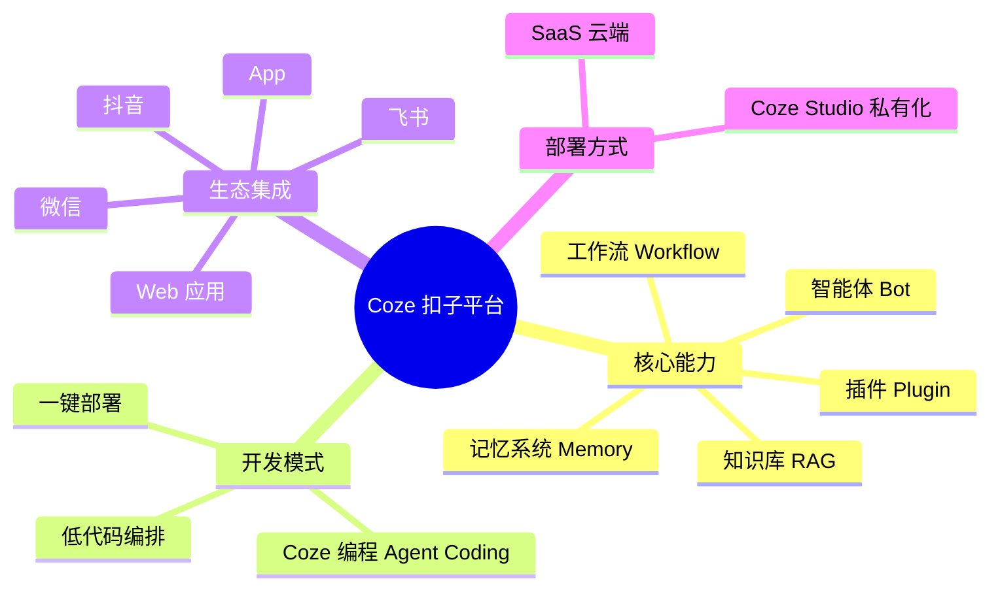
```mermaid
mindmap
  root((Coze 扣子平台))
    核心能力
      智能体 Bot
      工作流 Workflow
      插件 Plugin
      知识库 RAG
      记忆系统 Memory
    开发模式
      Coze 编程 Agent Coding
      低代码编排
      一键部署
    生态集成
      飞书
      微信
      抖音
      Web 应用
      App
    部署方式
      SaaS 云端
      Coze Studio 私有化
```

### 1.2 Coze 的发展演进

| 阶段                      | 内容                                                     |
| ------------------------- | -------------------------------------------------------- |
| **Coze 1.0**              | 低代码 AI Bot 搭建平台，拖拽式工作流编排                 |
| **Coze 2.0** (2026.01.19) | 新增 Agent Coding（扣子编程），云端 Vibe Coding 开发环境 |
| **Coze Studio**           | 开源私有化部署方案，支持 Docker 一键部署                 |

### 1.3 平台定位

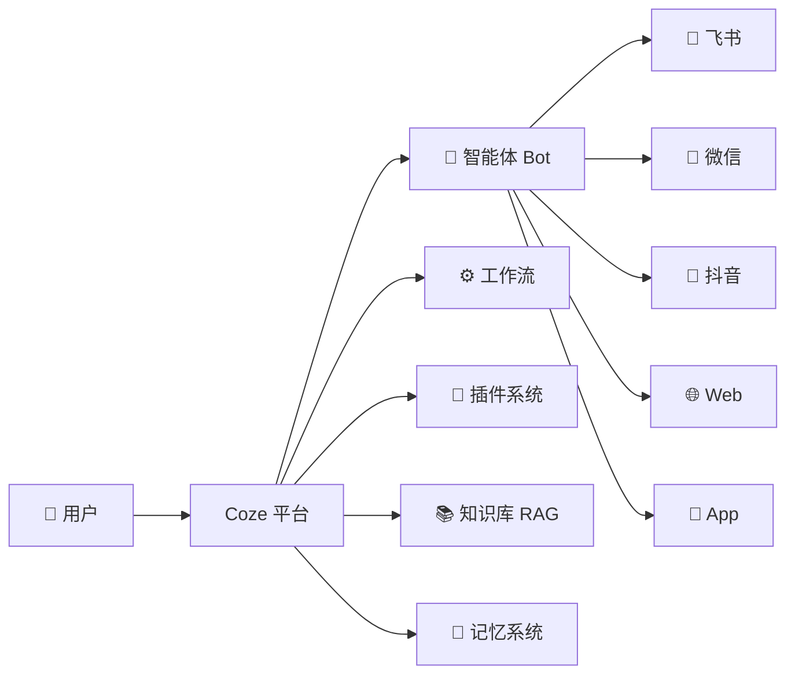
```mermaid
graph LR
    A["👤 用户"] --> B["Coze 平台"]
    B --> C["🤖 智能体 Bot"]
    B --> D["⚙️ 工作流"]
    B --> E["🔌 插件系统"]
    B --> F["📚 知识库 RAG"]
    B --> G["🧠 记忆系统"]

    C --> H["📱 飞书"]
    C --> I["💬 微信"]
    C --> J["🎵 抖音"]
    C --> K["🌐 Web"]
    C --> L["📲 App"]
```

---

## 2. Coze 核心架构

### 2.1 四大核心支柱

Coze 的核心由四个关键组件构成：

```
Coze 核心 = 智能体（Agent）+ 工作流（Workflow）+ 插件系统（Plugin）+ 记忆系统（Knowledge & Memory）
```

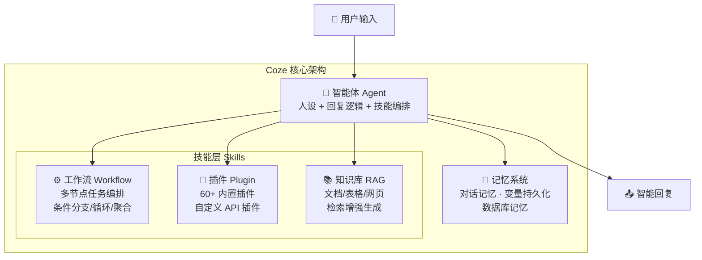
```mermaid
graph TB
    subgraph "Coze 核心架构"
        direction TB

        Agent["🤖 智能体 Agent<br/>人设 + 回复逻辑 + 技能编排"]

        subgraph "技能层 Skills"
            WF["⚙️ 工作流 Workflow<br/>多节点任务编排<br/>条件分支/循环/聚合"]
            Plugin["🔌 插件 Plugin<br/>60+ 内置插件<br/>自定义 API 插件"]
            RAG["📚 知识库 RAG<br/>文档/表格/网页<br/>检索增强生成"]
        end

        Memory["🧠 记忆系统<br/>对话记忆 · 变量持久化<br/>数据库记忆"]

        Agent --> WF
        Agent --> Plugin
        Agent --> RAG
        Agent --> Memory
    end

    User["👤 用户输入"] --> Agent
    Agent --> Response["📤 智能回复"]
```

### 2.2 技术架构全景图

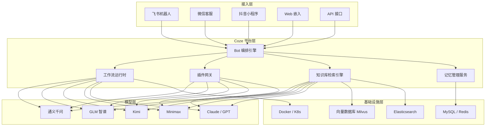
```mermaid
flowchart TB
    subgraph "接入层"
        A1[飞书机器人]
        A2[微信客服]
        A3[抖音小程序]
        A4[Web 嵌入]
        A5[API 接口]
    end

    subgraph "Coze 平台层"
        B1[Bot 编排引擎]
        B2[工作流运行时]
        B3[插件网关]
        B4[知识库检索引擎]
        B5[记忆管理服务]
    end

    subgraph "模型层"
        C1[通义千问]
        C2[GLM 智谱]
        C3[Kimi]
        C4[Minimax]
        C5[Claude / GPT]
    end

    subgraph "基础设施层"
        D1[向量数据库 Milvus]
        D2[Elasticsearch]
        D3[MySQL / Redis]
        D4[Docker / K8s]
    end

    A1 & A2 & A3 & A4 & A5 --> B1
    B1 --> B2 & B3 & B4 & B5
    B2 & B3 & B4 --> C1 & C2 & C3 & C4 & C5
    B4 --> D1 & D2
    B5 --> D3
    B2 --> D4
```

---

## 3. Coze 编程（Agent Coding / Vibe Coding）

### 3.1 什么是 Coze 编程？

Coze 编程（Agent Coding，又称扣子编程）是字节跳动在 **2026 年 1 月 19 日** Coze 2.0 中新增的**云端 Vibe Coding 开发环境**。

- **访问地址**：https://code.coze.cn
- **核心定位**：基于云端的自然语言编程环境
- **能力范围**：通过持续的自然语言对话，构建 AI Agent、工作流、Web 应用和移动 App，并支持一键部署上线

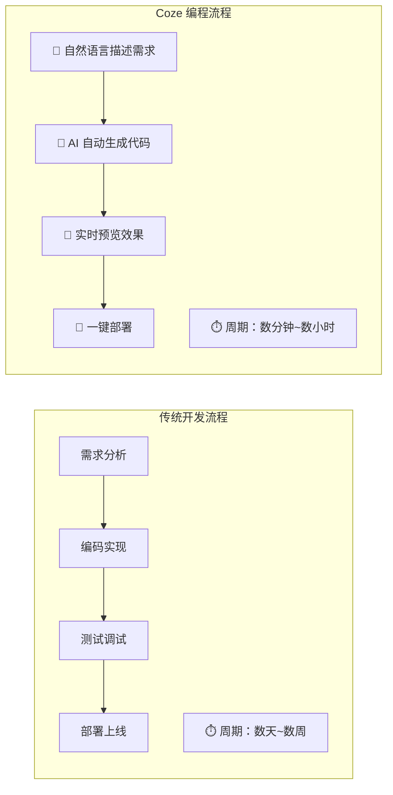
```mermaid
flowchart LR
    subgraph "传统开发流程"
        T1[需求分析] --> T2[编码实现] --> T3[测试调试] --> T4[部署上线]
        T5[⏱️ 周期：数天~数周]
    end

    subgraph "Coze 编程流程"
        C1["💬 自然语言描述需求"] --> C2["🤖 AI 自动生成代码"] --> C3["👀 实时预览效果"] --> C4["🚀 一键部署"]
        C5[⏱️ 周期：数分钟~数小时]
    end
```

### 3.2 Coze 编程 vs 传统低代码

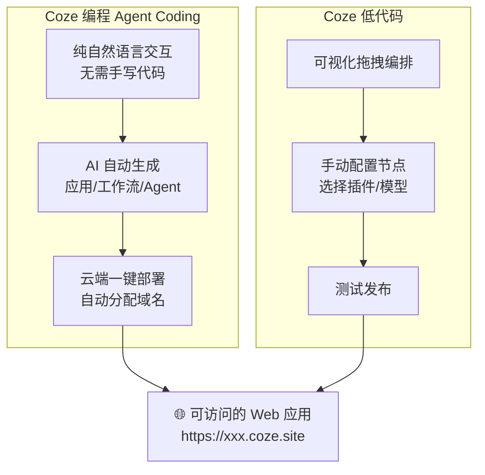
```mermaid
graph TB
    subgraph "Coze 编程 Agent Coding"
        NC1["纯自然语言交互<br/>无需手写代码"] --> NC2["AI 自动生成<br/>应用/工作流/Agent"]
        NC2 --> NC3["云端一键部署<br/>自动分配域名"]
    end

    subgraph "Coze 低代码"
        LC1["可视化拖拽编排"] --> LC2["手动配置节点<br/>选择插件/模型"]
        LC2 --> LC3["测试发布"]
    end

    NC3 --> Output["🌐 可访问的 Web 应用<br/>https://xxx.coze.site"]
    LC3 --> Output
```

---

## 4. 低代码平台对比：Coze vs Dify vs n8n

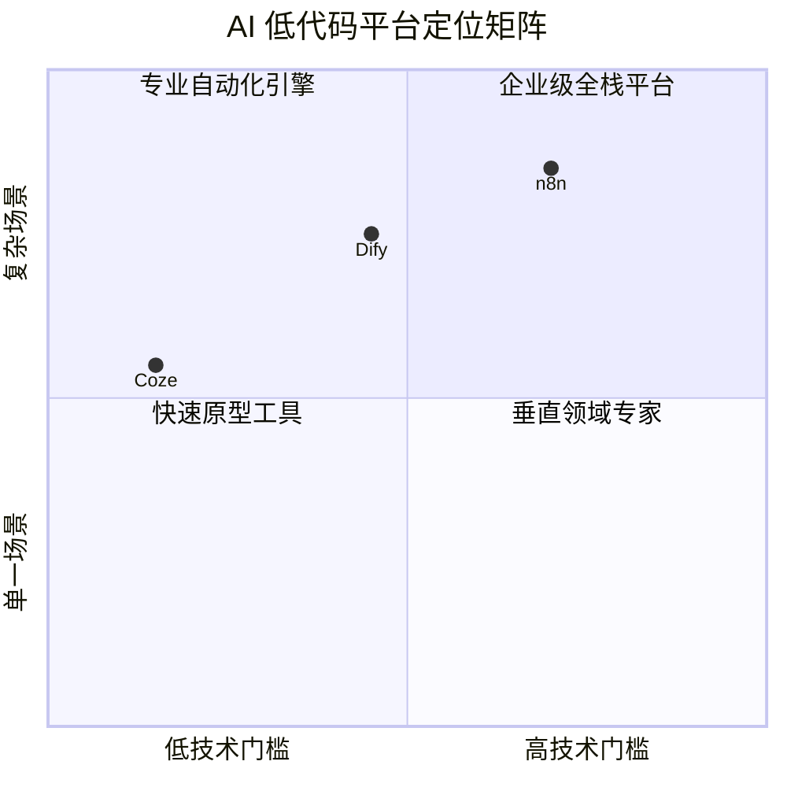
```mermaid
quadrantChart
    title AI 低代码平台定位矩阵
    x-axis "低技术门槛" --> "高技术门槛"
    y-axis "单一场景" --> "复杂场景"
    quadrant-1 "企业级全栈平台"
    quadrant-2 "专业自动化引擎"
    quadrant-3 "快速原型工具"
    quadrant-4 "垂直领域专家"
    "Coze": [0.15, 0.55]
    "Dify": [0.45, 0.75]
    "n8n": [0.7, 0.85]
```

### 详细对比表

| 维度             | **Coze**                       | **Dify**                                    | **n8n**                                               |
| ---------------- | ------------------------------ | ------------------------------------------- | ----------------------------------------------------- |
| **技术门槛**     | 低（含 Vibe Coding + 低代码）  | 中等（需理解工作流和 API）                  | 中等（需理解工作流和 API）                            |
| **开源性**       | 部分组件开源                   | **开源（Apache 2.0）**                      | Fair-code（Sustainable Use License）                  |
| **部署方式**     | 纯 SaaS（字节云端）            | 云版 + 私有化（Docker）                     | 云版 + 私有化（Docker）                               |
| **集成能力**     | 字节生态（飞书/微信/抖音）为主 | AI 模型 + 知识库为主                        | **超强**：400+ 原生节点（CRM/ERP/DB/Slack 等）        |
| **RAG/知识库**   | 功能完善（文本/表格/图像）     | **功能最完善**（分段/清洗/召回测试/重排序） | 2.0 已原生支持，适合"工作流+RAG"混合                  |
| **工作流复杂度** | 适合简单到中等流程             | 适合 LLM 应用内工作流                       | **适合复杂跨系统流程**（条件/循环/人工审核/多 Agent） |
| **适用场景**     | 快速搭建社交生态聊天机器人     | 企业级 AI 应用（知识库、对话系统）          | 业务流程自动化 + AI 增强（多系统集成）                |

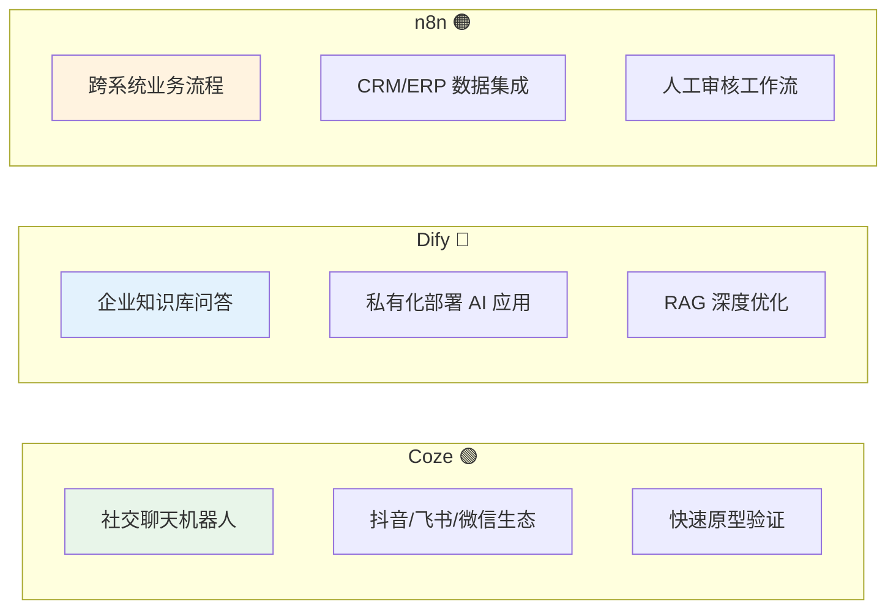
```mermaid
graph LR
    subgraph "Coze 🟢"
        C1[社交聊天机器人]
        C2[抖音/飞书/微信生态]
        C3[快速原型验证]
    end

    subgraph "Dify 🔵"
        D1[企业知识库问答]
        D2[私有化部署 AI 应用]
        D3[RAG 深度优化]
    end

    subgraph "n8n 🟠"
        N1[跨系统业务流程]
        N2[CRM/ERP 数据集成]
        N3[人工审核工作流]
    end

    style C1 fill:#e8f5e9
    style D1 fill:#e3f2fd
    style N1 fill:#fff3e0
```

---

## 5. 智能体（Bot）搭建

### 5.1 Bot 的三要素

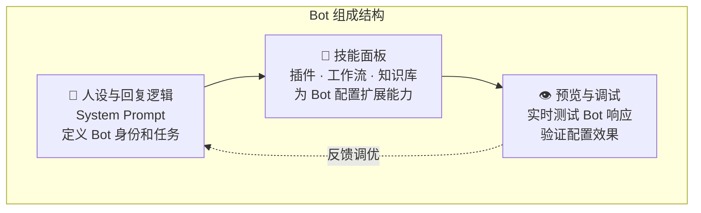
```mermaid
graph TB
    subgraph "Bot 组成结构"
        Persona["👤 人设与回复逻辑<br/>System Prompt<br/>定义 Bot 身份和任务"]
        Skills["🔧 技能面板<br/>插件 · 工作流 · 知识库<br/>为 Bot 配置扩展能力"]
        Preview["👁️ 预览与调试<br/>实时测试 Bot 响应<br/>验证配置效果"]
    end

    Persona --> Skills --> Preview
    Preview -.->|"反馈调优"| Persona
```

### 5.2 结构化的 System Prompt 设计

Coze 推荐使用 **Markdown 结构化格式** 编写人设：

```markdown
# Character <Bot 人设>
你是 [角色描述]，擅长使用 [工具]，包括 [能力描述]。

## Skills <Bot 的功能>
### Skill 1: [技能名称]
1. [具体操作步骤]
2. [具体操作步骤]

### Skill 2: [技能名称]
1. [具体操作步骤]

## Constraints <Bot 约束>
- [约束条件 1]
- [约束条件 2]
```

### 5.3 实例：数据分析 Bot 的人设

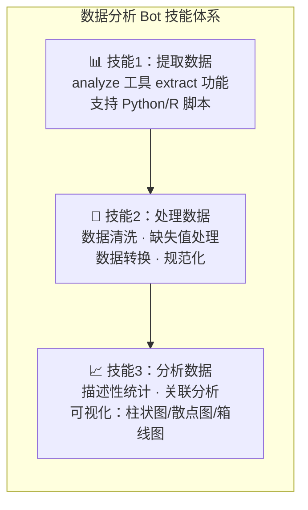
```mermaid
graph LR
    subgraph "数据分析 Bot 技能体系"
        S1["📊 技能1：提取数据<br/>analyze 工具 extract 功能<br/>支持 Python/R 脚本"]
        S2["🧹 技能2：处理数据<br/>数据清洗 · 缺失值处理<br/>数据转换 · 规范化"]
        S3["📈 技能3：分析数据<br/>描述性统计 · 关联分析<br/>可视化：柱状图/散点图/箱线图"]
    end

    S1 --> S2 --> S3
```

### 5.4 Bot 创建流程

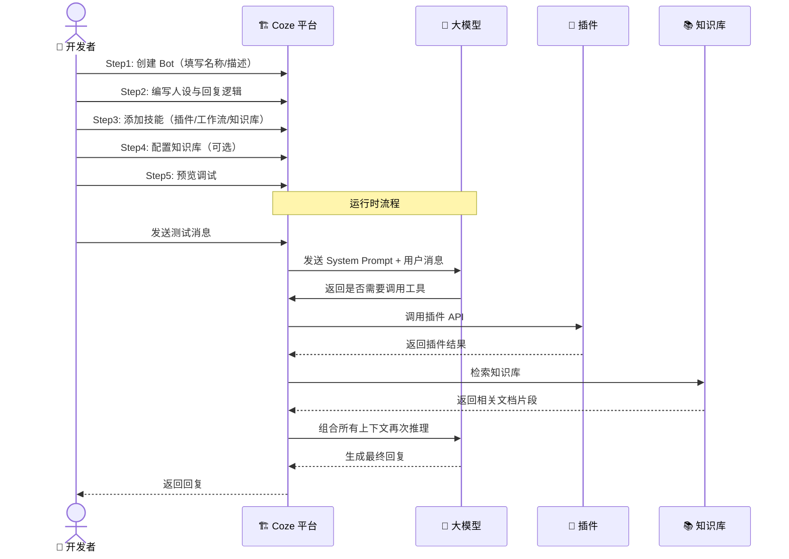
```mermaid
sequenceDiagram
    actor User as 👤 开发者
    participant Coze as 🏗️ Coze 平台
    participant LLM as 🧠 大模型
    participant Plugin as 🔌 插件
    participant KB as 📚 知识库

    User->>Coze: Step1: 创建 Bot（填写名称/描述）
    User->>Coze: Step2: 编写人设与回复逻辑
    User->>Coze: Step3: 添加技能（插件/工作流/知识库）
    User->>Coze: Step4: 配置知识库（可选）
    User->>Coze: Step5: 预览调试

    Note over Coze,LLM: 运行时流程
    User->>Coze: 发送测试消息
    Coze->>LLM: 发送 System Prompt + 用户消息
    LLM->>Coze: 返回是否需要调用工具
    Coze->>Plugin: 调用插件 API
    Plugin-->>Coze: 返回插件结果
    Coze->>KB: 检索知识库
    KB-->>Coze: 返回相关文档片段
    Coze->>LLM: 组合所有上下文再次推理
    LLM-->>Coze: 生成最终回复
    Coze-->>User: 返回回复
```

---

## 6. 插件系统

### 6.1 插件架构

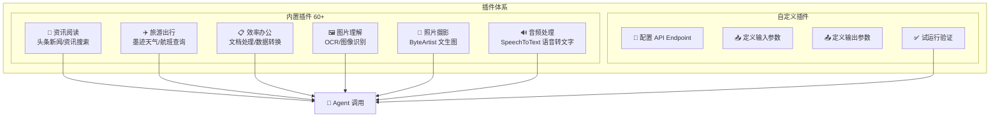
```mermaid
flowchart TB
    subgraph "插件体系"
        direction TB

        subgraph "内置插件 60+"
            B1[📰 资讯阅读<br/>头条新闻/资讯搜索]
            B2[✈️ 旅游出行<br/>墨迹天气/航班查询]
            B3[📋 效率办公<br/>文档处理/数据转换]
            B4[🖼️ 图片理解<br/>OCR/图像识别]
            B5[🎨 照片摄影<br/>ByteArtist 文生图]
            B6[🔊 音频处理<br/>SpeechToText 语音转文字]
        end

        subgraph "自定义插件"
            C1[🔗 配置 API Endpoint]
            C2[📥 定义输入参数]
            C3[📤 定义输出参数]
            C4[✅ 试运行验证]
        end
    end

    B1 & B2 & B3 & B4 & B5 & B6 --> Agent["🤖 Agent 调用"]
    C4 --> Agent
```

### 6.2 自定义插件创建流程

每个插件可添加多个工具，每个工具都是一个独立的 API 服务（Endpoint）。同一个插件内的不同工具必须使用相同的域名。

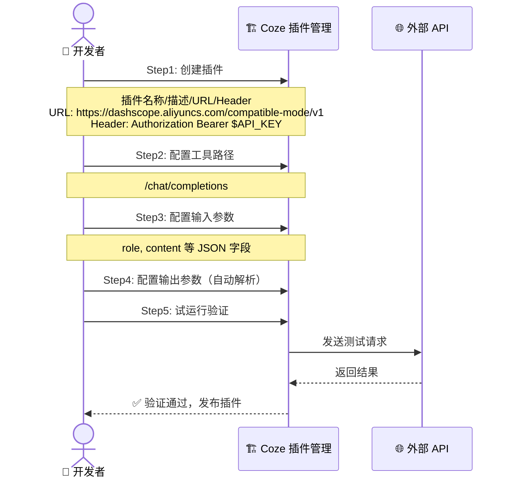
```mermaid
sequenceDiagram
    actor Dev as 👤 开发者
    participant Coze as 🏗️ Coze 插件管理
    participant API as 🌐 外部 API

    Dev->>Coze: Step1: 创建插件
    Note over Dev,Coze: 插件名称/描述/URL/Header<br/>URL: https://dashscope.aliyuncs.com/compatible-mode/v1<br/>Header: Authorization Bearer $API_KEY

    Dev->>Coze: Step2: 配置工具路径
    Note over Dev,Coze: /chat/completions

    Dev->>Coze: Step3: 配置输入参数
    Note over Dev,Coze: role, content 等 JSON 字段

    Dev->>Coze: Step4: 配置输出参数（自动解析）

    Dev->>Coze: Step5: 试运行验证

    Coze->>API: 发送测试请求
    API-->>Coze: 返回结果
    Coze-->>Dev: ✅ 验证通过，发布插件
```

### 6.3 插件 vs 工作流 的区别

| 维度         | **插件**                   | **工作流**                          |
| ------------ | -------------------------- | ----------------------------------- |
| **粒度**     | 单个 API 调用              | 多个节点编排                        |
| **复用性**   | 跨 Bot 复用                | 跨 Bot 复用                         |
| **复杂度**   | 简单（输入→输出）          | 复杂（多步骤/条件分支）             |
| **典型用途** | 天气查询、新闻搜索、文生图 | 意图识别→参数提取→插件调用→结果聚合 |
| **开发方式** | 配置 API endpoint          | 可视化拖拽节点                      |

---

## 7. 工作流系统

### 7.1 工作流核心概念

工作流由**多个节点**构成，节点是组成工作流的基本单元。通过工作流可以完成复杂的任务处理。

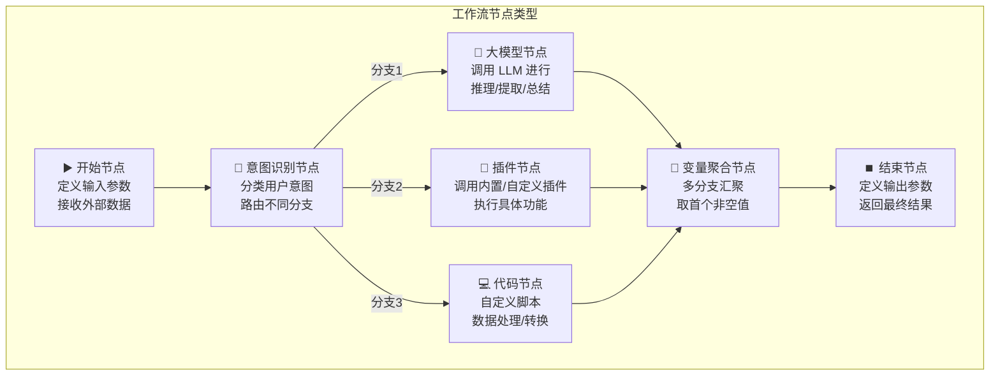
```mermaid
graph TB
    subgraph "工作流节点类型"
        Start["▶️ 开始节点<br/>定义输入参数<br/>接收外部数据"]
        LLM["🧠 大模型节点<br/>调用 LLM 进行<br/>推理/提取/总结"]
        Plugin["🔌 插件节点<br/>调用内置/自定义插件<br/>执行具体功能"]
        Intent["🎯 意图识别节点<br/>分类用户意图<br/>路由不同分支"]
        Code["💻 代码节点<br/>自定义脚本<br/>数据处理/转换"]
        Agg["🔀 变量聚合节点<br/>多分支汇聚<br/>取首个非空值"]
        End["⏹️ 结束节点<br/>定义输出参数<br/>返回最终结果"]
    end

    Start --> Intent
    Intent -->|"分支1"| LLM
    Intent -->|"分支2"| Plugin
    Intent -->|"分支3"| Code
    LLM --> Agg
    Plugin --> Agg
    Code --> Agg
    Agg --> End
```

### 7.2 变量聚合节点原理

变量聚合节点本质上是 **"多进一出"的智能选值器**：

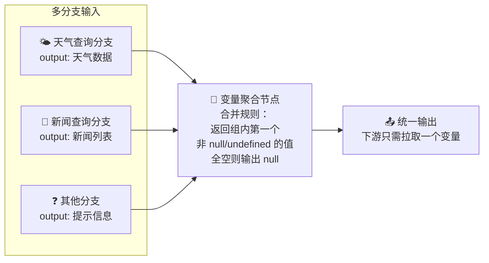
```mermaid
flowchart LR
    subgraph "多分支输入"
        B1["🌤️ 天气查询分支<br/>output: 天气数据"]
        B2["📰 新闻查询分支<br/>output: 新闻列表"]
        B3["❓ 其他分支<br/>output: 提示信息"]
    end

    Agg["🔀 变量聚合节点<br/>合并规则：<br/>返回组内第一个<br/>非 null/undefined 的值<br/>全空则输出 null"]

    Output["📤 统一输出<br/>下游只需拉取一个变量"]

    B1 --> Agg
    B2 --> Agg
    B3 --> Agg
    Agg --> Output
```

### 7.3 工作流设计原则

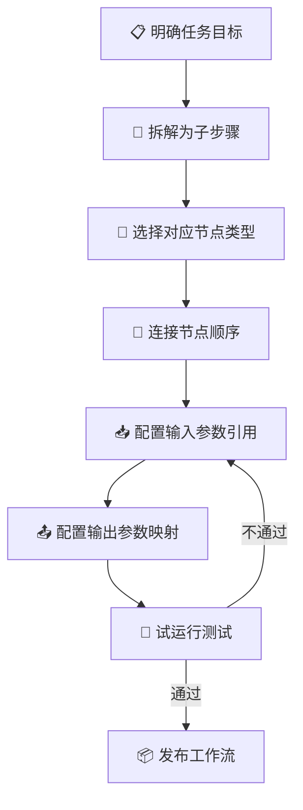
```mermaid
flowchart TD
    A["📋 明确任务目标"] --> B["🔢 拆解为子步骤"]
    B --> C["🧩 选择对应节点类型"]
    C --> D["🔗 连接节点顺序"]
    D --> E["📥 配置输入参数引用"]
    E --> F["📤 配置输出参数映射"]
    F --> G["🧪 试运行测试"]
    G -->|"通过"| H["📦 发布工作流"]
    G -->|"不通过"| E
```

---

## 8. RAG 知识库

### 8.1 RAG 技术原理

**RAG（Retrieval-Augmented Generation，检索增强生成）** 在回答问题或生成文本时，先从大规模文档库中检索相关信息，然后利用检索到的信息来生成响应，从而提高回复内容的质量。

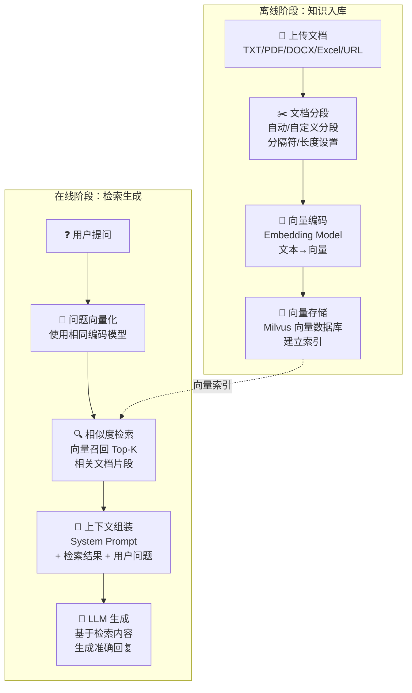
```mermaid
flowchart TB
    subgraph "离线阶段：知识入库"
        A1["📄 上传文档<br/>TXT/PDF/DOCX/Excel/URL"] --> A2["✂️ 文档分段<br/>自动/自定义分段<br/>分隔符/长度设置"]
        A2 --> A3["🧮 向量编码<br/>Embedding Model<br/>文本→向量"]
        A3 --> A4["💾 向量存储<br/>Milvus 向量数据库<br/>建立索引"]
    end

    subgraph "在线阶段：检索生成"
        B1["❓ 用户提问"] --> B2["🧮 问题向量化<br/>使用相同编码模型"]
        B2 --> B3["🔍 相似度检索<br/>向量召回 Top-K<br/>相关文档片段"]
        B3 --> B4["📝 上下文组装<br/>System Prompt<br/>+ 检索结果 + 用户问题"]
        B4 --> B5["🧠 LLM 生成<br/>基于检索内容<br/>生成准确回复"]
    end

    A4 -.->|"向量索引"| B3
```

### 8.2 RAG 知识库的应用场景

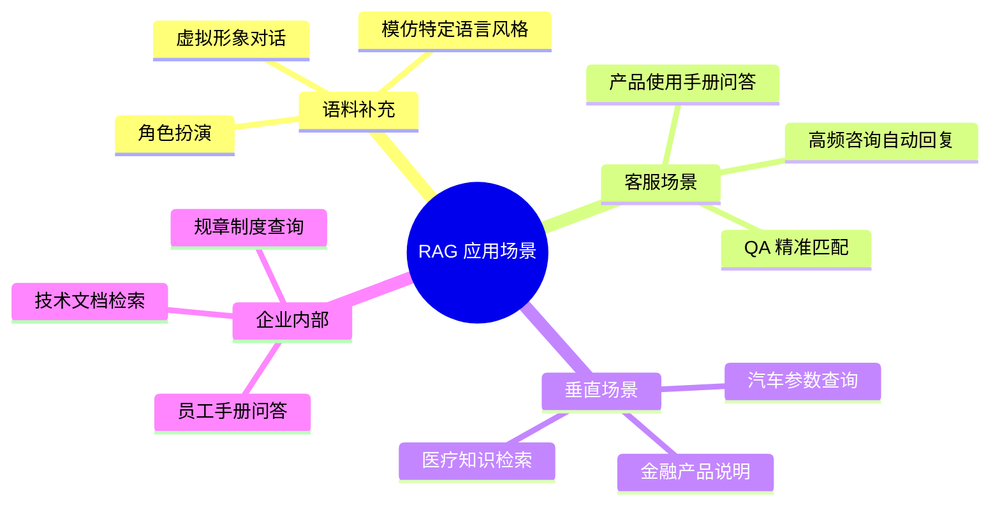
```mermaid
mindmap
  root((RAG 应用场景))
    语料补充
      虚拟形象对话
      模仿特定语言风格
      角色扮演
    客服场景
      产品使用手册问答
      高频咨询自动回复
      QA 精准匹配
    垂直场景
      汽车参数查询
      金融产品说明
      医疗知识检索
    企业内部
      员工手册问答
      技术文档检索
      规章制度查询
```

### 8.3 知识库配置要点

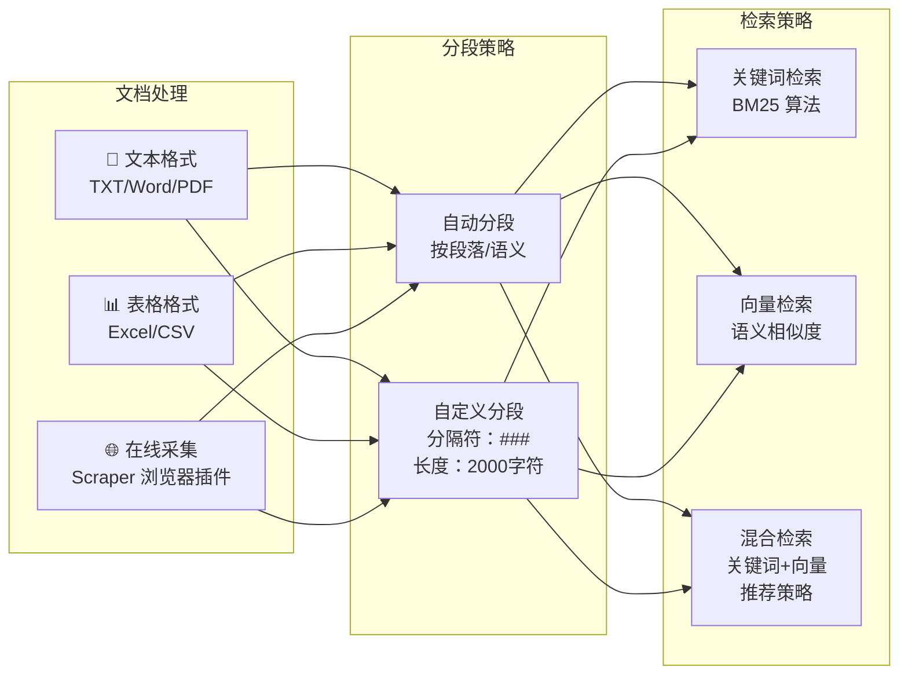
```mermaid
flowchart LR
    subgraph "文档处理"
        D1["📝 文本格式<br/>TXT/Word/PDF"]
        D2["📊 表格格式<br/>Excel/CSV"]
        D3["🌐 在线采集<br/>Scraper 浏览器插件"]
    end

    subgraph "分段策略"
        S1["自动分段<br/>按段落/语义"]
        S2["自定义分段<br/>分隔符：###<br/>长度：2000字符"]
    end

    subgraph "检索策略"
        R1["关键词检索<br/>BM25 算法"]
        R2["向量检索<br/>语义相似度"]
        R3["混合检索<br/>关键词+向量<br/>推荐策略"]
    end

    D1 & D2 & D3 --> S1 & S2
    S1 & S2 --> R1 & R2 & R3
```

### 8.4 传统 RAG vs Agentic RAG

| 维度         | **传统 RAG**                | **Agentic RAG**                            |
| ------------ | --------------------------- | ------------------------------------------ |
| **流程**     | 固定工作流（检索→生成）     | 灵活的、探索式过程                         |
| **决策方式** | 单次检索                    | Agent 自主决定是否检索、检索什么、何时检索 |
| **适用场景** | 确定性问答（FAQ、文档查询） | 探索性任务（研究、分析、复杂推理）         |
| **实现方式** | 工作流编排                  | Agent 自主编排                             |
| **推荐**     | 工作流固定场景              | 灵活探索场景                               |

---

## 9. 实战案例分析

### 9.1 CASE：新闻搜索工作流（getNews_tasks）

**目标**：创建工作流，根据用户输入搜索 AI 相关新闻。

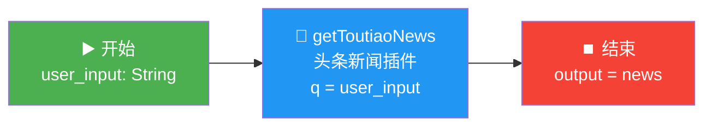
```mermaid
flowchart LR
    Start["▶️ 开始<br/>user_input: String"] --> Plugin["🔌 getToutiaoNews<br/>头条新闻插件<br/>q = user_input"]
    Plugin --> End["⏹️ 结束<br/>output = news"]

    style Start fill:#4CAF50,color:#fff
    style Plugin fill:#2196F3,color:#fff
    style End fill:#F44336,color:#fff
```

**节点配置详情**：

| 节点               | 配置项                | 值                           |
| ------------------ | --------------------- | ---------------------------- |
| **开始节点**       | 新增参数 `user_input` | 类型：String                 |
| **getToutiaoNews** | 输入参数 `q`          | 引用 `开始 → user_input`     |
| **结束节点**       | 新增参数 `output`     | 引用 `getToutiaoNews → news` |

**Bot 提示词关键配置**：

```markdown
## 技能
### 技能1: 新闻查找
1. 当用户询问最新新闻时，先调用 getToutiaoNews 搜索最新人工智能新闻
2. 从搜索结果中筛选出 AI 主题相关的新闻
3. 筛选最重要的 5 条新闻，并按照时间升序排序
```

---

### 9.2 CASE：weather_news 工作流（基于意图识别）

**目标**：识别用户意图（天气查询 / 新闻查询 / 其他），根据意图调用不同服务。

```mermaid
flowchart TB
    Start["▶️ 开始<br/>input: String"]

    Intent["🎯 意图识别<br/>分类用户意图<br/>1=天气查询<br/>2=新闻查询<br/>3=其他"]

    LLM_Weather["🧠 大模型<br/>提取天气查询参数<br/>输出 JSON:<br/>city, province,<br/>start_time, end_time"]

    Plugin_Weather["🌤️ 墨迹天气<br/>天气查询插件"]

    Plugin_News["📰 头条搜索<br/>input_query = input"]

    Agg["🔀 变量聚合<br/>合并三个分支<br/>返回首个非空值"]

    End["⏹️ 结束<br/>统一输出"]

    Start --> Intent

    Intent -->|"意图=1 天气"| LLM_Weather
    LLM_Weather --> Plugin_Weather
    Plugin_Weather --> Agg

    Intent -->|"意图=2 新闻"| Plugin_News
    Plugin_News --> Agg

    Intent -->|"意图=3 其他"| Agg

    Agg --> End

    style Intent fill:#9C27B0,color:#fff
    style Agg fill:#FF9800,color:#fff
```

**关键设计点**：

1. **意图识别**将用户输入分类为三种类型
2. **天气分支**：大模型节点提取 JSON 参数 → 墨迹天气插件
3. **新闻分支**：直接从开始节点取 input → 头条搜索插件
4. **变量聚合**：三个分支汇聚，下游只需拉取一个变量

---

### 9.3 CASE：创建产品知识库

**目标**：搭建飞连产品助手，回答产品使用问题和大模型定价查询。

```mermaid
flowchart TB
    subgraph "Step1: 数据收集"
        D1["📄 Word 文档<br/>远程办公场景最佳实践<br/>5个VPN配置场景"]
        D2["📊 Excel 文档<br/>大模型定价表<br/>Qwen系列模型价格"]
        D3["🌐 在线网页<br/>飞连产品官网<br/>火山引擎文档"]
    end

    subgraph "Step2: 知识库创建"
        K1["📝 文本知识库<br/>自定义分段 ###<br/>长度 2000"]
        K2["📊 表格知识库<br/>上传定价 Excel<br/>建立模型索引"]
        K3["🌐 在线采集<br/>Scraper 插件<br/>Chrome 扩展"]
    end

    subgraph "Step3: Bot 搭建"
        Bot["🤖 飞连产品助手"]
        Bot_Persona["人设：飞连产品问答小助手<br/>技能1：问题理解和检索<br/>技能2：回答生成<br/>约束：仅回答产品相关问题"]
        Bot_KB["知识库：<br/>文本知识库 + 表格知识库"]
        Bot_Config["检索策略：混合检索"]
    end

    D1 --> K1
    D2 --> K2
    D3 --> K3
    K1 & K2 --> Bot_KB
    Bot_KB --> Bot
    Bot_Persona --> Bot
    Bot_Config --> Bot
```

**测试问题**：

| 问题                                | 预期答复来源       |
| ----------------------------------- | ------------------ |
| 有出差员工如何进行远程办公          | Word 文档 → 场景一 |
| 如何限制指定部门访问指定资源        | Word 文档 → 场景二 |
| 如何允许指定部门访问指定资源        | Word 文档 → 场景三 |
| 如何让不同部门员工使用不同 VPN 节点 | Word 文档 → 场景四 |
| Qwen-Turbo 费用多少                 | Excel → 定价表     |

**文档分段策略**：

- 在 Word 文档中手动添加 `###` 作为分段标识符
- 设置分段长度为 2000 字符
- 每个功能场景独立成段，确保检索精度

---

### 9.4 CASE：抖音文案提取 & 二创

**目标**：用户输入抖音视频链接，提取视频文案并优化二次创作。

```mermaid
flowchart TB
    Input["🔗 输入：抖音视频 URL"] --> Node1["📤 输出节点<br/>状态：开始提取..."]

    Node1 --> Plugin1["🔌 抖音文案解析插件<br/>get_douin_article_info<br/>douyin_url = input"]

    Plugin1 --> Node2["📤 输出节点<br/>状态：已解析音频地址"]

    Node2 --> Plugin2["🔊 SpeechToText<br/>音频转文字<br/>获取原始文案"]

    Plugin2 --> Node3["📤 输出节点<br/>状态：已解析原文案"]

    Node3 --> LLM["🧠 大模型<br/>文案优化师<br/>保留核心内容<br/>优化为抖音风格"]

    LLM --> Output["📤 最终输出<br/>原文案 + 优化后文案"]

    style LLM fill:#9C27B0,color:#fff
    style Output fill:#4CAF50,color:#fff
```

**大模型 System Prompt**：

```markdown
# 角色
你是一个专业的抖音文案优化师，擅长根据抖音平台的特点和用户需求，
对用户提供的文案进行优化，使其更适合在抖音平台传播。

## 技能
### 技能1: 抖音文案优化
对原文案进行重新创作，保留核心内容的同时，让文案更具吸引力和感染力，
符合抖音平台的调性。

===回复示例===
调整后的文案：[调整后的文案]
===示例结束===

## 限制:
- 所输出的内容必须清晰展示原文案和调整后的文案
- 回复内容应简洁明了，避免冗长复杂的表述
```

**设计亮点**：当节点步骤较多、处理时间较长时，增加**输出节点显示中间状态**，避免用户在等待时不知道进度。

---

### 9.5 CASE：LLM 联网搜索

**目标**：用户输入问题，AI 提取关键字，使用搜索插件搜索，并用大模型总结。

```mermaid
flowchart TB
    Input["❓ 用户输入问题"] --> LLM1["🧠 大模型节点1<br/>提取关键字<br/>多个关键字空格隔开"]

    LLM1 --> Node1["📤 输出节点<br/>状态：提取到关键字"]

    Node1 --> Search["🔍 Bing 搜索插件<br/>query = 大模型提取的关键字"]

    Search --> LLM2["🧠 大模型节点2<br/>对搜索结果进行<br/>总结整理"]

    LLM2 --> Output["📤 最终输出<br/>搜索结果总结"]

    style LLM1 fill:#FF9800,color:#fff
    style LLM2 fill:#9C27B0,color:#fff
```

**两个大模型节点分工**：

| 节点         | 作用           | System Prompt                                    |
| ------------ | -------------- | ------------------------------------------------ |
| 大模型节点 1 | **提取关键字** | "对用户的问题，提取关键字，多个关键字用空格隔开" |
| 大模型节点 2 | **总结整理**   | "对网上搜索到的内容进行总结整理"                 |

---

### 9.6 CASE：古诗词 Agent

**目标**：用户输入一句古诗，AI 联想画面 → 翻译成英文 → 文生图。

```mermaid
flowchart TB
    Input["📝 用户输入古诗<br/>如：离离原上草"] --> LLM1["🧠 大模型节点1<br/>古诗词专家<br/>描述联想到的画面<br/>100字以内"]

    LLM1 --> LLM2["🧠 翻译大模型<br/>中文→英文<br/>前缀加：ancient china,<br/>children's book illustration style"]

    LLM2 --> ImgPlugin["🎨 ByteArtist<br/>text2image 插件<br/>model_type=1<br/>Prompt=翻译后的英文"]

    ImgPlugin --> Output["🖼️ 最终输出<br/>生成的古诗意境图片<br/>image_url"]

    style Input fill:#4CAF50,color:#fff
    style Output fill:#F44336,color:#fff
    style ImgPlugin fill:#2196F3,color:#fff
```

**关键设计点**：

1. **第一个大模型**：中文古诗词专家，将抽象诗意转化为具体画面描述
2. **第二个大模型**：翻译节点，因为文生图插件需要英文输入
3. **翻译技巧**：英文前加 `"ancient china, children's book illustration style"` 控制画风
4. **插件配置**：text2image 的 `model_type=1`，Prompt 引用翻译大模型的 output

---

## 10. Coze Studio 私有化部署

### 10.1 Coze Studio 简介

**Coze Studio** 是一站式 AI Agent 开发工具，提供 Prompt、RAG、Plugin、Workflow 完整能力，使开发者可以聚焦创造 AI 核心价值。

- **GitHub**：https://github.com/coze-dev/coze-studio
- **技术栈**：
  - 后端：Golang（微服务架构，DDD 领域驱动设计）
  - 前端：React + TypeScript
  - 核心引擎：Eino 框架（Agent 和工作流运行时）

### 10.2 技术架构

```mermaid
graph TB
    subgraph "Coze Studio 技术栈"
        Frontend["🖥️ 前端<br/>React + TypeScript<br/>可视化编排界面"]
        Backend["⚙️ 后端<br/>Golang 微服务<br/>DDD 领域驱动设计"]
        Engine["🚀 核心引擎<br/>Eino 框架<br/>Agent + Workflow 运行时"]

        Frontend --> Backend
        Backend --> Engine
    end

    subgraph "依赖服务"
        MySQL["🐬 MySQL 8.4<br/>业务数据存储"]
        ES["🔍 Elasticsearch 8<br/>全文检索"]
        Redis["⚡ Redis 8<br/>缓存/会话"]
        Milvus["📊 Milvus 2.5<br/>向量数据库"]
        MinIO["💾 MinIO<br/>对象存储"]
        etcd["🔐 etcd 3.5<br/>配置中心"]
        NSQ["📮 NSQ<br/>消息队列"]
    end

    Backend --> MySQL & ES & Redis & Milvus & MinIO & etcd & NSQ
```

### 10.3 Docker 部署流程

```mermaid
flowchart TB
    S1["Step1: 配置 Docker<br/>修改 daemon.json<br/>添加镜像源<br/>可选：迁移到 D 盘"]
    S1 --> S2["Step2: 重启 Docker Desktop"]

    S2 --> S3["Step3: 克隆代码<br/>git clone coze-studio<br/>cd coze-studio/docker"]

    S3 --> S4["Step4: 配置环境<br/>copy .env.example .env"]

    S4 --> S5["Step5: 拉取镜像<br/>基础镜像用镜像源<br/>Coze 镜像从 Docker Hub"]

    S5 --> S6["Step6: 启动服务<br/>docker compose up -d"]

    S6 --> S7["Step7: 检查状态<br/>docker compose ps<br/>全部应为 running/healthy"]

    S7 --> S8["Step8: 访问使用<br/>http://localhost:8888<br/>注册→配置模型→开始使用"]

    style S8 fill:#4CAF50,color:#fff
```

**镜像拉取清单**：

| 类别       | 镜像                                | 来源     |
| ---------- | ----------------------------------- | -------- |
| 基础镜像   | `mysql:8.4.5`                       | 镜像源   |
| 基础镜像   | `elasticsearch:8.18.0`              | 镜像源   |
| 基础镜像   | `redis:8.0`                         | 镜像源   |
| 基础镜像   | `nsq:v1.2.1`                        | 镜像源   |
| Docker Hub | `minio/minio`                       | 直接拉取 |
| Docker Hub | `etcd:3.5`                          | 直接拉取 |
| Docker Hub | `milvusdb/milvus:v2.5.10`           | 直接拉取 |
| Coze 服务  | `cozedev/coze-studio-server:latest` | 直接拉取 |
| Coze 前端  | `cozedev/coze-studio-web:latest`    | 直接拉取 |

**C 盘空间不足？迁移 Docker 到 D 盘**：

```powershell
# 1. 创建 D 盘目录
New-Item -ItemType Directory -Path "D:\Docker" -Force

# 2. Docker Desktop → Settings → Resources → Advanced
#    Disk image location → Browse → D:\Docker
#    Apply & Restart
```

---

## 11. 总结与展望

### 11.1 Coze 平台能力全景

```mermaid
graph TB
    title["🎯 Coze 平台能力全景"]

    subgraph "开发范式"
        P1["💬 Vibe Coding<br/>自然语言→应用"]
        P2["🧩 低代码编排<br/>拖拽式可视化"]
    end

    subgraph "核心能力"
        C1["🤖 Agent<br/>智能体"]
        C2["⚙️ Workflow<br/>工作流"]
        C3["🔌 Plugin<br/>插件"]
        C4["📚 RAG<br/>知识库"]
    end

    subgraph "部署与发布"
        D1["☁️ SaaS 云端<br/>一键发布"]
        D2["🏠 Coze Studio<br/>私有化部署"]
        D3["📱 多渠道<br/>飞书/微信/抖音/Web"]
    end

    subgraph "生态集成"
        E1["🦊 字节生态<br/>飞书/抖音/微信"]
        E2["🔗 开放 API<br/>自定义插件"]
        E3["📦 开源社区<br/>Coze Studio"]
    end

    P1 & P2 --> C1 & C2 & C3 & C4
    C1 & C2 & C3 & C4 --> D1 & D2 & D3
    D1 & D2 & D3 --> E1 & E2 & E3
```

### 11.2 从零构建 AI 应用的方法论

```mermaid
flowchart TD
    A["1️⃣ 需求描述<br/>→ 场景示例<br/>用户提问 X → AI 回复 Y"] --> B["2️⃣ 技术选型<br/>高代码：LangChain/LangGraph<br/>低代码：Coze/Dify<br/>Agent 还是 工作流？<br/>是否需要 Tool？<br/>是否需要 RAG？"]

    B --> C["3️⃣ 实现细节<br/>高代码：AI 编程<br/>（Cursor/Trae）<br/>低代码：Coze/Dify<br/>拖拉拽方法"]

    C --> D["4️⃣ 测试验证<br/>整理测试问题集<br/>覆盖边界 case<br/>迭代优化"]

    D --> E["5️⃣ 部署发布<br/>多渠道发布<br/>监控与迭代"]

    style A fill:#4CAF50,color:#fff
    style E fill:#2196F3,color:#fff
```

### 11.3 关键要点回顾

| 主题                    | 核心要点                                                     |
| ----------------------- | ------------------------------------------------------------ |
| **Coze 核心公式**       | Agent = System Prompt + Tool + RAG + Workflow                |
| **Coze 编程**           | 云端 Vibe Coding，自然语言→应用，一键部署                    |
| **插件 vs 工作流**      | 插件 = 单个 API；工作流 = 多节点编排。插件给 Agent 使用，工作流实现复杂逻辑 |
| **意图识别**            | 工作流核心模式：意图识别 → 分支处理 → 变量聚合 → 统一输出    |
| **RAG 知识库**          | 收集数据 → 分段编码 → 向量存储 → 检索增强生成                |
| **分段策略**            | 自定义分隔符（###）+ 合适长度（2000），保证检索精度          |
| **传统 vs Agentic RAG** | 固定流程用传统 RAG，灵活探索用 Agentic RAG                   |
| **Coze Studio**         | 开源私有化方案，Golang + React + Eino 框架，Docker 部署      |

### 11.4 推荐模型选择（2026 年参考）

| 市场              | 推荐模型                                 |
| ----------------- | ---------------------------------------- |
| **国外**          | Claude Opus 4.6, GPT 5.4                 |
| **国内**          | Qwen3-Coder-Plus, GLM, Kimi 2.5, Minimax |
| **Coze 平台推荐** | 通义千问-Max（推理质量最佳）             |

