<!-- more -->

## 1. Dify 平台概述

### 1.1 什么是 Dify？

Dify 是一个开源的大语言模型（LLM）应用开发平台，融合了 **Agent**、**AI Workflow**、**RAG（检索增强生成）** 等核心能力，帮助开发者快速构建和部署 AI 原生应用。它可视化了 LangChain 的核心理念，降低了 AI 应用开发的门槛。

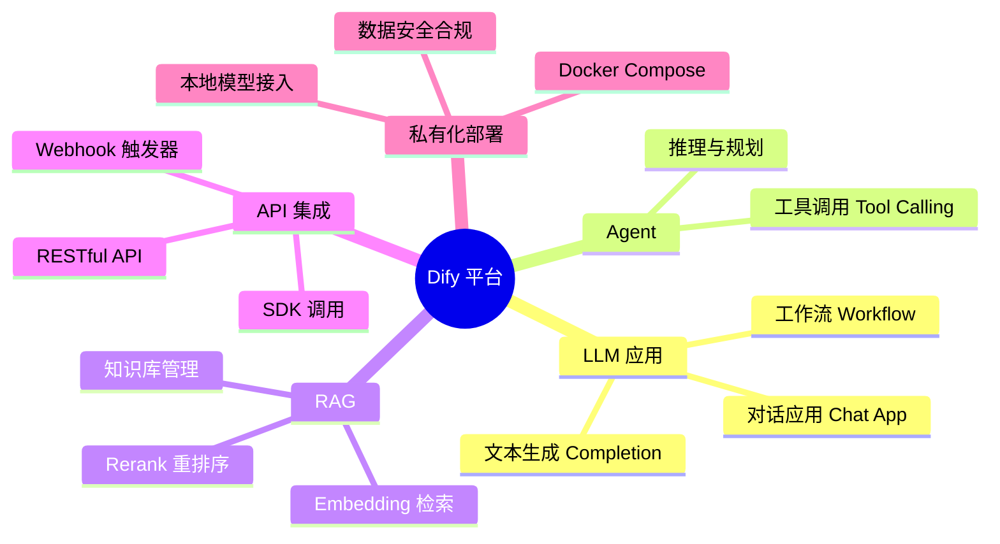

### 1.2 Dify vs 其他平台

| 维度           | Dify                     | Coze                    | LangChain            |
| -------------- | ------------------------ | ----------------------- | -------------------- |
| **定位**       | 开源 LLM 应用平台        | 字节跳动智能体平台      | LLM 开发框架         |
| **部署方式**   | 私有化 Docker / Cloud    | 云端 SaaS / Coze Studio | 代码库集成           |
| **企业适用**   | ✅ 高（私有化、数据安全） | 中（国内生态好）        | 高（灵活但开发量大） |
| **低代码程度** | 高（可视化编排）         | 高（拖拽式）            | 低（纯代码）         |
| **工作流**     | ChatFlow + Workflow      | 单一流程                | 完全自定义           |
| **开源**       | ✅ 是                     | ❌ 否                    | ✅ 是                 |

---

## 2. Dify 本地化部署

### 2.1 部署架构

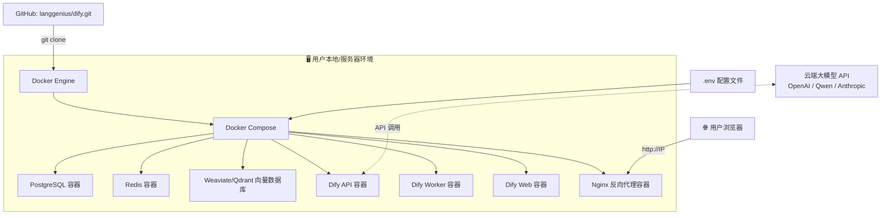

### 2.2 环境要求

| 资源     | 最低配置                   | 推荐配置           |
| -------- | -------------------------- | ------------------ |
| **内存** | ≥ 4 GB                     | ≥ 16 GB            |
| **CPU**  | ≥ 2 核                     | ≥ 4 核             |
| **硬盘** | 2-3 GB（仅 Dify）          | 10 GB+（含模型）   |
| **网络** | 需访问 Docker Hub / GitHub | 科学上网或国内镜像 |

### 2.3 部署步骤

#### Step 1：克隆 Dify 源码

```bash
git clone https://github.com/langgenius/dify.git
```

#### Step 2：配置 Docker 环境

```bash
cd dify/docker
cp .env.example .env
```

编辑 `.env` 文件，关键配置项：

```ini
# Dify 访问地址（生产环境替换为实际 IP）
APP_URL=http://localhost

# 大模型 API Keys
OPENAI_API_KEY=sk-xxxxx
ANTHROPIC_API_KEY=sk-ant-xxxxx
DASHSCOPE_API_KEY=sk-xxxxx     # 通义千问

# 数据库与中间件（保持默认即可）
DB_USERNAME=postgres
DB_PASSWORD=difyai123456
REDIS_PASSWORD=difyai123456
```

#### Step 3：启动 Dify

```bash
docker compose up -d
```

> `-d` 参数表示后台运行（守护进程模式）。

#### Step 4：初始化访问

- **初始化页面**: `http://<IP>/install`（首次设置管理员账号）
- **登录页面**: `http://<IP>/signin`
- **默认地址**: `http://localhost`（本地访问）

### 2.4 Dify 升级

```bash
cd dify/docker
git pull                          # 拉取最新代码
docker compose pull               # 拉取最新镜像
docker compose up -d              # 重新启动
```

### 2.5 部署生命周期

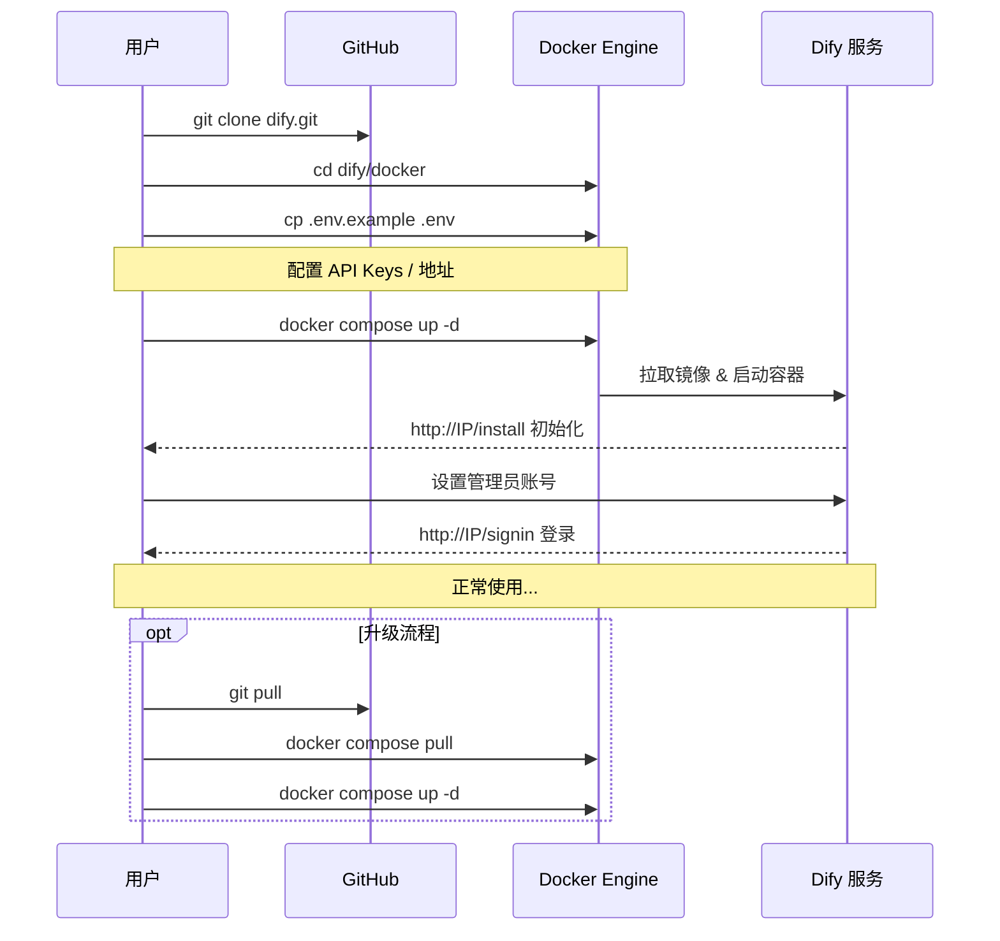

---

## 3. 核心概念：ChatFlow vs Workflow

Dify 提供两种核心应用编排模式，适用于不同的场景：

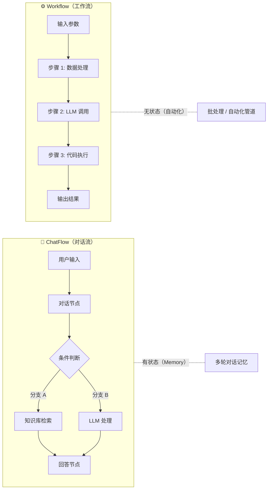

### 对比总结

| 特性         | ChatFlow               | Workflow             |
| ------------ | ---------------------- | -------------------- |
| **核心场景** | 多轮对话、客服、咨询   | 自动化流程、数据处理 |
| **状态管理** | ✅ 有记忆（Memory）     | ❌ 无状态             |
| **交互方式** | 一问一答               | 一次输入 → 自动运行  |
| **输出节点** | 必须包含 "Answer" 节点 | 最终节点输出         |
| **适用举例** | 智能客服、AI 咨询      | 文档处理、批量分析   |

---

## 4. CASE 1：LLM — 联网搜索与关键词提取

### 4.1 场景描述

利用 Dify 构建一个**联网搜索智能问答系统**：用户输入问题 → 提取关键词 → 联网搜索 → 内容整理 → 返回答案。

### 4.2 工作流架构

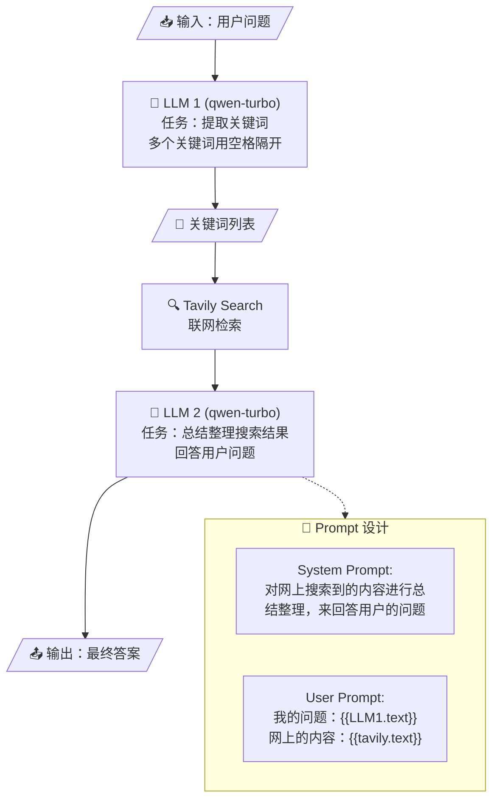

### 4.3 为什么需要关键词提取？

| 方法                       | 优点               | 缺点           |
| -------------------------- | ------------------ | -------------- |
| **LLM 自带联网搜索**       | 方便快捷           | 搜索质量不可控 |
| **关键词 + Tavily Search** | 搜索更精准、可调优 | 需要两步处理   |

> 直接传原始问题给搜索引擎可能导致检索结果不精确，先提取关键词可以提升搜索召回质量。

### 4.4 Tavily Search 配置

1. 访问 [https://tavily.com/](https://tavily.com/) 注册获取 API Key
2. 在 Dify 中添加 Tavily Search 工具插件
3. 在工作流中拖入 TavilySearch 节点，配置 API Key

---

## 5. CASE 2：Agent — AI 文生图（古诗词配画）

### 5.1 场景描述

用户输入一句古诗词 → Agent 将其翻译为英文（前缀 "ancient china"）→ 调用 AI 文生图模型生成配画。

### 5.2 工作流架构

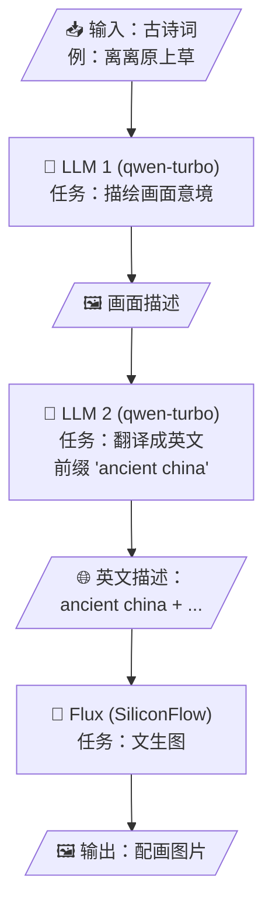

### 5.3 文生图模型选项

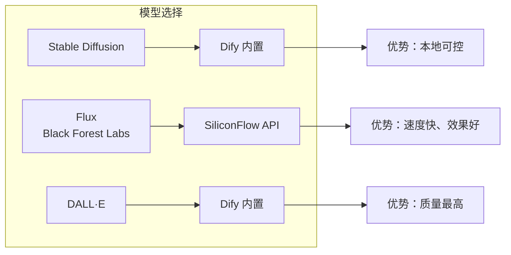

### 5.4 SiliconFlow 配置步骤

1. 注册 SiliconCloud 获取 API Key
2. 在 Dify 的工具区添加 SiliconFlow 凭据
3. 工作流中选择 "SiliconCloud → Flux / Stable Diffusion"

### 5.5 关键提示词设计

```
System Prompt (LLM 1):
用户给你一句古诗词，你来描绘一幅画面

System Prompt (LLM 2):
翻译成英文，前面加上 "ancient china"
```

> ⚠️ 注意：每次运行生成的图片结果会不一样，这是生成式 AI 的固有特性。

---

## 6. CASE 3：ChatFlow — 智能客服系统

### 6.1 场景描述

构建一个**金融智能客服系统**，融合知识库、用户行为分析和投诉处理能力：

- 🏦 **知识库**: 港股交易规则、理财产品文档
- 👤 **用户画像**: 用户标签 + 行为事件
- 💬 **意图分类**: 营销咨询 / 投诉处理
- 🤖 **智能回复**: 基于上下文的个性化应答

### 6.2 整体架构

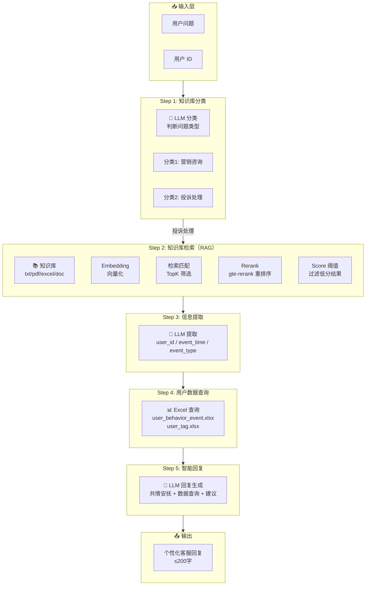

### 6.3 RAG 知识库处理流程

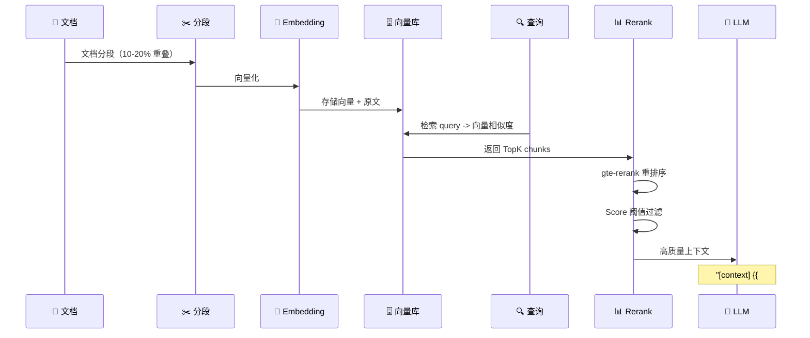

### 6.4 知识库质量优化策略

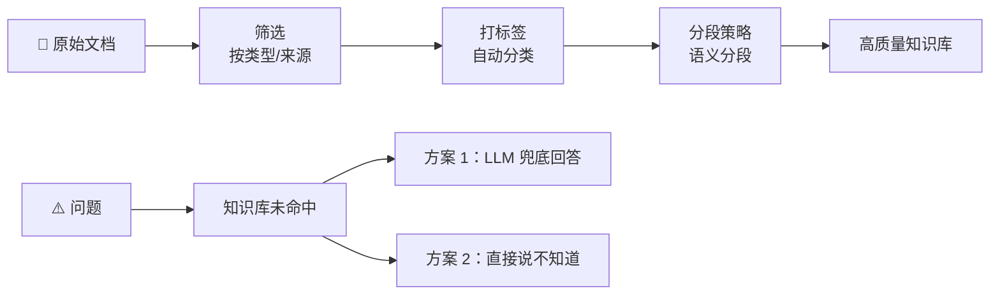

### 6.5 信息提取 Prompt 设计

```
你是一个智能信息提取助手。
你的任务是从用户提供的文本中准确地提取以下信息：
1. user_id: 用户的唯一标识符。
2. event_time: 事件发生的时间，改成日期格式
3. event_type: 事件类型，包括：查看持仓、浏览产品、搜索、
   登录、委托交易、推送点击、查看行情、集合竞价、咨询客服、
   风险警示、查看收益、浏览广告、推送未读。

请严格按照以下格式输出：
user_id: {user_id}, event_time: {event_time}, event_type: {event_type}

如果某个信息在用户文本中没有找到，请将对应的值设为 null
```

### 6.6 回复生成 Prompt 设计

```
# 角色定位:
- 专业投诉处理顾问

# 背景:
- 需通过共情语言安抚客户情绪，积极解决问题。
- 需核查关键信息，确保问题准确定位。

# 目标:
1. 回应话术：以共情安抚客户，表达积极解决态度。
2. 反馈你从数据库中查询到的情况（筛选与该用户user_id匹配的信息，
   说明具体的event_detail。无关信息不要回答）
3. 针对用户的问题给出建议
4. 回答文字简洁，通常不超过200字

# 以下是从用户数据库中检索出的信息：
{{#context#}}
```

---

## 7. CASE 4：MinerU + Dify — 智能文档分析

### 7.1 场景描述

利用 MinerU 的 PDF 解析能力 + Dify 的 LLM 能力，实现对复杂 PDF 文档（如学术论文）的智能分析与问答。

### 7.2 工作流架构

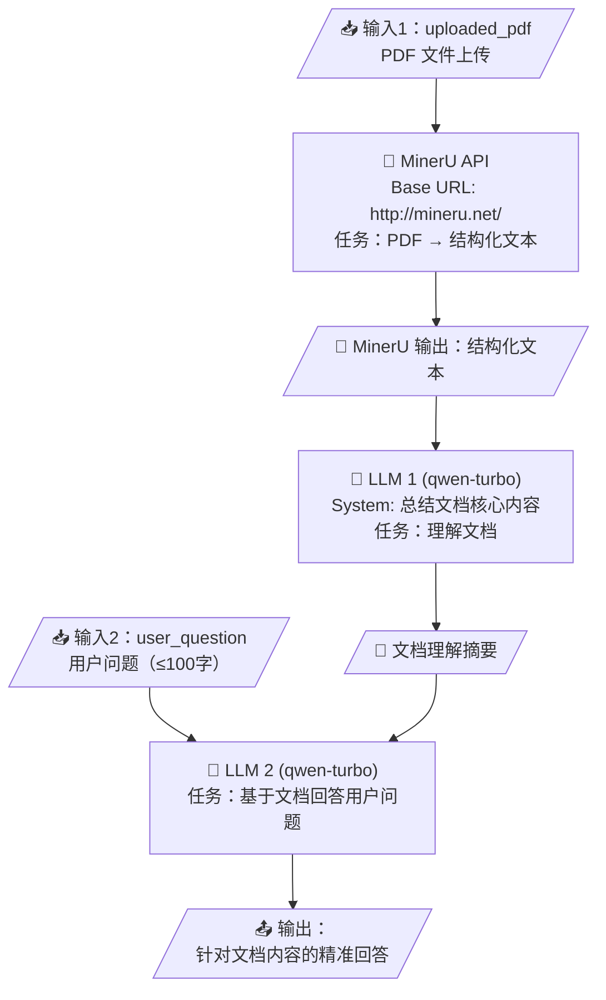

### 7.3 MinerU 配置

| 配置项     | 值                                   |
| ---------- | ------------------------------------ |
| Base URL   | `http://mineru.net/`                 |
| Token 获取 | `https://mineru.net/apiManage/token` |

### 7.4 为什么用 MinerU 而不是直接让 LLM 读取 PDF？

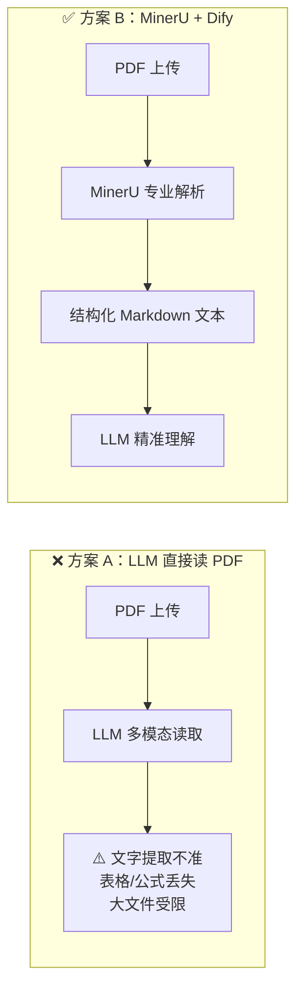

> MinerU 专为 PDF 解析优化，能更好地提取文字、表格、公式等结构化内容，输出为标准 Markdown 格式。

---

## 8. Agent API 编程集成

### 8.1 Coze API（cozepy SDK）

Coze 提供了 Python SDK `cozepy`，可以方便地与 Coze 智能体进行交互。

#### 8.1.1 SDK 架构

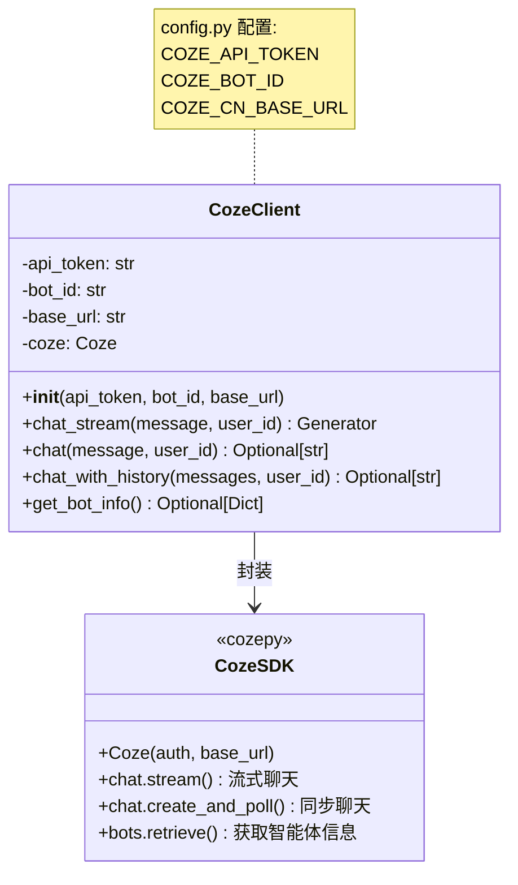

#### 8.1.2 获取凭证

**Step 1: 获取 API Token**

访问 [https://www.coze.cn/open/oauth/pats](https://www.coze.cn/open/oauth/pats) → 创建 Personal Access Token → 复制保存。

**Step 2: 获取 Bot ID**

进入智能体发布页面，从 URL 中提取 Bot ID：

```
https://www.coze.cn/store/agent/7507272032905199655?bot_id=true
                                   ↑ Bot ID
```

#### 8.1.3 代码示例

**配置（config.py）**:

```python
# Coze API 配置
COZE_API_TOKEN = "pat_xxxxxxxxxxxxxxxxxxxxx"
COZE_BOT_ID = "7658520471843536930"
COZE_CN_BASE_URL = "https://api.coze.cn"
DEFAULT_USER_ID = "user_12345"
```

**流式聊天**:

```python
from cozepy import Coze, TokenAuth, Message, ChatEventType, MessageContentType

coze = Coze(
    auth=TokenAuth(token="your_api_token"),
    base_url="https://api.coze.cn"
)

# 流式接收回复
for event in coze.chat.stream(
    bot_id="your_bot_id",
    user_id="user_123",
    additional_messages=[Message.build_user_question_text("你好")]
):
    if event.event == ChatEventType.CONVERSATION_MESSAGE_DELTA:
        if event.message.content.type == MessageContentType.TEXT:
            print(event.message.content.text, end="", flush=True)
```

**普通聊天**:

```python
from cozepy import ChatStatus

chat_poll = coze.chat.create_and_poll(
    bot_id="your_bot_id",
    user_id="user_123",
    additional_messages=[Message.build_user_question_text("你好")]
)

if chat_poll.chat.status == ChatStatus.COMPLETED:
    for message in chat_poll.messages:
        if message.role == "assistant" and message.content:
            print(f"智能体: {message.content}")
```

**客户端封装使用**:

```python
from coze_client import CozeClient

client = CozeClient()

# 流式模式
for chunk in client.chat_stream("你好，请介绍一下自己"):
    print(chunk, end="", flush=True)

# 普通模式
response = client.chat("你好，请介绍一下自己")
print(response)
```

#### 8.1.4 Coze API 调用流程

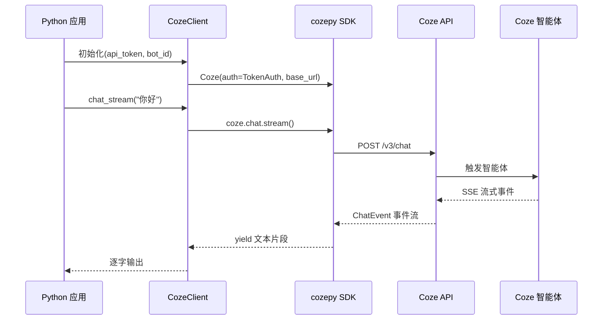

---

### 8.2 Dify API

Dify 提供了完整的 RESTful API，支持三种应用类型的调用。

#### 8.2.1 API 类型

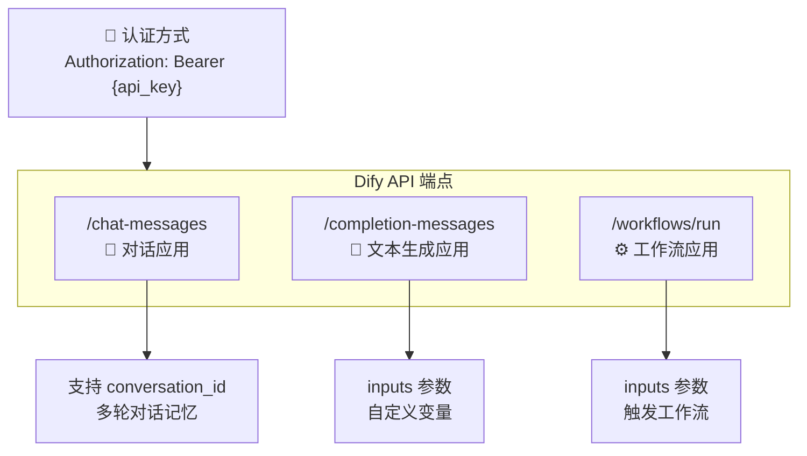

#### 8.2.2 获取 API 凭证

在 Dify 平台中：**应用 → 访问 API → API 密钥**，获取 API Key。

- **API Base URL**: `https://api.dify.ai/v1`（Cloud）或 `http://<你的IP>/v1`（本地部署）

#### 8.2.3 SDK 类设计

```mermaid
classDiagram
    class DifyAgentClient {
        -base_url: str
        -api_key: str
        -headers: dict
        +chat_completion(user_input, user_id, conversation_id, stream, app_type) Dict
        +run_workflow(inputs, user_id, stream) Dict
        +completion_message(user_input, user_id, stream, inputs) Dict
        +get_conversation_messages(conversation_id, user_id) Dict
        -_try_chat_endpoint() Dict
        -_try_completion_endpoint() Dict
        -_try_workflow_endpoint() Dict
        -_handle_blocking_response() Dict
        -_handle_streaming_response() Dict
        -_handle_workflow_blocking_response() Dict
        -_handle_workflow_streaming_response() Dict
    }

    note for DifyAgentClient "自动检测应用类型:<br/>chat → completion → workflow<br/>按优先级尝试"
```

#### 8.2.4 代码示例

**Chat App 调用（对话流）**:

```python
from dify_agent_client import DifyAgentClient

client = DifyAgentClient(
    base_url="https://api.dify.ai/v1",
    api_key="app-xxxxxxxxxxxx"
)

result = client.chat_completion(
    user_input="我的用户id：7501690985227960354，我在5月4日登录了软件，但是没有成功",
    user_id="demo_user",
    app_type="chat"  # 明确指定为对话流类型
)

if not result.get("error"):
    print(f"回复: {result['answer']}")
    print(f"会话ID: {result['conversation_id']}")
```

**Workflow 调用**:

```python
from dify_agent_client import DifyAgentClient

client = DifyAgentClient(
    base_url="https://api.dify.ai/v1",
    api_key="app-DoQ8YDcVNqGRdD6UqffkWq0B"
)

result = client.run_workflow(
    inputs={"input": "离离原上草"},
    user_id="demo_user"
)

if not result.get("error"):
    print(f"工作流回复: {result['answer']}")
    print(f"运行ID: {result['workflow_run_id']}")
```

#### 8.2.5 Dify API 调用流程

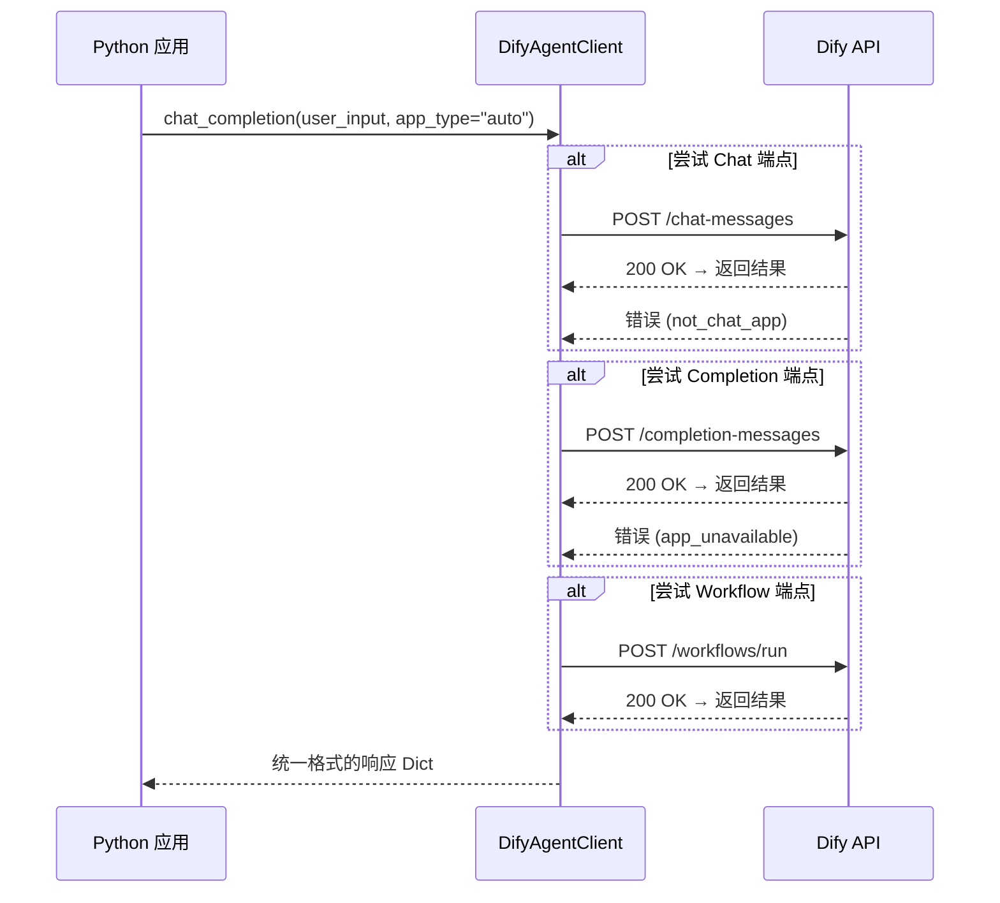

---

## 9. FAQ 常见问题汇总

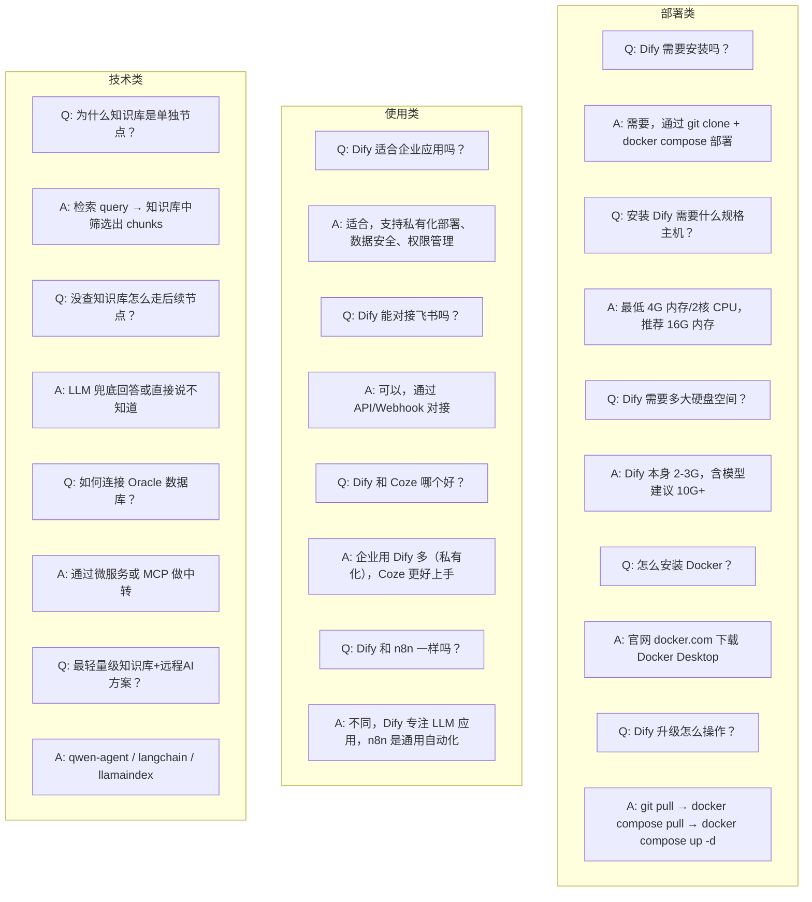

### 更多 Q&A


<b>Q: Coze 200万的方案凭什么值200万？</b>


A: Coze 的 enterprise 解决方案包含专属部署、模型精调、运维支持和 SLA 保障，不仅是软件本身。


<b>Q: 低代码方便但不可预测性和掌控性差？</b>


A: 是的，这是固有取舍。低代码适合快速验证，纯代码（LangChain/LangGraph）适合复杂定制。实际项目中可以混合使用：低代码搭主体，代码做插件。


<b>Q: AI 智能体架构师需要哪些技能？</b>


1. **AI Agent 搭建**：RAG、工具调用、Workflow 编排
2. **模型微调**：LoRA、数据工程
3. **数据决策**：数据分析、策略设计


<b>Q: 什么时候用私有化大模型？</b>


1. **数据安全**：敏感数据不能上云
2. **模型微调**：需要定制化模型能力


<b>Q: Agent 可以 Coze + Trae 混合开发吗？怎么封装？</b>


- Coze 搭建主体流程
- Trae 进行插件搭建
- 最终通过 API 或 SDK 封装为统一服务
  

---

## 10. 附录：环境依赖与参考链接

### 10.1 Python 依赖

**Coze API 项目** (`requirements.txt`):

```
cozepy>=0.7.0
python-dotenv>=1.0.0
```

**Dify API 项目** (`requirements.txt`):

```
requests==2.31.0
python-dotenv==1.0.0
```

### 10.2 项目文件结构

```
20-Dify本地化部署和应用/
├── 1-Dify部署与应用.pdf              # 课程主文档
├── 笔记20260405.txt                   # 课堂问答笔记
├── CASE-Coze API使用/
│   ├── config.py                      # Coze API 配置
│   ├── coze_client.py                 # Coze 客户端封装
│   └── requirements.txt               # Python 依赖
├── CASE-Dify API使用/
│   ├── dify_agent_client.py           # Dify API 客户端
│   ├── dify_chat_example.py           # Chat App 示例
│   ├── dify_workflow_example.py       # Workflow 示例
│   └── requirements.txt               # Python 依赖
├── CASE-智能客服ChatFlow/
│   ├── user_behavior_event.xlsx       # 用户行为事件数据
│   ├── user_tag.xlsx                  # 用户标签数据
│   ├── 港股交易规则介绍.pdf           # 知识库文档
│   ├── 平安财富日添利理财产品.doc     # 知识库文档
│   ├── 上海证券交易所交易规则.pdf    # 知识库文档
│   └── 中国平安金裕人生理财产品.doc  # 知识库文档
└── CASE-智能文档分析助手/
    └── INTERNVIDEO2.5.pdf             # 学术论文分析案例
```

### 10.3 参考链接

| 资源           | 地址                                                         |
| -------------- | ------------------------------------------------------------ |
| Dify 官网      | [https://dify.ai](https://dify.ai)                           |
| Dify Cloud     | [https://cloud.dify.ai/apps](https://cloud.dify.ai/apps)     |
| Dify GitHub    | [https://github.com/langgenius/dify](https://github.com/langgenius/dify) |
| Coze 中国      | [https://www.coze.cn](https://www.coze.cn)                   |
| Coze API Token | [https://www.coze.cn/open/oauth/pats](https://www.coze.cn/open/oauth/pats) |
| Tavily Search  | [https://tavily.com](https://tavily.com)                     |
| MinerU         | [https://mineru.net](https://mineru.net)                     |
| Docker 官网    | [https://www.docker.com](https://www.docker.com)             |

### 10.4 技术栈总览

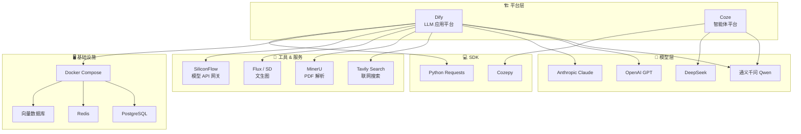
