<!-- more -->

## 1. 概述与学习目标

本课程聚焦 **Agent 进阶与集成**，涵盖从低代码到高代码的完整 Agent 开发链路：

- **批处理**：对同类型多任务进行批量并行处理
- **Coze 应用**：构建带 UI 表单的应用级 Agent
- **数据表使用**：结构化数据的动态查询与写入
- **多 Agents 模式**：分诊台 + 专业子 Agent 的协作架构
- **多工作流复杂应用**：嵌套工作流、跨工作流数据传递
- **Agent 集成**：通过 API 将 Agent 嵌入现有业务系统

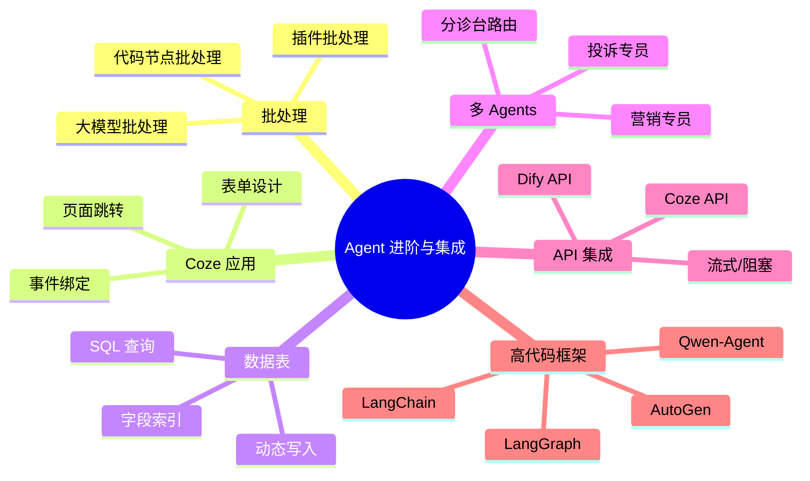

## 2. Agent 核心架构

### 2.1 Agent 组成公式

```
Agent = System Prompt + RAG（知识库） + 数据表 + 工具（插件/工作流）
```

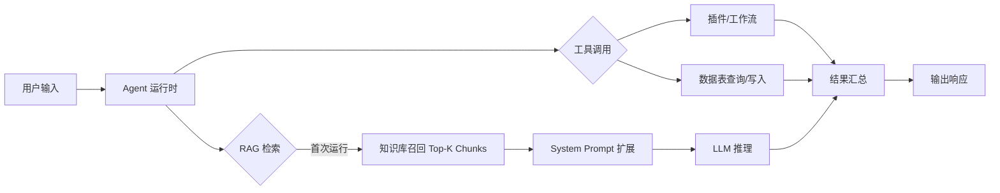

### 2.2 Agent 运行时流程

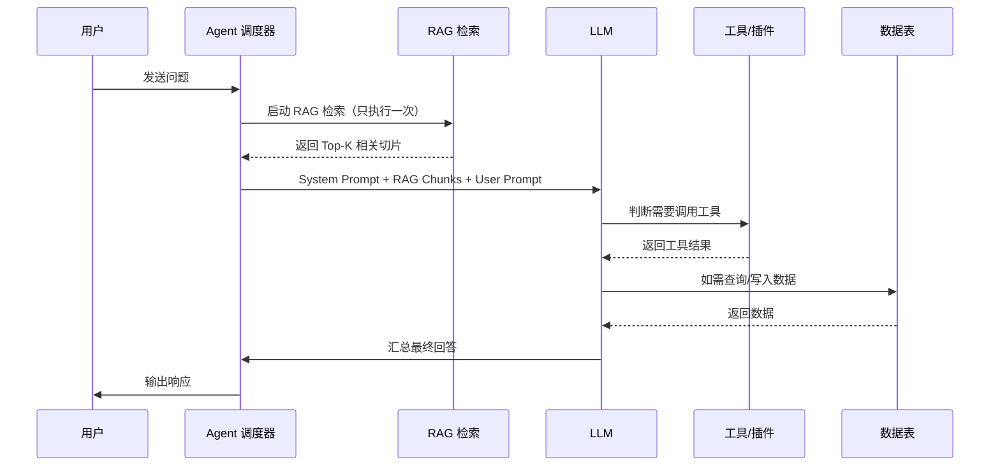

---

## 3. 低代码 Agent 开发平台对比

| 特性     | **Coze（扣子）**               | **Dify**                   |
| -------- | ------------------------------ | -------------------------- |
| 开发商   | 字节跳动                       | 开源社区                   |
| 定位     | AI Agent 智能体开发平台        | LLM 应用开发平台           |
| 应用类型 | 智能体、应用（App）            | 对话流、工作流、文本生成   |
| 批处理   | ✅ 支持（大模型/插件/代码节点） | ✅ 支持                     |
| 多 Agent | ✅ 原生多 Agents 模式           | ⚠️ 通过工作流编排           |
| 数据库   | ✅ 内置数据表（SQL 查询）       | ✅ 知识库 + 外部数据库      |
| API 集成 | `cozepy` SDK / REST API        | REST API（标准 SSE）       |
| 部署方式 | SaaS（coze.cn / coze.com）     | SaaS（Dify Cloud）/ 自部署 |
| 适用人群 | 业务人员 + 低代码开发者        | 开发者 + 技术团队          |

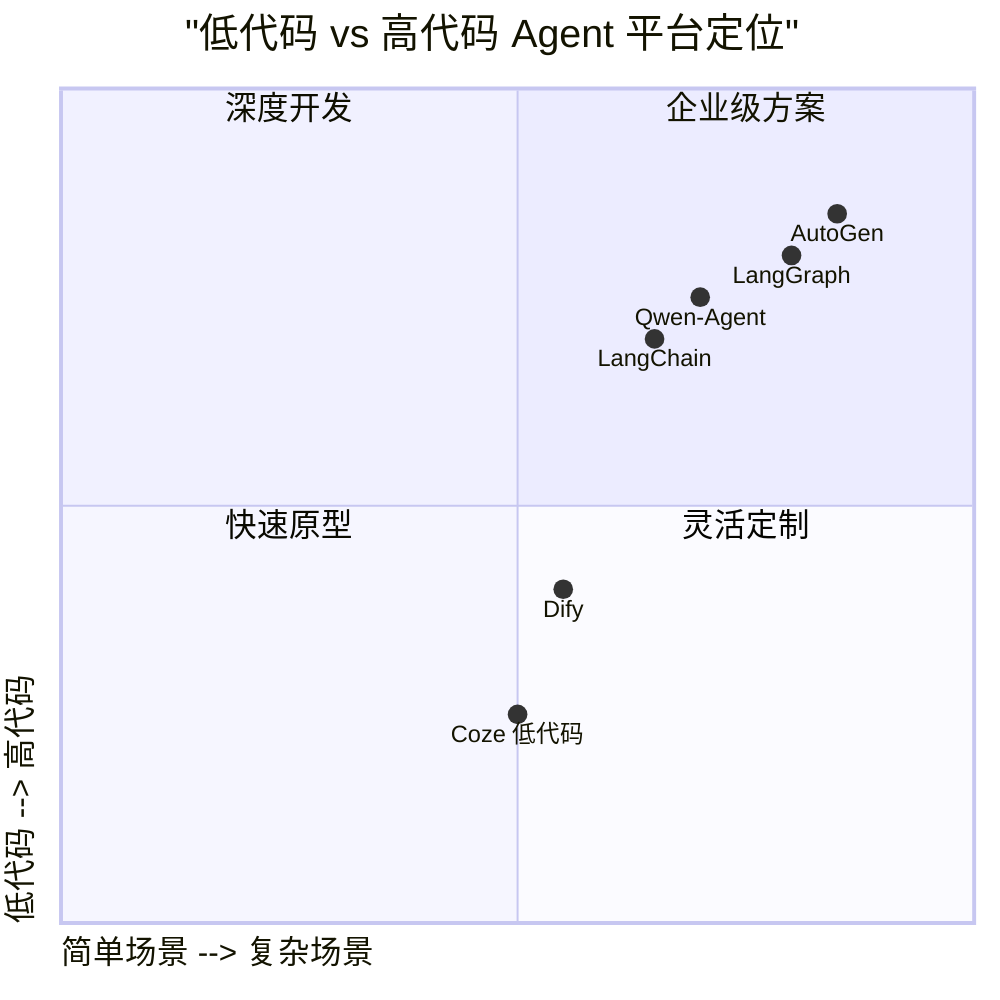

---

## 4. CASE 1：古诗词绘画（批处理）

### 4.1 业务场景

用户输入完整古诗词，AI 自动拆解为 4 个场景，对每个场景进行文生图提示词制作，最终生成 4 张绘画作品。

### 4.2 工作流架构

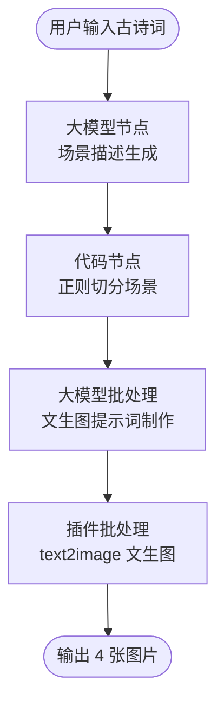

### 4.3 核心代码实现

#### 场景切分代码节点（Python）

```python
import re

async def main(args: Args) -> Output:
    params = args.params
    # 提取场景文本
    scenes_text = params['input']
    # 使用正则表达式匹配场景
    scene_pattern = r'场景\d+：([^场景]+)'
    scenes = []

    # 查找所有匹配
    for match in re.finditer(scene_pattern, scenes_text, re.DOTALL):
        scene_text = match.group(1).strip()
        scenes.append(scene_text)

    # 构建输出对象
    ret: Output = {
        "scenes": scenes,       # 场景数组
        "scene_count": len(scenes),  # 场景数量
    }
    return ret
```

#### 数据流转示意

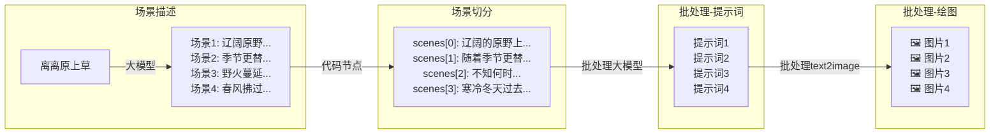

### 4.4 关键技术点

| 技术点           | 说明                                                |
| ---------------- | --------------------------------------------------- |
| **批处理模式**   | 将数组数据拆分为 item，对每个 item 并行执行相同逻辑 |
| **代码节点**     | 在 Coze IDE 中使用 `Ctrl+I` 调用 AI 辅助编写代码    |
| **输出变量传递** | `scenes` 和 `scene_count` 作为节点间数据桥梁        |
| **插件选择**     | `text2image` 插件，`model_type=1` 提高出图质量      |

---

## 5. CASE 2：智能投顾助手（风险评测与推荐）

### 5.1 业务场景

用户通过表单填写风险评测问卷，AI 根据风险等级从知识库中匹配最合适的 3 款金融产品，并通过流式输出展示推荐结果。

### 5.2 应用架构

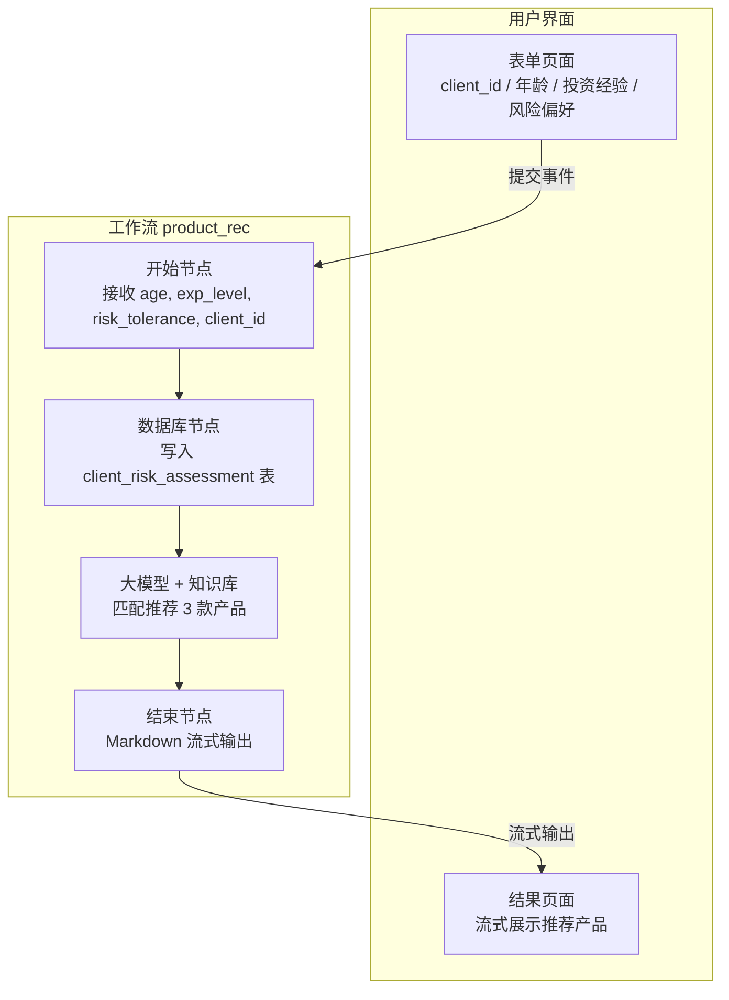

### 5.3 风险评测问卷设计

| 字段     | 问题                                  | 变量名           | 类型   | 验证  |
| -------- | ------------------------------------- | ---------------- | ------ | ----- |
| 客户 ID  | 请输入客户 ID                         | `client_id`      | String | —     |
| 年龄     | 请输入您的年龄（18-70 岁）            | `age`            | Number | 18-70 |
| 投资经验 | 投资经验：1. <1 年 2. 1-3 年 3. >3 年 | `exp_level`      | Number | 1/2/3 |
| 风险偏好 | 最大本金亏损比例：A.10% B.20% C.30%   | `risk_tolerance` | String | A/B/C |

### 5.4 产品推荐 Prompt

```
你是一名证券投顾，根据客户的风险测评结果，从知识库中筛选最匹配的3款产品：
- 年龄：{{age}}岁
- 投资经验：{{exp_level}}级（1=新手，3=资深）
- 风险偏好：{{risk_tolerance}}（能承受的最大本金亏损比例，A=10%, B=20%, C=30%）

筛选规则：
1. 优先匹配风险等级（R1/R2/R3对应A/B/C）。
2. 新手客户（exp_level=1）避免推荐复杂衍生品。
3. 返回格式：
**产品名称**（代码）
- 匹配理由：结合客户年龄和风险偏好说明
```

### 5.5 ABC 证券产品矩阵

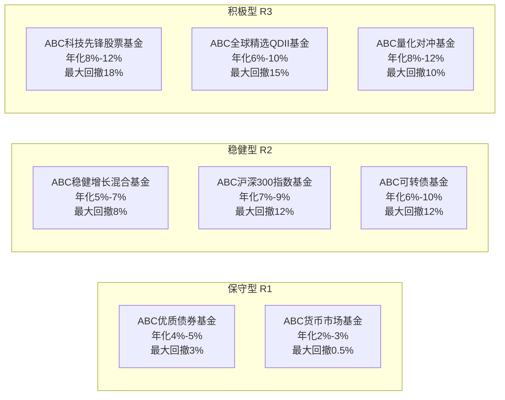

### 5.6 关键技术点

| 技术点         | 说明                                                    |
| -------------- | ------------------------------------------------------- |
| **数据表**     | `client_risk_assessment` 持久化存储用户评测结果         |
| **知识库分段** | 使用 `###产品` 作为自定义分段标识，确保产品信息完整召回 |
| **流式输出**   | 结束节点开启 Markdown 流式输出，提升用户交互体验        |
| **Coze 应用**  | 表单组件 + 事件绑定 + 页面跳转，构建完整 App            |

---

## 6. CASE 3：客户分层营销助手

### 6.1 业务场景

AI 助手根据客户资产、交易频率及风险偏好自动生成分层标签，匹配个性化营销策略（时机、渠道、话术），提升客户营销效率。

### 6.2 数据架构

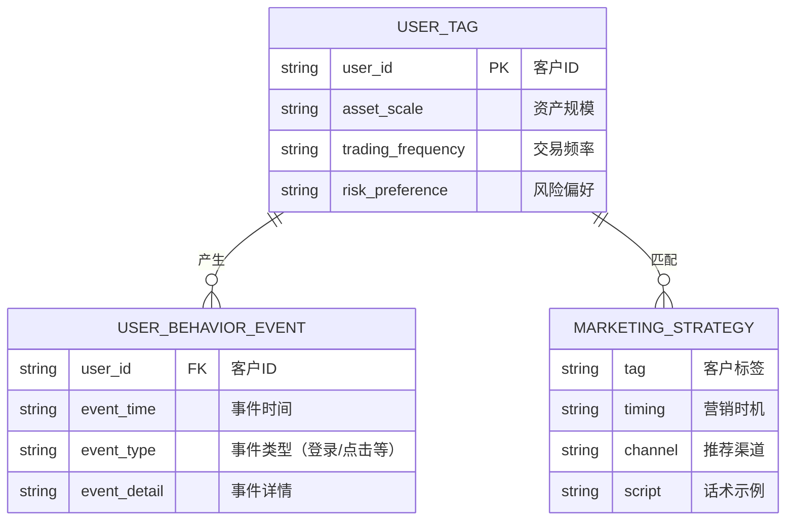

### 6.3 Agent 工作流程

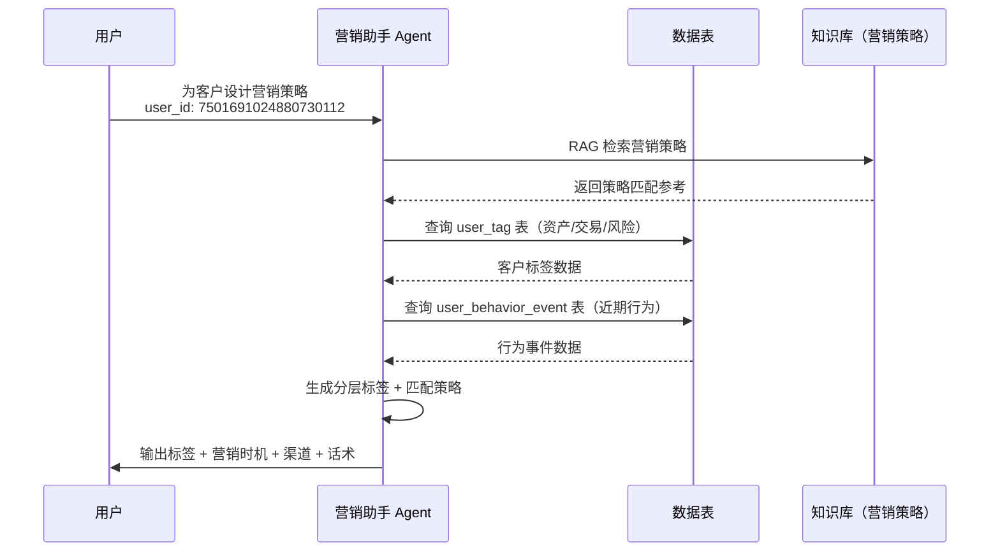

### 6.4 Agent 人设 Prompt（核心部分）

```
# 角色
你是一个智能营销助手，能够依据客户的资产规模、交易频率以及风险偏好，
自动精准生成分层标签。同时，可根据客户行为，匹配与之对应的营销策略，
涵盖营销时机、渠道以及合适的话术。

## 技能
### 技能1: 生成分层标签
根据客户资产规模、交易频率、风险偏好，生成匹配的分层标签。
例如：若客户资产规模大、交易频率高且风险偏好高，
生成"高价值高活跃高风险偏好客户"标签。

### 技能2: 匹配营销策略
1. 结合客户近期行为数据（如浏览产品种类、咨询频率）
2. 筛选最适配的营销策略：
   - 最佳营销时机（如客户浏览特定产品后的24小时内）
   - 合适的营销渠道（短信、邮件、电话等）
   - 针对性营销话术（根据客户偏好定制）

## 限制
- 仅围绕客户分层标签生成和营销策略匹配相关内容操作
- 输出内容需条理清晰
- 所有操作基于给定的客户数据和策略库
```

### 6.5 关键技术点

| 技术点                  | 说明                                                         |
| ----------------------- | ------------------------------------------------------------ |
| **知识库+数据表双通道** | 知识库存储营销策略文档（RAG 召回），数据表存储用户动态数据（SQL 查询） |
| **RAG 执行时机**        | RAG 只在 Agent 启动时执行一次，作为 System Prompt 的拓展     |
| **Few-Shot**            | 在提示词中说明标签范围，防止 Agent 超出标签范围生成结果      |
| **标签召回**            | 知识库需要设置标签才能进行有效召回                           |

---

## 7. CASE 4：智能客服 Agent（多 Agent 模式）

### 7.1 业务场景

设置两个智能体（营销专员 + 投诉专员）和一个分诊台路由 Agent，实现产品咨询和投诉处理的自动化分流，提供 7×24 小时客户服务。

### 7.2 多 Agent 协作架构

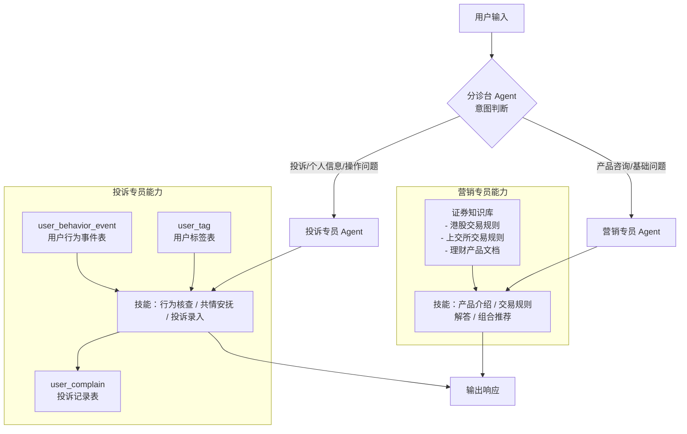

### 7.3 分诊台 Agent Prompt

```
# Role:
- 智能客服分诊台

# Background:
- 用于判断用户提出的问题是否为产品咨询（营销类），还是投诉问题。

# Goals:
- 判断用户问题的类别：营销问题，投诉问题

# Skills:
- 理解用户问题分类

# Constrains:
- 不做任何回复，只需要转到适合的Agent（营销专员，投诉专员）
- 当用户输入：投诉相关，产品使用不成功，用户问题涉及到个人信息，
  以及需要后台记录的信息时跳转到"投诉专员"
- 当用户输入：产品使用疑问，怎么使用，或者产品咨询等问题和基础问题时，
  跳转到"营销专员"节点
```

### 7.4 投诉专员 Prompt（核心部分）

```
# 角色定位:
- 专业投诉处理顾问（证券公司客户投诉处理智能体）

# 目标:
1. 首条回应话术：以共情安抚客户，表达积极解决态度。
2. 关于软件的操作，需要根据客户的情况，进行核实并反馈，
   使用 user_behavior_event 数据表进行查询
3. 关于客户投诉，需要添加到 user_complain 数据表
   complain_type：产品使用 / 系统故障 / 业务办理

# 约束:
- 添加投诉前，先需要进行核实用户行为，并进行反馈。
  如果确实是有问题，再添加到投诉中
- 回复必须体现共情和积极解决态度。
- 遵守证券行业合规要求，避免承诺投资建议。
```

### 7.5 多 Agent 切换规则

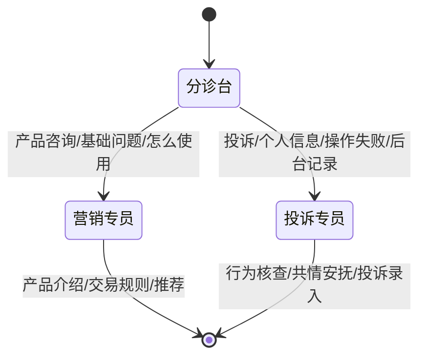

### 7.6 知识库文档清单

| 文档                         | 类型 | 用途             |
| ---------------------------- | ---- | ---------------- |
| 港股交易规则介绍.pdf         | PDF  | 港股交易规则知识 |
| 上海证券交易所交易规则.pdf   | PDF  | A股交易规则知识  |
| 平安财富日添利理财产品.doc   | DOC  | 理财产品信息     |
| 中国平安金裕人生理财产品.doc | DOC  | 理财产品信息     |

---

## 8. CASE 5：市场舆情监测 Agent

### 8.1 业务场景

用户输入查询日期 → 获取新浪财经新闻、APP 评论等舆情数据 → 数据分析 → 生成词云图（热点词云/好评词云/差评词云）→ 数据整合生成日报 → 生成 PDF 并返回链接。

### 8.2 工作流全景架构

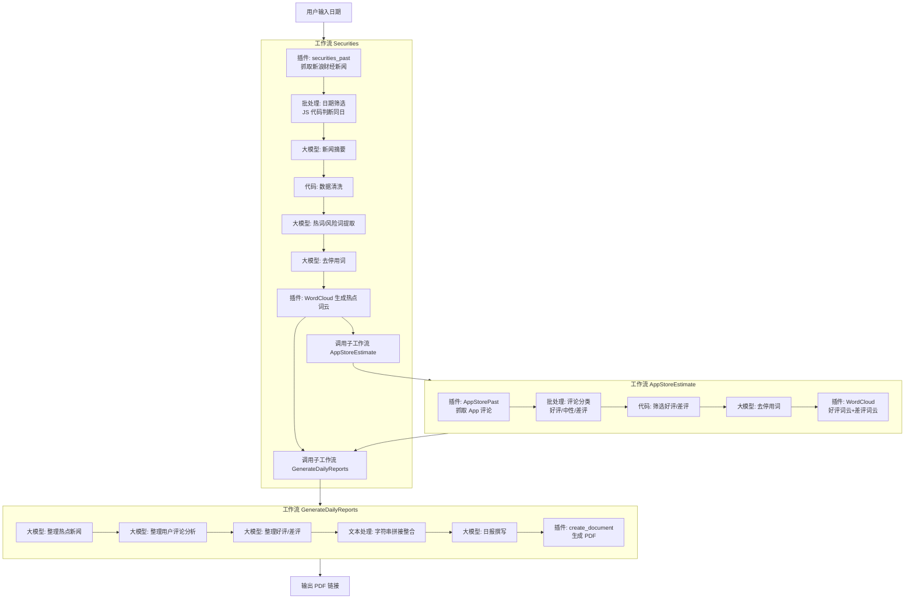

### 8.3 核心插件代码

#### 新浪财经新闻抓取（securities_past.py）

```python
from runtime import Args
from typings.securities_past.securities_past import Input, Output
import requests
from bs4 import BeautifulSoup

def get_news_list(page=1, logger=None):
    url = f"https://feed.mix.sina.com.cn/api/roll/get?pageid=186&lid=1746&num=10&page={page}"
    headers = {"User-Agent": "Mozilla/5.0"}
    resp = requests.get(url, headers=headers, timeout=10)
    data = resp.json()
    return data.get("result", {}).get("data", [])

def get_news_detail(news_url, logger=None):
    headers = {"User-Agent": "Mozilla/5.0"}
    resp = requests.get(news_url, headers=headers, timeout=10)
    resp.encoding = resp.apparent_encoding
    soup = BeautifulSoup(resp.text, "lxml")
    # 发布时间提取（多选择器兼容）
    pub_time = ""
    for sel in [
        ("span", {"class": "date"}),
        ("span", {"id": "pub_date"}),
        ("meta", {"property": "article:published_time"}),
    ]:
        tag = soup.find(*sel)
        if tag:
            pub_time = tag.get("content") if tag.name == "meta" else tag.text.strip()
            if pub_time: break
    # 正文提取（多选择器兼容）
    content = ""
    for sel in [
        ("div", {"id": "artibody"}),
        ("div", {"class": "article"}),
    ]:
        div = soup.find(*sel)
        if div:
            content = "\n".join([p.text.strip() for p in div.find_all("p") if p.text.strip()])
            if content: break
    return pub_time, content

def handler(args: Args[Input]) -> Output:
    logger = getattr(args, "logger", None)
    all_news = []
    for page in range(1, 21):  # 抓取前 20 页
        news_list = get_news_list(page, logger=logger)
        for news in news_list[:3]:  # 每页取前 3 条
            title = news.get("title")
            url = news.get("url")
            try:
                pub_time, content = get_news_detail(url, logger=logger)
                all_news.append({
                    "title": title,
                    "publish_time": pub_time,
                    "content": content,
                    "url": url
                })
            except Exception as e:
                if logger:
                    logger.error(f"解析失败: {e}")
    return {"data": all_news}
```

#### App Store 评论抓取（AppStorePast.py）

```python
from runtime import Args
from typings.AppStorePast.AppStorePast import Input, Output
import requests
from bs4 import BeautifulSoup

def handler(args: Args[Input]) -> Output:
    app_id = '1042567321'  # 招商证券 APP
    comments = []
    page = 1
    url = f'https://itunes.apple.com/cn/rss/customerreviews/page={page}/id={app_id}/sortBy=mostRecent/xml'
    response = requests.get(url)
    response.encoding = 'utf-8'
    soup = BeautifulSoup(response.content, 'xml')
    entries = soup.find_all('entry')[1:]  # 跳过第一个 entry

    for entry in entries:
        author = entry.find('name').text
        rating = entry.find('im:rating').text
        title = entry.find('title').text
        content = entry.find('content').text
        updated = entry.find('updated').text
        comments.append({
            'author': author,
            'rating': rating,
            'title': title,
            'content': content,
            'updated': updated
        })

    print(f"共获取到{len(comments)}条评论：\n")
    return {"comments": comments}
```

#### 日期筛选（代码.js）

```javascript
async function main({ params }: Args): Promise<Output> {
    const now_time = params.now_time;        // 例如 "3月2日"
    const publish_time = params.publish_time; // 例如 "2025年03月02日 22:32"

    function parseNowMonthDay(str) {
        const match = str.match(/(\d{1,2})月(\d{1,2})日/);
        if (match) {
            return { month: parseInt(match[1], 10), day: parseInt(match[2], 10) };
        }
        return { month: null, day: null };
    }

    function parsePublishMonthDay(str) {
        const month = parseInt(str.slice(5, 7), 10);
        const day = parseInt(str.slice(8, 10), 10);
        return { month, day };
    }

    const now = parseNowMonthDay(now_time);
    const pub = parsePublishMonthDay(publish_time);
    const same_month_day = (now.month === pub.month && now.day === pub.day) ? 1 : 0;
    const ret = { same_month_day };
    return ret;
}
```

#### 评论分类筛选（AppStorePast-代码1.py）

```python
from typing import Any
async def main(args: Args) -> Output:
    params = args.params
    input_list = params['input_list']
    key0 = []  # 好评
    key1 = []  # 差评
    for obj in input_list:
        for item in obj['output']:
            if item['estimate'] == '好评':
                key0.append(item)
            elif item['estimate'] == '差评':
                key1.append(item)

    ret: Output = {
        "key0_good": key0,
        "key1_bad": key1,
    }
    return ret
```

### 8.4 日报生成 Prompt（核心）

```
# Role:
- 舆情日报编写专家

# Goals:
- 分析证券新闻热点、AppStore用户评论、新闻热词、舆情风向等信息
- 总结并生成一份专业的证券行业市场舆情监控日报

# Workflows:
1. 根据已有数据确定报告生成时间和数据来源
2. 分析新闻热点信息，提炼热点内容，总结近期热点事件
3. 分析评论数据，确定舆情导向，对舆情内容分类并思考解决方案
4. 整理数据内容，将数据量化，用百分比生成对比表格
5. 生成"市场舆情监控日报"大纲
6. 按照大纲要求进行日报撰写

# Constrains:
- 按照大纲撰写文章，不得随意编写
- 数据要求有理有据，不得捏造
- 输出报告详细完整，并提供相关优化和风控建议
- 将词云图插入到报告中
```

---

## 9. Agent API 集成

### 9.1 Coze API 集成

Coze 提供 `cozepy` Python SDK，支持三种对话模式。

#### 安装与配置

```python
# config.py
COZE_API_TOKEN = "pat_xxxx...你的令牌"
COZE_BOT_ID = "你的bot_id"
COZE_CN_BASE_URL = "https://api.coze.cn"
DEFAULT_USER_ID = "user_12345"
```

```bash
pip install cozepy>=0.16.2
```

#### 三种对话模式

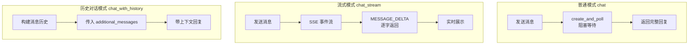

#### 流式事件流程

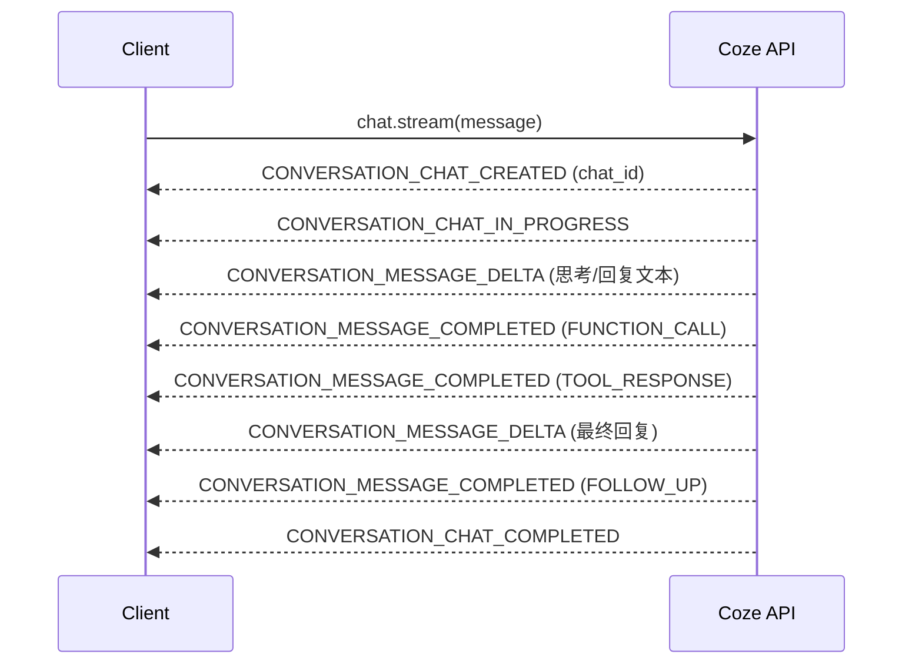

#### 事件类型说明

| 事件类型                         | 消息类型        | 说明                                      |
| -------------------------------- | --------------- | ----------------------------------------- |
| `CONVERSATION_CHAT_CREATED`      | —               | 对话创建，返回 `chat_id`                  |
| `CONVERSATION_CHAT_IN_PROGRESS`  | —               | 对话开始处理                              |
| `CONVERSATION_MESSAGE_DELTA`     | `ANSWER`        | 流式文本片段，逐字/逐词返回               |
| `CONVERSATION_MESSAGE_COMPLETED` | `FUNCTION_CALL` | 插件/工具调用信息（JSON，含插件名、参数） |
| `CONVERSATION_MESSAGE_COMPLETED` | `TOOL_RESPONSE` | 工具返回结果（JSON，含输出内容）          |
| `CONVERSATION_MESSAGE_COMPLETED` | `ANSWER`        | 完整最终回复文本                          |
| `CONVERSATION_MESSAGE_COMPLETED` | `FOLLOW_UP`     | 智能体推荐的后续问题                      |
| `CONVERSATION_CHAT_COMPLETED`    | —               | 对话结束                                  |
| `CONVERSATION_CHAT_FAILED`       | —               | 对话失败                                  |

#### CozeClient 核心类

```python
from cozepy import Coze, TokenAuth, Message, ChatEventType, MessageType, ChatStatus

class CozeClient:
    def __init__(self, api_token, bot_id, base_url):
        self.coze = Coze(
            auth=TokenAuth(token=api_token),
            base_url=base_url,
        )

    # 流式聊天
    def chat_stream(self, message, user_id=None, verbose=False):
        for event in self.coze.chat.stream(
            bot_id=self.bot_id,
            user_id=user_id,
            additional_messages=[Message.build_user_question_text(message)],
        ):
            if event.event == ChatEventType.CONVERSATION_MESSAGE_DELTA:
                if event.message.type == MessageType.ANSWER:
                    yield event.message.content

    # 普通聊天（阻塞模式）
    def chat(self, message, user_id=None):
        chat_poll = self.coze.chat.create_and_poll(
            bot_id=self.bot_id,
            user_id=user_id,
            additional_messages=[Message.build_user_question_text(message)],
        )
        if chat_poll.chat.status == ChatStatus.COMPLETED:
            for msg in chat_poll.messages:
                if msg.role == "assistant" and msg.content:
                    return msg.content
```

### 9.2 Dify API 集成

Dify 提供标准的 REST API，支持三种应用类型。

#### 整体架构

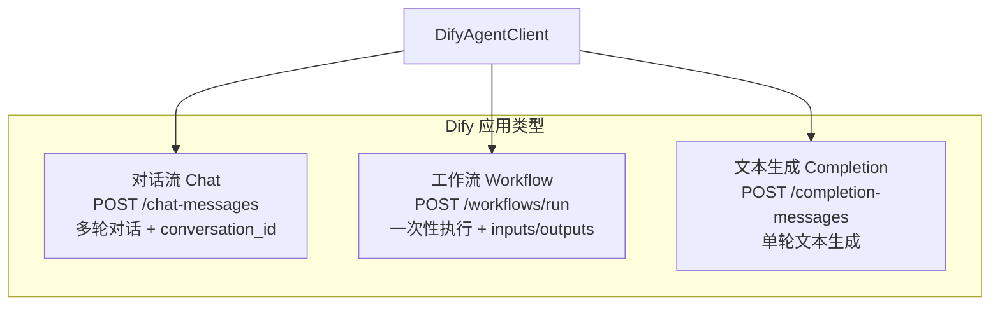

#### 对话流 vs 工作流对比

| 特性     | **工作流 Workflow**                                          | **对话流 Chat**                     |
| -------- | ------------------------------------------------------------ | ----------------------------------- |
| API 端点 | `/workflows/run`                                             | `/chat-messages`                    |
| 输入方式 | `inputs` 字典（自定义 key）                                  | `query` 字符串                      |
| 多轮对话 | ❌ 不支持                                                     | ✅ 支持（`conversation_id`）         |
| 返回格式 | `data.outputs`（结构化）                                     | `answer`（文本回复）                |
| 适用场景 | 一次性任务（生成图片、数据处理）                             | 交互式对话、客服问答                |
| 流式支持 | SSE 事件：`workflow_started` → `text_chunk` → `workflow_finished` | SSE 事件：`message` → `message_end` |

#### Dify 流式事件类型

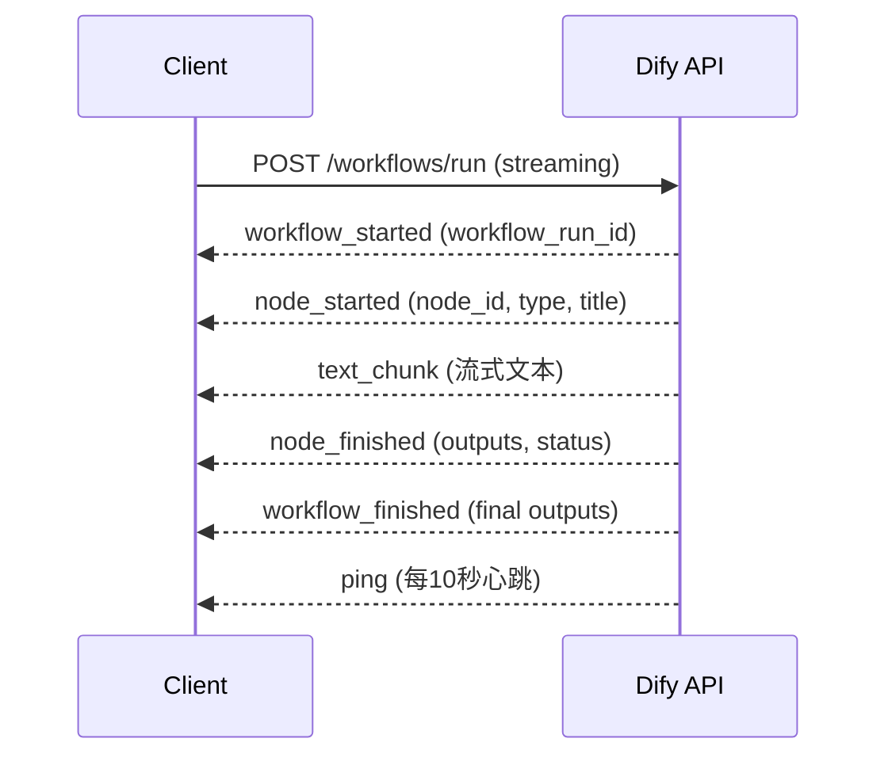

#### DifyAgentClient 核心类（工作流调用示例）

```python
from dify_agent_client import DifyAgentClient

BASE_URL = "https://api.dify.ai/v1"
API_KEY = "app-xxxxxxxxxxxxx"

client = DifyAgentClient(BASE_URL, API_KEY)

# 调用工作流
result = client.run_workflow(
    inputs={"input": "离离原上草"},
    user_id="demo_user",
)

# 处理返回结果（如图片文件）
if not result.get("error"):
    outputs = result.get("outputs", {})
    for item in outputs.get("output", []):
        if item.get("type") == "image":
            print(f"图片URL: {item.get('url')}")
```

#### 多轮对话示例

```python
# 多轮对话通过 conversation_id 维持上下文
conversation_id = None
questions = [
    "可以在上海证券交易所挂牌交易有哪些？",
    "我的用户id：7501690985227960354，我在5月4日登录了软件，但是没有成功",
    "今天天气怎样？",
]

for question in questions:
    result = client.chat_completion(
        user_input=question,
        user_id="demo_user",
        conversation_id=conversation_id,  # 首轮为 None
        app_type="chat",
    )
    conversation_id = result.get("conversation_id")  # 保存用于下轮
    print(result.get("answer"))
```

---

## 10. 高代码 Agent 开发框架

根据课程笔记中提到的技术栈，当前主流高代码 Agent 框架：

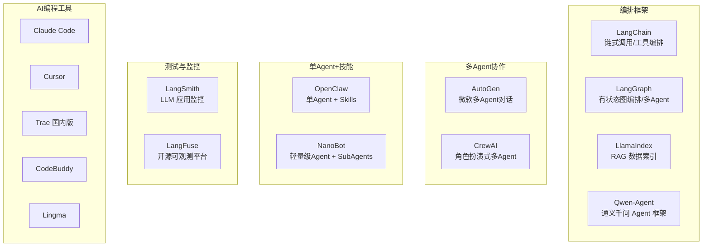

### 框架选型建议

| 框架                   | 适用场景                   | 复杂度 |
| ---------------------- | -------------------------- | ------ |
| **LangChain**          | RAG 应用、工具链编排       | ⭐⭐⭐    |
| **LangGraph**          | 有状态多 Agent、复杂工作流 | ⭐⭐⭐⭐   |
| **AutoGen**            | 多 Agent 对话协作          | ⭐⭐⭐⭐   |
| **Qwen-Agent**         | 通义千问生态、中文场景     | ⭐⭐⭐    |
| **OpenClaw / NanoBot** | 单 Agent + 子技能          | ⭐⭐     |

---

## 11. 知识库 vs 数据表

这是课程中反复强调的核心设计原则：

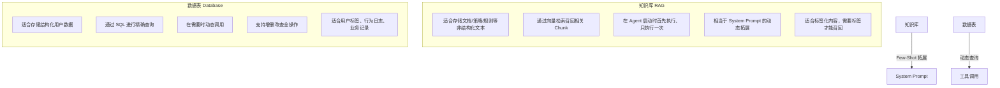

### 选择决策矩阵

| 数据类型                  | 推荐存储 | 原因                      |
| ------------------------- | -------- | ------------------------- |
| 产品介绍文档              | 知识库   | 非结构化文本，需语义检索  |
| 交易规则说明              | 知识库   | 文档型内容，RAG 检索      |
| 营销策略模板              | 知识库   | 策略型文档，需标签召回    |
| 用户标签（资产/风险偏好） | 数据表   | 结构化字段，需精确查询    |
| 用户行为事件日志          | 数据表   | 时序数据，需 SQL 条件查询 |
| 投诉记录                  | 数据表   | 需动态写入和查询          |
| 客户风险评测结果          | 数据表   | 结构化数据，需持久化      |

---

## 12. 多 Agent 协作模式

### 12.1 三种协作架构

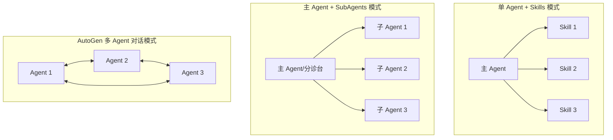

### 12.2 适用场景对比

| 模式                 | 代表实现             | 适用场景                | 课程 CASE          |
| -------------------- | -------------------- | ----------------------- | ------------------ |
| 单 Agent + Skills    | OpenClaw, NanoBot    | 任务明确、流程固定      | —                  |
| 主 Agent + SubAgents | Coze 多 Agents, Dify | 需按意图分流、专业分工  | CASE 4（智能客服） |
| 多 Agent 对话        | AutoGen, LangGraph   | 复杂协作、需要讨论/辩论 | —                  |

### 12.3 多 Agent vs 多工作流

| 维度     | 多 Agent              | 多工作流          |
| -------- | --------------------- | ----------------- |
| 本质     | 多个智能体分工协作    | 多个工具/流程编排 |
| 决策权   | 每个 Agent 有独立判断 | 流程预定义        |
| 路由方式 | LLM 语义判断分流      | 可视化工作流逻辑  |
| 灵活性   | 高（可动态切换）      | 中（预定义路径）  |
| 调试难度 | 较高                  | 较低              |

---

## 13. 最佳实践与总结

### 13.1 开发流程

```mermaid
flowchart LR
    A[需求分析] --> B[数据准备]
    B --> C[知识库/数据表设计]
    C --> D[Prompt 编写与测试]
    D --> E[工作流编排]
    E --> F[用户界面设计]
    F --> G[API 集成]
    G --> H[部署上线]
    H --> I[监控与迭代]
```

### 13.2 关键设计原则

| 原则              | 说明                                                    |
| ----------------- | ------------------------------------------------------- |
| **RAG 前置**      | RAG 在 Agent 启动时执行一次，作为 System Prompt 的拓展  |
| **数据表动态**    | 结构化数据使用数据表，支持 SQL 精确查询和写入           |
| **标签化召回**    | 知识库需要设置标签才能有效召回                          |
| **Few-Shot 约束** | 在提示词中明确标签范围，防止 Agent 超范围生成           |
| **分段策略**      | PDF/PPT 类建议先用 MinerU 转 Markdown；纯文本可直接使用 |
| **流式优先**      | Markdown 流式输出提升用户体验                           |
| **先验证后操作**  | 投诉录入前先核实用户行为数据                            |
| **过程提示**      | 长时间工作流增加输出节点提示进度                        |

### 13.3 工具链总览

```mermaid
flowchart TD
    subgraph 低代码平台
        COZE[Coze<br/>扣子]
        DIFY[Dify]
    end

    subgraph 高代码框架
        LC2[LangChain]
        LG2[LangGraph]
        AG2[AutoGen]
    end

    subgraph AI编程
        AI1[Claude Code / Cursor]
        AI2[Trae / CodeBuddy / Lingma]
    end

    subgraph 测试监控
        TM1[LangSmith]
        TM2[LangFuse]
    end

    subgraph 部署交付
        DP1[Coze API 发布]
        DP2[Dify 自部署]
        DP3[Web App / 移动端]
    end

    低代码平台 --> AI编程
    AI编程 --> 高代码框架
    高代码框架 --> 测试监控
    测试监控 --> 部署交付
```

### 13.4 面试与职业发展建议

根据课程笔记：

- **低代码方向**：掌握 Coze 和 Dify，可搜索 JD 了解市场要求
- **高代码方向**：核心技能包括 RAG、工具调用（Function Call）、MCP、Text2SQL
- **测试监控**：LangSmith、LangFuse 是加分项
- **AI 编程工具**：国外（Cursor、Claude Code）、国内（Trae、Lingma、CodeBuddy）
- **量化交易 Agent**：可使用 `miniQMT` 实现实盘自动买卖，需对接 API 而非模拟人操作
- **Agent 交付方式**：网页嵌入、API 调用、移动端 App 包装

---

## 附录：项目文件结构

```
21-Agent进阶与集成/
├── Agent进阶与集成.pdf              # 课程课件（122页）
├── ABC公司证券产品介绍.txt           # 证券产品知识库源数据
├── 笔记20260409.txt                   # 课程问答笔记
├── CASE-Coze API使用/
│   ├── config.py                     # Coze API 配置
│   ├── coze_client.py                # Coze API 客户端（支持三种模式）
│   └── requirements.txt
├── CASE-Dify API使用/
│   ├── dify_agent_client.py          # Dify API 客户端（Chat/Workflow/Completion）
│   ├── dify_chat_example.py          # 对话流多轮对话示例
│   ├── dify_workflow_example.py      # 工作流调用示例
│   └── requirements.txt
├── CASE-客户分层营销助手/
│   ├── user_behavior_event.xlsx      # 用户行为事件数据
│   ├── user_tag.xlsx                 # 用户标签数据
│   └── 营销策略.xlsx                  # 营销策略知识库
├── CASE-市场舆情监测Agent/
│   ├── AppStorePast.py               # App Store 评论抓取插件
│   ├── AppStorePast-代码1.py         # 评论分类筛选代码
│   ├── securities_past.py            # 新浪财经新闻抓取插件
│   ├── 代码.js                        # 日期筛选（JS 批处理节点）
│   └── 代码1.py                       # 无效数据过滤
└── CASE-智能客服Agent/
    ├── user_complain.xlsx            # 投诉记录数据表
    ├── 港股交易规则介绍.pdf           # 知识库：港股交易规则
    ├── 平安财富日添利理财产品.doc      # 知识库：理财产品
    ├── 上海证券交易所交易规则.pdf     # 知识库：A股交易规则
    └── 中国平安金裕人生理财产品.doc   # 知识库：理财产品
```
