<!-- more -->

## 1. AI 编程概述

### 1.1 什么是 AI 编程

AI 编程是指利用大语言模型（LLM）辅助软件开发的编程范式。通过 AI 代码编辑器（如 Cursor、Trae、Claude Code 等），开发者可以用自然语言描述需求，AI 自动生成、修改、解释代码，实现从"手写代码"到"指挥 AI 写代码"的转变。

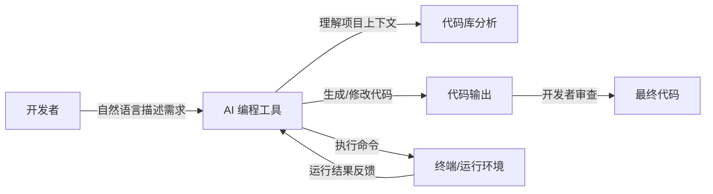

### 1.2 AI 编程的核心能力

- **代码生成与补全**：根据上下文自动补全代码，生成完整功能模块
- **跨文件编辑**：同时理解和修改多个文件，保持项目一致性
- **智能 Debug**：分析报错信息，定位根因并提供修复方案
- **代码解释与审查**：解释复杂代码逻辑，进行代码质量审查
- **自主任务执行**：Agent 模式可独立执行多步骤任务，自动运行命令并迭代修复

### 1.3 AI 编程能做什么

| 场景           | 说明                                                      |
| -------------- | --------------------------------------------------------- |
| Excel 报表处理 | 读取、合并、分析 Excel 数据（用 Python 而非手写 VLOOKUP） |
| 数据可视化大屏 | Flask + ECharts 搭建实时监控大屏                          |
| 机器学习建模   | 逻辑回归、决策树等模型的训练与评估                        |
| Web 应用开发   | 全栈应用从后端 API 到前端界面的完整开发                   |
| 量化交易       | 股票数据分析与策略回测                                    |

---

## 2. Cursor Rules：定制 AI 行为

### 2.1 什么是 Cursor Rules

Cursor Rules 是用于定制 AI 编程助手行为的规则文件，让 AI 遵循你的编码风格和项目规范。

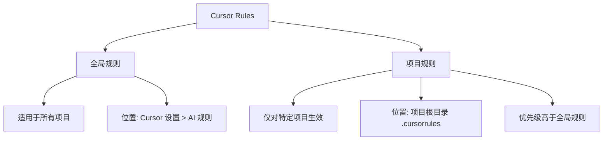

### 2.2 推荐的 Cursor Rules 配置

以下是在实际项目中验证有效的规则配置：

```
1. 之前完成正确的功能，尽量不要修改。
   比如当前的 instruction 是完善功能 A 的，那么只需要专注功能 A，不需要修改其他功能（比如功能 B）。

2. 生成的注释用中文，并使用 UTF-8 编码。

3. 生成的代码有时候会存在中文乱码的情况，所以你在生成中文的时候，需要检查是否有中文乱码，如果有乱码需要修正。

4. 如果修改某个函数的实现，先理解之前函数实现的逻辑。然后在原来的基础上，再进行修改（保留之前的函数逻辑，不要移除）。

5. 你操作的环境是 Windows 系统。

6. 如果用户没有明确说，就不需要编写测试脚本，也不需要写专门的项目说明 md。

7. 写代码，不考虑 fallback。

8. 代码中不要有 emoji。

9. 不要重复造轮子，尽量复用现有的代码。
```

### 2.3 规则生效概率

> **注意**：Cursor Rules 并非 100% 生效，但能显著增加 AI 遵循规则的概率。编写清晰、具体的规则可以提高生效率。

---

## 3. AI 编程工具对比

### 3.1 主流工具一览

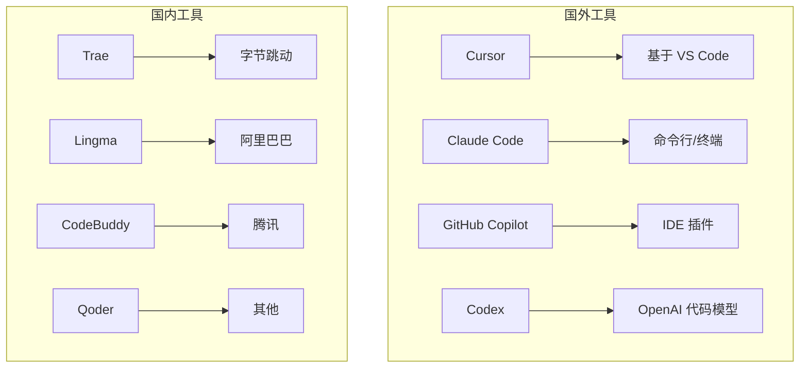

### 3.2 工具详细对比

| 特性       | Cursor   | Trae         | Lingma     | CodeBuddy    |
| ---------- | -------- | ------------ | ---------- | ------------ |
| 基础       | VS Code  | 自研 IDE     | 自研 IDE   | VS Code 插件 |
| 免费       | 付费     | 免费         | 免费       | 免费         |
| Agent 模式 | 支持     | Builder 模式 | Agent 模式 | 支持         |
| MCP 支持   | 支持     | 支持         | 2400+ 服务 | 支持         |
| 多模态     | 支持图片 | 支持图片     | 支持       | 支持         |
| 亮点       | 生态成熟 | 免费+多模型  | 长期记忆   | 腾讯生态     |

### 3.3 Cursor 的四种工作模式

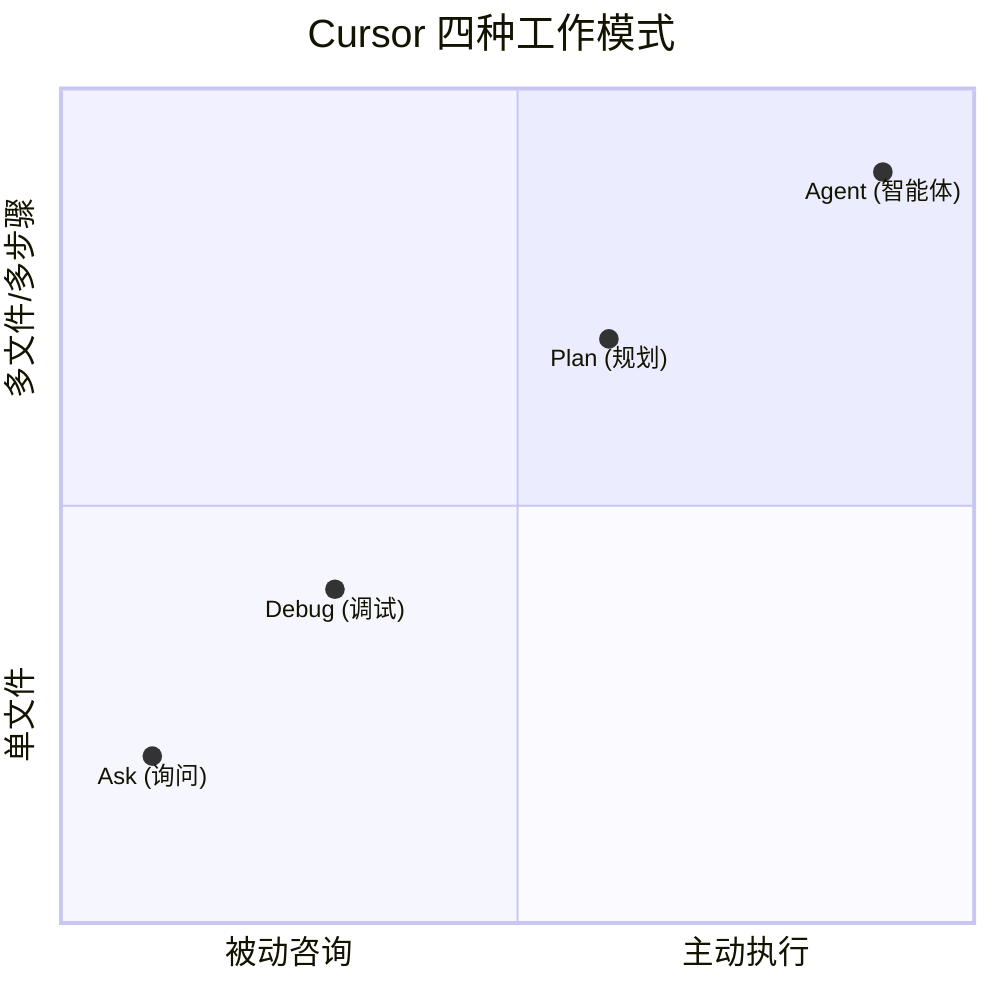

| 模式                | 用途               | 特点                                   |
| ------------------- | ------------------ | -------------------------------------- |
| **Agent（智能体）** | 自主完成多步骤任务 | 同时编辑多文件、自动运行命令、迭代修复 |
| **Plan（规划）**    | 先规划后执行       | 列出修改计划，用户审阅后再执行         |
| **Debug（调试）**   | 定位和修复 bug     | 分析堆栈、定位根因、自动应用补丁       |
| **Ask（询问）**     | 纯咨询不修改代码   | 解释逻辑、讨论方案、代码审查           |

### 3.4 Cursor 模型选择

| 模型          | 特点                       | 适用场景             |
| ------------- | -------------------------- | -------------------- |
| Composer 2    | 基于 Kimi K2.5，编程能力强 | 日常开发             |
| Opus 4.6      | Anthropic 旗舰，最强推理   | 复杂算法、架构设计   |
| Opus 4.6 Fast | Opus 快速版                | 需速度的常规开发     |
| Sonnet 4.5    | 性价比之选                 | 日常编码、调试、文档 |
| GPT-5.2       | OpenAI 最新                | Python/JS 特定场景   |
| GPT-5.2 Codex | 代码专项优化               | 测试生成、代码审查   |

---

## 4. CASE 1：多张 Excel 报表合并

### 4.1 场景描述

将员工基本信息表与员工绩效表合并，在主表基础上增加员工 2024 年第 4 季度的绩效评分。

### 4.2 数据流架构

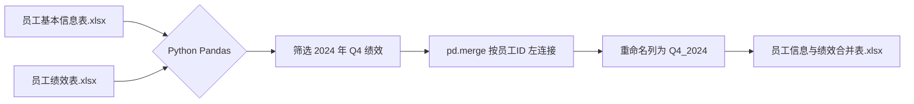

### 4.3 核心实现

**项目路径**：`【完成参考】Excel_merge/test1.py`

```python
import pandas as pd

# 读取员工基本信息表
basic_info_df = pd.read_excel('员工基本信息表.xlsx')
# 读取员工绩效表
performance_df = pd.read_excel('员工绩效表.xlsx')

# 查看基本信息表的字段和前5行记录
print("员工基本信息表字段：")
print(basic_info_df.columns)
print("\n前5行记录：")
print(basic_info_df.head())

# 查看绩效表的字段和前5行记录
print("\n员工绩效表字段：")
print(performance_df.columns)
print("\n前5行记录：")
print(performance_df.head())

# 筛选出2024年第四季度的绩效数据
q4_2024_perf = performance_df[
    (performance_df['年度'] == 2024) & (performance_df['季度'] == 4)
]

# 合并表格
merged_df = pd.merge(
    basic_info_df,
    q4_2024_perf[['员工ID', '绩效评分']],
    on='员工ID',
    how='left'
)

# 重命名绩效评分为Q4_2024
merged_df = merged_df.rename(columns={'绩效评分': 'Q4_2024'})

# 将合并后的结果保存到新文件
merged_df.to_excel('员工信息与绩效合并表.xlsx', index=False)
```

### 4.4 关键技术点

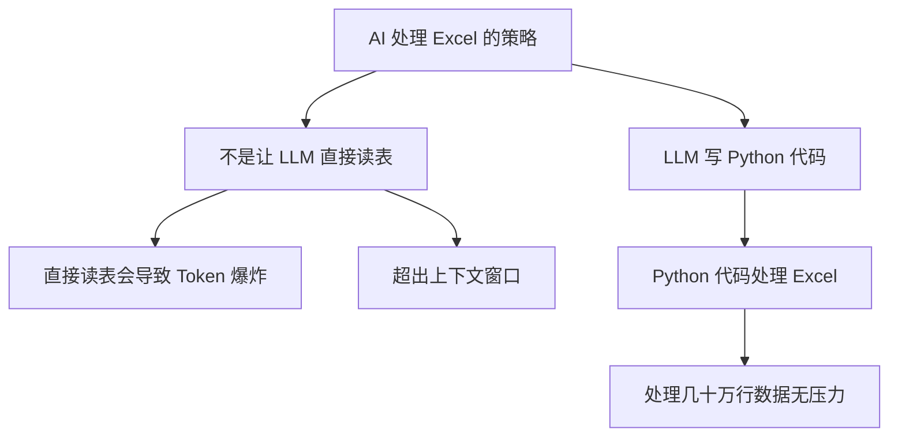

| 要点           | 说明                                      |
| -------------- | ----------------------------------------- |
| 先读前 5 行    | 让 LLM 了解数据结构，而非直接处理全量数据 |
| 用 Python 处理 | LLM 负责写代码，Python 负责执行           |
| 报错就修复     | 选中错误 -> Add to Chat -> 让 AI 修复     |
| 不依赖 VLOOKUP | 业务人员通过 AI 编程替代复杂的 Excel 函数 |

---

## 5. CASE 2：疫情实时监控大屏

### 5.1 场景描述

使用香港各区疫情数据，搭建 Flask + ECharts 可视化大屏，展示疫情核心指标、地理分布和趋势分析。

### 5.2 系统架构

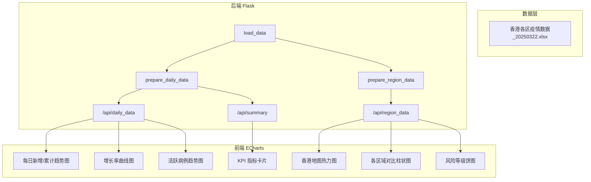

### 5.3 项目结构

```
dashboard_epidemic/
├── app.py                    # Flask 应用主文件
├── read_excel.py             # Excel 数据读取脚本
├── requirements.txt          # 依赖项列表
├── static/
│   ├── css/dashboard.css     # 大屏样式
│   └── js/
│       ├── dashboard.js      # 图表渲染逻辑（核心）
│       └── hongkong.json     # 香港地图 GeoJSON 数据
├── templates/
│   └── index.html            # 主页面模板
└── 香港各区疫情数据_20250322.xlsx  # 数据源
```

### 5.4 后端核心实现

**项目路径**：`【完成参考】dashboard_epidemic/app.py`

关键技术点：

- **数据加载**：`pd.read_excel()` 读取 Excel，`pd.to_datetime()` 处理日期
- **每日统计**：按日期 `groupby` 聚合，计算 7 日滑动平均、增长率、活跃病例
- **地区统计**：获取最新日期数据，按地区分组，计算每 10 万人口确诊数
- **禁用缓存**：使用 `@no_cache` 装饰器，设置 `Cache-Control` 头确保数据实时性

```python
def prepare_daily_data(df):
    """计算每日新增和累计确诊病例数等统计数据"""
    daily_summary = df.groupby('报告日期').agg({
        '新增确诊': 'sum',
        '累计确诊': 'max',
        '新增康复': 'sum',
        '累计康复': 'max',
        '新增死亡': 'sum',
        '累计死亡': 'max'
    }).reset_index()

    daily_summary = daily_summary.sort_values('报告日期')
    # 7日滑动平均
    daily_summary['7日移动平均_新增确诊'] = daily_summary['新增确诊'].rolling(
        window=7, min_periods=1
    ).mean().round(2)
    # 增长率
    daily_summary['确诊增长率'] = daily_summary['新增确诊'].pct_change().fillna(0) * 100
    # 活跃病例 = 累计确诊 - 累计康复 - 累计死亡
    daily_summary['活跃病例'] = (
        daily_summary['累计确诊'] - daily_summary['累计康复'] - daily_summary['累计死亡']
    )
    return daily_summary
```

### 5.5 前端可视化实现

**项目路径**：`【完成参考】dashboard_epidemic/static/js/dashboard.js`

#### 5 个核心图表：

| 图表              | 类型                       | 数据来源           |
| ----------------- | -------------------------- | ------------------ |
| 香港地图热力图    | ECharts Map + GeoJSON      | `/api/region_data` |
| 每日新增/累计趋势 | 柱状图 + 双 Y 轴折线       | `/api/daily_data`  |
| 各区域对比        | 横向柱状图（风险等级着色） | `/api/region_data` |
| 增长率曲线        | 折线图 + 零增长参考线      | `/api/daily_data`  |
| 活跃病例趋势      | 面积图                     | `/api/daily_data`  |
| 风险等级分布      | 环形饼图                   | `/api/region_data` |

#### 香港地图实现要点：

```javascript
// 加载 GeoJSON 并注册地图
fetch('/static/js/hongkong.json')
    .then(response => response.json())
    .then(hongkongJson => {
        echarts.registerMap('hongkong', hongkongJson);
        // 配置地图选项
        const option = {
            visualMap: {
                min: 0, max: maxValue,
                inRange: { color: ['#2ecc71', '#e67e22', '#c23531'] }
            },
            series: [{
                type: 'map', map: 'hongkong',
                roam: true,  // 允许缩放和平移
                nameMap: {
                    'Central and Western': '中西区',
                    'Yuen Long': '元朗区',
                    // ... 英文名到中文名的映射
                }
            }]
        };
    });
```

### 5.6 大屏布局设计

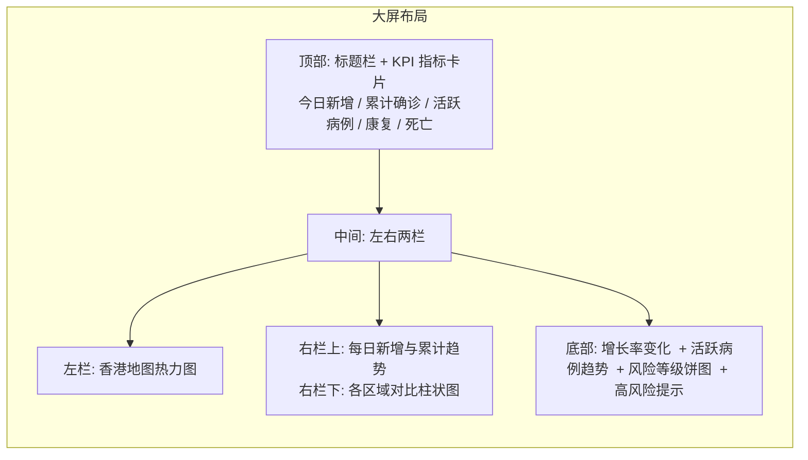

### 5.7 迭代调优经验

从 PDF 记录的开发过程来看，大屏开发经历了多次迭代：


**关键经验**：

- 地图数据需要真实的 GeoJSON 文件，不能依赖 AI 凭空生成
- 使用 Chat 模式（Ctrl+L）比直接生成更适合精细调修
- AI 不一定每次都能得到满意结果，需要多轮迭代

---

## 6. CASE 3：客户续保预测（机器学习）

### 6.1 场景描述

使用保险客户的保单数据，通过逻辑回归和决策树模型预测客户续保行为，分析影响续保的关键因素。

### 6.2 项目结构

```
CASE-客户续保预测/
├── policy_data.xlsx              # 训练数据集
├── policy_test.xlsx              # 测试数据集
├── analyze_data.py               # 数据分析和可视化
├── logistic_regression_model.py  # 逻辑回归模型
├── decision_tree_model.py        # 决策树模型
├── random_forest_model.py        # 随机森林模型
├── naive_bayes_model.py          # 朴素贝叶斯模型
└── view_data.py / view_excel.py  # 数据查看工具
```

### 6.3 机器学习流程

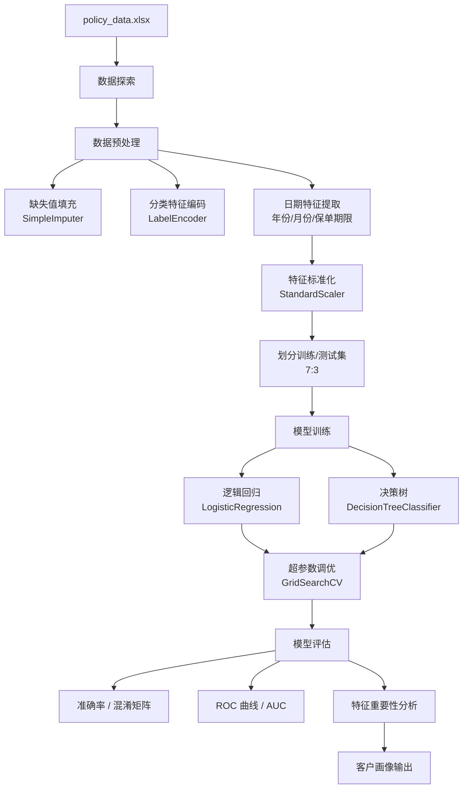

### 6.4 核心实现

**项目路径**：`【完成参考】CASE-客户续保预测/logistic_regression_model.py`

```python
# 1. 数据预处理
# 填充缺失值
numeric_features = data.select_dtypes(include=['int64', 'float64']).columns
imputer = SimpleImputer(strategy='median')
data[numeric_features] = imputer.fit_transform(data[numeric_features])

# 分类特征 LabelEncoder 编码
for feature in categorical_features:
    le = LabelEncoder()
    data[feature] = data[feature].fillna('未知')
    data[feature] = le.fit_transform(data[feature])

# 2. 逻辑回归建模
lr = LogisticRegression(random_state=42, max_iter=1000)
lr.fit(X_train_scaled, y_train)

# 3. 超参数调优
param_grid = [
    {'penalty': ['l2', None], 'C': [0.001, 0.01, 0.1, 1, 10, 100],
     'solver': ['newton-cg', 'lbfgs', 'sag']},
    {'penalty': ['l1'], 'C': [0.001, 0.01, 0.1, 1, 10, 100],
     'solver': ['liblinear', 'saga']},
]
grid_search = GridSearchCV(
    LogisticRegression(random_state=42, max_iter=1000),
    param_grid=param_grid, cv=5, n_jobs=-1, scoring='accuracy'
)
grid_search.fit(X_train_scaled, y_train)
best_lr = grid_search.best_estimator_
```

### 6.5 模型分析结果

#### 逻辑回归系数解读（正系数 -> 倾向续保；负系数 -> 倾向不续保）

| 特征                     | 系数   | 解读                       |
| ------------------------ | ------ | -------------------------- |
| cat__income_level_中     | +3.396 | 中等收入者更倾向续保       |
| cat__marital_status_已婚 | +2.363 | 已婚客户续保意愿强         |
| cat__marital_status_离异 | -2.266 | 离异客户续保意愿弱         |
| cat__income_level_低     | -5.152 | 低收入者极不倾向续保       |
| cat__policy_type_平安福  | +1.688 | 平安福产品续保率高         |
| num__age                 | -1.588 | 年龄越大续保意愿越低       |
| cat__claim_history_是    | +1.189 | 有理赔历史的客户更倾向续保 |

#### 决策树关键规则

```
收入非低 & 年龄 <= 60.5 & 非设计师 & 非销售 => 续保 (class: 1)
收入低 & 年龄 > 60.5 & 非已婚 & 高中学历 => 不续保 (class: 0)
收入低 & 年龄 > 60.5 & 已婚 & 无高中学历 & 保单期限=20年 => 续保 (class: 1)
```

### 6.6 模型评估指标

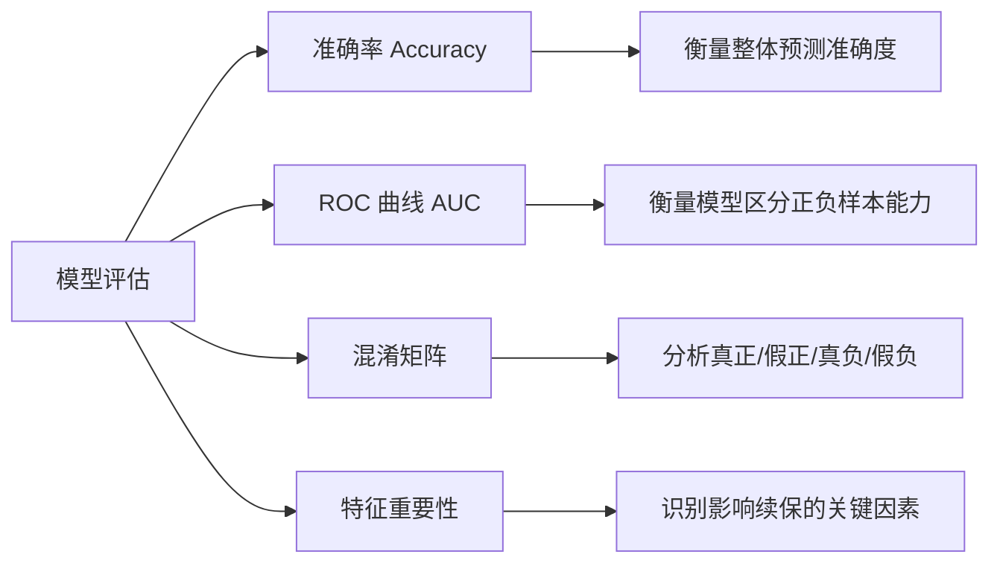

---

## 7. CASE 4：医院病床使用情况大屏

### 7.1 场景描述

实时监控香港医院病床使用情况，展示各医院、科室的使用率及空闲病床分布。

### 7.2 系统架构

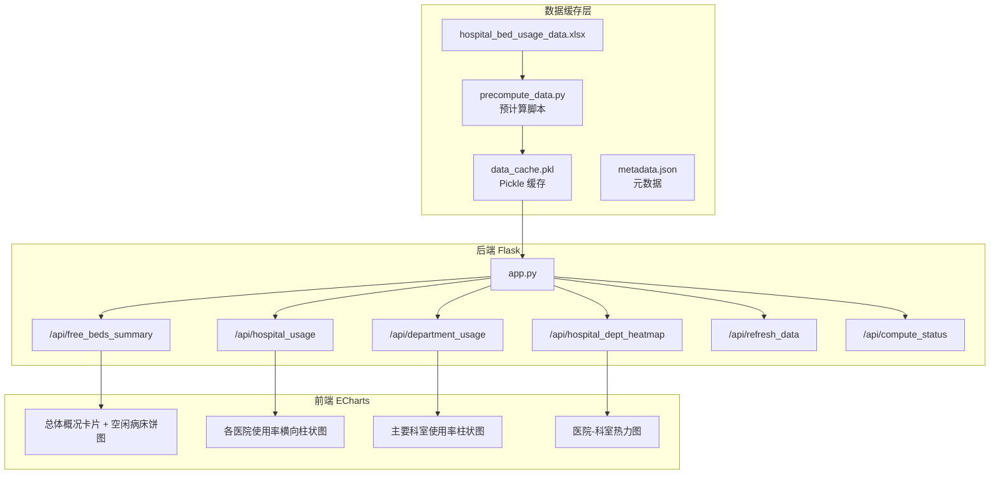

### 7.3 核心设计亮点

**项目路径**：`【完成参考】bed_usage/app.py`

#### 7.3.1 数据缓存机制

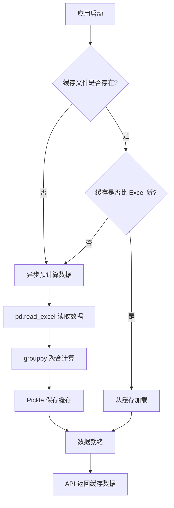

关键实现：

- **文件变更检测**：通过 MD5 哈希 + 文件修改时间双重校验判断 Excel 是否更新
- **预计算脚本**：`precompute_data.py` 独立运行，提前完成耗时计算
- **缓存持久化**：使用 Pickle 序列化 + JSON 元数据，重启后无需重新计算
- **异步计算**：使用 `threading.Thread` 后台计算，不阻塞请求响应

#### 7.3.2 渐进式数据加载

前端采用"空数据结构 + 异步轮询"策略，在数据计算完成前显示空图而非加载失败：

```javascript
// 不显示加载遮罩，直接显示空图表
function loadAllChartData() {
    $.getJSON('/api/hospital_usage', function(data) {
        if (data.hospital && data.hospital.length > 0) {
            updateHospitalChart(data);  // 有数据才更新
        }
        // 无数据时保持空图表状态，等待下次轮询
    });
}

// 每 2 秒检查一次数据状态
function checkDataStatus() {
    $.getJSON('/api/compute_status', function(data) {
        if (data.ready) { /* 数据已就绪 */ }
        setTimeout(checkDataStatus, 2000);
    });
}
```

### 7.4 可视化图表配置

| 图表            | ECharts 类型    | 交互特性                                           |
| --------------- | --------------- | -------------------------------------------------- |
| 总体概况        | 卡片 + 环形饼图 | 显示总数/已用/空闲/使用率                          |
| 各医院使用率    | 横向柱状图      | 颜色根据使用率分级(>90%红, >80%橙, >70%蓝, 其余绿) |
| 科室使用率      | 柱状图          | x 轴标签旋转 45 度                                 |
| 医院-科室热力图 | Heatmap         | 颜色范围 60%-100%, 绿-橙-红渐变                    |

---

## 8. AI 应用开发知识体系

### 8.1 技能图谱

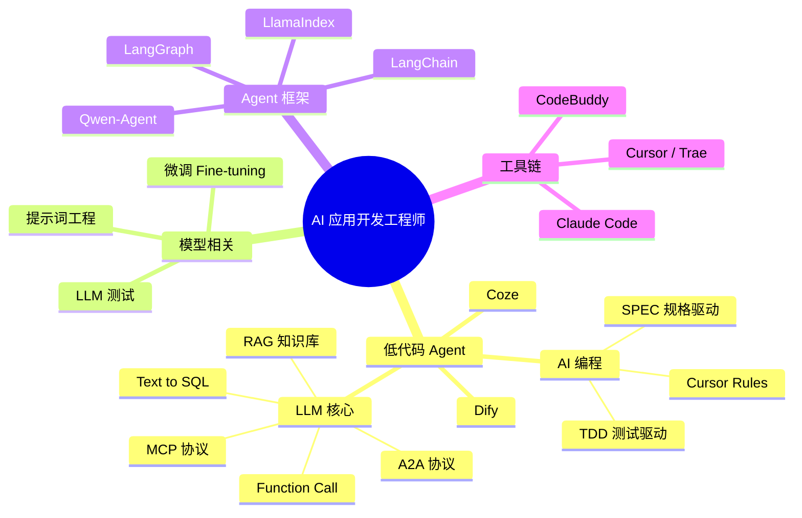

### 8.2 技术栈关系

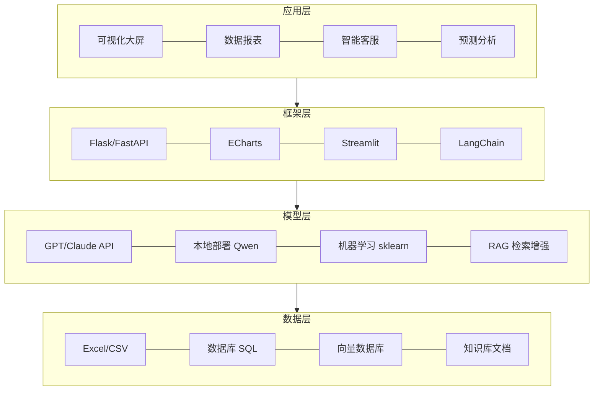

### 8.3 垂直领域智能体架构

基于课堂讨论总结的智能体架构：

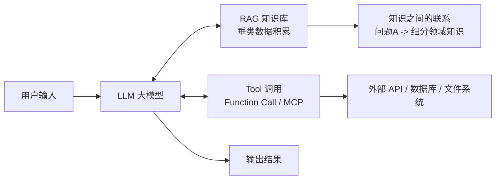

核心要点：

1. **LLM 可以不微调**：多数场景下，RAG + Tool 调用即可满足需求
2. **RAG 知识库**：独特的数据积累是壁垒，关键是知识之间的联系
3. **测试集 TDD**：需求梳理 -> 场景示例 -> 撰写测试集(input, output)
4. **幻觉问题**：通过测试集覆盖、RAG 限定范围来降低

---

## 9. 实践要点与常见问题

### 9.1 如何高效使用 AI 编程

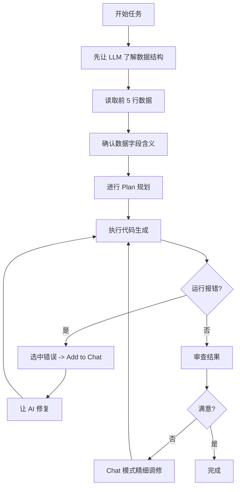

### 9.2 常见问题与解决方案

| 问题               | 原因               | 解决方案                                                     |
| ------------------ | ------------------ | ------------------------------------------------------------ |
| 中文乱码           | 编码问题           | 设置 `plt.rcParams['font.sans-serif'] = ['SimHei']`，使用 UTF-8 编码 |
| Token 爆炸         | LLM 直接读大数据表 | 让 LLM 写 Python 处理，不直接读取数据                        |
| 地图显示异常       | 缺少真实 GeoJSON   | 从网上下载真实地理数据文件                                   |
| 图表重叠           | 布局不合理         | 使用 Chat 模式描述问题，逐步调整                             |
| 包未导入           | AI 遗漏 import     | 运行报错后，选中错误让 AI 补充                               |
| 缓存导致数据不更新 | 浏览器缓存         | 添加 `@no_cache` 装饰器，设置 Cache-Control 头               |

### 9.3 数据安全与合规

- **数据出境风险**：使用 Cursor 等国外工具时，代码和上下文可能传输至海外服务器
- **国内企业建议**：使用 Trae、Lingma、CodeBuddy 等合规工具
- **敏感数据**：不要在提示词中包含真实的敏感数据，可使用模拟数据

### 9.4 Token 节省策略

| 策略              | 说明                                     |
| ----------------- | ---------------------------------------- |
| 同一会话持续修改  | 利用上下文缓存，比每次新开会话更省 Token |
| 先了解数据再 Plan | 减少因信息不足导致的返工                 |
| Plan 模式先行     | 确认方案后再执行，避免 AI 盲目修改       |
| 精准描述问题      | 指令越清晰，AI 越高效                    |

### 9.5 关于 fallback 的理解

- **开发环境**：不写 fallback，让 bug 在开发阶段暴露
- **生产环境**：适当增加 fallback 做降级处理
- **AI 编程阶段**：不考虑 fallback，专注于核心功能实现
