<!-- more -->

## 1. 课程全景

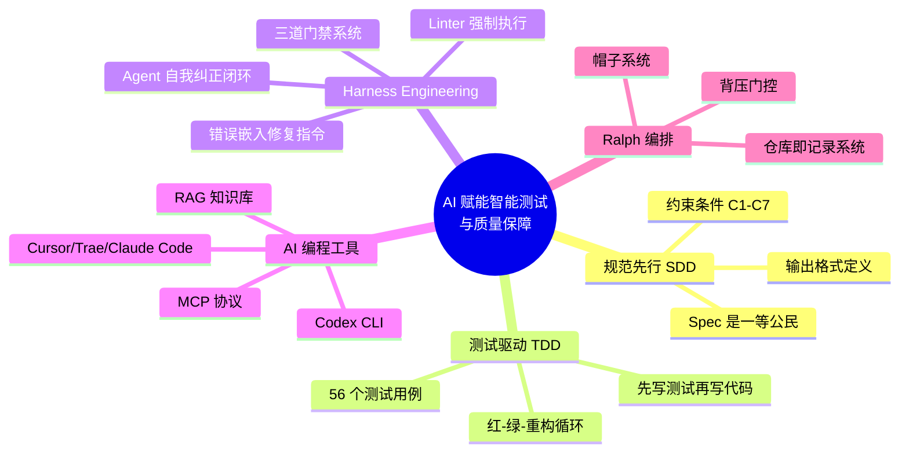

### 两条开发路径

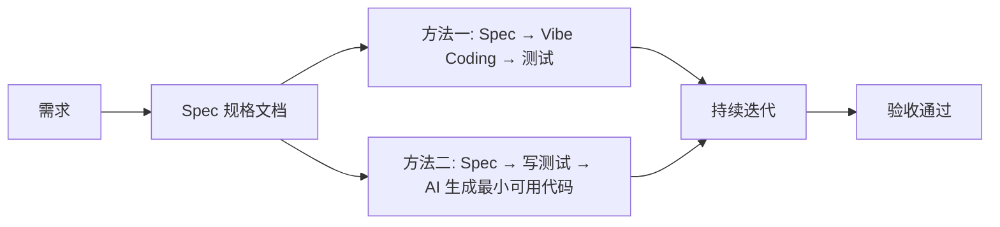

---

## 2. 核心方法论

### 2.1 SDD — 规范驱动开发

**Specification-Driven Development** 的核心思想：**规格文档是项目的一等公民**，所有实现代码都是规格的可执行表达。

#### Spec 模板结构

```markdown
# Stock Deep Research -- 规格文档 (Specification)

> 本文档是项目的"一等公民"。
> 所有实现代码都是本规格的可执行表达。
> 修改本文档时必须同步更新对应的测试和实现。

## 功能目标
## 系统架构
## 数据采集维度
## 输出格式
## 约束条件 (Constraints)
### C1: XX
### C2: XX
## API 依赖
```

#### 约束条件 C1-C7

| 编号   | 名称         | 描述                                                         | 验证方式          |
| ------ | ------------ | ------------------------------------------------------------ | ----------------- |
| **C1** | 维度完整性   | 报告必须包含全部 4 个维度：fundamental, market, news, analyst | `validate_report` |
| **C2** | 摘要最小长度 | 每个维度的 summary 不少于 100 个字符                         | `validate_report` |
| **C3** | 置信度范围   | confidence 必须在 [0.0, 1.0] 闭区间                          | `validate_report` |
| **C4** | 评级有效值   | overall_rating 只能取 buy / hold / sell                      | `validate_report` |
| **C5** | 来源数量     | sources 列表至少 3 个 URL                                    | `validate_report` |
| **C6** | 风险因素     | risk_factors 列表不能为空                                    | `validate_report` |
| **C7** | 必填字段     | stock_code, stock_name, report_date 为必填                   | `validate_report` |

### 2.2 TDD — 测试驱动开发

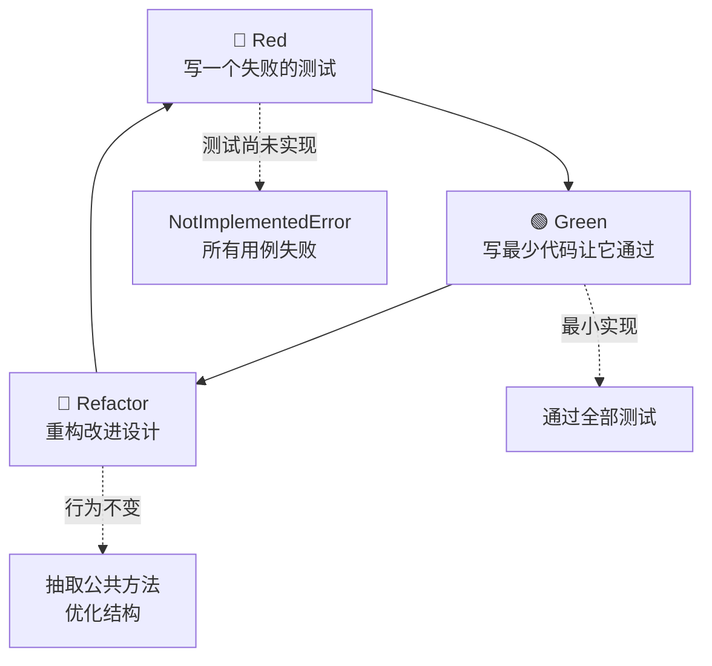

#### TDD 在 stock-research 项目中的实战

**Red 阶段**：

- `validate_research_report` 初始为 `NotImplementedError`
- 56 条测试用例全部失败

**Green 阶段**：

- 在 `src/reporter.py` 中实现 `validate_report()` 函数
- 逐条实现 C1–C7 约束检查
- 56 条测试全部通过（`pytest tests -q` → 56 passed in 0.18s）

**Refactor 阶段**：

- 将「单维度 summary + confidence」抽成 `_dimension_block_errors()`
- `_collect_dimension_errors` 只负责结构遍历与 C1，再 extend 单维度结果
- 行为不变，结构更清晰

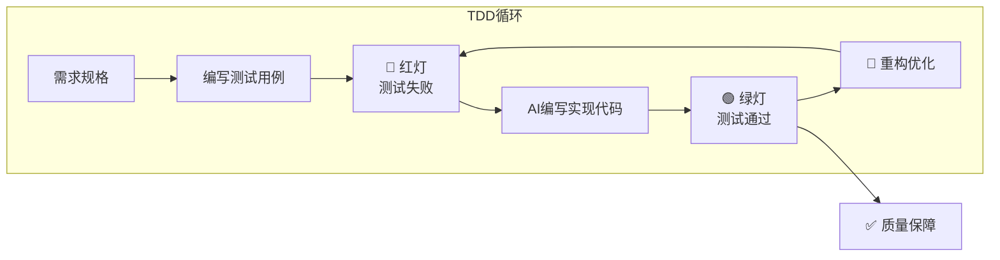

### 2.3 Harness Engineering

Harness Engineering 是一套确保 AI 生成代码质量的工程方法论，核心是**三道门禁系统**：

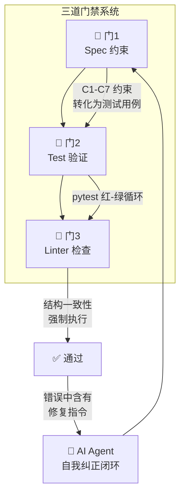

#### 核心原则

1. **文档会腐烂，lint 规则不会** — 用代码强制执行不变量
2. **错误信息中嵌入修复指令** — Agent 可以自我纠正（Harness Engineering 核心理念）
3. **在中央层面强制执行边界** — CI 阻塞不合格的合并

**错误信息示例**（来自 `validate_report`）：

```json
{
  "type": "summary_too_short",
  "detail": "fundamental: 摘要长度 32 字符，要求至少 100",
  "fix": "扩充 dimensions['fundamental']['summary'] 的内容，至少 100 个字符。可重新调用 collector.collect_single('fundamental') 获取更详细的数据。"
}
```

### 2.4 Ralph 编排系统

Ralph 是一个约束驱动的 AI 编排系统，定义了**多角色协作循环**：

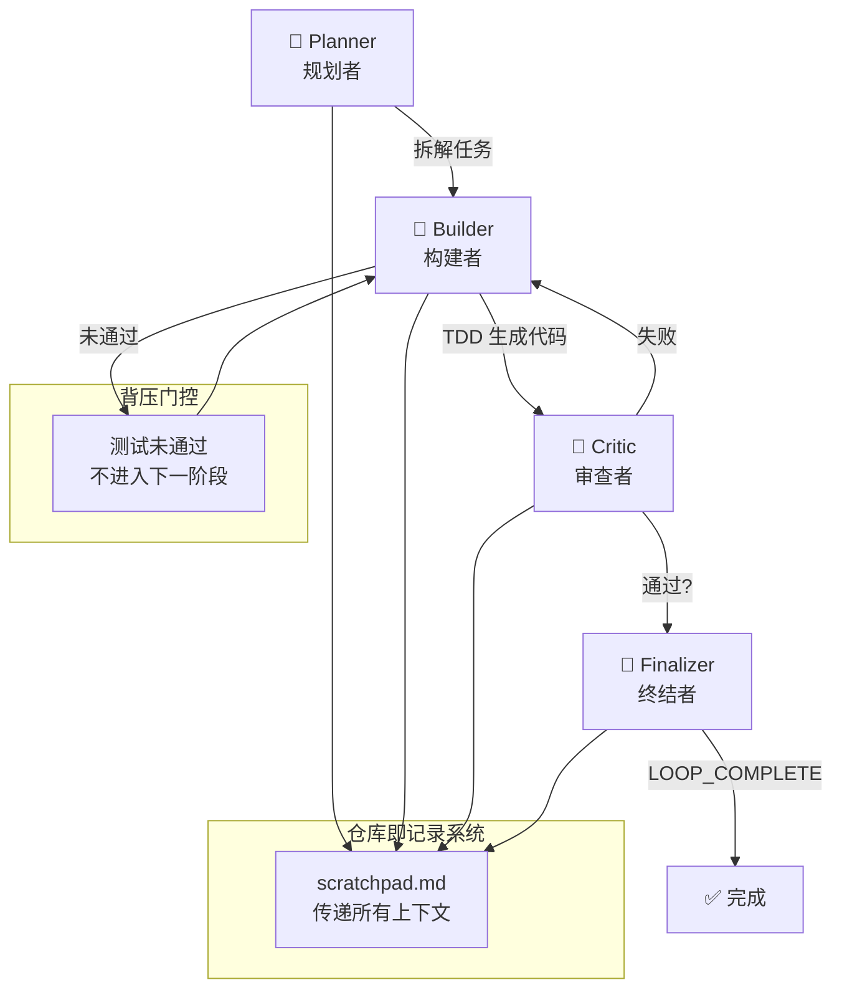

#### 四顶帽子

| 角色          | 职责                        | 输出                                 |
| ------------- | --------------------------- | ------------------------------------ |
| **Planner**   | 阅读任务，拆解实施步骤      | 编号列表计划                         |
| **Builder**   | 严格 TDD 流程：先测试后实现 | Python 文件（`===FILE:xxx===` 格式） |
| **Critic**    | 独立审查代码质量和正确性    | `VERDICT: PASSED / FAILED`           |
| **Finalizer** | 确认所有目标完成            | `LOOP_COMPLETE`                      |

Ralph 的 mini 实现见 `ralph_demo.py`，通过 Qwen 模型模拟完整的编排循环，并在 `ralph_output/` 目录下生成计算器模块作为示例。

---

## 3. stock-research 项目实战

### 3.1 项目概述

**项目名称**：Stock Deep Research  
**目标**：输入股票代码（如 `600519`），自动从多个维度联网搜索信息，通过 Qwen 大模型分析，生成结构化深度研究报告  

**技术栈**：

- Python 3.11+
- Qwen (DashScope OpenAI 兼容接口)
- akshare（A股数据）
- pytest（测试框架）

### 3.2 系统架构

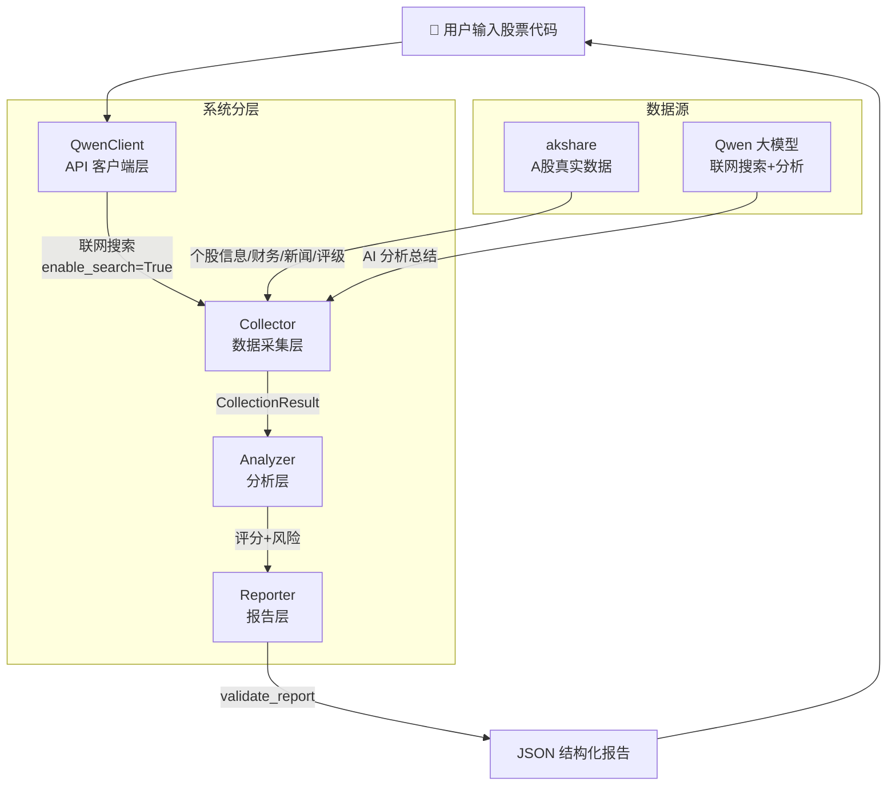

#### 模块依赖关系

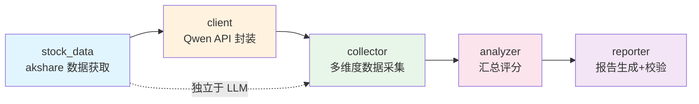

**架构约束**：

- 依赖方向：`client → collector → analyzer → reporter`（单向，禁止反向依赖）
- API 调用只发生在 `client.py` 中，其他模块不直接调用外部 API

#### 文件结构

```
stock-research/
├── spec/
│   └── research_spec.md          # 规格文档（一等公民）
├── src/
│   ├── __init__.py
│   ├── client.py                 # Qwen API 客户端封装
│   ├── collector.py              # 多维度数据采集
│   ├── analyzer.py               # 数据汇总分析 + 评分
│   ├── reporter.py               # 报告生成 + 结构校验
│   └── stock_data.py             # akshare 真实数据获取
├── tests/
│   ├── __init__.py
│   ├── conftest.py               # 共享 fixture（环境隔离 + 工厂）
│   ├── test_client.py            # Qwen 客户端测试
│   ├── test_collector.py         # 采集模块测试
│   ├── test_analyzer.py          # 分析模块测试
│   ├── test_reporter.py          # 报告校验测试（C1-C7）
│   ├── test_stock_data.py        # akshare 数据层测试
│   └── test_integration.py       # 端到端集成测试
├── linters/
│   └── check_report_structure.py # 自定义结构校验 Linter
├── ralph_output/                 # Ralph Demo 输出
│   ├── calc.py
│   ├── test_calc.py
│   └── scratchpad.md
├── ralph_demo.py                 # Mini Ralph 编排循环演示
├── PROMPT.md                     # Ralph 任务描述
├── AGENTS.md                     # 项目导航入口
├── pyproject.toml
└── requirements.txt
```

### 3.3 数据流与约束

#### 数据采集维度

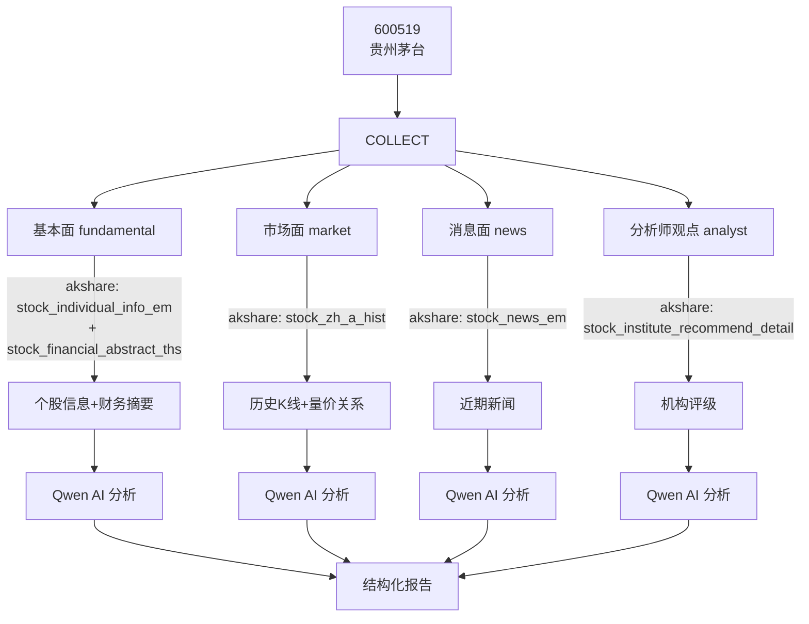

#### 输出 JSON 格式

```json
{
  "stock_code": "600519",
  "stock_name": "贵州茅台",
  "report_date": "2026-04-12",
  "dimensions": {
    "fundamental": { "summary": "不少于100字的基本面分析...", "confidence": 0.85 },
    "market":      { "summary": "不少于100字的市场面分析...", "confidence": 0.78 },
    "news":        { "summary": "不少于100字的消息面分析...", "confidence": 0.72 },
    "analyst":     { "summary": "不少于100字的分析师观点...", "confidence": 0.80 }
  },
  "overall_rating": "buy",
  "risk_factors": ["市场系统性风险", "行业竞争加剧"],
  "sources": ["https://...", "https://...", "https://..."]
}
```

#### 置信度评分算法

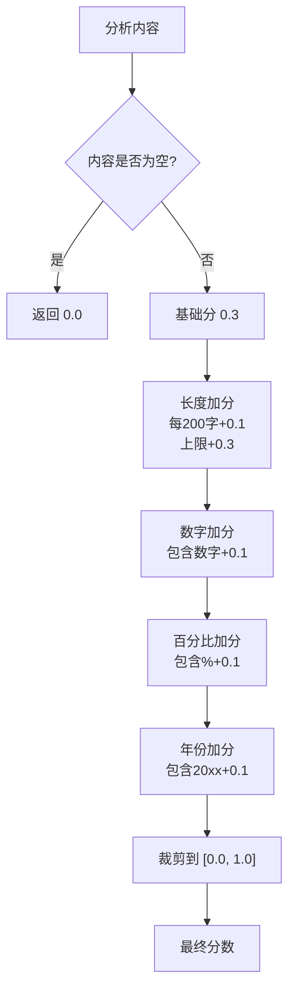

#### 综合评级规则

| 平均置信度     | 评级     | 含义     |
| -------------- | -------- | -------- |
| ≥ 0.7          | **buy**  | 推荐买入 |
| ≥ 0.4 且 < 0.7 | **hold** | 建议持有 |
| < 0.4          | **sell** | 建议卖出 |

### 3.4 测试策略

#### 测试覆盖全景

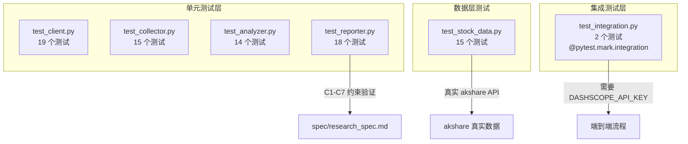

#### 测试设计原则

1. **环境隔离**：`conftest.py` 中 `monkeypatch.delenv("DASHSCOPE_API_KEY")` 确保单元测试不会意外调用真实 API
2. **Mock 策略**：`client.py` 和 `collector.py` 的 API 调用通过 Mock 隔离；`stock_data.py` 使用真实 akshare 数据
3. **Spec → Test 映射**：`test_reporter.py` 中每个测试直接对应 `research_spec.md` 中的一条约束
4. **Fix 指令验证**：每个错误都包含 `fix` 字段，方便 AI Agent 自我纠正

#### 测试命令

```bash
pytest tests -q                              # 全部单元测试（36+ passed）
pytest tests/test_reporter.py -v             # 单个模块验证
pytest tests -m integration                  # 集成测试（需要 API Key）
python linters/check_report_structure.py     # 结构 lint 检查
```

### 3.5 Linter 结构检查

`linters/check_report_structure.py` 是 Harness Engineering 三关门禁的第三道，在 CI 层面强制执行项目结构不变量：

| 检查项                         | 描述                                     | 修复指令                   |
| ------------------------------ | ---------------------------------------- | -------------------------- |
| `check_spec_exists`            | `spec/research_spec.md` 必须存在         | 创建规格文档，定义约束条件 |
| `check_validate_report_exists` | `reporter.py` 必须有 `validate_report()` | 实现 C1-C7 检查函数        |
| `check_required_dimensions`    | `REQUIRED_DIMENSIONS` 必须含 4 个维度    | 与 spec 保持一致的维度定义 |
| `check_test_coverage`          | `src/` 每模块 → `tests/` 对应测试文件    | 创建缺失的测试文件         |

---

## 4. 课堂问答精粹

### 4.1 AI 编程工具链

| 概念       | 解释                                                         |
| ---------- | ------------------------------------------------------------ |
| **RAG**    | 基于用户 query 从知识库检索相关内容，先于工具运行            |
| **MCP**    | 第三方服务通过协议接口形式提供能力                           |
| **Skills** | 渐进式的 function call 加载                                  |
| **CLI**    | 命令行工具（Claude Code CLI、Codex CLI），可直接在终端中驱动 AI 编程 |
| **ReACT**  | Reasoning + Action，当前 Agent 默认的自主逻辑框架            |
| **RALPH**  | 约束驱动的编排系统，Harness Engineering 的具体实现           |

### 4.2 AI 编程最佳实践

- **硬件**：充足的 Token 和 LLM 上下文
- **软件**：清晰的 Spec（规格）+ 完善的 Test（测试）
- **方法**：Spec → TDD → AI 写代码，跑通全部测试用例
- **国内推荐模型**：GLM-5.1、Qwen3.6-Plus
- **本地部署方案**：Dify 搭建企业级智能体，可通过 URL 发布到公网

### 4.3 TDD 常见问题

- **测试用例完整性**：Spec 约束直接转化为测试，是迭代过程
- **Mock 策略**：尽量不要 Mock 数据库——用真实数据测试
- **AI 钻测试漏洞**：看 Spec + Test 的约束边界，AI 只需覆盖 Test 即可
- **前端 TDD**：可以验证按钮点击弹出 Msg 等动作
- **已有系统改造**：Step1 回写 Spec（人工检查）→ Step2 TDD

### 4.4 自动执行策略

让 AI 自动长时间工作的方法：

1. **Harness** 编排框架
2. **Claude Code CLI** 的 `dangerously mode`
3. 自定义 Agent 模式（类似 OpenClaw）

---

## 5. 总结与展望

### 课程核心理念

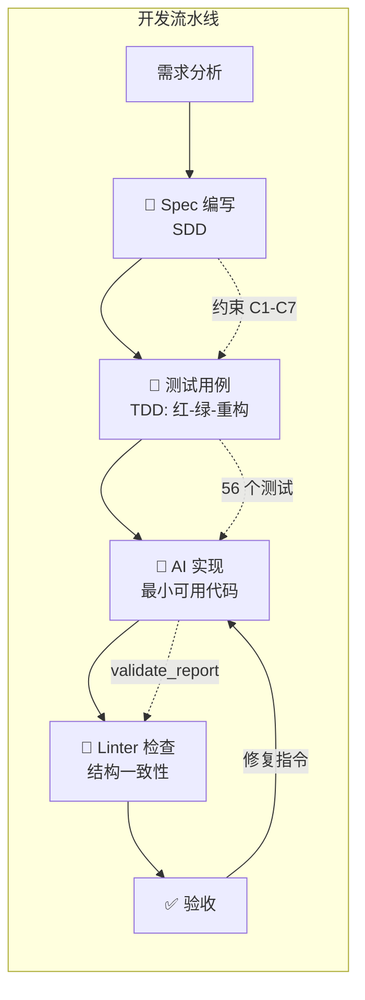

### 三条黄金法则

1. **Spec 先行** — 没有规格文档就不写代码
2. **测试驱动** — 没有测试就不实现
3. **门禁把关** — 不通过 Linter 就不合入

### 项目实践价值

`stock-research` 项目覆盖了从需求分析、Spec 编写、TDD 测试开发、AI 代码生成到 Linter 结构检查的完整链路，是理解 **SDD + TDD + Harness Engineering** 三大方法论的最佳实战案例。