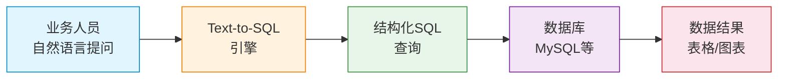
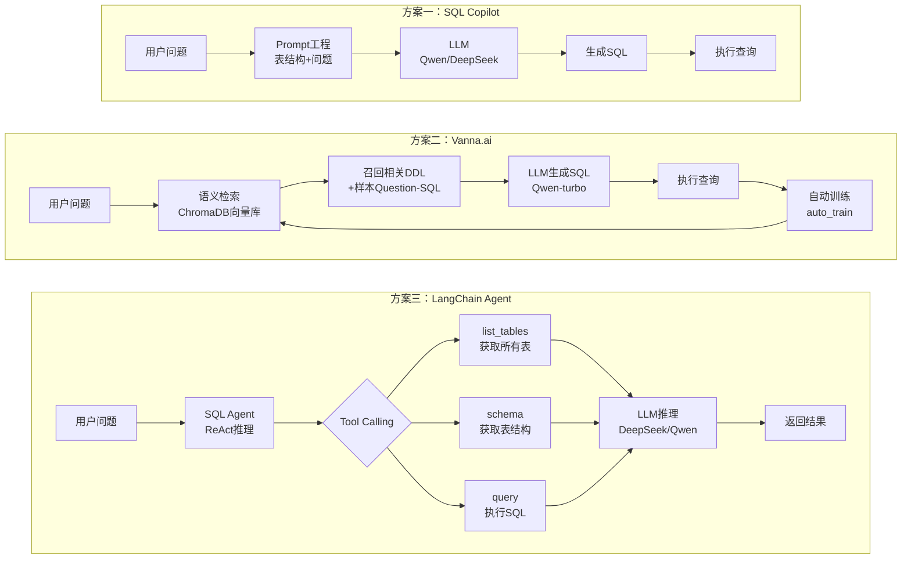
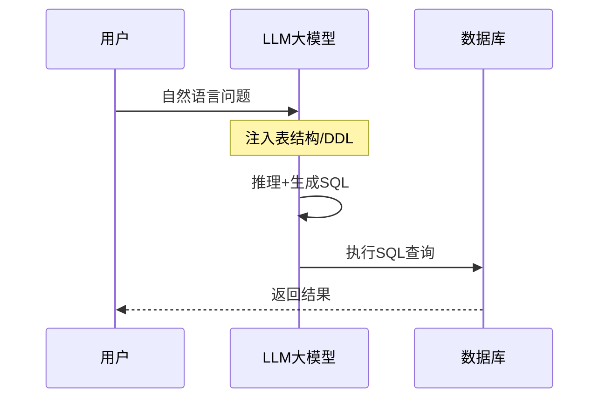
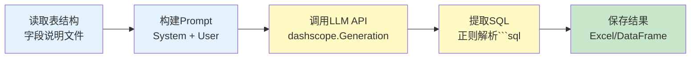
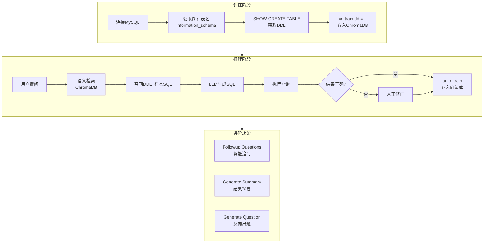
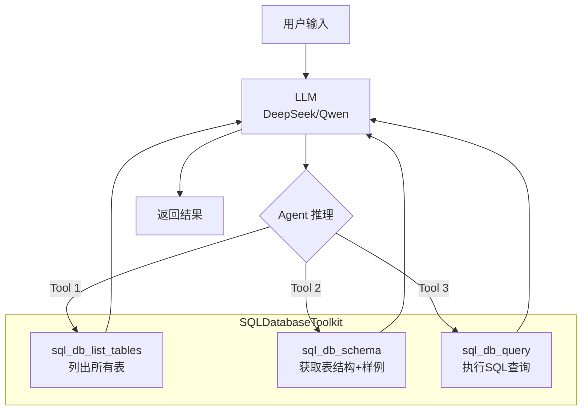
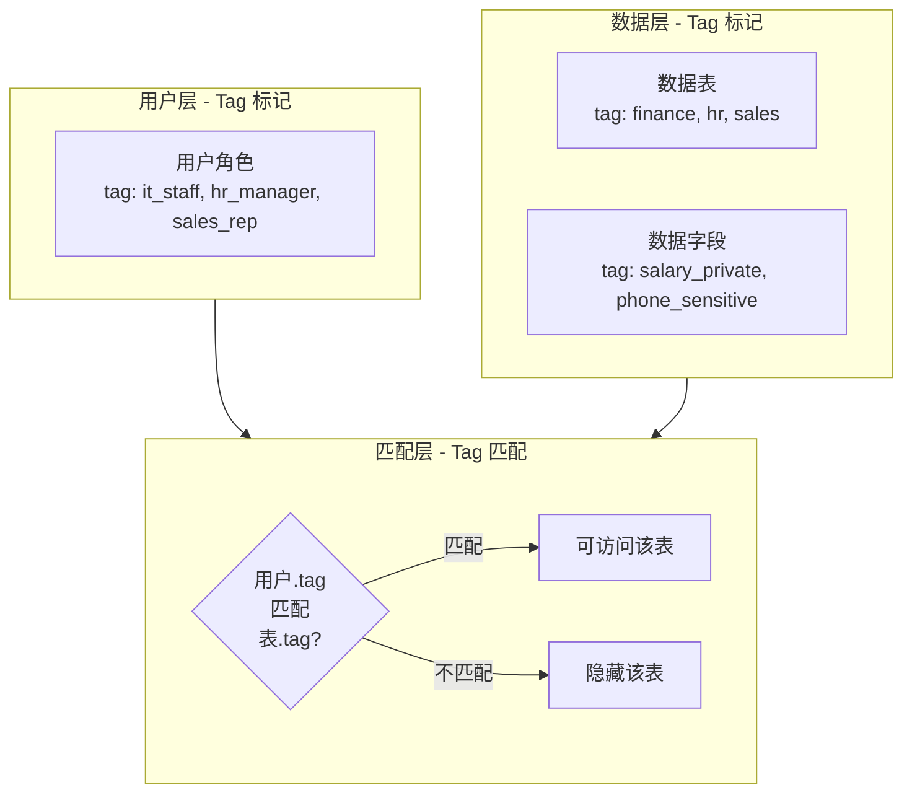
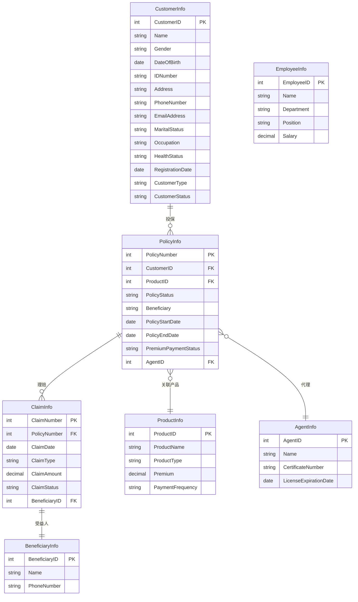
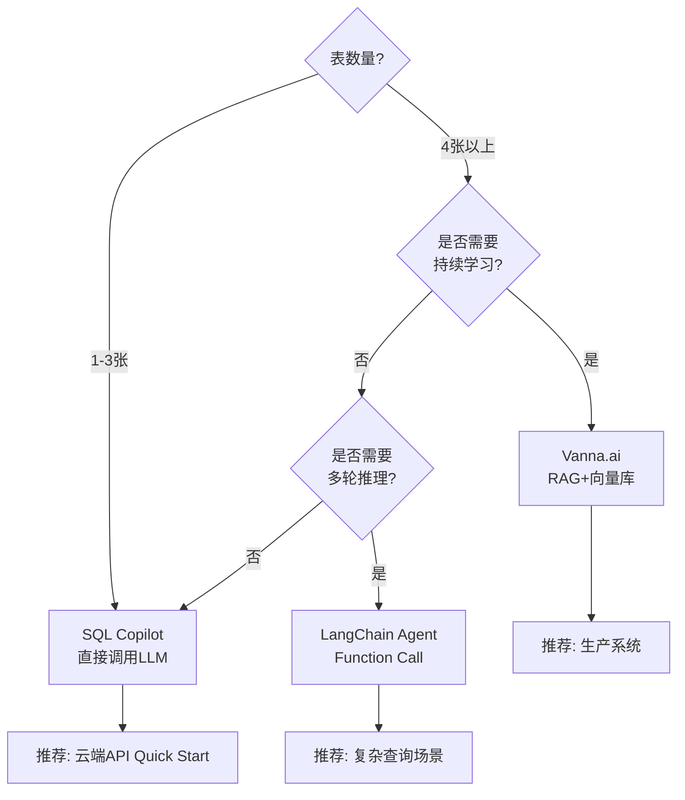
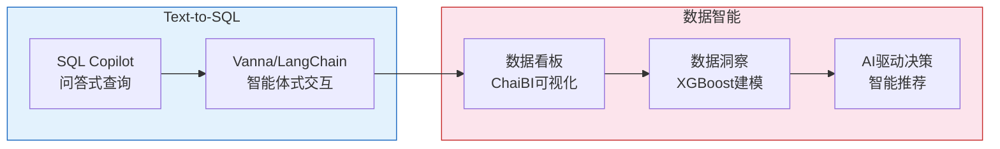

<!-- more -->

## 1. 概述

### 1.1 什么是 Text-to-SQL

Text-to-SQL 是指将用户的**自然语言问题**自动转化为**SQL查询语句**，并执行查询返回结果的技术。它是数据民主化（Data Democratization）的关键基础设施——让业务人员无需掌握 SQL 语法，即可用自然语言从数据库中获取信息。

### 1.2 核心价值



### 1.3 三种主流实现路径

| 方案                | 核心思路                 | 适用场景               | 代表项目           |
| ------------------- | ------------------------ | ---------------------- | ------------------ |
| **SQL Copilot**     | Prompt工程 + 直接调用LLM | 快速原型、表结构简单   | CASE-SQL Copilot   |
| **Vanna.ai**        | RAG（向量库+LLM）        | 多表、需要持续学习     | CASE-SQL-vanna     |
| **LangChain Agent** | Function Call 智能体     | 复杂查询、需要交互反馈 | Case-SQL-LangChain |

---

## 2. 技术架构总览

### 2.1 整体架构对比 



### 2.2 通用数据流



---

## 3. 方案一：SQL Copilot —— 直接调用LLM生成SQL

### 3.1 原理

最直接的方式：将数据库表结构（CREATE TABLE DDL 或字段说明文本）作为 System Prompt 注入，让 LLM 直接生成对应的 SQL。

### 3.2 实现流程



### 3.3 核心代码详解

**Step 1：构建 Prompt**

```python
sys_prompt = """我正在编写SQL，以下是数据库中的数据表和字段，
请思考：哪些数据表和字段是该SQL需要的，然后编写对应的SQL，
如果有多个查询语句，请尝试合并为一个。"""

user_prompt = f"""{table_description}
=====
我要写的SQL是：{query}
请思考：哪些数据表和字段是该SQL需要的，然后编写对应的SQL"""
```

**Step 2：调用模型**

```python
response = dashscope.Generation.call(
    model='qwen-turbo-latest',
    messages=messages,
    result_format='message'
)
```

**Step 3：提取 SQL**

```python
def get_sql_code(response):
    pattern = r'```sql(.*?)```'
    match = re.search(pattern, content, re.DOTALL)
    return match.group(1).strip() if match else content
```

### 3.4 CodeGeeX 本地模型方案

除了云端 API 调用，课程还演示了使用 **CodeGeeX4-All-9B** 本地模型进行代码补全型 Text-to-SQL：

```python
from transformers import AutoTokenizer, AutoModel

tokenizer = AutoTokenizer.from_pretrained(
    "/root/autodl-tmp/models/ZhipuAI/codegeex4-all-9b",
    trust_remote_code=True
)
model = AutoModel.from_pretrained(
    "/root/autodl-tmp/models/ZhipuAI/codegeex4-all-9b",
    trust_remote_code=True,
    device='cuda'
)

prompt = "# language: Python\n# write a bubble sort function\n"
inputs = tokenizer.encode(prompt, return_tensors="pt").to(model.device)
outputs = model.generate(inputs, max_length=256, top_k=1)
```

> **说明**：CodeGeeX 是**基座模型（Base Model）**，主要做代码补全，采用"上文-续写"模式。与之对应的是 Chat 模型（如 Qwen-turbo），采用 Q&A 对话模式。

### 3.5 QA 评测示例

**保险业务 QA 列表（qa_list-2.txt）：**

```
获取所有客户的姓名和联系电话。
=====
找出所有已婚客户的客户ID和配偶姓名。
=====
查询所有未支付保费的保单号和客户姓名。
=====
找出所有理赔金额大于10000元的理赔记录，并列出相关客户的姓名和联系电话。
=====
查找代理人的姓名和执照到期日期，按照执照到期日期升序排序。
=====
获取所有保险产品的产品名称和保费，按照保费降序排序。
=====
查询销售区域在上海的员工，列出他们的姓名和职位。
=====
找出所有年龄在30岁以下的客户，并列出其客户ID、姓名和出生日期。
=====
查找所有已审核但尚未支付的理赔记录。
=====
获取每个产品类型下的平均保费，以及该产品类型下的产品数量。
```

**高级分析 QA 列表（qa_list-1.txt）：**

```
查询每种保险类型的保险金额的平均值、最大值和最小值。
=====
查询每个客户购买的保单数以及这些保单的总保费金额。
=====
查询每个投保日期月份的新保单数量的趋势。
=====
查询保险期限在一年以内的保单数量，以及它们的平均保费金额。
=====
查询每个代理人代理的保单数量和总保费金额。
=====
查询保单状态随时间的变化趋势。
```

---

## 4. 方案二：Vanna.ai —— 向量库+RAG+LLM

### 4.1 原理

Vanna 是一个开源的 Text-to-SQL 框架，核心思路是 **RAG（Retrieval-Augmented Generation）**：

1. 将数据库的 DDL（建表语句）向量化存入 ChromaDB
2. 用户提问时，从向量库召回最相似的 DDL 和 Question-SQL 对
3. 将召回内容作为上下文注入 prompt，让 LLM 生成 SQL
4. 执行成功后，自动将 (Question, SQL) 对存入向量库，实现持续学习

### 4.2 架构图



### 4.3 基础用法代码

```python
from openai import OpenAI
from vanna.openai import OpenAI_Chat
from vanna.chromadb.chromadb_vector import ChromaDB_VectorStore

# 自定义 Vanna：向量库用 ChromaDB，LLM 用 OpenAI 兼容接口
class MyVanna(ChromaDB_VectorStore, OpenAI_Chat):
    def __init__(self, config=None, client=None):
        ChromaDB_VectorStore.__init__(self, config=config)
        OpenAI_Chat.__init__(self, client=client, config=config)

# 创建 OpenAI 客户端（指向 DashScope 兼容接口）
client = OpenAI(
    base_url="https://dashscope.aliyuncs.com/compatible-mode/v1",
    api_key=os.getenv("DASHSCOPE_API_KEY"),
)

vn = MyVanna(
    config={'model': 'qwen-turbo-latest', 'n_results_ddl': 30},
    client=client,
)

# 连接到 MySQL
vn.connect_to_mysql(
    host='rm-uf6z891lon6dxuqblqo.mysql.rds.aliyuncs.com',
    dbname='action',
    user='student123',
    password='student321',
    port=3306,
)

# 首次运行：训练所有表的 schema
training_data = vn.get_training_data()
if training_data is None or training_data.empty:
    tables_df = vn.run_sql(
        "SELECT TABLE_NAME FROM information_schema.TABLES WHERE TABLE_SCHEMA = 'action'"
    )
    for table_name in tables_df['TABLE_NAME']:
        ddl_df = vn.run_sql(f"SHOW CREATE TABLE `{table_name}`")
        create_table = ddl_df.iloc[0, 1]
        vn.train(ddl=create_table)
```

### 4.4 进阶功能演示

**（1）auto_train —— 自动学习**

```python
sql, df, _ = vn.ask(
    question="查询英雄攻击力前5名的英雄",
    auto_train=True,  # 成功后自动将 Question-SQL 对存入向量库
)
```

**（2）generate_followup_questions —— 智能追问**

基于查询结果，自动生成后续可追问的问题，引导用户深入分析：

```python
followups = vn.generate_followup_questions(
    question=question1,
    sql=sql1,
    df=df1,
    n_questions=5,
)
```

**（3）generate_summary —— 结果摘要**

将查询结果的 DataFrame 自动翻译为自然语言总结：

```python
summary = vn.generate_summary(question=question1, df=df1)
# 输出如："攻击力排名前5的英雄是：孙悟空（攻击力438）、吕布（420）..."
```

**（4）generate_question —— 反向出题**

给定一段 SQL，让 LLM 反向推断出对应的业务问题，用于批量扩充训练样本：

```python
sample_sqls = [
    "SELECT role_main, COUNT(*) AS cnt FROM heros GROUP BY role_main ORDER BY cnt DESC",
    "SELECT name, hp_max FROM heros ORDER BY hp_max DESC LIMIT 10",
]
for sql in sample_sqls:
    q = vn.generate_question(sql=sql)
    print(f"SQL: {sql}\n反推问题: {q}")
```

### 4.5 Web 可视化界面

```python
from vanna.flask import VannaFlaskApp

app = VannaFlaskApp(vn, debug=True)
app.run(host='0.0.0.0', port=8080)
```

Vanna 内置 Flask Web 界面，开箱即用，支持：

- 对话式问答
- SQL 结果展示
- 训练数据管理
- 可视化图表

---

## 5. 方案三：LangChain SQL Agent —— Function Call 智能体

### 5.1 原理

LangChain 提供了 `create_sql_agent` 工厂函数，创建一个内置 SQL 工具箱的智能体（Agent）。该 Agent 使用 **ReAct（Reasoning + Acting）** 框架进行推理，核心逻辑是：

1. 接收用户自然语言问题
2. Agent 自主决定调用哪个工具（Tool）
3. 根据工具返回结果继续推理
4. 最终给出答案

### 5.2 架构图



### 5.3 核心代码

```python
from langchain_community.agent_toolkits import create_sql_agent
from langchain_community.agent_toolkits.sql.toolkit import SQLDatabaseToolkit
from langchain_community.utilities import SQLDatabase
from langchain_openai import ChatOpenAI

# 1. 连接数据库
db = SQLDatabase.from_uri(
    f"mysql+pymysql://{user}:{password}@{host}:3306/{db_name}"
)

# 2. 初始化 LLM（通过 DashScope 兼容接口调用 DeepSeek）
llm = ChatOpenAI(
    temperature=0.01,
    model="deepseek-v3",
    openai_api_base="https://dashscope.aliyuncs.com/compatible-mode/v1",
    openai_api_key=api_key,
)

# 3. 创建 Toolkit
toolkit = SQLDatabaseToolkit(db=db, llm=llm)

# 4. 创建 SQL Agent（tool-calling 类型）
agent_executor = create_sql_agent(
    llm=llm,
    toolkit=toolkit,
    agent_type="tool-calling",
    verbose=True,
)

# 5. 执行查询
agent_executor.invoke({"input": "找出英雄攻击力最高的前5个英雄"})
```

### 5.4 Agent 内置的三个工具

| 工具函数             | 功能                             | 触发时机                    |
| -------------------- | -------------------------------- | --------------------------- |
| `sql_db_list_tables` | 获取数据库中所有表名             | Agent 需要了解有哪些表时    |
| `sql_db_schema`      | 获取指定表的建表语句和前几行样例 | Agent 需要了解表结构时      |
| `sql_db_query`       | 执行 SQL 查询并返回结果          | Agent 确定 SQL 后执行查询时 |

### 5.5 LangChain SQL Agent 的推理过程示例

当用户问"找出所有未支付保费的保单号和客户姓名"时，Agent 的推理链：

```
1. Thought: 用户想了解未支付保费的保单信息，需要保单表和客户表
2. Action: sql_db_list_tables → 返回所有表名
3. Thought: 找到 PolicyInfo(保单表) 和 CustomerInfo(客户表)
4. Action: sql_db_schema(PolicyInfo) → 获取表结构
5. Action: sql_db_schema(CustomerInfo) → 获取表结构
6. Thought: 可以编写 JOIN 查询了
7. Action: sql_db_query(SQL) → 执行查询返回结果
8. Final Answer: 返回结果给用户
```

---

## 6. 数据权限控制方案

课程中讨论了如何在 Text-to-SQL 系统中实现数据权限控制，主要有三种方法：

### 6.1 方案对比

| 方法            | 实现方式                        | 粒度        | 优缺点           |
| --------------- | ------------------------------- | ----------- | ---------------- |
| **Prompt 控制** | 在 System Prompt 中声明权限规则 | 表级        | 简单但不可靠     |
| **函数规则**    | 通过函数/代码逻辑过滤           | 表级/字段级 | 灵活但需编写规则 |
| **物理权限**    | 数据库层面的 GRANT 授权         | 行级/列级   | 最安全但配置复杂 |

### 6.2 Tag 权限模型



**示例实现逻辑：**

```python
def get_accessible_tables(user_role):
    """根据用户角色，返回该角色可访问的表列表"""
    role_table_map = {
        'it_staff': ['EmployeeInfo', 'PolicyInfo'],
        'hr_manager': ['EmployeeInfo', 'CustomerInfo'],
        'sales_rep': ['CustomerInfo', 'PolicyInfo', 'ProductInfo'],
    }
    return role_table_map.get(user_role, [])

def filter_sensitive_columns(user_role, columns):
    """根据用户角色过滤敏感字段"""
    if user_role != 'hr_manager':
        columns = [c for c in columns if c != 'salary']
    return columns
```

### 6.3 Prompt 控制示例

```python
sys_prompt = """
如果你是IT人员，那么你看不到HR的数据表。
如果你是销售人员，你不能查看客户的收入字段。
{表结构}
"""
```

---

## 7. 项目数据库结构

### 7.1 保险业务数据库（CASE-SQL Copilot / Case-SQL-LangChain）



### 7.2 王者荣耀英雄表（CASE-SQL-vanna）

用于 Vanna 进阶演示的 `heros` 表，包含英雄名称、攻击力、生命值、防御力、角色定位等字段。

---

## 8. 环境配置与依赖

### 8.1 方案一：SQL Copilot 依赖

```txt
# CASE-SQL Copilot\insurance\requirements.txt
dashscope==1.22.1
Faker==20.1.0
langchain==0.3.25
openai==1.77.0
pandas==2.2.3
Requests==2.32.3
SQLAlchemy==2.0.23
transformers==4.49.0
zhipuai==2.1.5.20250421
```

### 8.2 方案二：Vanna.ai 依赖

```txt
# CASE-SQL-vanna\requirements.txt
mysql_connector_repackaged==0.3.1
openai==1.77.0
vanna==0.7.9
```

### 8.3 方案三：LangChain SQL Agent 依赖

```txt
# Case-SQL-LangChain\requirements.txt
langchain==0.3.25
openai==1.77.0
pandas==2.2.3
qdrant_client==1.14.2
vanna==0.7.9
```

### 8.4 API 配置（通用）

所有方案均通过 **DashScope（阿里云百炼）** 兼容 OpenAI 接口调用模型：

```
API Base: https://dashscope.aliyuncs.com/compatible-mode/v1
环境变量: DASHSCOPE_API_KEY
```

支持模型：`qwen-turbo-latest`、`deepseek-v3` 等

---

## 9. 各方案对比与选型建议

### 9.1 综合对比

| 维度             | SQL Copilot   | Vanna.ai         | LangChain Agent    |
| ---------------- | ------------- | ---------------- | ------------------ |
| **实现复杂度**   | ⭐ 低          | ⭐⭐ 中            | ⭐⭐⭐ 较高           |
| **查询准确率**   | ⭐⭐ 一般       | ⭐⭐⭐ 较好         | ⭐⭐⭐ 好             |
| **多表JOIN能力** | ⭐⭐ 依赖模型   | ⭐⭐ 依赖模型      | ⭐⭐⭐ 自动推理       |
| **上下文管理**   | 手动拼接      | 向量检索自动管理 | Agent 自动管理     |
| **持续学习**     | ❌ 无          | ✅ auto_train     | ❌ 无               |
| **交互反馈**     | ❌ 无          | ⭐ 有追问/摘要    | ⭐⭐⭐ 多轮推理       |
| **部署难度**     | 低            | 中（需ChromaDB） | 中（需LangChain）  |
| **调试友好度**   | 低            | 中               | 高（verbose=True） |
| **适合场景**     | 快速验证/原型 | 生产级、持续优化 | 复杂查询、需要交互 |

### 9.2 选型决策树



### 9.3 注意事项与陷阱

1. **上下文长度限制**：表多时 DDL 可能超出 LLM 上下文窗口，Vanna 的 `n_results_ddl` 参数可控制召回量
2. **外键缺失问题**：互联网业务表常无外键约束，需让模型通过字段命名和业务逻辑推断关系
3. **结果报表展示**：可通过自定义函数将 SQL 查询结果渲染为表格或图表
4. **本地搭建数据库**：建议先用本地库测试，确保 SQL 语句正确后再连接生产库
5. **模型选择**：基座模型（如 CodeGeeX）做代码补全，Chat 模型（Qwen/DeepSeek）做 Q&A
6. **linter 生成**：可以使用 AI 生成 SQL lint 规则来校验生成的 SQL 质量

---

## 10. 从 Text-to-SQL 到数据智能的演进

### 10.1 演进路线



### 10.2 关键理念

1. **结构化数据是金矿**：主数据 → SQL 结构化数据（越规范，质量越高）→ 挖掘更多价值
2. **从查询到分析**：Text-to-SQL 只是入口，真正的数据智能包含数据看板（ChaiBI）、数据洞察（XGBoost 建模）
3. **非结构化+结构化结合**：RAG 知识库处理非结构化（PDF/Word/HTML），SQL Agent 处理结构化，两者互补
4. **业务人员自助分析**：过去 BI 需要数据立方体（OLAP），现在直接对交易表进行 NL2SQL 查询

### 10.3 学习资源

| 资源              | 链接                                                       |
| ----------------- | ---------------------------------------------------------- |
| Vanna.ai 开源项目 | https://github.com/vanna-ai/vanna                          |
| ModelScope 模型库 | https://modelscope.cn/my/overview                          |
| CodeGeeX4 GGUF    | https://modelscope.cn/models/ZhipuAI/codegeex4-all-9b-GGUF |
| GLM-5.1           | https://modelscope.cn/models/ZhipuAI/GLM-5.1/files         |
| Qwen Code         | https://github.com/QwenLM/qwen-code                        |
| LangChain 文档    | https://python.langchain.com/                              |

---

## 附录：课堂 QA 精选

| 问题                            | 解答                                       |
| ------------------------------- | ------------------------------------------ |
| linter 需要自己写吗？           | 让 AI 来生成                               |
| akshare 不稳定有替代吗？        | tushare（需积分），东方财富，同花顺        |
| HTTP 和 MCP 如何选择？          | 视具体场景，MCP 更标准化                   |
| SQL 查询结果如何展示为图表？    | 通过自定义函数将 DataFrame 渲染为图表      |
| 互联网表没有外键怎么办？        | 让模型通过字段名和业务逻辑推断关系         |
| 如何控制数据权限？              | Prompt 控制 / 函数规则 / 物理 Grant        |
| Vanna 可以直接回答不用 LLM 吗？ | 必须用 LLM                                 |
| 自己实现 Text2SQL 步骤？        | Function Call → `exc_sql` + `run_sql` 工具 |
