<!-- more -->

## 1. 项目概述

ChatBI 是一个基于 **qwen-agent** 框架构建的**智能股票分析助手**，实现了从数据获取、SQL 查询、自动可视化到高级技术分析（ARIMA 预测、MACD 信号、布林带检测、Prophet 周期性分析）的完整垂直领域 Agent。

### 核心定位

```
理解业务需求 → 打造 Skill → POC 快速验证 → 架构迁移迭代
```

### 关键技术栈

| 层级       | 技术选型                            |
| ---------- | ----------------------------------- |
| Agent 框架 | qwen-agent                          |
| 大模型     | qwen-max / qwen-turbo（通义千问）   |
| 数据源     | Tushare Pro API                     |
| 存储       | SQLite（本地）                      |
| 可视化     | Matplotlib + Plotly                 |
| 预测模型   | ARIMA (statsmodels)                 |
| 技术分析   | MACD / 布林带 / Prophet             |
| 信息搜索   | Tavily MCP（@tavily-ai/tavily-mcp） |
| 前端界面   | qwen-agent GUI（Gradio WebUI）      |

---

## 2. 系统架构总览

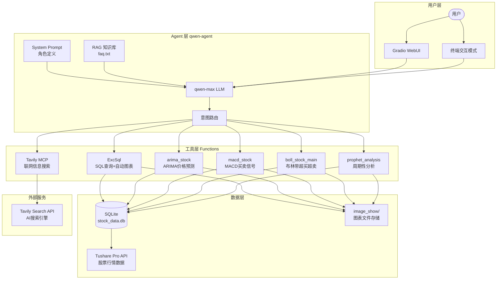

### Agent = LLM + System Prompt + Tool + RAG

这是整个项目的核心公式。每一次用户请求，Agent 的工作流程如下：

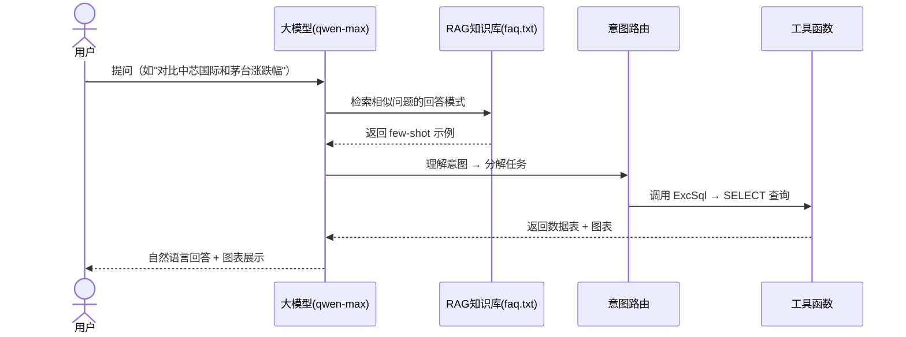

---

## 3. 数据管道

### 3.1 数据获取流程

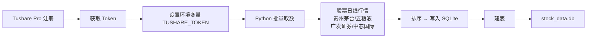

### 3.2 数据库表结构

```sql
CREATE TABLE stock_history (
    id          INTEGER PRIMARY KEY AUTOINCREMENT,
    ts_code     TEXT NOT NULL,          -- 股票代码, e.g. 600519.SH
    trade_date  TEXT NOT NULL,          -- 交易日期 YYYY-MM-DD
    open        REAL NOT NULL,          -- 开盘价
    high        REAL NOT NULL,          -- 最高价
    low         REAL NOT NULL,          -- 最低价
    close       REAL NOT NULL,          -- 收盘价
    pre_close   REAL,                   -- 前收盘价
    change      REAL,                   -- 涨跌额
    pct_chg     REAL,                   -- 涨跌幅(%)
    vol         INTEGER,                -- 成交量(手)
    amount      REAL,                   -- 成交额(千元)
    stock_name  TEXT NOT NULL           -- 股票名称
);

-- 索引
CREATE INDEX idx_trade_date ON stock_history (trade_date);
CREATE INDEX idx_ts_code    ON stock_history (ts_code);
CREATE INDEX idx_stock_name ON stock_history (stock_name);
```

### 3.3 数据表包含的股票

| 股票代码  | 股票名称 |
| --------- | -------- |
| 600519.SH | 贵州茅台 |
| 000858.SZ | 五粮液   |
| 601211.SH | 广发证券 |
| 688981.SH | 中芯国际 |

---

## 4. 工具系统设计

qwen-agent 通过 `@register_tool` 装饰器将 Python 类注册为 LLM 可调用的工具函数。每个工具需定义 `description`、`parameters` 和 `call` 方法。

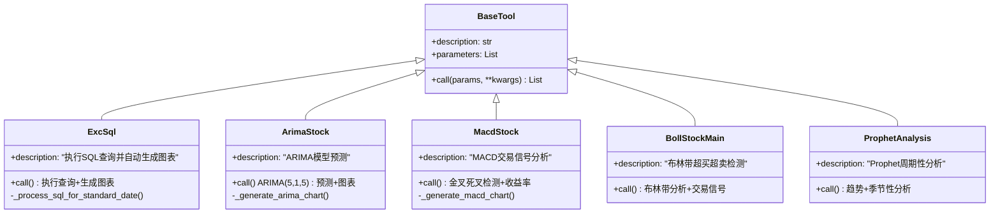

### 工具注册的两种形式

**1. 本地函数工具（字符串形式）：**

```python
function_list = ['ExcSql', 'arima_stock', 'macd_stock']
```

**2. MCP 远程工具（字典形式）：**

```python
function_list = [
    'ExcSql',
    {
        "mcpServers": {
            "tavily-mcp": {
                "command": "npx",
                "args": ["-y", "tavily-mcp@0.1.4"],
                "env": {"TAVILY_API_KEY": os.getenv("TAVILY_API_KEY")}
            }
        }
    }
]
```

---

## 5. 核心实现详解

### 5.1 SQL 查询与可视化工具（ExcSql）

这是最核心的工具，负责接收 LLM 生成的 SQL → 执行查询 → 自动生成折线图。

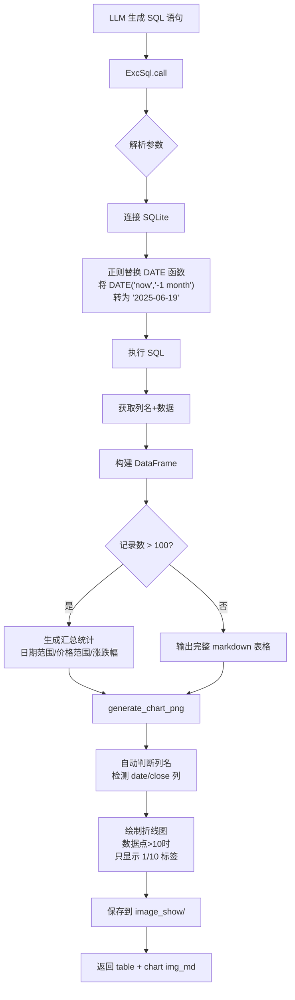

#### 关键设计：日期函数预处理器

LLM 生成的 SQL 中常包含 `DATE('now', '-1 month')` 等 SQLite 日期函数，但实际数据存储为 `YYYY-MM-DD` 文本格式。因此工具内部通过正则替换进行预处理：

```python
# 输入:  trade_date >= DATE('now', '-1 month')
# 输出:  trade_date >= '2025-06-19'

sql = re.sub(
    r"trade_date\s*(>=|<=)\s*DATE\s*\(\s*('[^)]*')\)",
    replace_condition_date_function,
    sql, flags=re.IGNORECASE
)
```

支持的偏移量解析：

- `'now'` → 当前日期
- `'-1 day'` / `'+1 day'` → 日偏移
- `'-1 month'` / `'-3 months'` → 月偏移（处理跨月边界）
- `'-1 year'` → 年偏移
- 动态模式：`'-30 days'`, `'+7 days'`, `'-2 weeks'`

#### 可视化优化

```python
# 数据点超过10个时自动降采样标签
if len(x_values) > 10:
    step = max(1, len(x_values) // 10)  # 最多显示10个标签
    tick_indices = list(range(0, len(x_values), step))
    tick_labels = [x_values.iloc[i] for i in tick_indices]
    ax.set_xticks(tick_indices)
    ax.set_xticklabels(tick_labels, rotation=45)
```

---

### 5.2 ARIMA 时间序列预测

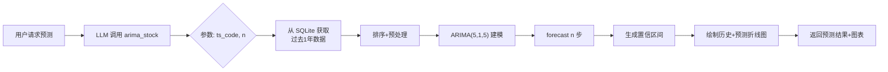

核心代码摘录：

```python
from statsmodels.tsa.arima.model import ARIMA

close_prices = df['close'].values
model = ARIMA(close_prices, order=(5, 1, 5))  # p=5, d=1, q=5
fitted_model = model.fit()

forecast_result = fitted_model.forecast(steps=n)
forecast_conf_int = fitted_model.get_forecast(steps=n).conf_int()
```

返回值包含：

```python
{
    'stock_code': '600519.SH',
    'prediction_days': 7,
    'predictions': [
        {'date': '2025-06-20', 'predicted_price': 1520.50,
         'lower_bound': 1480.30, 'upper_bound': 1560.70},
        ...
    ],
    'chart': ''
}
```

---

### 5.3 MACD 技术分析

MACD（指数平滑异同移动平均线）通过快慢 EMA 线的交叉来判断买卖时机。

#### MACD 计算公式

```python
def calculate_macd(data, fast=12, slow=26, signal=9):
    exp1 = data.ewm(span=fast).mean()    # 快速EMA (12日)
    exp2 = data.ewm(span=slow).mean()    # 慢速EMA (26日)
    macd_line = exp1 - exp2
    signal_line = macd_line.ewm(span=signal).mean()  # 信号线 (9日)
    histogram = macd_line - signal_line  # 柱状图
    return macd_line, signal_line, histogram
```

#### 交易信号逻辑

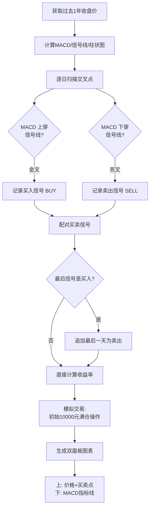

#### 收益率模拟

```python
initial_amount = 10000
current_amount = initial_amount

for buy, sell in zip(buy_signals, sell_signals):
    shares = current_amount / buy['price']
    sold_amount = shares * sell['price']
    profit_rate = (sold_amount - current_amount) / current_amount * 100
    # ...
```

---

### 5.4 布林带超买超卖检测

布林带（Bollinger Bands）通过移动平均线 ± k 倍标准差构建通道，用于识别价格异常。

#### 检测逻辑

```python
# 20日移动平均线
df['MA'] = df['close'].rolling(window=20).mean()
# 标准差 × 2
df['Upper'] = df['MA'] + 2 * df['close'].rolling(window=20).std()
df['Lower'] = df['MA'] - 2 * df['close'].rolling(window=20).std()

# 超买: 收盘价 > 上轨
overbought = df[df['close'] > df['Upper']]
# 超卖: 收盘价 < 下轨
oversold = df[df['close'] < df['Lower']]
```

#### 参数配置

| 参数           | 默认值 | 说明               |
| -------------- | ------ | ------------------ |
| ts_code        | 必填   | 股票代码           |
| start_date     | 一年前 | 检测开始日期       |
| end_date       | 今天   | 检测结束日期       |
| window         | 20     | 移动平均窗口（日） |
| num_std        | 2.0    | 标准差倍数         |
| initial_amount | 10000  | 模拟交易初始资金   |

---

### 5.5 Prophet 周期性分析

Facebook Prophet 模型用于识别股票价格的趋势和季节性模式。

```python
from prophet import Prophet

model = Prophet(
    yearly_seasonality=True,   # 年度季节性
    weekly_seasonality=True,   # 周度季节性
    daily_seasonality=False
)
model.fit(prophet_df)
future = model.make_future_dataframe(periods=30)
forecast = model.predict(future)
```

---

### 5.6 Tavily MCP 信息搜索

通过 MCP（Model Context Protocol）协议集成 Tavily AI 搜索引擎，让 Agent 具备获取实时信息的能力。

```json
{
    "mcpServers": {
        "tavily-mcp": {
            "command": "npx",
            "args": ["-y", "tavily-mcp@0.1.4"],
            "autoApprove": [],
            "env": {
                "TAVILY_API_KEY": "tvly-dev-xxxxxxxxxxxxxxxx"
            }
        }
    }
}
```

配置方式：

1. 注册 [tavily.com](https://tavily.com) 获取 API Key
2. 设置环境变量 `TAVILY_API_KEY`
3. 也可在 [ModelScope MCP](https://modelscope.cn/mcp) 查找更多 MCP Server

---

## 6. 版本演变历程

### 从门票助手到股票分析助手的渐进式开发

| 版本         | 文件                            | 新增功能                   | 核心变化          |
| ------------ | ------------------------------- | -------------------------- | ----------------- |
| **门票助手** | `assistant_ticket_bot-3.py`     | 基础 SQL 查询 + 柱状图     | MySQL 门票订单库  |
| **v1**       | `stock_analysis_assistant.py`   | SQL 查询 + 折线图          | 切换到股票 SQLite |
| **v2**       | `stock_analysis_assistant-2.py` | **ARIMA 预测**             | 时间序列分析      |
| **v3→v4**    | `stock_analysis_assistant-4.py` | **MACD 技术分析**          | 买卖信号检测      |
| **v5→v6**    | `stock_analysis_assistant-6.py` | **布林带 + Prophet + MCP** | 五工具全能版本    |

### 渐进式开发方法论

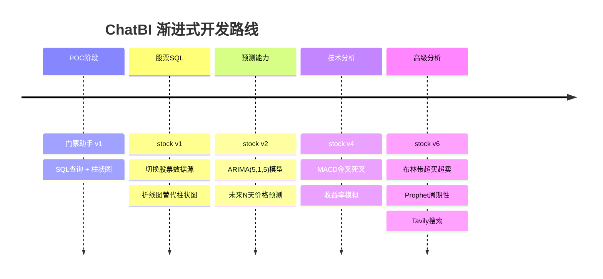

---

## 7. Agent 工作流程

### 完整的一次对话示例

用户提问："**对比2025年中芯国际和贵州茅台的涨跌幅**"

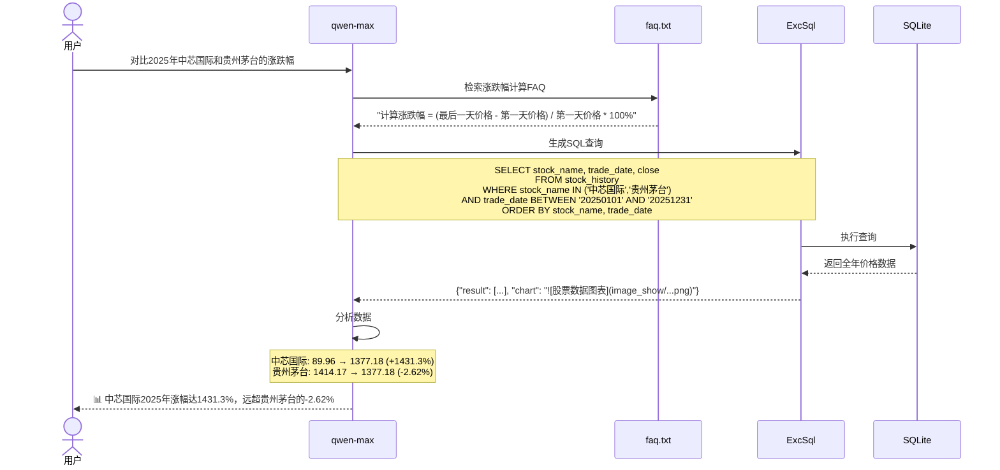

### System Prompt 设计要点

System Prompt 是 Agent 行为的核心约束，需要包含：

```
1. 角色定义：专业的股票查询和分析助手
2. 能力描述：五大工具各能做什么
3. 数据库结构：完整的 CREATE TABLE + 索引定义
4. 数据类型说明：SQLite 特有语法（TEXT, REAL）
5. 日期格式：YYYY-MM-DD，支持的 DATE 函数列表
6. 输出要求：Markdown 表格和图片必须原样输出
7. 风险提示：在适当时候提醒投资风险
```

---

## 8. RAG 知识库与 FAQ

### 知识库机制

qwen-agent 的 `Assistant` 构造函数支持 `files` 参数，可加载文本文件作为 RAG 知识库：

```python
bot = Assistant(
    llm=llm_cfg,
    name='股票查询和分析助手',
    function_list=tools,
    files=['./faq.txt']  # ↑ 这里设置RAG知识库
)
```

### FAQ 示例（few-shot 学习）

```
Q1：对比2000年股票A和股票B的涨跌幅
A1：
我需要先找到股票A在2000年第一天和最后一天的价格，再找到股票B在2000年第一天和最后一天的价格，
然后计算股票A的涨跌幅 = (最后一天价格 - 第一天价格) / 第一天价格 * 100%
同样计算股票B的涨跌幅 = (最后一天价格 - 第一天价格) / 第一天价格 * 100%
然后对比这两只股票的涨跌幅。
```

这种 **"错题本"模式** 本质上是 **query → few-shot 示例检索**，帮助 LLM 在面对复杂查询时遵循正确的推理路径。

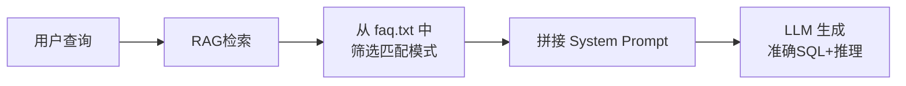

---

## 9. 前端界面

基于 qwen-agent 内置的 WebUI（Gradio），通过几行代码即可启动交互界面：

```python
from qwen_agent.gui import WebUI

# 配置建议问题列表
chatbot_config = {
    'prompt.suggestions': [
        '查询贵州茅台最近一个月的股价走势',
        '查询2024年全年贵州茅台的收盘价走势',
        '对比2024年中芯国际和贵州茅台的涨跌幅',
        '获取贵州茅台最近新闻',
        '使用ARIMA模型预测贵州茅台未来7天的价格',
        '使用MACD分析贵州茅台过去一年的买卖点',
        '使用布林带检测600519.SH股票的超买超卖点',
        '使用Prophet分析600519.SH股票的趋势和周期性',
    ]
}

# 启动
WebUI(bot, chatbot_config=chatbot_config).run()
```

界面运行在 `http://127.0.0.1:7860`，默认包含：

- 聊天对话框
- 预设建议问题（引导用户）
- Markdown 渲染（表格、图片）
- 会话历史

---

## 10. nanobot 项目迁移与实现

> **说明**：nanobot 是课程的架构扩展方向，本节介绍从 qwen-agent POC 成果迁移到 nanobot 体系的方法和项目结构。**nanobot 的核心价值在于将"单体 Agent"解耦为 AGENTS.md（角色定义）+ 独立脚本（scripts/）+ 技能定义（SKILL.md）的标准化体系。**

### 10.1 nanobot 架构核心概念

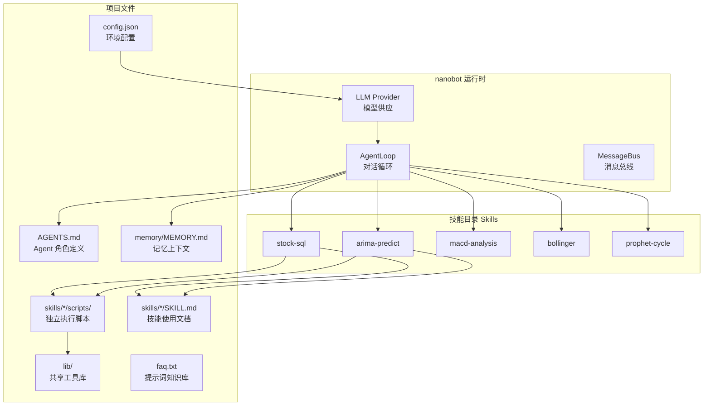

### 10.2 两个 nanobot 项目版本

课程提供了两个基于 nanobot 的项目版本，对应不同的交互方式：

| 对比维度 | CLI 版                             | GUI 版                        |
| -------- | ---------------------------------- | ----------------------------- |
| 项目目录 | `CASE-ChatBI助手-nanobot-cli`      | `CASE-ChatBI助手-nanobot-gui` |
| 交互方式 | 终端命令行交互                     | Gradio Web 图形界面           |
| 启动方式 | `python agent.py`                  | 内置 WebUI 服务               |
| 会话记录 | `sessions/quant_interactive.jsonl` | `sessions/quant_gradio.jsonl` |
| 技能数量 | 5 个                               | 6 个（含 RSI 分析）           |
| 数据字段 | 含 `股票简称` 中文列               | 含 `stock_name` 英文列        |
| 图床方式 | 保存 PNG 到 `image_show/`          | Base64 内嵌 + 文件            |

### 10.3 项目结构详解（以 CLI 版为例）

```
CASE-ChatBI助手-nanobot-cli/
├── agent.py                   # 入口：构建 Agent、配置、运行
├── config.json                # 模型/工具/Provider 配置
├── AGENTS.md                  # ★ Agent 角色定义（等同 System Prompt）
├── faq.txt                    # RAG 知识库（few-shot 问答示例）
├── requirements.txt           # 依赖列表
├── stock_data.db              # SQLite 数据库
│
├── lib/                       # ★ 共享工具函数库（技能脚本的公共依赖）
│   ├── __init__.py
│   ├── sql_chart.py           # SQL 查询 + Matplotlib 可视化
│   ├── arima_predict.py       # ARIMA(5,1,5) 预测
│   ├── macd_analysis.py       # MACD 金叉死叉检测
│   ├── bollinger_core.py      # 布林带超买超卖
│   └── prophet_core.py        # Prophet 周期性分析
│
├── skills/                    # ★ 技能目录（每个技能一个子目录）
│   ├── stock-sql/
│   │   ├── SKILL.md           #   技能描述 + 调用方式
│   │   └── scripts/
│   │       └── run_sql.py     #   可执行脚本（CLI 参数）
│   ├── arima-predict/
│   │   ├── SKILL.md
│   │   └── scripts/
│   │       └── run_arima.py
│   ├── macd-analysis/
│   │   ├── SKILL.md
│   │   └── scripts/
│   │       └── run_macd.py
│   ├── bollinger/
│   │   ├── SKILL.md
│   │   └── scripts/
│   │       └── run_bollinger.py
│   └── prophet-cycle/
│       ├── SKILL.md
│       └── scripts/
│           └── run_prophet.py
│
├── memory/
│   └── MEMORY.md              # 自动注入的日期上下文
│
├── image_show/                # 生成的图表 PNG
└── sessions/                  # 对话历史记录
    └── quant_interactive.jsonl
```

### 10.4 迁移步骤：从 qwen-agent 到 nanobot

```mermaid
flowchart LR
    subgraph "Step 1: 业务蒸馏"
        A1[分析 qwen-agent 工具] --> A2[提炼为独立脚本]
        A2 --> A3[拆分为 lib/ 公共库 + <br/>skills/*/scripts/ 入口]
    end

    subgraph "Step 2: 技能定义"
        B1[为每个工具写 SKILL.md] --> B2[描述适用场景]
        B2 --> B3[明确命令行参数]
        B3 --> B4[说明输出格式]
    end

    subgraph "Step 3: Agent 配置"
        C1[编写 AGENTS.md] --> C2[定义角色/能力/规范]
        C2 --> C3[配置 config.json]
        C3 --> C4[编写 agent.py 入口]
    end

    subgraph "Step 4: 运营部署"
        D1[GUI 版 / CLI 版] --> D2[多通道集成]
        D2 --> D3[持续迭代技能]
    end

    A3 --> B1
    B4 --> C1
    C4 --> D1
```

#### 具体步骤说明

**Step 1 — 业务蒸馏（代码重构）**

将 `stock_analysis_assistant-6.py` 中注册的 5 个工具类，逐一拆解为：

- **`lib/` 层**：`sql_chart.py`、`arima_predict.py`、`macd_analysis.py`、`bollinger_core.py`、`prophet_core.py`  
  包含核心算法，工具函数可复用。
- **`skills/*/scripts/` 层**：`run_sql.py`、`run_arima.py`、`run_macd.py`、`run_bollinger.py`、`run_prophet.py`  
  每个脚本只做一件事：解析命令行参数 → 调用 lib 函数 → 输出 JSON 到 stdout。

示例：`run_sql.py` 的骨架

```python
#!/usr/bin/env python3
"""执行 SQL 并输出 JSON（表格 + 图表路径）"""
import argparse, json, sys
from pathlib import Path
ROOT = Path(__file__).resolve().parents[2]
sys.path.insert(0, str(ROOT))
from lib.sql_chart import run_exc_sql

parser = argparse.ArgumentParser()
parser.add_argument("--sql", required=True, help="完整 SELECT 语句")
args = parser.parse_args()

db_path = ROOT / "stock_data.db"
result = run_exc_sql(args.sql, db_path, ROOT)
print(json.dumps(result, ensure_ascii=False))  # 仅标准输出 JSON
```

**Step 2 — 技能定义（SKILL.md 规范化）**

每个技能目录下的 `SKILL.md` 使用 YAML 前置元数据 + Markdown 主体，遵循统一格式：

```markdown
---
name: arima-predict
description: "使用 ARIMA(5,1,5) 对收盘价做短期预测，并生成历史与预测曲线图。"
keywords: ARIMA, 预测, 未来价格, 时间序列
---

# arima-predict 技能指南

## 适用场景
用户明确要求 ARIMA 预测、未来 N 天收盘价时调用。

## 执行命令
python skills/arima-predict/scripts/run_arima.py --ts-code 600519.SH --n 7

## 参数
- `--ts-code` 必填
- `--n` 必填，正整数，预测天数

## 输出
JSON 含 `predictions`、`chart`；须在回复中原样附带 `chart` 的 markdown。
```

**Step 3 — Agent 配置**

`AGENTS.md` 是 nanobot 体系的核心文件，替代了 qwen-agent 中的 `system_message` 参数：

```markdown
# AI 量化助手

你是专业的 A 股数据分析助手，基于本地 SQLite 行情库与可执行分析脚本回答问题。

## 能力概览

| 能力 | 何时使用 | 如何调用 |
|------|----------|----------|
| SQL 查询 + 自动走势图 | 查历史 K 线、多股对比 | 先读 `stock-sql` 技能，再 `exec` 运行脚本 |
| MACD | 近一年买卖点与简易回测 | 读 `macd-analysis` 技能后执行脚本 |
| ARIMA 预测 | 未来 N 天价格预测 | 读 `arima-predict` 技能 |
| 布林带 | 超买超卖与回测 | 读 `bollinger` 技能 |
| Prophet 季节性 | 趋势/周/年季节分解 | 读 `prophet-cycle` 技能 |

## 回答规范
- 脚本返回的 JSON 中含有 `table`、`chart` 等 markdown 字段时，**须原样输出**
- 使用简体中文；涉及投资建议时附加风险提示
```

`config.json` 配置模型和工具：

```json
{
  "agents": {
    "defaults": {
      "model": "qwen-plus",
      "provider": "auto",
      "temperature": 0.1,
      "max_tool_iterations": 50
    }
  },
  "providers": {
    "dashscope": { "api_key": "" }
  },
  "tools": {
    "web": { "enable": true, "search": { "provider": "tavily" } },
    "exec": { "enable": true, "timeout": 180 }
  }
}
```

**Step 4 — agent.py 入口**

在 nanobot 体系下，`agent.py` 只需做三件事：

```python
# 1. 加载配置
config = load_config(WORKSPACE / "config.json")
config.providers.dashscope.api_key = os.environ["DASHSCOPE_API_KEY"]

# 2. 构建 AgentLoop
loop = AgentLoop(bus=MessageBus(), provider=provider, workspace=WORKSPACE, ...)

# 3. 注入时间上下文到 memory
memory_file.write_text(f"今天是 {today_str}。")

# 4. 启动 nanobot
bot = Nanobot(loop)
result = await bot.run(user_input, session_key="quant:interactive")
```

### 10.5 nanobot 技能与 qwen-agent 工具对照

| qwen-agent 工具    | nanobot 技能    | 核心脚本                         | 输出格式                                           |
| :----------------- | :-------------- | :------------------------------- | :------------------------------------------------- |
| `ExcSql`           | `stock-sql`     | `run_sql.py --sql "..."`         | `{ok, table, chart, count}`                        |
| `arima_stock`      | `arima-predict` | `run_arima.py --ts-code X --n Y` | `{predictions, chart}`                             |
| `macd_stock`       | `macd-analysis` | `run_macd.py --ts-code X`        | `{buy_signals, sell_signals, transactions, chart}` |
| `boll_stock_main`  | `bollinger`     | `run_bollinger.py --ts-code X`   | `{signals, transactions, chart}`                   |
| `prophet_analysis` | `prophet-cycle` | `run_prophet.py --ts-code X`     | `{components_chart, trend_chart}`                  |

### 10.6 nanobot GUI 版进阶特性

`CASE-ChatBI助手-nanobot-gui` 在 CLI 版基础上增加了：

1. **Gradio 前端**：Agent 决策后直接渲染交互式 Web 界面
2. **RSI 分析技能**：额外提供相对强弱指标（Relative Strength Index）分析
3. **flow.json 管道定义**：ARIMA 预测等技能带有结构化步骤描述（inputs → steps → outputs → edges），形成可视化工作流流水线：

```json
{
  "name": "ARIMA收盘价短期预测",
  "inputs": [
    {"name": "ts_code", "type": "string", "required": true},
    {"name": "n", "type": "integer", "required": true}
  ],
  "steps": [
    {"id": "load_data", "type": "tool", "label": "加载历史收盘价"},
    {"id": "fit_arima_model", "type": "tool", "label": "拟合ARIMA(5,1,5)模型"},
    {"id": "plot_chart", "type": "tool", "label": "绘制预测曲线图"}
  ],
  "edges": [
    {"from": "load_data", "to": "fit_arima_model"},
    {"from": "fit_arima_model", "to": "plot_chart"}
  ]
}
```

4. **多种会话隔离**：`sessions/` 目录下同时保留交互式、单次查询、Web 三类对话历史

---

## 11. 总结与最佳实践

### 架构设计原则

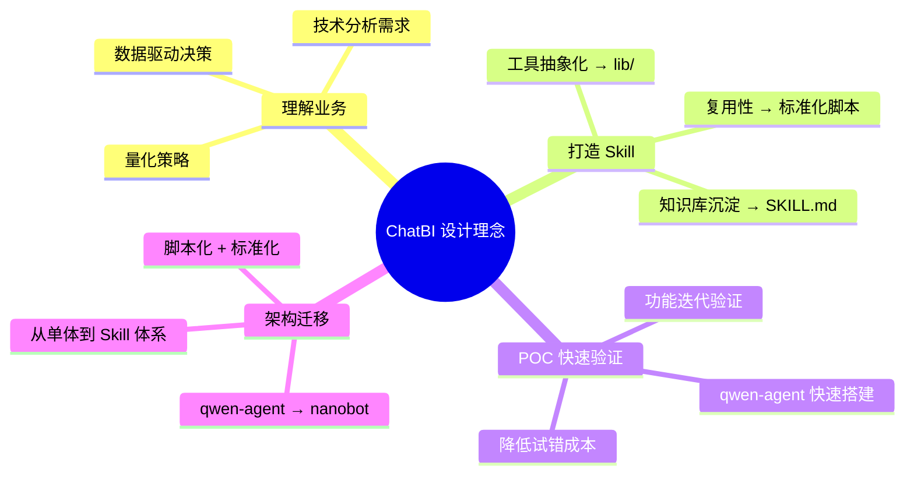

### 关键技术决策

| 决策点       | 选择                        | 理由                            |
| ------------ | --------------------------- | ------------------------------- |
| POC 框架     | qwen-agent                  | 快速验证，内置 GUI/RAG/MCP 支持 |
| 生产框架     | nanobot                     | Skill 解耦，标准化脚本编排      |
| 数据存储     | SQLite                      | 本地化，无需部署数据库服务      |
| SQL 日期处理 | 正则替换                    | 兼容 LLM 生成的非标准 DATE 函数 |
| 可视化       | Matplotlib                  | 成熟稳定，中文字体支持好        |
| 工具注册     | @register_tool → Skill 目录 | 从装饰器演进为标准化文件体系    |
| 信息搜索     | MCP 协议                    | 标准化工具接口，可扩展          |

### 从 POC 到生产的完整路径

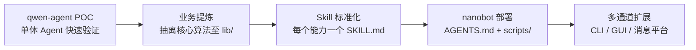

### 方法总结：如何完成一个 ChatBI 项目

| 阶段             | 关键动作                             | 产出物                                      |
| ---------------- | ------------------------------------ | ------------------------------------------- |
| **1. 数据基建**  | Tushare 取数 → SQLite 建表           | `stock_data.db` + DDL                       |
| **2. SQL Agent** | qwen-agent 实现自然语言→SQL          | `assistant_ticket_bot-3.py`（POC 门票助手） |
| **3. 业务迁移**  | 切换到股票场景，增加图表可视化       | `stock_analysis_assistant-*.py` 系列        |
| **4. 工具矩阵**  | 叠加 ARIMA → MACD → 布林带 → Prophet | 5 大专业分析工具                            |
| **5. MCP 扩展**  | 接入 Tavily 联网搜索能力             | 实时信息获取                                |
| **6. 架构迁移**  | 单体 Agent → nanobot Skill 体系      | `nanobot-cli` / `nanobot-gui` 双版本        |
| **7. 前端交付**  | Gradio WebUI / 命令行 / 消息通道     | 多种交互方式                                |

### 完成方法的 4 步心法

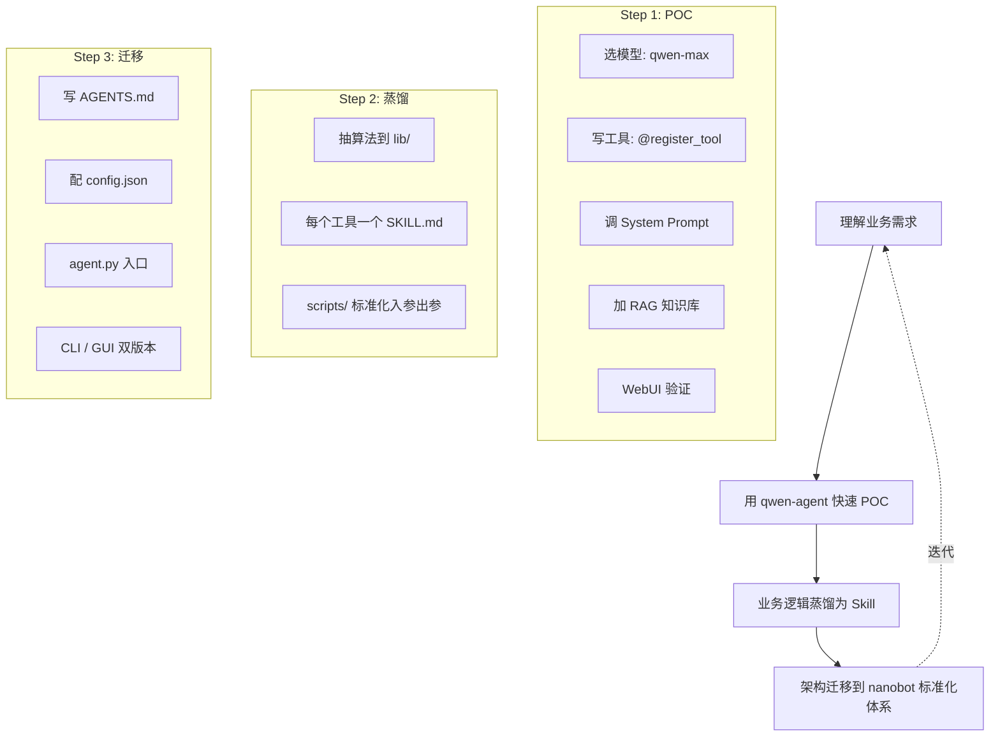

