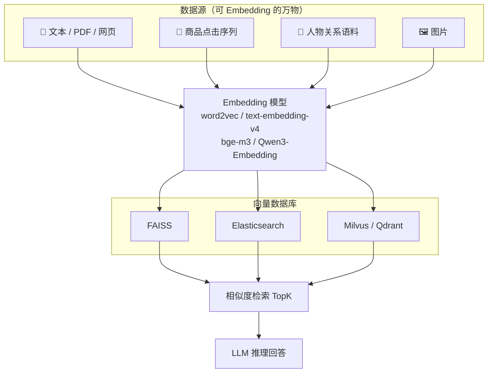
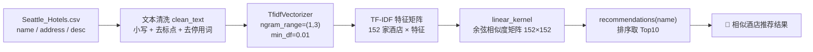
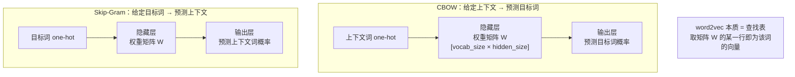
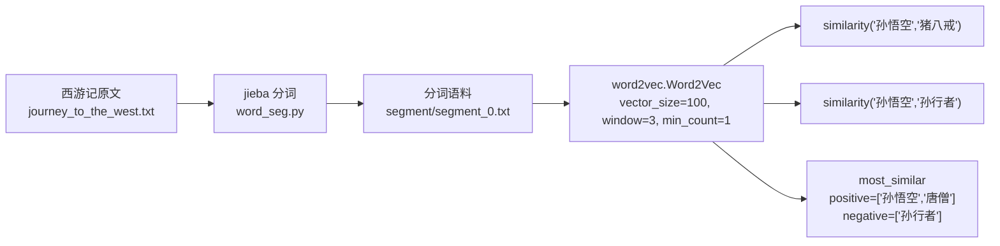
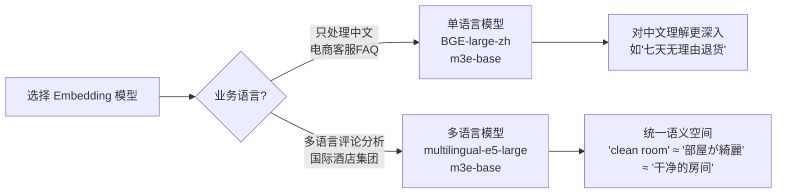
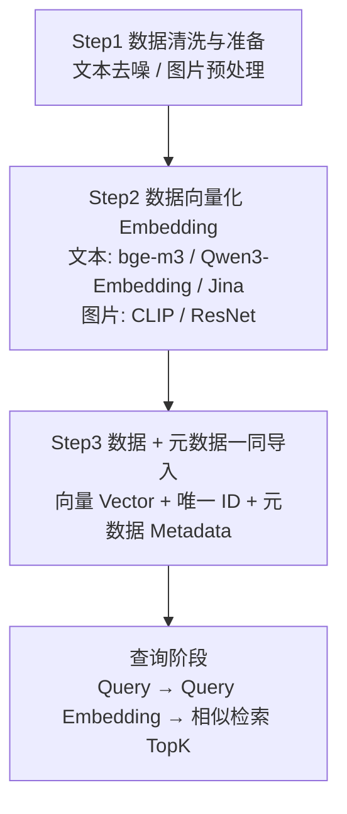
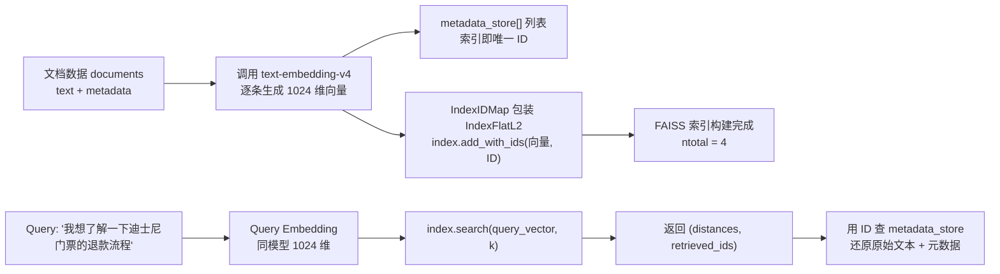
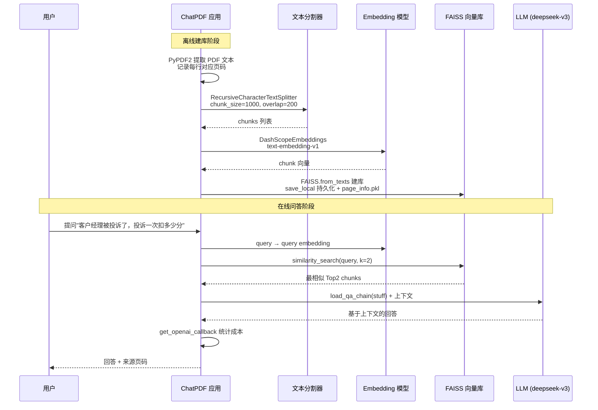
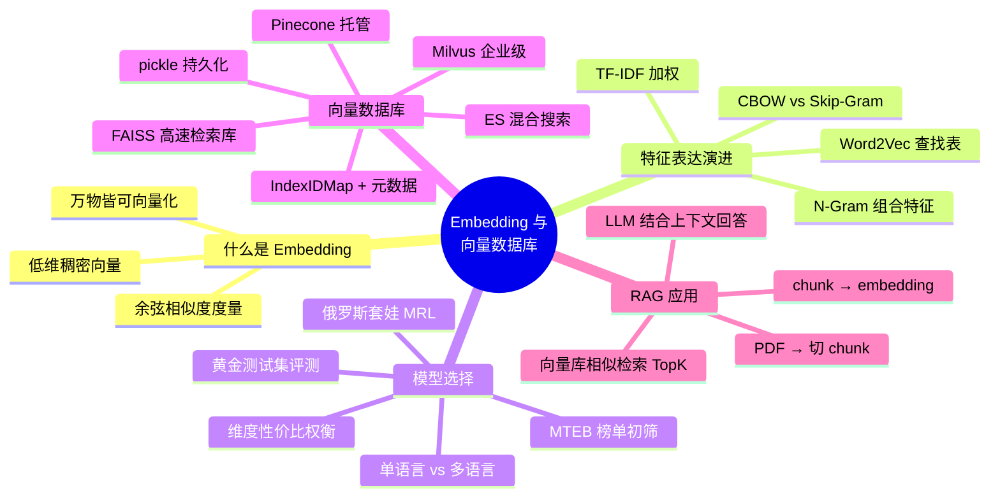

<!-- more -->

## 1. 课程概述

本课围绕 **Embedding（向量化）** 与 **向量数据库** 两大主题，核心学习目标：

| 模块                 | 内容                                                         |
| -------------------- | ------------------------------------------------------------ |
| 什么是 Embedding     | N-Gram、Word Embedding、余弦相似度计算                       |
| Embedding 模型的选择 | MTEB 榜单、向量维度影响、俄罗斯套娃（MRL）、单/多语言模型    |
| 向量数据库           | FAISS / Elasticsearch / Milvus / Pinecone 特点、与传统数据库对比、数据导入 |

**一句话主线**：把万物（文本、商品、人物、图片）变成**低维稠密向量**，放进**向量数据库**做**相似度检索**，喂给 LLM 做 RAG 问答。



---

## 2. 什么是 Embedding

> **定义**：Embedding（嵌入/向量化）是一种**降维方式**，将不同特征转换为**维度相同的向量**。

- 高维稀疏的离线变量（如 one-hot）→ 转换为固定 size 的稠密 embedding 向量
- 任何物体都可以转换成向量的形式，从 Trait #1 到 Trait #N
- 向量之间可以用**相似度**计算，推荐时选择相似度最大的

### 2.1 为什么不用 one-hot？

| 对比项    | One-Hot 编码           | Embedding                  |
| --------- | ---------------------- | -------------------------- |
| 维度      | 词表大小（可能几十万） | 固定小维度（100/256/1024） |
| 稠密度    | 极度稀疏（大量 0）     | 稠密                       |
| 语义关系  | 无法表达（词与词独立） | 语义相近的词向量距离近     |
| 存储/计算 | 浪费                   | 高效                       |

> 📌 课堂 Q：one-hot 编码方式本身不是向量吗？—— 是向量，但维度太大、太稀疏；Embedding 是**稠密**的。

### 2.2 词向量的经典效果

以 King 为例（通过 GloVe/Word2Vec 学习得到 50 维向量，权重范围 [-2, 2]）：

- **Man 和 Woman 更相近**（语义相似性体现在向量距离上）
- **向量可运算**：`king - man + woman ≈ queen`，与 queen 的相似度最高

```
king - man + woman = queen
```

---

## 3. 特征表达演进：N-Gram → TF-IDF → Word Embedding

### 3.1 N-Gram（N 元语法）

- **假设**：第 n 个词的出现只与前 n-1 个词相关，与其他词无关
- N=1 → unigram；N=2 → bigram；N=3 → trigram
- 文本 `A B C D E` 的 Bi-Gram：`A B, B C, C D, D E`
- **作用**：一阶特征不够用时，用 N-Gram 生成相邻关键词的组合特征

### 3.2 TF-IDF

| 概念                | 公式                                 | 含义                                          |
| ------------------- | ------------------------------------ | --------------------------------------------- |
| TF（词频）          | 单词次数 / 文档总单词数              | 词在文档中出现的频繁程度                      |
| IDF（逆向文档频率） | log(文档总数 / 单词出现的文档数) + 1 | 词在文档集合中的区分度，出现文档越少 IDF 越大 |

### 3.3 特征工程 → 相似度计算的瓶颈

> 课堂笔记关键点：某案例特征数量 `3329 = 1000（1元特征）+ 1000（2元特征）+ 1329（3元特征）`
>
> ⚠️ 问题：**特征维度太大，且很多特征值为 0 → 存储空间浪费、计算量大**。这就是引出 Word Embedding 的动机（Thinking：有没有更适合的方式？）。

---

## 4. 项目一：酒店内容推荐系统

> 📁 工作区代码：`hotel_recommendation/hotel_rec.py`

**业务目标**：基于西雅图酒店数据集（字段：`name, address, desc`），用户选中一家酒店后，推荐与其描述最相似的 Top10 其他酒店。

**技术路线**：N-Gram + TF-IDF 特征提取 → 线性核计算余弦相似度矩阵 → 取 TopK。



### 4.1 关键代码

```python
# 得到酒店描述中 n-gram 特征中的 TopK 个
def get_top_n_words(corpus, n=1, k=None):
    vec = CountVectorizer(ngram_range=(n, n), stop_words='english').fit(corpus)
    bag_of_words = vec.transform(corpus)
    sum_words = bag_of_words.sum(axis=0)
    words_freq = [(word, sum_words[0, idx]) for word, idx in vec.vocabulary_.items()]
    words_freq = sorted(words_freq, key=lambda x: x[1], reverse=True)
    return words_freq[:k]

# 使用 TF-IDF 提取文本特征（1-gram, 2-gram, 3-gram）
tf = TfidfVectorizer(analyzer='word', ngram_range=(1, 3), min_df=0.01, stop_words=list(ENGLISH_STOPWORDS))
tfidf_matrix = tf.fit_transform(df['desc_clean'])
print(tfidf_matrix.shape)  # (152, 特征数)

# 计算酒店之间的余弦相似度（线性核函数）
cosine_similarities = linear_kernel(tfidf_matrix, tfidf_matrix)

# 基于相似度矩阵和指定酒店 name，推荐 TOP10
def recommendations(name, cosine_similarities=cosine_similarities):
    idx = indices[indices == name].index[0]
    score_series = pd.Series(cosine_similarities[idx]).sort_values(ascending=False)
    top_10_indexes = list(score_series.iloc[1:11].index)  # 去掉自己
    return [list(df.index)[i] for i in top_10_indexes]

print(recommendations('Hilton Seattle Airport & Conference Center'))
print(recommendations('The Bacon Mansion Bed and Breakfast'))
```

### 4.2 余弦相似度（Cosine Similarity）

- 通过测量两个向量的**夹角余弦值**度量相似性
- 方向相同 → 1；夹角 90° → 0；方向相反 → -1
- 取值范围 **[-1, 1]**

$$cos(\theta) = \frac{A \cdot B}{\|A\| \times \|B\|} = \frac{\sum_{i=1}^{n} A_i B_i}{\sqrt{\sum_{i=1}^{n} A_i^2} \times \sqrt{\sum_{i=1}^{n} B_i^2}}$$

**手工计算示例**（课件 Step1-4）：

- 句子A：`这个/程序/代码/太乱，那个/代码/规范`
- 句子B：`这个/程序/代码/不/规范，那个/更/规范`
- 词表：`这个，程序，代码，太乱，那个，规范，不，更`
- 词频向量 A：`(1, 1, 2, 1, 1, 1, 0, 0)`
- 词频向量 B：`(1, 1, 1, 0, 1, 2, 1, 1)`
- **结果 ≈ 0.738**，接近 1，说明两句话语义相似

---

## 5. Word2Vec 详解

### 5.1 原理：Embedding = 学习隐藏层的权重矩阵

> Word2Vec 把词所在空间映射到一个新空间，使**语义相似的单词在该空间内距离相近**。



**关键认知**：

- 输入是 one-hot 编码，隐藏层神经元数量 = Embedding Size
- 输入层与隐藏层之间的权值矩阵 W 大小为 `[vocab_size, hidden_size]`
- one-hot 与 W 相乘时，本质是**选取矩阵的某一行** → 这一行就是该词的 word2vec 表示
- 隐含层节点个数 = 词向量维数；隐层输出 = 每个输入单词的 Word Embedding
- **word2vec 实际上就是一个查找表（Lookup Table）**

| 模式      | 任务                       | 方向            |
| --------- | -------------------------- | --------------- |
| CBOW      | 给定上下文预测 input word  | 上下文 → 目标词 |
| Skip-Gram | 给定 input word 预测上下文 | 目标词 → 上下文 |

### 5.2 Gensim 工具

```bash
pip install gensim
```

| 参数                         | 含义                                                         | 默认 |
| ---------------------------- | ------------------------------------------------------------ | ---- |
| `window`                     | 句子中当前单词和被预测单词的最大距离                         | 5    |
| `min_count`                  | 需要训练词语的最小出现次数（词频 < min_count 的词不参与学习） | 5    |
| `vector_size`（旧版 `size`） | 向量维度                                                     | 100  |
| `workers`                    | 训练线程数                                                   | 1    |

> 📌 课堂 Q：min_count=1 是什么参数？→ 最小出现词频 ≥ 1 的词才训练。
> 📌 课堂 Q：怎么知道特征设置多少维比较好？→ 做实验，embedding size / vector_size 从 100 起试。

### 5.3 西游记实战（人物相似度）

> 📁 工作区代码：`word2vec/word_seg.py` + `word2vec/word_similarity.py`

**方案步骤**：

1. 用 Jieba 分词，将训练语料转成句子迭代器
2. 用 Word2Vec 训练（`PathLineSentences` 读取分好词的 segment 目录）
3. 计算两个单词的相似度



```python
from gensim.models import word2vec
import multiprocessing

sentences = word2vec.PathLineSentences('./journey_to_the_west/segment')

# 轻量模型：训练 + 相似度
model = word2vec.Word2Vec(sentences, vector_size=100, window=3, min_count=1)
print(model.wv['孙悟空'])                      # 词向量
print(model.wv.similarity('孙悟空', '猪八戒'))  # 相似度
print(model.wv.similarity('孙悟空', '孙行者'))

# 更充分的模型：多线程训练 + 保存
model2 = word2vec.Word2Vec(sentences, vector_size=128, window=5,
                           min_count=5, workers=multiprocessing.cpu_count())
model2.save('./models/word2Vec.model')
print(model2.wv.most_similar(positive=['孙悟空', '唐僧'], negative=['孙行者']))
```

> 💡 运行环境：安装 `jieba` + `gensim` 即可运行。

### 5.4 打卡任务：三国演义 Embedding

- 使用 Gensim 的 Word2Vec 对 `three_kingdoms.txt`（三国演义）做 Embedding
- 分析**和曹操最相近的词**有哪些
- 向量运算：`曹操 + 刘备 - 张飞 = ?`

### 5.5 万物皆可 Embedding（商品2Vec / 人物2Vec）

> 课堂核心观点：**word2vec ⇒ embedding is all you need，万事万物都可以 embedding**。

| 场景     | 单词 | 句子（序列）            |
| -------- | ---- | ----------------------- |
| 商品推荐 | 商品 | 用户点击/购买商品的顺序 |
| 人物推荐 | 人物 | 用户关注/互动人物的顺序 |
| 大V推荐  | 大V  | 用户关注大V的顺序       |

- session1：`商品A 商品B 商品C ... 商品F` → 句子
- session2：`商品B 商品E 商品F ... 商品H` → 句子
- 大量序列组成语料 → word2vec 学习商品 embedding → 计算商品A 和 商品B 像不像 → 淘宝「看了又看」

---

## 6. Embedding 模型的选择

### 6.1 MTEB 榜单

**MTEB (Massive Text Embedding Benchmark)**：全面评测基准，涵盖 **8 大类任务、58 个数据集**：

| 任务类型                   | 说明                                         |
| -------------------------- | -------------------------------------------- |
| 检索 Retrieval             | 从文档库中按查询找出最相关文档列表           |
| 语义文本相似度 STS         | 判断一对句子的语义相似程度（如 1-5 分）      |
| 重排序 Reranking           | 对初步检索结果二次优化排序                   |
| 分类 Classification        | 文本划分到预定义类别                         |
| 聚类 Clustering            | 无标签情况下自动分组                         |
| 对分类 Pair Classification | 判断一对文本是否有特定关系（如是否重复问题） |
| 双语挖掘 Bitext Mining     | 从两种语言句子中找出互为翻译的句子对         |
| 摘要 Summarization         | 评估机器摘要与人工参考摘要的语义相似度       |

- 榜单地址：https://huggingface.co/spaces/mteb/leaderboard
- 通过榜单看 BGE 系列、GTE、Jina 等模型在不同任务上的表现 → **初步筛选**

### 6.2 向量维度对性能的影响

| 维度                | 优势                   | 代价                   |
| ------------------- | ---------------------- | ---------------------- |
| 高维度（1024/4096） | 编码更丰富、语义更细致 | 计算成本高、存储空间大 |
| 低维度（256/512）   | 计算快、内存占用小     | 表达力有限             |

> 💡 性价比决策：**从 768 维升到 1024 维，检索指标提升不到 1%，内存却多占约 35% → 不升维**；若压缩到 768 维后指标下降超过 5% → 信息损失大，值得用更高维度。

### 6.3 神奇的"俄罗斯套娃"（Matryoshka Representation Learning, MRL）

以 Jina-Embedding-V4 为例：

- 模型内部总是先生成**最完整的高维向量（2048 维）**
- 这个长向量的**前 128/256/512/1024 维本身就是独立可用的高质量短向量**
- 调用时通过 `embedding_size` 指定只需要前 N 维，模型直接截断返回

| 场景             | 维度选择 | 理由                         |
| ---------------- | -------- | ---------------------------- |
| 社交媒体情感分析 | 128 维   | 文本短、实时性高、算力有限   |
| 投资分析报告     | 2048 维  | 专业术语多、精准理解至关重要 |

> 动态调整维度 = Jina embedding 赋予开发者的强大选项。

### 6.4 单语言 vs 多语言模型



- **单语言模型**（如 BGE-large-zh）：特定语言任务理解更深入、性能更优越
- **多语言模型**（如 m3e-base、multilingual-e5-large）：将多种语言映射到**统一语义空间**，实现跨语言聚类分析和检索
- ⚠️ **Embedding 不等于翻译**！多语言模型是把不同语言映射到同一语义空间，不是做实时翻译

### 6.5 模型选型完整流程

> 不能仅依赖公开榜单！

1. **明确业务场景与评估指标**：核心任务是检索/分类/聚类？确定 Recall@K、Accuracy、NDCG
2. **构建"黄金"测试集**：真实反映业务场景的小规模「问题-标准答案」对
3. **小范围对比测试**：从 MTEB 挑几款符合需求（语言、维度）的候选模型，用黄金测试集评测
4. **综合决策**：测试结果 + 推理速度 + 部署成本

### 6.6 可用的开源/商业模型清单

| 模型                        | 来源                   | 说明                                             |
| --------------------------- | ---------------------- | ------------------------------------------------ |
| Qwen3-Embedding-8B          | ModelScope（免费开源） | 中文首选之一，15.15GB，需 4090 级显卡            |
| BGE-M3                      | ModelScope（免费开源） | BAAI 出品，中文方便本地部署                      |
| text-embedding-v4 / v3 / v1 | 阿里云百炼（商业 API） | 通过 DASHSCOPE_API_KEY 调用，支持指定 dimensions |
| Jina-Embedding-V4           | ModelScope             | 多模态多语言，MRL 套娃维度                       |

---

## 7. 向量数据库

### 7.1 为什么需要向量数据库？

> **向量数据库 = AI 时代的核心记忆体**。让 LLM"记住"并利用海量、多样的私有知识。

- 弥补 LLM **上下文窗口长度限制**和**知识更新延迟**的问题 → 长期记忆
- 实现**私有知识库的问答与搜索**：企业内部文档 → 向量 → 语义检索
- 赋能**推荐系统、以图搜图**：计算用户、物品向量相似度

**核心能力：高效的相似性检索** —— 向量在多维空间中的距离 = 原始数据的语义相似度。

### 7.2 LLM vs Embedding 模型的分工

> 课堂 Q：用了大模型还需要额外用 embedding 吗？大模型本身不带 embedding 吗？

| 模型           | 职责           | 特点                                 |
| -------------- | -------------- | ------------------------------------ |
| LLM            | 推理、回答问题 | 尺寸巨大（DeepSeek R1 671B）         |
| Embedding 模型 | 相似度判断     | 判断知识库里哪些 chunk 与 query 很像 |

> 💡 知识库有 1 万 chunks，如果让 LLM 逐个筛选哪个好 → 要计算 1 万次；用 embedding 一次相似度检索即可 → **LLM 只做推理，embedding 做筛选**。

### 7.3 常见向量数据库一览

| 数据库            | 特点                                       | 优势                                  | 局限性                                           |
| ----------------- | ------------------------------------------ | ------------------------------------- | ------------------------------------------------ |
| **FAISS**         | Facebook(Meta AI) 开发的高性能相似性搜索库 | 检索快，支持多种索引类型，CPU/GPU     | 主要用于静态数据，增删改复杂；本身不是完整数据库 |
| **Elasticsearch** | 分布式搜索分析引擎，k-NN 是其功能之一      | **混合搜索**（关键词 + 向量）业界领先 | 向量检索性能弱于专门向量库                       |
| **Milvus**        | 开源、云原生、分布式                       | 强扩展性、动态数据更新                | 需一定运维能力                                   |
| **Pinecone**      | 托管的云原生向量数据库                     | 完全托管、易部署、低延迟              | 闭源托管，内部细节不透明                         |

### 7.4 向量数据库 vs 传统数据库

| 维度     | 传统数据库                 | 向量数据库                              |
| -------- | -------------------------- | --------------------------------------- |
| 数据类型 | 结构化数据（表格、行、列） | 高维向量（非结构化数据转化）            |
| 查询方式 | 精确匹配（=、<、>）        | 相似度/距离度量（欧氏距离、余弦相似度） |
| 应用场景 | 事务记录、结构化信息管理   | 语义搜索、内容推荐等相似性计算场景      |

### 7.5 完整选型对比

| 数据库        | 核心特点                           | 性能表现                                         | 适用场景                                             |
| ------------- | ---------------------------------- | ------------------------------------------------ | ---------------------------------------------------- |
| FAISS         | 核心算法库，非数据库，Meta AI 开发 | 纯粹的性能标杆，GPU 版本极快，是衡量其他库的基准 | 算法研究者；需深度集成向量检索的团队；自行构建服务层 |
| Milvus        | 开源领导者，云原生、高度可扩展     | 大规模数据集吞吐量和延迟控制优秀                 | 海量数据、企业级应用、私有化部署                     |
| Pinecone      | 全托管商业先驱，Serverless         | 极低延迟                                         | 快速上线、运维负担最小化、初创公司                   |
| Weaviate      | 开源，内置数据向量化模块           | 性能良好，易用性强                               | 简化 ETL，快速构建全链路应用                         |
| Qdrant        | 开源，Rust 开发，内存安全          | 复杂过滤查询场景突出，内存效率高                 | 金融、电商等复杂过滤规则应用                         |
| Elasticsearch | 通用搜索巨头 + 向量检索扩展        | 混合搜索（关键词+向量）表现优异                  | 以文本搜索为主、向量为辅，统一平台解决搜索问题       |

> 📌 课堂 Q：企业级 Java 应用推荐用什么？→ **ES**。数据量很大且要同时支持关键词 + 向量相似检索时用 ES（单索引可支撑 21 亿数据）。

### 7.6 如何将数据导入向量数据库



**元数据（Metadata）= 数据的数据**：文本来源的文件名/章节/URL、商品的类别/品牌/价格、图片的创建日期/作者…… 是实现高级检索的关键。

> 📌 课堂 Q：知识一直在变，需要全量重新 embedding 吗？→ 可以**增量计算**。
> 📌 课堂 Q：存向量库前使用的 embedding 和 query 的 embedding 必须是同一个吗？→ **是的！** 必须用同一模型同一维度。

---

## 8. 项目二：调用百炼 Embedding API

> 📁 工作区代码：`CASE-向量数据库/1-embedding计算.py`

```python
import os
from openai import OpenAI

client = OpenAI(
    api_key=os.getenv("DASHSCOPE_API_KEY"),  # 百炼 API Key（环境变量）
    base_url="https://dashscope.aliyuncs.com/compatible-mode/v1"  # 百炼兼容模式
)

completion = client.embeddings.create(
    model="text-embedding-v4",
    input='我想知道迪士尼的退票政策',
    dimensions=1024,      # 指定向量维度（仅 v3 / v4 支持）
    encoding_format="float"
)

print(completion.model_dump_json())
# 返回 {"data": [{"embedding": [0.0095, -0.1117, ...1024个浮点数...], "index": 0, "object": "embedding"}],
#        "model": "text-embedding-v4", "usage": {"prompt_tokens": 23, "total_tokens": 23}}
```

> 💡 返回的 `embedding` 就是 1024 维的稠密向量，可以直接存入向量数据库。

---

## 9. 项目三：Embedding + 元数据导入 FAISS

> 📁 工作区代码：`CASE-向量数据库/2-embedding-faiss-元数据.py`

### 9.1 核心思想

**FAISS 本身只存储和检索向量，不存储元数据** → 需要在 FAISS 之外维护一个元数据"查找表"，通过向量在 FAISS 中的**唯一 ID** 关联两者。

> 最直接有效的方法：使用 FAISS 的 **IndexIDMap**，允许为每个向量指定自定义的 64 位整数 ID，再用这个 ID 作为元数据存储的键。

### 9.2 完整流程



### 9.3 关键代码

```python
import os, numpy as np, faiss
from openai import OpenAI

# Step2. 准备示例文本和元数据
documents = [
    {"id": "doc1", "text": "迪士尼乐园的门票一经售出，原则上不予退换。……",
     "metadata": {"source": "official_faq_v1.pdf", "category": "退票政策", "author": "Admin"}},
    {"id": "doc2", "text": "购买"奇妙年卡"的用户，可以享受一年内多次入园的特权……",
     "metadata": {"source": "annual_pass_rules.docx", "category": "会员权益", "author": "MarketingDept"}},
    {"id": "doc3", "text": "对于在线购买的迪士尼门票，如果需要退票，必须在票面日期前48小时……",
     "metadata": {"source": "online_policy.html", "category": "退票政策", "author": "E-commerceTeam"}},
    {"id": "doc4", "text": "园区内的"加勒比海盗"项目因年度维护，将于下周暂停开放。",
     "metadata": {"source": "maintenance_notice.txt", "category": "园区公告", "author": "OpsDept"}},
]

# Step3. 元数据存储 + 向量列表（列表索引 = 唯一 ID）
metadata_store, vectors_list, vector_ids = [], [], []
for i, doc in enumerate(documents):
    completion = client.embeddings.create(
        model="text-embedding-v4", input=doc["text"],
        dimensions=1024, encoding_format="float")
    vectors_list.append(completion.data[0].embedding)
    metadata_store.append(doc)
    vector_ids.append(i)  # 自定义 ID 与列表索引一致

vectors_np = np.array(vectors_list).astype('float32')
vector_ids_np = np.array(vector_ids)

# Step4. 构建并填充 FAISS 索引
dimension = 1024
k = 3
index_flat_l2 = faiss.IndexFlatL2(dimension)     # L2（欧氏）距离精确索引
index = faiss.IndexIDMap(index_flat_l2)          # 关键：ID 映射，关联向量和元数据
index.add_with_ids(vectors_np, vector_ids_np)    # 添加向量 + 自定义 ID

# Step5. 查询 → query embedding → 相似检索
query_text = "我想了解一下迪士尼门票的退款流程"
query_vector = np.array([...query_embedding...]).astype('float32')
distances, retrieved_ids = index.search(query_vector, k)   # D=距离, I=索引/ID

# Step6. 用 ID 检索元数据
for i in range(k):
    doc_id = retrieved_ids[0][i]
    if doc_id == -1:
        print(f"排名 {i+1}: 未找到更多结果。")
        continue
    retrieved_doc = metadata_store[doc_id]
    print(f"--- 排名 {i+1} (距离: {distances[0][i]:.4f}) ---")
    print(f"ID: {doc_id}\n原始文本: {retrieved_doc['text']}\n元数据: {retrieved_doc['metadata']}")
```

### 9.4 真实运行结果

```
正在为文档生成向量...
  - 已处理文档 1/4
  - 已处理文档 2/4
  - 已处理文档 3/4
  - 已处理文档 4/4
FAISS 索引已成功创建，共包含 4 个向量。
正在为查询文本生成向量: '我想了解一下迪士尼门票的退款流程'
--- 排名 1 (相似度得分/距离: 0.3222) ---
ID: 2
原始文本: 对于在线购买的迪士尼门票，如果需要退票，必须在票面日期前48小时通过原购买渠道提交申请，并可能收取手续费。
元数据: {'source': 'online_policy.html', 'category': '退票政策', 'author': 'E-commerceTeam'}
--- 排名 2 (相似度得分/距离: 0.3312) ---
ID: 0
原始文本: 迪士尼乐园的门票一经售出，原则上不予退换。但在特殊情况下，如恶劣天气导致园区关闭……
元数据: {'source': 'official_faq_v1.pdf', 'category': '退票政策', 'author': 'Admin'}
--- 排名 3 (相似度得分/距离: 1.0135) ---
ID: 1
原始文本: 购买"奇妙年卡"的用户，可以享受一年内多次入园的特权……
元数据: {'source': 'annual_pass_rules.docx', 'category': '会员权益', 'author': 'MarketingDept'}
```

> ✅ 排名 1、2 都是「退票政策」类别，语义检索精准命中；年卡会员权益被排在最后，符合预期。

### 9.5 距离度量小结

| 度量方式          | 判断标准                              |
| ----------------- | ------------------------------------- |
| 余弦相似度（cos） | **cos 值越大 ⇒ 越相似**，范围 [-1, 1] |
| 欧氏距离（L2）    | **距离越小 ⇒ 越相似**                 |

### 9.6 FAISS 的持久化

> 📌 课堂 Q：faiss 的数据存在哪？→ 持久化保存到文件中。

```python
# faiss 是向量检索库，可以用 pickle 对向量索引做持久化
index => .pkl   # pickle.dump / pickle.load
```

### 9.7 元数据管理更健壮的方案（生产环境）

| 存储方案                   | 优势                       |
| -------------------------- | -------------------------- |
| 键值数据库（Redis）        | 通过 ID 快速查询，性能极高 |
| 关系型数据库（PostgreSQL） | 存储更复杂的结构化元数据   |
| 文档数据库（MongoDB）      | 非常适合 JSON 格式元数据   |

> FAISS 专注高速向量检索，元数据管理交给专业数据库 → **架构解耦、高效协同**。

---

## 10. 项目四：ChatPDF-Faiss 完整 RAG 应用

> 📁 工作区代码：`Case-ChatPDF-Faiss/chatpdf-faiss.py`
> 数据：`浦发上海浦东发展银行西安分行个金客户经理考核办法.pdf`

### 10.1 架构流程



### 10.2 关键代码

```python
from PyPDF2 import PdfReader
from langchain.chains.question_answering import load_qa_chain
from langchain.text_splitter import RecursiveCharacterTextSplitter
from langchain_community.embeddings import DashScopeEmbeddings
from langchain_community.vectorstores import FAISS
from langchain_community.llms import Tongyi
from langchain_community.callbacks.manager import get_openai_callback
import pickle, os

# ① PDF 文本提取 + 页码记录
def extract_text_with_page_numbers(pdf):
    text, page_numbers = "", []
    for page_number, page in enumerate(pdf.pages, start=1):
        extracted_text = page.extract_text()
        if extracted_text:
            text += extracted_text
            page_numbers.extend([page_number] * len(extracted_text.split("\n")))
    return text, page_numbers

# ② 文本切分 → 向量化 → 建 FAISS 库（chunk 粒度）
text_splitter = RecursiveCharacterTextSplitter(
    separators=["\n\n", "\n", ".", " ", ""],
    chunk_size=1000, chunk_overlap=200)
chunks = text_splitter.split_text(text)

embeddings = DashScopeEmbeddings(
    model="text-embedding-v1", dashscope_api_key=DASHSCOPE_API_KEY)
knowledgeBase = FAISS.from_texts(chunks, embeddings)
knowledgeBase.save_local(save_dir)   # 持久化
# 改进：chunk → 页码映射，回答时能溯源
# with open(os.path.join(save_path, "page_info.pkl"), "wb") as f:
#     pickle.dump(page_info, f)

# ③ 加载 + 相似检索 + LLM 问答
llm = Tongyi(model_name="deepseek-v3", dashscope_api_key=DASHSCOPE_API_KEY)
query = "客户经理被投诉了，投诉一次扣多少分"
docs = knowledgeBase.similarity_search(query, k=2)
chain = load_qa_chain(llm, chain_type="stuff")
with get_openai_callback() as cost:
    response = chain.invoke({"input_documents": docs, "question": query})
    print(f"查询已处理。成本: {cost}")
    print(response["output_text"])
```

**RAG 完整链路**：知识库 → 切 chunk（原文）→ chunk embedding → 存入向量数据库；Query → query embedding → 相似检索 TopK chunk → 作为上下文交给 LLM 回答。

> 📌 课堂 Q：什么是 chunk？和句子分词一样吗？→ 不一样。chunk 是**对全文的一种切片**，一片文章 10 万字可以切成 1 个粗 chunk（按 chunk_size 切分）。
> 📌 课堂 Q：PDF 可以 Embedding 吗？→ 可以，PDF 提取文本/图片后再 embedding。

---

## 11. 课堂 Q&A 精华

### 11.1 概念澄清

| 问题                                        | 回答                                                         |
| ------------------------------------------- | ------------------------------------------------------------ |
| Embedding 和 Text-to-SQL 的关联？           | Text-to-SQL 是函数调用让大模型做 SQL 查询；相似度检索可以把（Question, SQL answer）写入知识库供检索复用 |
| 什么时候用 ES 做向量数据库？                | 数据量很大，且要同时支持关键词 + 向量相似检索（单索引 21 亿数据） |
| 多语言 embedding 等于实时翻译吗？           | 不等于翻译，是把多语言映射到统一语义空间                     |
| embedding 能做价格预测吗？                  | 侧重相似度检索/知识检索，不是预测工具                        |
| 不同 embedding 模型产出的向量能互相理解吗？ | 不能，各模型语义空间不同                                     |
| 更换 embedding 模型后原向量数据还能用吗？   | 不能（即使维度相同），语义空间不一致，需重新向量化           |
| 用 embedding 做消费者行为分析？             | 消费者A/B 行为 embedding → 计算两者像不像（相似度检索）      |
| 向量维度是固定列表值还是任意值？            | 固定列表值（如 128/256/512/1024/2048…）                      |
| Word2Vec 只跟窗口内的词计算相关度？         | 是的，只跟窗口内词元做相关度计算                             |
| faiss 检索是暴力遍历吗？                    | IndexFlat 是精确暴力检索（L2/IP）；数据极大时可换 ANN 索引（分桶/量化的近似最近邻） |
| FAISS 和 LanceDB 区别？                     | FAISS 是检索库；向量数据库是完整软件（FAISS 库 + 管理界面 + 元数据管理） |
| 10MB 文档用 faiss 合适吗？                  | 适合，任何向量库都需第三方 embedding（如 qwen3-embedding），faiss 负责存储与检索 |
| 需要 GPU 加速吗？                           | embedding 模型通过 GPU 可以批量计算加速                      |
| embedding 是取模型的隐藏层吗？              | 是的，embedding 保存在隐藏层中                               |

### 11.2 实战问题

| 问题                                            | 回答                                                    |
| ----------------------------------------------- | ------------------------------------------------------- |
| faiss 怎么安装？                                | `pip install faiss-cpu`                                 |
| trae 上运行不了 / 我这运行不了？                | 安装 jieba + gensim 即可运行；超参数慢慢测试            |
| 为什么我算出的相似度（0.97/0.98）和老师不一样？ | 模型随机初始化，训练参数/语料不同结果不同               |
| 中文 embedding 哪个最好且方便本地部署？         | qwen3-embedding 8B（免费开源，modelscope 下载）、bge-m3 |
| 千文 8B 要钱吗？                                | 免费开源，可下载本地部署                                |
| 天池比赛 508 降不下去还越做越高？               | 建议重新做一遍；过多特征工程反而可能变差                |
| 老用阿里的 Qoder 开发工具怎么样？               | （老师未否定，可作为辅助开发工具）                      |
| dify 切换向量数据库要装插件吗？                 | 修改配置中的向量数据库名称/连接即可                     |

### 11.3 推荐系统扩展（embedding 思路）

```
消费者行为分析：消费者A 行为embedding vs 消费者B 行为embedding → 相似度
商品推荐：商品点击/购买序列 → 句子 → word2vec 学习商品 embedding
人物推荐：人物互动序列 → 句子 → 学习人物 embedding
```

---

## 12. 总结与最佳实践



**核心记忆点（背诵版）**：

1. **Embedding 是降维稠密向量化**，语义相近 → 向量距离近
2. **word2vec 是查找表**：one-hot × 权重矩阵 W = 取一行
3. **库和数据库分开**：FAISS 是检索库，完整向量数据库 = 库 + 元数据管理 + 服务层
4. **元数据关联三件套**：向量 + 唯一 ID（IndexIDMap）+ metadata_store（或 Redis/PG/Mongo）
5. **存库 embedding 与 query embedding 必须是同一个模型**
6. **RAG = LLM 推理 + Embedding 检索**：LLM 不做筛选，embedding 做筛选，LLM 只负责结合上下文回答
7. **选型看场景**：纯检索性能 → FAISS/Milvus；混合搜索 → ES；快速托管 → Pinecone；复杂过滤 → Qdrant
8. **维度升不升看性价比**：指标提升 <1% 而内存 +35% → 不升