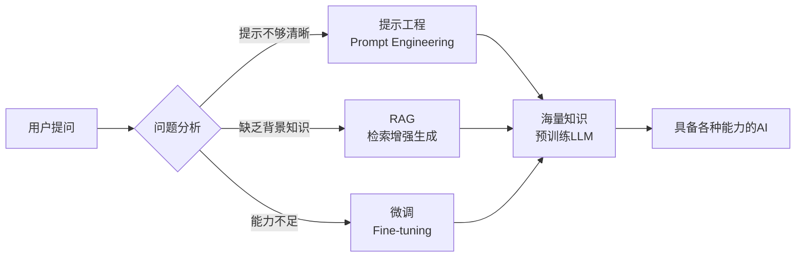
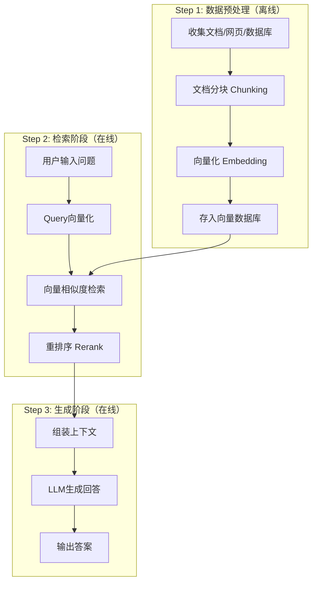
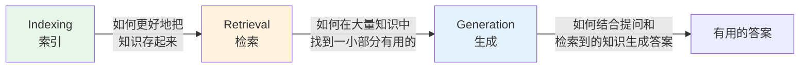
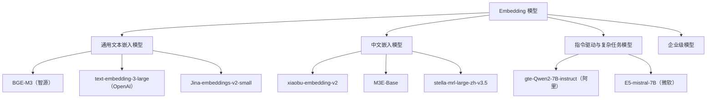
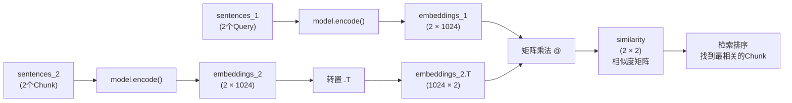
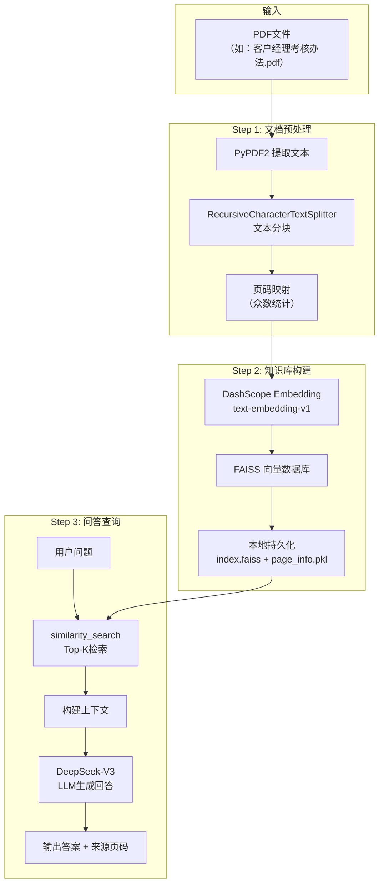
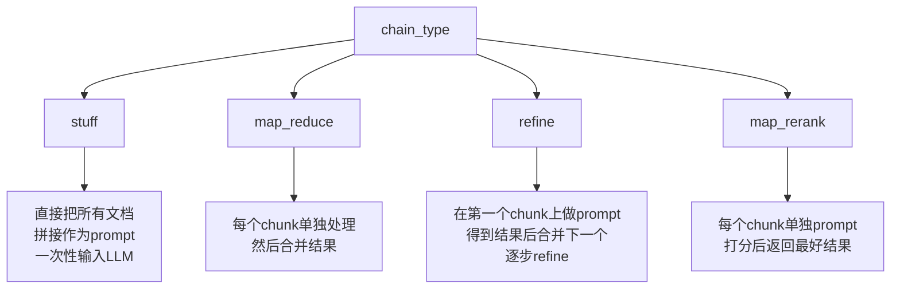
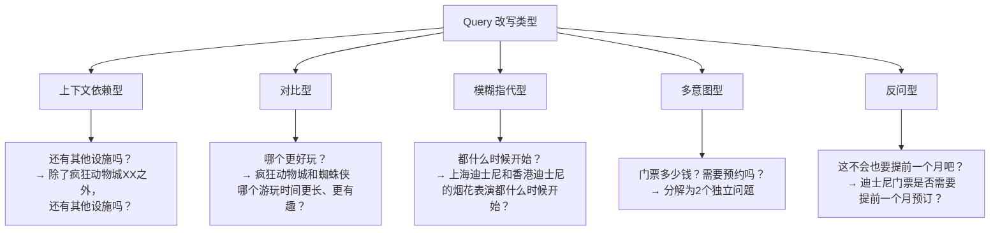
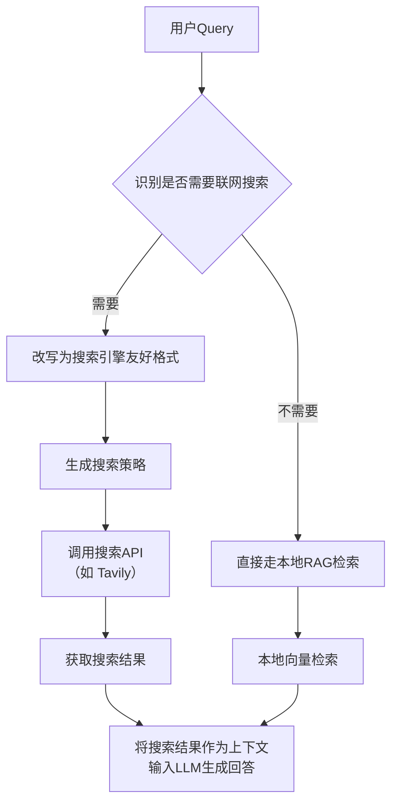

<!-- more -->

## 1. 大模型应用开发的三种模式

在AI大模型应用开发中，有三种主要的技术路线：**提示工程**、**RAG** 和 **微调**。



| 模式         | 适用场景           | 核心思想                           |
| ------------ | ------------------ | ---------------------------------- |
| **提示工程** | 没问清楚、提示不够 | 优化输入提示，让模型更好地理解意图 |
| **RAG**      | 缺乏背景知识       | 检索外部知识库，增强上下文         |
| **微调**     | 模型能力不足       | 用领域数据训练模型，提升专业能力   |

---

## 2. RAG 核心原理与流程

### 2.1 什么是 RAG？

**RAG（Retrieval-Augmented Generation）** = 检索增强生成

- 一种结合**信息检索（Retrieval）**和**文本生成（Generation）**的技术
- 通过实时检索相关文档或信息，并将其作为上下文输入到生成模型中
- 从而提高生成结果的**时效性**和**准确性**

### 2.2 RAG 的优势

| 优势                       | 说明                                                |
| -------------------------- | --------------------------------------------------- |
| 🕐 **解决知识时效性问题**   | 大模型训练数据是静态的，RAG可检索外部知识库实时更新 |
| 🎯 **减少模型幻觉**         | 引入外部知识，减少虚假或不准确内容的生成            |
| 🏥 **提升专业领域回答质量** | 结合垂直领域知识库，生成更具专业深度的回答          |

### 2.3 RAG 核心流程



**Step 1 — 数据预处理**

- **知识库构建**：收集并整理文档、网页、数据库等多源数据
- **文档分块**：将文档切分为适当大小的片段（Chunks），需要在语义完整性与检索效率之间取得平衡
- **向量化处理**：使用嵌入模型（如BGE、M3E等）将文本块转换为向量，存储在向量数据库中

**Step 2 — 检索阶段**

- **查询处理**：将用户问题转换为向量，在向量数据库中进行相似度检索
- **重排序（Rerank）**：对检索结果进行相关性排序，选择最相关的片段

**Step 3 — 生成阶段**

- **上下文组装**：将检索到的文本片段与用户问题结合
- **生成回答**：大语言模型基于增强的上下文生成最终回答

---

## 3. NativeRAG 三步骤

RAG的三个核心步骤可以概括为 **I-R-G**：



| 步骤     | 英文       | 核心问题                                               |
| -------- | ---------- | ------------------------------------------------------ |
| **索引** | Indexing   | 如何更好地把知识存起来                                 |
| **检索** | Retrieval  | 如何在大量知识中找到一小部分有用的，给到模型参考       |
| **生成** | Generation | 如何结合用户的提问和检索到的知识，让模型生成有用的答案 |

---

## 4. Embedding 模型选择

> 📊 完整榜单：https://huggingface.co/spaces/mteb/leaderboard （比较了1000多种语言中的100多种文本嵌入模型）

### 4.1 模型分类总览



### 4.2 常见 Embedding 模型对比

| 模型                         | 机构       | 特点                                                         | 适用场景                    | 文件大小 |
| ---------------------------- | ---------- | ------------------------------------------------------------ | --------------------------- | -------- |
| **BGE-M3**                   | 智源研究院 | 支持100+语言，输入长度8192 tokens，融合密集/稀疏/多向量混合检索 | 跨语言长文档检索、高精度RAG | 2.3G     |
| **text-embedding-3-large**   | OpenAI     | 向量维度3072，长文本语义捕捉能力强                           | 英文内容优先的全球化应用    | -        |
| **Jina-embeddings-v2-small** | Jina AI    | 参数量仅35M，RT<50ms                                         | 轻量级文本处理、实时推理    | -        |
| **xiaobu-embedding-v2**      | -          | 针对中文语义优化                                             | 中文文本分类、语义检索      | -        |
| **M3E-Base**                 | -          | 针对中文优化的轻量模型                                       | 中文法律、医疗领域检索      | 0.4G     |
| **gte-Qwen2-7B-instruct**    | 阿里巴巴   | 基于Qwen大模型微调，支持代码与文本跨模态检索                 | 复杂指令驱动任务、智能问答  | -        |
| **E5-mistral-7B**            | Microsoft  | 基于Mistral架构，Zero-shot表现优异                           | 动态调整语义密度的复杂系统  | -        |

---

## 5. CASE：BGE-M3 使用

### 5.1 代码实现

```python
# 模型下载
from modelscope import snapshot_download
model_dir = snapshot_download('BAAI/bge-m3', cache_dir='/root/autodl-tmp/models')

# 使用 BGE-M3 进行文本编码和相似度计算
from FlagEmbedding import BGEM3FlagModel

model = BGEM3FlagModel('/root/autodl-tmp/models/BAAI/bge-m3',  
                       use_fp16=True)  # 使用FP16加速计算

# 定义查询和文档
sentences_1 = ["What is BGE M3?", "Defination of BM25"]  # Query
sentences_2 = [
    "BGE M3 is an embedding model supporting dense retrieval, lexical matching and multi-vector interaction.", 
    "BM25 is a bag-of-words retrieval function that ranks a set of documents based on the query terms appearing in each document"
]  # Chunk

# 编码为向量
embeddings_1 = model.encode(sentences_1, 
                            batch_size=12, 
                            max_length=8192,
                            )['dense_vecs']
embeddings_2 = model.encode(sentences_2)['dense_vecs']

# 计算相似度矩阵
similarity = embeddings_1 @ embeddings_2.T
print(similarity)
# [[0.6265, 0.3477],
#  [0.3499, 0.678 ]]
```

### 5.2 Embedding 矩阵乘法详解

`similarity = embeddings_1 @ embeddings_2.T` 这行代码的核心逻辑：



**维度变化：**

- `embeddings_1` 形状: `(2, 1024)` — 2个query，每个1024维
- `embeddings_2` 形状: `(2, 1024)` — 2个chunk，每个1024维
- `embeddings_2.T` 形状: `(1024, 2)` — 转置后
- 矩阵乘法: `(2, 1024) @ (1024, 2) = (2, 2)` — 结果是相似度矩阵

**计算公式：**

```
similarity[i, j] = Σ(k=0 to 1023) embeddings_1[i, k] × embeddings_2[j, k]
```

**结果解读：**

|                                  | Chunk1: "BGE M3 is an embedding..." | Chunk2: "BM25 is a bag-of-words..." |
| -------------------------------- | ----------------------------------- | ----------------------------------- |
| **Query1**: "What is BGE M3?"    | **0.6265** ✅ 高相关                 | 0.3477                              |
| **Query2**: "Defination of BM25" | 0.3499                              | **0.6780** ✅ 高相关                 |

> 💡 **关键理解**：矩阵乘法实际上是在计算所有query和chunk之间的成对相似度。向量点积的几何意义：`q · c = ||q|| × ||c|| × cos(θ)`，点积越大，夹角越小，相似度越高。

### 5.3 依赖环境

```
FlagEmbedding==1.3.5
modelscope==1.25.0
sentence_transformers==3.4.1
torch==2.7.0
```

---

## 6. CASE：GTE-Qwen2 使用

### 6.1 方式一：SentenceTransformer 封装调用

```python
from sentence_transformers import SentenceTransformer

model_dir = "/root/autodl-tmp/models/iic/gte_Qwen2-1___5B-instruct"
model = SentenceTransformer(model_dir, trust_remote_code=True)
model.max_seq_length = 8192

queries = [
    "how much protein should a female eat",
    "summit define",
]
documents = [
    "As a general guideline, the CDC's average requirement of protein for women ages 19 to 70 is 46 grams per day...",
    "Definition of summit for English Language Learners...",
]

# 使用 prompt_name="query" 对查询进行编码
query_embeddings = model.encode(queries, prompt_name="query")
document_embeddings = model.encode(documents)

scores = (query_embeddings @ document_embeddings.T) * 100
print(scores.tolist())
# [[78.50, 17.04], [14.92, 75.38]]
```

### 6.2 方式二：底层AutoModel调用

```python
import torch
import torch.nn.functional as F
from torch import Tensor
from modelscope import AutoTokenizer, AutoModel

def last_token_pool(last_hidden_states: Tensor,
                    attention_mask: Tensor) -> Tensor:
    """从最后的隐藏状态中提取每个序列的最后一个有效token的表示"""
    left_padding = (attention_mask[:, -1].sum() == attention_mask.shape[0])
    if left_padding:
        return last_hidden_states[:, -1]
    else:
        sequence_lengths = attention_mask.sum(dim=1) - 1
        batch_size = last_hidden_states.shape[0]
        return last_hidden_states[torch.arange(batch_size, 
            device=last_hidden_states.device), sequence_lengths]

def get_detailed_instruct(task_description: str, query: str) -> str:
    """将任务描述和查询组合成特定格式的指令"""
    return f'Instruct: {task_description}\nQuery: {query}'

# 任务描述
task = 'Given a web search query, retrieve relevant passages that answer the query'
queries = [
    get_detailed_instruct(task, 'how much protein should a female eat'),
    get_detailed_instruct(task, 'summit define')
]
documents = [
    "As a general guideline, the CDC's average requirement...",
    "Definition of summit for English Language Learners..."
]

input_texts = queries + documents

# 加载模型
model_dir = "/root/autodl-tmp/models/iic/gte_Qwen2-1___5B-instruct"
tokenizer = AutoTokenizer.from_pretrained(model_dir, trust_remote_code=True)
model = AutoModel.from_pretrained(model_dir, trust_remote_code=True)

max_length = 8192

# 分词处理
batch_dict = tokenizer(input_texts, max_length=max_length, 
    padding=True, truncation=True, return_tensors='pt')
outputs = model(**batch_dict)

# 提取最后一个token的表示
embeddings = last_token_pool(outputs.last_hidden_state, 
    batch_dict['attention_mask'])

# L2归一化
embeddings = F.normalize(embeddings, p=2, dim=1)

# 计算相似度
scores = (embeddings[:2] @ embeddings[2:].T) * 100
print(scores.tolist())
# [[78.50, 17.04], [14.92, 75.38]]
```

### 6.3 GTE-Qwen2 特点总结

- **指令优化**：经过大量指令-响应对训练，擅长理解和生成高质量文本
- **性能表现**：在文本生成、问答系统、文本分类、语义匹配等任务中表现优异
- **优势**：指令理解和执行能力强，多语言支持
- **局限**：计算资源需求较高

---

## 7. CASE：DeepSeek + FAISS 搭建本地知识库检索

### 7.1 项目架构



### 7.2 技术栈选择

| 组件           | 技术选型                    | 说明                  |
| -------------- | --------------------------- | --------------------- |
| **向量数据库** | FAISS                       | 高效的向量检索引擎    |
| **嵌入模型**   | DashScope text-embedding-v1 | 阿里云Embedding模型   |
| **大语言模型** | DeepSeek-V3                 | 通过DashScope API调用 |
| **文档处理**   | PyPDF2                      | PDF文本提取           |
| **Agent框架**  | LangChain                   | 问答链构建            |

### 7.3 完整代码实现

#### 7.3.1 PDF文本提取与页码映射

```python
from PyPDF2 import PdfReader
from typing import List, Tuple

def extract_text_with_page_numbers(pdf) -> Tuple[str, List[int]]:
    """
    从PDF中提取文本并记录每个字符对应的页码
    
    参数:
        pdf: PDF文件对象
    返回:
        text: 提取的文本内容
        char_page_mapping: 每个字符对应的页码列表
    """
    text = ""
    char_page_mapping = []

    for page_number, page in enumerate(pdf.pages, start=1):
        extracted_text = page.extract_text()
        if extracted_text:
            text += extracted_text
            # 为当前页面的每个字符记录页码
            char_page_mapping.extend([page_number] * len(extracted_text))
        else:
            print(f"No text found on page {page_number}.")

    return text, char_page_mapping
```

#### 7.3.2 文本分块与向量数据库构建

```python
from langchain_text_splitters import RecursiveCharacterTextSplitter
from langchain_community.embeddings import DashScopeEmbeddings
from langchain_community.vectorstores import FAISS
import pickle

def process_text_with_splitter(text: str, char_page_mapping: List[int], 
                                save_path: str = None) -> FAISS:
    """处理文本并创建向量存储"""
    
    # 创建文本分割器
    text_splitter = RecursiveCharacterTextSplitter(
        separators=["\n\n", "\n", ".", " ", ""],
        chunk_size=1000,      # 每块最大1000字符
        chunk_overlap=200,    # 块之间重叠200字符
        length_function=len,
        add_start_index=True, # 记录每个块在原文中的真实起始位置
    )

    # 切分文本
    docs = text_splitter.create_documents([text])
    print(f"文本被分割成 {len(docs)} 个块。")
    
    # 创建嵌入模型
    embeddings = DashScopeEmbeddings(
        model="text-embedding-v1",
        dashscope_api_key=DASHSCOPE_API_KEY,
    )
    
    # 按原文真实位置取该块覆盖的页码，再取众数
    page_info = {}
    for doc in docs:
        chunk_start = doc.metadata["start_index"]
        chunk_end = chunk_start + len(doc.page_content)
        chunk_pages = char_page_mapping[chunk_start:chunk_end]

        page_counts = {}
        for page in chunk_pages:
            page_counts[page] = page_counts.get(page, 0) + 1
        most_common_page = max(page_counts, key=page_counts.get)

        doc.metadata["page"] = most_common_page
        page_info[doc.page_content] = most_common_page

    # 从带页码 metadata 的 Document 创建知识库
    knowledgeBase = FAISS.from_documents(docs, embeddings)
    knowledgeBase.page_info = page_info
    
    # 保存到磁盘
    if save_path:
        os.makedirs(save_path, exist_ok=True)
        knowledgeBase.save_local(save_path)
        with open(os.path.join(save_path, "page_info.pkl"), "wb") as f:
            pickle.dump(page_info, f)
    
    return knowledgeBase
```

#### 7.3.3 问答查询

```python
from langchain_community.llms import Tongyi

llm = Tongyi(model_name="deepseek-v3", dashscope_api_key=DASHSCOPE_API_KEY)

query = "客户经理被投诉了，投诉一次扣多少分"

if query:
    # 执行相似度搜索
    docs = knowledgeBase.similarity_search(query, k=10)

    # 构建上下文
    context = "\n\n".join([doc.page_content for doc in docs])

    # 构建提示
    prompt = f"""根据以下上下文回答问题:

{context}

问题: {query}"""

    # 调用 LLM
    response = llm.invoke(prompt)
    print(response)
    
    # 显示来源页码
    unique_pages = set()
    for doc in docs:
        source_page = doc.metadata["page"]
        if source_page not in unique_pages:
            unique_pages.add(source_page)
            print(f"文本块页码: {source_page}")
```

### 7.4 文本分块参数说明

| 参数              | 值                             | 说明                                    |
| ----------------- | ------------------------------ | --------------------------------------- |
| `chunk_size`      | 1000                           | 每个文本块的最大字符数                  |
| `chunk_overlap`   | 200                            | 相邻块之间的重叠字符数（10%-20%）       |
| `separators`      | `["\n\n", "\n", ".", " ", ""]` | 分割符优先级：段落 → 句子 → 空格 → 字符 |
| `add_start_index` | True                           | 记录每个块在原文中的真实起始位置        |

> 💡 **关于 chunk_overlap**：由于基于规则切分容易出现"硬截断"的情况，使用冗余（overlap）可以减少语义不连贯的问题。overlap 一般设置为 chunk_size 的 10%-20%。

### 7.5 依赖环境

```
langchain_community==0.4.1
langchain_text_splitters==1.1.0
PyPDF2==3.0.1
```

---

## 8. LangChain 问答链

LangChain 问答链中的 4 种 `chain_type`：



| chain_type     | 策略           | 适用场景                       | 特点                            |
| -------------- | -------------- | ------------------------------ | ------------------------------- |
| **stuff**      | 直接拼接       | 文档拆分较小，一次获取文档较少 | 调用LLM次数最少，优先使用       |
| **map_reduce** | 分别处理再合并 | 文档较多，需要并发处理         | 每个文档之间缺少上下文          |
| **refine**     | 逐步优化       | 需要保留部分上下文             | 能部分保留上下文，token使用可控 |
| **map_rerank** | 打分排序       | 需要从多个文档中选最优         | 大量调用LLM，每个文档独立处理   |

```python
from langchain.chains.question_answering import load_qa_chain

# 使用 stuff 策略（推荐）
chain = load_qa_chain(llm, chain_type="stuff")
input_data = {"input_documents": docs, "question": query}
response = chain.invoke(input=input_data)
```

---

## 9. Query 改写

### 9.1 为什么需要 Query 改写？

RAG 的核心在于"检索→生成"。如果第一步"检索"就走偏了，后续的"生成"质量也会降低。

用户的问题往往是**口语化的、承接上下文的、模糊的**，而知识库里的文本通常是**陈述性的、客观的**。

=> 需要一个**"翻译官"**的角色，将用户的"口语化查询"转换成"书面化、精确的检索语句"

### 9.2 Query 改写类型总览



### 9.3 各类型改写示例

#### 上下文依赖型

```python
instruction = """
你是一个智能的查询优化助手。请分析用户的当前问题以及前序对话历史，
判断当前问题是否依赖于上下文。如果依赖，请将当前问题改写成一个独立的、
包含所有必要上下文信息的完整问题。如果不依赖，直接返回原问题。
"""
```

> **示例**：
>
> - 对话历史：用户问了"疯狂动物城"园区的设施
> - 当前查询：`还有其他设施吗？`
> - 改写结果：`除了疯狂动物城警察局、朱迪警官训练营和尼克狐的冰淇淋店之外，疯狂动物城园区还有其他设施吗？`

#### 对比型

```python
instruction = """
你是一个查询分析专家。请分析用户的输入和相关的对话上下文，识别出问题中
需要进行比较的多个对象。然后，将原始问题改写成一个更明确、更适合在知识库中
检索的对比性查询。
"""
```

> **示例**：
>
> - 当前查询：`哪个游玩的时间比较长，比较有趣`
> - 改写结果：`哪个游玩时间更长、更有趣：上海迪士尼乐园的疯狂动物城主题园区和蜘蛛侠主题园区？`

#### 模糊指代型

```python
instruction = """
你是一个消除语言歧义的专家。请分析用户的当前问题和对话历史，找出问题中
"都"、"它"、"这个"等模糊指代词具体指向的对象。然后，将这些指代词替换为
明确的对象名称，生成一个清晰、无歧义的新问题。
"""
```

> **示例**：
>
> - 当前查询：`都什么时候开始？`
> - 改写结果：`上海迪士尼乐园和香港迪士尼乐园的烟花表演都什么时候开始？`

#### 多意图型

```python
instruction = """
你是一个任务分解机器人。请将用户的复杂问题分解成多个独立的、可以单独回答
的简单问题。以JSON数组格式输出。
"""
```

> **示例**：
>
> - 原始查询：`门票多少钱？需要提前预约吗？停车费怎么收？`
> - 分解结果：`['门票多少钱？', '需要提前预约吗？', '停车费怎么收？']`

#### 反问型

```python
instruction = """
你是一个沟通理解大师。请分析用户的反问或带有情绪的陈述，识别其背后真实的
意图和问题。然后，将这个反问改写成一个中立、客观、可以直接用于知识库检索的问题。
"""
```

> **示例**：
>
> - 当前查询：`这不会也要提前一个月预订吧？`
> - 改写结果：`迪士尼乐园门票是否需要提前一个月预订？`

### 9.4 自动意图识别

```python
instruction = """
你是一个智能的查询分析专家。请分析用户的查询，识别其属于以下哪种类型：
1. 上下文依赖型 - 包含"还有"、"其他"等需要上下文理解的词汇
2. 对比型 - 包含"哪个"、"比较"、"更"等比较词汇
3. 模糊指代型 - 包含"它"、"他们"、"都"、"这个"等指代词
4. 多意图型 - 包含多个独立问题，用"、"或"？"分隔
5. 反问型 - 包含"不会"、"难道"等反问语气

请返回JSON格式：
{
    "query_type": "查询类型",
    "rewritten_query": "改写后的查询",
    "confidence": "置信度(0-1)"
}
"""
```

| 原始查询                 | 识别类型     | 改写结果                                           | 置信度 |
| ------------------------ | ------------ | -------------------------------------------------- | ------ |
| 还有其他游乐项目吗？     | 上下文依赖型 | 除了之前提到的游乐项目之外，还有哪些其他游乐项目？ | 0.95   |
| 哪个园区更好玩？         | 模糊指代型   | 哪个园区更好玩？（请明确是哪些园区）               | 0.95   |
| 都适合小朋友吗？         | 模糊指代型   | 哪些产品或活动适合小朋友？                         | 0.95   |
| 有什么餐厅？价格怎么样？ | 多意图型     | 有哪些餐厅？这些餐厅的价格怎么样？                 | 0.95   |
| 这不会也要排队两小时吧？ | 反问型       | 这需要排队两小时吗？                               | 0.95   |

---

## 10. Query 联网搜索

### 10.1 为什么需要联网搜索？

以迪士尼RAG助手为例，某些类型的Query需要联网获取实时信息：

| 类型         | 关键词特征                   | 示例查询                   | 原因说明                   |
| ------------ | ---------------------------- | -------------------------- | -------------------------- |
| **时效性**   | 最新、今天、现在、实时       | 上海迪士尼乐园今天开放吗？ | 需获取当前时间的最新信息   |
| **价格信息** | 多少钱、价格、费用、票价     | 下周六的门票多少钱？       | 价格信息经常变动           |
| **营业信息** | 营业时间、开放时间、是否开放 | 迪士尼乐园现在开门吗？     | 营业状态可能因特殊情况调整 |
| **活动信息** | 活动、表演、演出、节日       | 最近有什么特别活动？       | 活动信息具有时效性         |
| **天气信息** | 天气、下雨、温度             | 明天去迪士尼天气怎么样？   | 需要实时获取               |
| **交通信息** | 怎么去、交通、地铁           | 从浦东机场怎么去迪士尼？   | 可能因施工等变化           |
| **预订信息** | 预订、预约、购票             | 需要提前多久预订？         | 预订政策可能随时调整       |
| **实时状态** | 排队、拥挤、人流量           | 现在人多不多？             | 需即时获取                 |

### 10.2 联网搜索处理流程



### 10.3 核心功能实现

#### 功能1：识别是否需要联网搜索

```python
def identify_web_search_needs(query, conversation_history):
    """识别查询是否需要联网搜索"""
    instruction = """
    你是一个智能的查询分析专家。请分析用户的查询，判断是否需要联网搜索。
    
    需要联网搜索的情况包括：
    1. 时效性信息 - 包含"最新"、"今天"、"现在"等时间相关词汇
    2. 价格信息 - 包含"多少钱"、"价格"、"费用"等价格相关词汇
    3. 营业信息 - 包含"营业时间"、"开放时间"等营业状态
    4. 活动信息 - 包含"活动"、"表演"、"演出"等动态信息
    5. 天气信息 - 包含"天气"、"下雨"、"温度"等天气相关
    6. 交通信息 - 包含"怎么去"、"交通"等交通方式
    7. 预订信息 - 包含"预订"、"预约"、"购票"等预订相关
    8. 实时状态 - 包含"排队"、"拥挤"、"人流量"等实时状态
    
    请返回JSON格式：
    {
        "need_web_search": true/false,
        "search_reason": "需要搜索的原因",
        "confidence": "置信度(0-1)"
    }
    """
    # ... 调用LLM获取结果
```

#### 功能2：为联网搜索改写查询

```python
def rewrite_for_web_search(query, search_type="general"):
    """为联网搜索改写查询"""
    instruction = """
    你是一个专业的搜索查询优化专家。请将用户的查询改写为更适合搜索引擎检索的形式。
    
    改写技巧：
    1. 添加具体地点 - 如"上海迪士尼乐园"
    2. 添加时间范围 - 如"2024年"、"今天"
    3. 使用关键词组合 - 将长句拆分为关键词
    4. 添加搜索意图 - 明确搜索目的
    5. 去除口语化表达 - 转换为标准搜索词
    6. 添加相关词汇 - 增加同义词或相关词
    
    请返回JSON格式：
    {
        "rewritten_query": "改写后的搜索查询",
        "search_keywords": ["关键词1", "关键词2"],
        "search_intent": "搜索意图",
        "suggested_sources": ["建议搜索的网站类型"]
    }
    """
    # ... 调用LLM获取结果
```

#### 功能3：生成搜索策略

```python
def generate_search_strategy(query, search_type="general"):
    """生成搜索策略"""
    current_date = datetime.now().strftime("%Y年%m月%d日")
    instruction = f"""
    你是一个搜索策略专家。请为用户的查询制定详细的搜索策略。
    当前日期：{current_date}
    
    搜索策略包括：
    1. 主要搜索词 - 核心关键词
    2. 扩展搜索词 - 相关词汇和同义词
    3. 搜索网站 - 推荐的搜索平台
    4. 时间范围 - 具体的搜索时间范围
    """
    # ... 调用LLM获取结果
```

### 10.4 完整示例输出

**示例1：时效性信息查询**

```
当前查询: 上海迪士尼乐园今天开放吗？现在人多不多？
✓ 需要联网搜索
搜索原因: 查询上海迪士尼乐园今天是否开放属于营业信息，'现在人多不多'涉及实时状态
置信度: 0.98
改写查询: 上海迪士尼乐园2024年今天开放时间及人流情况
搜索关键词: ['上海迪士尼乐园', '开放时间', '2024年', '人流量', '游客数量']
搜索意图: 获取上海迪士尼乐园今日是否开放以及当前游客密度信息
建议来源: ['官方旅游网站', '携程/飞猪等旅游平台', '大众点评或美团用户评价']
```

**示例2：价格和预订信息查询**

```
当前查询: 下周六的门票多少钱？需要提前多久预订？
✓ 需要联网搜索
搜索原因: 查询下周六的门票价格和预订时间，涉及价格信息和预订信息
置信度: 0.98
改写查询: 下周六上海迪士尼乐园门票价格及预订时间要求
搜索关键词: ['下周六', '上海迪士尼乐园', '门票价格', '预订时间', '提前多久预订']
搜索意图: 获取特定日期的门票价格和预订政策信息
建议来源: ['官方网站', '旅游预订平台（如携程、飞猪）', '景点官方社交媒体账号']
```

### 10.5 Tavily MCP 搜索参数

如果后续使用 Tavily MCP 进行具体联网搜索，可以引导 LLM 生成以下参数：

| 参数名           | 类型   | 默认值    | 说明                                        |
| ---------------- | ------ | --------- | ------------------------------------------- |
| `query`          | string | -         | 搜索关键词                                  |
| `search_depth`   | string | "basic"   | 搜索深度："basic" 或 "advanced"             |
| `time_range`     | string | "week"    | 时间范围："day"/"week"/"month"/"year"/"all" |
| `max_results`    | int    | 5         | 最大返回结果数量                            |
| `include_images` | bool   | FALSE     | 是否包含图片                                |
| `include_answer` | bool   | FALSE     | 是否包含LLM生成的简短回答                   |
| `topic`          | string | "general" | 搜索主题："general" 或 "news"               |

---

## 附录

### A. 关键概念速查

| 概念           | 说明                                                 |
| -------------- | ---------------------------------------------------- |
| **Chunk**      | 知识的最小颗粒度，要放到向量数据库中的文本片段       |
| **Embedding**  | 将文本转换为高维向量的过程，用于表示文本的语义特征   |
| **向量数据库** | 存储Embedding向量的数据库，支持相似度检索（如FAISS） |
| **Tokenizer**  | LLM如何理解文字的（token map id），与Chunk、分词不同 |
| **jieba分词**  | 句子里面加空格，用于中文分词                         |
| **Rerank**     | 对检索结果进行重排序，使用精排模型打分               |
| **GraphRAG**   | 基于知识图谱的RAG增强方案                            |

### B. Chunk Size 选择建议

| 场景     | chunk_size | chunk_overlap | 说明                     |
| -------- | ---------- | ------------- | ------------------------ |
| 通用文档 | 800-1000   | 160-200       | 平衡语义完整性和检索效率 |
| 精细检索 | 300-500    | 30-100        | 适合需要精确匹配的场景   |
| 长文档   | 1000-1500  | 200-300       | 保留更多上下文           |

> 💡 chunk_overlap 一般设置为 chunk_size 的 **10%-20%**

### C. 常见问题

**Q：embedding模型更换了，向量数据库中的片段是否要重新录入？**
A：是的。不同Embedding模型生成的向量维度和语义空间不同，需要重新计算并导入新库。

**Q：RAG的数据能不能用于微调？**
A：可以。RAG检索到的高质量chunk可以作为微调的训练数据。

**Q：向量数据库和普通关系型数据库有什么区别？**
A：向量数据库专门用于相似度检索和模糊查询，而关系型数据库用于精确查询。

**Q：如果LLM可以处理无限上下文了，RAG还有意义吗？**
A：仍有意义。RAG在效率与成本、知识更新、可解释性、定制化、数据隐私等方面仍有优势。

