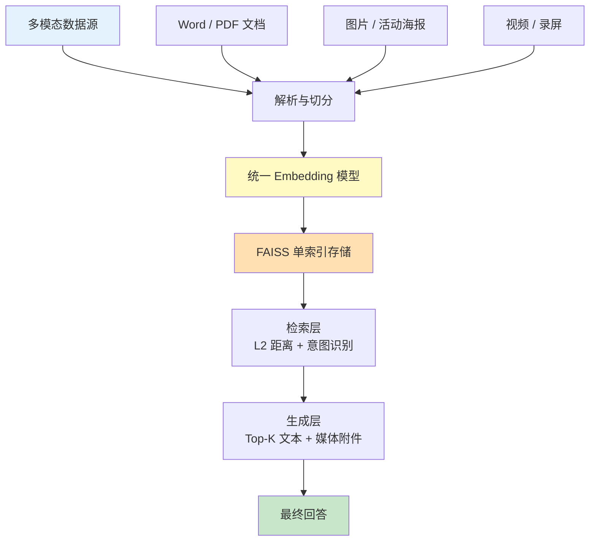
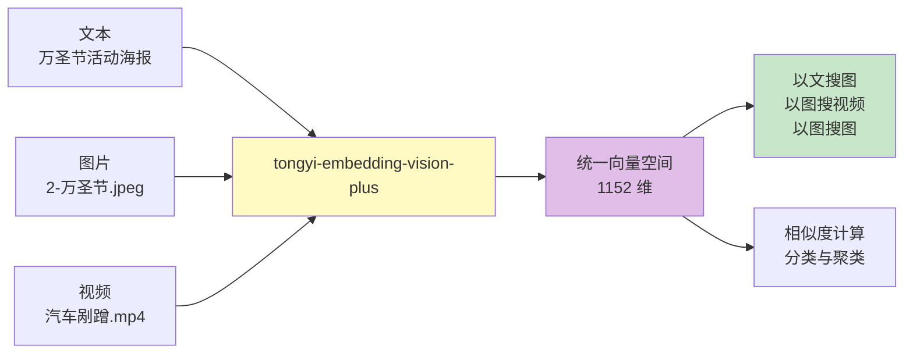
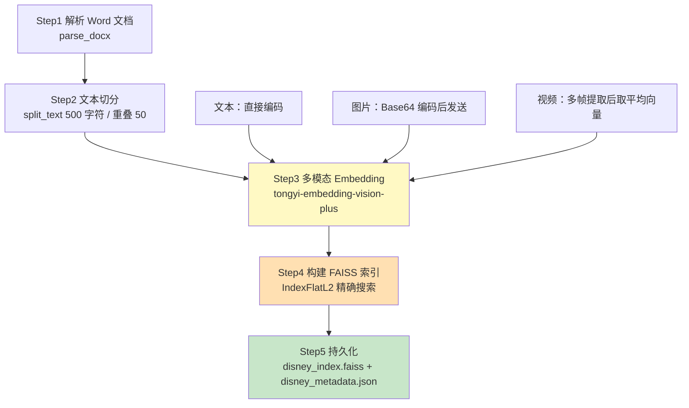
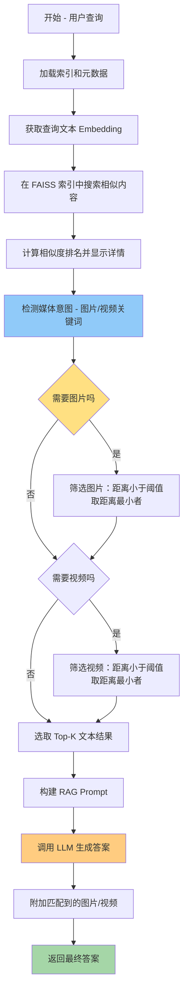
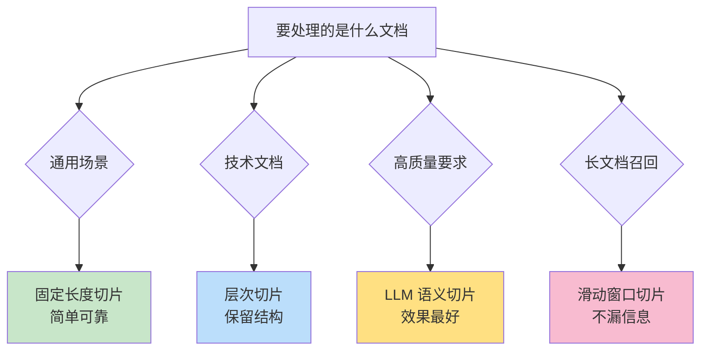
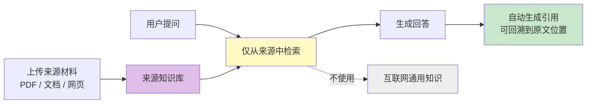

<!-- more -->

## RAG 多模态数据处理实战指南

传统 RAG 系统大多围绕纯文本构建：把文档切成片段、编码成向量、检索后拼进 Prompt。但真实业务里的知识往往是混合形态的——官方规定是 PDF，内部 FAQ 是 Word，活动介绍里有大量海报图片和表格，培训资料是视频。如果只处理文字，这些信息在入库的那一刻就被丢掉了，检索自然也就回答不了"最近万圣节的活动海报长什么样"或者"我的车被剐蹭了，你能看到视频吗"这类问题。

多模态 RAG 要解决的核心问题，是**让文本、图片、视频在同一个向量空间里可比较**。当一张万圣节海报和一句"万圣节活动海报"被编码得足够接近时，"以文搜图"就不再是额外的工程，而是同一次相似度计算的自然结果。

本文围绕两条主线展开：前半部分是 Gemini 的多模态理解能力与通义多模态 Embedding 的使用，后半部分是一个完整的迪士尼 RAG 助手实战，最后补齐切片策略与 NotebookLM 两个主题。文中代码与运行结果均取自课程课件与配套 Notebook，按原样整理。

### 多模态 RAG 的整体结构

一个多模态 RAG 系统可以拆成数据层、向量化层、索引存储层、检索层和生成层五段。关键点在于向量化层：文本、图片、视频走的是同一个 Embedding 模型，产出维度一致的向量，因此后续只需要维护一份索引。



这套结构带来的直接好处是：索引只有一份，新增一种模态不需要额外的检索通道；代价是对 Embedding 模型的要求更高，它必须在同一个语义空间里同时"读懂"一句话和一张图。

### Gemini 的多模态处理

#### 多模态能力概览

Gemini 的多模态是"原生统一架构"：从预训练开始就把文本、图像、音频、视频、PDF、代码放在同一表征空间里学习，而不是先训一个大语言模型再外挂视觉或语音模块。因此信息损耗更小，时序和细节保留更完整。

它有几个比较关键的能力特征：

- **端到端推理**：同一组 Transformer 参数直接处理任意组合的输入。给它一张 CT 影像加一段病历文本，可以同步给出诊断建议；给它一段手写食谱视频，可以直接转成可分享的数字菜谱。
- **上下文规模**：Gemini 3 Pro 支持 100 万 token 的长窗口，可一次性读入 1 小时视频或 700 页 PDF，再输出 6.4 万 token 的结构化报告。
- **生成能力**：不仅能"看"和"听"，还能"画"和"说"，包括文本生成图像、图像编辑、褪色修复、3D 模型输出，以及流式生成音频实现边看边解说。

课件里还提到了用于方案配图的 Nano Banana（正式名称对应 Gemini 3.0 Pro Image）。它在写实感、文字渲染、角色一致性和世界知识几个维度上表现突出，其中"能在图片里把字写对"和"同一角色跨场景保持一致"是过去图像模型比较薄弱的地方。日常汇报中常见的四种配图风格可以总结为：

| 风格       | 提示要点                                               | 适用场景           |
| ---------- | ------------------------------------------------------ | ------------------ |
| 白板书     | 图表、箭头、方框、多色笔迹、中文说明                   | 讲解原理与逻辑     |
| 视觉笔记   | Moleskine 点阵纸、黑色中性笔、黄粉马克笔高亮           | 知识梳理与读书笔记 |
| 未来科技风 | 深蓝黑背景、霓虹青橙发光线条、HUD 界面、模块化数据方框 | 数据大屏、方案封面 |
| 3D 黏土风  | 轴测视图、C4D/Blender 渲染、黏土材质、哑光深灰背景     | 场景化的概念示意   |

#### 环境准备与 API 调用

使用 Gemini API 只需要两步：在 `aistudio.google.com/app/api-keys` 申请 API Key，然后把 `GEMINI_API_KEY` 和 `GOOGLE_API_KEY` 配到环境变量里。

文本调用是最基础的形式，`contents` 直接传入字符串：

```python
from google import genai

client = genai.Client()
# 文字输出
response = client.models.generate_content(
    model="gemini-3.8-flash",
    contents="用中文解释AI大模型是如何工作的",
)
print(response.text)
```

图像理解的变化在于 `contents` 变成了一个列表，图片对象和文字指令同时放进去：

```python
from PIL import Image

# 图像理解
image = Image.open("dog_and_girl.jpeg")
# 注意：contents 变成了一个列表，里面同时放了图片对象和文字
response = client.models.generate_content(
    model="gemini-3.8-flash",
    contents=[image, "帮我解释下这张照片"]
)
print(response.text)
```

视频理解要额外处理一次"等待转码"的流程。视频上传到云端后 Google 需要几秒钟转码，必须轮询文件状态直到就绪，否则推理会拿到一个还在处理中的句柄：

```python
import time

# 1. 上传视频文件
print("正在上传视频...")
video_file = client.files.upload(file="car.mp4")  # 汽车剐蹭视频
print(f"上传成功: {video_file.name}")

# 2. 等待视频处理 (关键步骤！)
# 视频上传后，Google 需要几秒钟在云端进行转码。
while video_file.state.name == "PROCESSING":
    print("视频处理中，请稍候...")
    time.sleep(2)
    video_file = client.files.get(name=video_file.name)

if video_file.state.name == "FAILED":
    raise ValueError("视频处理失败")

print("视频就绪，开始推理...")

# 3. 多模态推理
response = client.models.generate_content(
    model="gemini-3.8-flash",
    contents=[
        video_file,
        "详细描述视频里发生了什么？如果有对话，请把关键对话提取出来。"
    ]
)
print(response.text)
```

#### 运行结果

文本任务上，模型把大模型的工作机制拆成了"分词与向量化 → 注意力机制 → 训练三部曲 → 推理生成"四段，其中对推理阶段的描述很直观：

> 当你现在向AI提问："番茄炒蛋先放什么？"时，它在后台是这样工作的：理解你的问题、计算接下来所有可能的汉字中哪个概率最高、选出概率最高的"先"、把它接回输入后面继续算下一个字……一个字一个字地吐出来，直到输出一个代表"停止"的特殊符号。

图像任务上，模型识别出了"黄金时刻"的侧逆光和低机位构图：

> 照片拍摄于日落或清晨时分。低角度的阳光从右侧照过来（侧逆光），在女孩的头发、肩膀和地面的沙粒上勾勒出一层金色的光晕（轮廓光），画面边缘泛着柔和的光斑，极具电影感。

视频任务上，模型不仅描述了车损和事故现场，还准确抽取了对话：

```
正在上传视频...
上传成功: files/l3dok1krkuf6
视频处理中，请稍候...
视频处理中，请稍候...
视频就绪，开始推理...
```

> **女方**："老公你说咱们这走保险呀，还是自己修呀？"
> **男方**："咱们没有车损险，咱们只能自己修了。"

#### 与 DeepSeek 的实现差异

课件里同时给出了 DeepSeek 的多模态方案，两者在接口风格和模态支持范围上有明显区别。

DeepSeek 走 OpenAI 兼容接口，模型名是 `deepseek-flash`，`base_url` 指向 `https://api.deepseek.com`：

```python
import base64
import os
from openai import OpenAI

# DeepSeek-V4.1-Flash 的官方调用名是 deepseek-flash
MODEL = "deepseek-flash"

client = OpenAI(
    api_key=os.environ["DEEPSEEK_API_KEY"],
    base_url="https://api.deepseek.com",
)
```

图片输入需要自己转成 data URL：

```python
# 图像理解：本地图片转成 data URL 后和文字一起放入 content 列表
with open("dog_and_girl.jpeg", "rb") as f:
    image_b64 = base64.b64encode(f.read()).decode("utf-8")

response = client.chat.completions.create(
    model=MODEL,
    messages=[
        {
            "role": "user",
            "content": [
                {"type": "image_url", "image_url": {"url": f"data:image/jpeg;base64,{image_b64}"}},
                {"type": "text", "text": "帮我解释下这张照片"},
            ],
        }
    ],
)
```

最关键的一条限制是：**DeepSeek 只支持图片多模态，不能像 Gemini 那样直接上传 mp4**。想要理解视频，只能自己从视频里均匀抽帧，再按图片理解的方式送给模型：

```python
# DeepSeek 只支持图片多模态，不能像 Gemini 那样直接上传 mp4。
# 这里从视频里均匀抽帧，再按图片理解的方式送给模型。
import cv2

video_path = "car.mp4"
frame_num = 6

cap = cv2.VideoCapture(video_path)
total = int(cap.get(cv2.CAP_PROP_FRAME_COUNT))
indexes = [int(i * (total - 1) / (frame_num - 1)) for i in range(frame_num)]
content = [{"type": "text", "text": "详细描述视频里发生了什么？如果有对话，请把关键对话提取出来。"}]

for idx in indexes:
    cap.set(cv2.CAP_PROP_POS_FRAMES, idx)
    ok, frame = cap.read()
    ok, buf = cv2.imencode(".jpg", frame)
    frame_b64 = base64.b64encode(buf.tobytes()).decode("utf-8")
    content.append({"type": "image_url", "image_url": {"url": f"data:image/jpeg;base64,{frame_b64}"}})
cap.release()
```

抽帧方案的效果并不差，同样识别出了车损位置和"没有车损险"这个关键信息：

```
正在从视频抽帧...
抽帧完成，共 6 帧，开始推理...
```

> 车辆右后侧轮胎和轮眉处的受损情况。黑色轮眉和轮胎侧壁上有明显的白色摩擦痕迹……车主站在一面有明显掉漆、破损的承重墙或柱子旁，指着墙面，表明这里是事故的发生地点。

两种路线的取舍很清楚：Gemini 的"原生视频输入"省去了抽帧逻辑，保留时序信息更完整；DeepSeek 的"抽帧 + 图片理解"实现成本更低，但会丢失帧间动态，遇到快速运动或依赖连续画面的场景就会吃力。

### 多模态 Embedding 与统一向量空间

#### 模型选型

方案一用的是"文本用 text-embedding、图像用 CLIP"的双模型组合；方案二则统一采用多模态向量模型，把文本、图像或视频转换成**同一个维度的浮点数向量**。方案二的好处是跨模态检索、语义相似度计算、内容聚类都可以在单空间里完成，不必再做向量对齐。

课件给出的备选模型对比如下：

| 模型名称                      | 向量维度                | 文本长度限制 | 图片限制      | 视频限制 | 单价（每千输入 Token）              |
| ----------------------------- | ----------------------- | ------------ | ------------- | -------- | ----------------------------------- |
| qwen2.5-vl-embedding          | 2048 / 1024 / 768 / 512 | 32,000 Token | ≤ 5MB，1 张   | ≤ 50MB   | 图片/视频 0.0018 元；文本 0.0007 元 |
| tongyi-embedding-vision-plus  | 1152                    | 1,024 Token  | ≤ 3MB，≤ 8 张 | ≤ 10MB   | 0.0005 元                           |
| tongyi-embedding-vision-flash | 768                     | 1,024 Token  | ≤ 3MB，≤ 8 张 | ≤ 10MB   | 0.00015 元                          |
| multimodal-embedding-v1       | 1024                    | 512 Token    | ≤ 3MB，1 张   | ≤ 10MB   | 图片/视频 0.0009 元；文本 0.0007 元 |

迪士尼案例选的是 `tongyi-embedding-vision-plus`，输出 1152 维。这个数字很关键：后面 FAISS 索引的维度、文本与图片向量能否直接做点积，都取决于它。

#### 三种模态的调用方式

文本最简单，直接放进 `input` 的 `text` 字段：

```python
import dashscope
from http import HTTPStatus

text = "上海迪士尼乐园门票分为一日票、两日票和特定日票三种类型。一日票可在购买时选定日期使用，价格根据季节浮动，平日成人票475元起"
input = [{'text': text}]

resp = dashscope.MultiModalEmbedding.call(
    model="tongyi-embedding-vision-plus",
    input=input
)
```

图片需要先转成 Base64 的 data URL，格式是 `data:image/{格式};base64,{内容}`：

```python
import base64

image_path = "./disney_knowledge_base/images/1-聚在一起说奇妙.jpg"
with open(image_path, "rb") as image_file:
    base64_image = base64.b64encode(image_file.read()).decode('utf-8')

image_format = "jpg"
image_data = f"data:image/{image_format};base64,{base64_image}"
input = [{'image': image_data}]
```

视频有一个硬性限制：**只支持以 URL 形式传入，不支持直接传本地文件**，所以视频必须先上传到可公网访问的对象存储：

```python
# 多模态向量化模型目前仅支持以URL形式输入视频文件，暂不支持直接传入本地视频。
video = "https://dataset-1255932437.cos.ap-nanjing.myqcloud.com/mp4/car.mp4"
input = [{'video': video}]

resp = dashscope.MultiModalEmbedding.call(
    model="tongyi-embedding-vision-plus",
    input=input
)
```

三次调用的返回结构一致，都是 `output.embeddings[0].embedding` 里的浮点数组。视频返回的可能是多帧向量，课件在入库时对多帧取平均，得到一个统一的视频向量。

#### 跨模态检索为什么成立

文本、图片、视频经同一个模型编码后落在同一语义空间，于是三件事变成了同一件事：



- **跨模态检索**：以文搜图、以图搜视频、以图搜图。
- **语义相似度计算**：在统一空间中衡量不同模态内容之间的语义接近程度。
- **内容分类与聚类**：基于语义向量做分组、打标和聚类分析。

这也解释了一个在案例中会反复出现的现象：一句"最近万圣节的活动海报是什么"和一张万圣节照片之间的距离，可能比它和某段门票规则文本之间的距离更小。

### 实战：迪士尼 RAG 助手

#### 目标与挑战

目标是给迪士尼做一个 7×24 小时在线的 AI 客服助手，需要满足三点：自动解答票务、入园须知、会员权益等高频问题以降低人工客服压力；确保所有回答都来自官方知识库，避免信息错误或过时；支持多模态查询，能理解并回应关于图片（如活动海报）的提问。

挑战集中在四处：

- **知识来源多样化**：知识库包含 PDF 格式的官方规定、Word 格式的内部 FAQ、网页公告，以及包含大量图片和表格的活动介绍文件。
- **非结构化数据处理**：如何有效提取并理解 PDF 和 Word 文档中的表格与图片信息。
- **知识的有效组织**：如何把海量零散的知识点切片并建立索引，确保检索准确。
- **答案有效性**：如何让最终答案严格基于检索到的内容，避免 LLM 幻觉。

技术选型上，文档处理用 PyMuPDF（PDF）+ python-docx（Word），Embedding 用通义的 `tongyi-embedding-vision-plus` 统一处理三种模态，向量检索用 FAISS，生成用 `qwen-flash`，流程编排不依赖 LangChain，直接调用底层 API。生产环境可以把 FAISS 换成 Milvus、ChromaDB 或 Elasticsearch，以获得完整的数据管理服务。

#### 数据层：多格式文档解析

Word 解析的关键思路是遍历 `doc.element.body` 里的所有元素，把段落和表格分开处理。表格会被转成 Markdown 格式，这样表格里的票务规则、价格区间在后续的 Embedding 里能保留结构信息：

```python
from docx import Document as DocxDocument

def parse_docx(file_path):
    """解析 DOCX 文件，提取全部文本"""
    doc = DocxDocument(file_path)
    all_text = []

    for element in doc.element.body:
        if element.tag.endswith('p'):
            paragraph_text = ""
            for run in element.findall('.//w:t', {'w': 'http://schemas.openxmlformats.org/wordprocessingml/2006/main'}):
                paragraph_text += run.text if run.text else ""
            if paragraph_text.strip():
                all_text.append(paragraph_text.strip())

        elif element.tag.endswith('tbl'):
            table = [t for t in doc.tables if t._element is element][0]
            if table.rows:
                md_table = []
                header = [cell.text.strip() for cell in table.rows[0].cells]
                md_table.append("| " + " | ".join(header) + " |")
                md_table.append("|" + "---|" * len(header))
                for row in table.rows[1:]:
                    row_data = [cell.text.strip() for cell in row.cells]
                    md_table.append("| " + " | ".join(row_data) + " |")
                all_text.append("\n".join(md_table))

    return "\n".join(all_text)
```

PDF 解析用 PyMuPDF 逐页读取，同时抽文本和图片。图片不会被丢弃，而是落盘保存并在元数据里记录路径，后续单独做图片 Embedding：

```python
import fitz
import os

def parse_pdf(file_path, image_dir):
    doc = fitz.open(file_path)
    content_chunks = []
    for page_num, page in enumerate(doc):
        # 提取文本
        text = page.get_text("text")
        content_chunks.append({"type": "text", "content": text, "page": page_num + 1})
        # 提取图片
        for img_index, img in enumerate(page.get_images(full=True)):
            xref = img[0]
            base_image = doc.extract_image(xref)
            image_bytes = base_image["image"]
            image_ext = base_image["ext"]
            image_path = os.path.join(image_dir, f"{os.path.basename(file_path)}_p{page_num+1}_{img_index}.{image_ext}")
            with open(image_path, "wb") as f:
                f.write(image_bytes)
            content_chunks.append({"type": "image", "path": image_path, "page": page_num + 1})
    return content_chunks
```

这里有一点值得强调：迪士尼案例里**图片并没有走 OCR**。早期思路是用 pytesseract 识别海报上的文字，但既然多模态 Embedding 本身就能理解图片语义，直接把图片编码进向量空间效果更好——OCR 只能拿到文字，而 Embedding 还能捕捉画面内容和风格，这正是"万圣节海报"能被检索到的原因。

#### 索引层：FAISS 构建

索引构建分成五步，从解析到持久化形成一条完整链路：



切分用的是固定长度，`chunk_size=500`、`overlap=50`：

```python
CHUNK_SIZE = 500    # 每个chunk的字符数
CHUNK_OVERLAP = 50  # chunk之间的重叠字符数

def split_text(text, chunk_size=CHUNK_SIZE, overlap=CHUNK_OVERLAP):
    """按固定长度切分文本"""
    chunks = []
    start = 0
    while start < len(text):
        end = start + chunk_size
        chunk = text[start:end]
        if chunk.strip():
            chunks.append(chunk.strip())
        start = end - overlap
    return chunks
```

索引用 `IndexFlatL2`，也就是 L2 距离（欧氏距离）的精确搜索。数据量不大时这是最简单也最可靠的选择，不需要近似索引带来的调参成本：

```python
import faiss
import numpy as np

dim = len(all_vectors[0])
print(f"向量维度: {dim}")

index = faiss.IndexFlatL2(dim)
index.add(np.array(all_vectors).astype('float32'))

faiss.write_index(index, INDEX_FILE)
with open(METADATA_FILE, 'w', encoding='utf-8') as f:
    json.dump(metadata_store, f, ensure_ascii=False, indent=2)
```

元数据与向量分开存储，FAISS 只负责向量检索，业务信息放在 JSON 里，通过数组下标一一对应：

```json
// 文本类型
{
  "id": 0,
  "source": "退票政策.docx",
  "type": "text",
  "content": "退票内容..."
}
// 图片类型
{
  "id": 10,
  "source": "图片: poster.jpg",
  "type": "image",
  "path": "images/poster.jpg",
  "content": "[图片] poster.jpg"
}
// 视频类型
{
  "id": 15,
  "source": "视频: 汽车剐蹭",
  "type": "video",
  "url": "https://...",
  "description": "汽车剐蹭视频"
}
```

入库过程的实际输出如下，可以清楚看到每个文档被切成了几个块、向量维度和最终的模态分布：

```
--- 构建多模态知识库 ---
切分参数: chunk_size=500, overlap=50
处理文档: 1-上海迪士尼门票规则.docx
文档长度: 1342 字符, 切分为3 个chunk
处理文档: 2-迪士尼老人票价规定.docx
文档长度: 879 字符, 切分为2 个chunk
处理文档: 3-迪士尼乐园游玩攻略清单.docx
文档长度: 641 字符, 切分为2 个chunk
处理文档: 4-上海迪士尼乐园酒店会员制度.docx
文档长度: 790 字符, 切分为2 个chunk
处理图片...
- 1-聚在一起说奇妙.jpg
- 2-万圣节.jpeg
处理视频...
- 汽车剐蹭视频
向量维度: 1152
索引已保存: disney_index.faiss
元数据已保存: disney_metadata.json
完成! 文本:9, 图片:2, 视频:1
```

9 条文本、2 张图片、1 段视频，共 12 条记录，全部落在同一个 1152 维索引里——这就是"统一索引"的具体形态。

#### 检索与生成层

查询流程比入库要精细一些，因为它额外承担了"意图识别"和"媒体筛选"两件事：



L2 距离不能直接当相似度用，代码用 `1 / (1 + distance)` 把它映射成 0 到 1 之间、越大越相似的分数：

```python
def distance_to_similarity(distance):
    """L2距离转相似度 (0-1之间，越大越相似)"""
    return 1 / (1 + distance)
```

意图识别走的是关键词匹配，图片和视频各维护一个关键词表。这套方法简单粗暴但足够有效，因为客服场景下的媒体请求往往有很明确的信号词：

```python
IMAGE_KEYWORDS = ["图片", "海报", "照片", "看看", "长什么样", "图"]
VIDEO_KEYWORDS = ["视频", "录像", "影片", "看一下", "播放"]
MEDIA_DISTANCE_THRESHOLD = 3.0  # 图片/视频匹配的距离阈值

def detect_media_intent(query):
    """检测query中是否包含图片/视频意图"""
    query_lower = query.lower()
    want_image = any(kw in query_lower for kw in IMAGE_KEYWORDS)
    want_video = any(kw in query_lower for kw in VIDEO_KEYWORDS)
    return want_image, want_video
```

筛选策略可以概括为四条：**文本优先**（文本结果无条件进入 Prompt，媒体只作附件补充）、**意图驱动**（只有检测到对应意图才触发媒体检索，避免无关媒体干扰）、**阈值过滤**（媒体距离必须小于 3.0 才被采纳）、**单索引统一检索**（一次查询返回所有类型，再按类型分流）。

```python
def rag_ask(query, index, metadata, k=3):
    results = search_with_details(query, index, metadata)

    # 检测媒体意图
    want_image, want_video = detect_media_intent(query)

    # 取top-k文本结果
    top_results = [r for r in results if r["metadata"]["type"] == "text"][:k]

    # 如果需要图片，找距离<3的图片中距离最小的Top1
    matched_image = None
    if want_image:
        image_results = [r for r in results if r["metadata"]["type"] == "image"
                         and r["distance"] < MEDIA_DISTANCE_THRESHOLD]
        if image_results:
            image_results.sort(key=lambda x: x["distance"])
            matched_image = image_results[0]
    # 视频同理……

    prompt = f"""你是一个迪士尼客服助手。请根据以下背景知识回答用户问题。

[背景知识]
{context_str}
[用户问题]
{query}
"""
    completion = client.chat.completions.create(
        model="qwen-flash",
        messages=[
            {"role": "system", "content": "你是一个迪士尼客服助手。"},
            {"role": "user", "content": prompt}
        ]
    )
```

#### 运行结果

**测试一：纯文本查询。** 问"我想了解一下迪士尼门票的退款流程"，意图检测为不需要图片和视频，最终选取 Top-3 文本构建 Prompt：

```
意图检测: 需要图片=False, 需要视频=False
选取Top-3文本构建Prompt:
- 章。储物柜分小型（60元/天）和大型（80元/天）两种，年卡用户享前两小时免费。童车租赁90元/天，... (相似度: 0.5489)
- 留位置和烟花预留位置。礼宾服务会在上海迪士尼度假区官方app和微信公众号有售，最早提前7天可购买，价... (相似度: 0.5474)
- 上海迪士尼门票规则 上海迪士尼乐园门票分为一日票、两日票和特定日票三种类型。一日票可在购买时选定日期... (相似度: 0.5283)
```

生成的答案结构完整，退改时间、特殊情况、未使用门票延期都覆盖到了：

> **退改时间限制**：若您计划更改或取消门票，需在**入园前至少48小时**操作，方可享受免费修改或退票。距离入园日**不足48小时**（即2天内），将无法办理退改，系统将视为已使用。
>
> **特殊情况处理**：如因突发疾病、意外事故等不可抗力情况导致无法入园，可提供**二级甲等及以上医院出具的诊断证明**，经核实后可申请退票。

**测试二：图片查询。** 问"最近万圣节的活动海报是什么"，检索排名前 8 条都是文本，万圣节图片排在第 8 位，相似度 0.3921、距离 1.5501。阈值判定通过，图片被选为附件：

```
7   7 [text ] 0.3936    1.5406  上海迪士尼乐园酒店会员制度首先迪士尼vip服务大致分为三种...
8   10 [image] 0.3921    1.5501  [图片] 2-万圣节.jpeg... <-- 图片
意图检测: 需要图片=True, 需要视频=False
  -> 匹配到图片: disney_knowledge_base\images\2-万圣节.jpeg (距离: 1.5501, 相似度: 0.3921)
```

注意这里的排名很有意思：图片在纯相似度上并不是第一名，但意图检测把它"捞"了出来。如果只取 Top-3，这张海报就会被彻底漏掉——这正是"统一检索 + 意图后筛选"相比"单纯 Top-K"的价值所在。

最终答案在文本回答之后附上了图片路径：

```
[相关图片]: disney_knowledge_base\images\2-万圣节.jpeg
```

**测试三：视频查询。** 问"我的汽车被剐蹭了，你能看到视频么？"，视频排在总榜第 4 位，距离 1.5424、相似度 0.3933，同样通过了 3.0 的阈值：

```
3    2 [text ] 0.4073    1.4552  章。储物柜分小型（60元/天）和大型（80元/天）两种...
4   11 [video] 0.3933    1.5424  [视频] 汽车剐蹭视频... <-- 视频
意图检测: 需要图片=False, 需要视频=True
  -> 匹配到视频: https://dataset-1255932437.cos.ap-nanjing.myqcloud.com/mp4/car.mp4 (距离: 1.5424, 相似度: 0.3933)
```

这个测试还暴露了纯 RAG 的一个典型问题：系统成功检索到了汽车剐蹭视频，但 LLM 的回答是"作为迪士尼客服助手，我无法查看或提供任何监控视频"，与检索结果脱节。原因是迪士尼知识库里并没有"如何处理车辆剐蹭"的文本知识，只有一段视频，而 Prompt 只把 Top-K 文本塞了进去。这说明**媒体被检索到，不等于媒体内容被模型理解**——如果希望模型真正基于视频作答，还需要把视频的描述或理解结果也转成文本进入上下文。

### 切片策略

切片质量直接决定检索上限：切得太碎会丢上下文，切得太大会稀释语义。课件对比了六种常用策略，并用同一段迪士尼门票文本做了实测。

#### 固定长度切片

按固定字符数切分，改进版会优先在句子边界断开，避免把句子拦腰截断。实现简单、速度快、长度统一，适合技术文档和批量处理场景。

```python
def improved_fixed_length_chunking(text, chunk_size=512, overlap=50):
    """改进的固定长度切片 - 在句子边界切分"""
    chunks = []
    start = 0
    while start < len(text):
        end = start + chunk_size
        # 尝试在句子边界切分
        if end < len(text):
            for i in range(end, max(start, end - 100), -1):
                if text[i] in '.!?。！？':
                    end = i + 1
                    break
        chunk = text[start:end]
        if len(chunk.strip()) > 0:
            chunks.append(chunk.strip())
        start = end - overlap
    return chunks
```

用 `chunk_size=300, overlap=50` 跑同一段文本，得到两个块（292 字符 + 80 字符），块 2 明显偏短。

#### 句子边界切片

按句号、问号、感叹号、换行等自然边界分句，再把句子合并到不超过上限。语义保持好、无重叠，但长度可能不均匀，适合自然语言文本和问答系统。

```python
import re

def semantic_chunking(text, max_chunk_size=512):
    """基于句子边界的切片 - 按句子分割"""
    sentences = re.split(r'[.!?。！？\n]+', text)
    chunks = []
    current_chunk = ""
    for sentence in sentences:
        sentence = sentence.strip()
        if not sentence:
            continue
        if len(current_chunk) + len(sentence) > max_chunk_size and current_chunk:
            chunks.append(current_chunk.strip())
            current_chunk = sentence
        else:
            current_chunk += " " + sentence if current_chunk else sentence
    if current_chunk.strip():
        chunks.append(current_chunk.strip())
    return chunks
```

实测两块为 287 字符和 29 字符，末尾那个 29 字符的块几乎是"碎片"，这是长度不均匀的直观体现。

#### LLM 语义切片

把切片任务交给 LLM，让它在理解内容的基础上选择分割点，同时满足长度约束。Prompt 要求模型返回 JSON 格式的切片列表：

```python
prompt = f"""
请将以下文本按照语义完整性进行切片，每个切片不超过{max_chunk_size}字符。
要求：
1. 保持语义完整性
2. 在自然的分割点切分
3. 返回JSON格式的切片列表，格式如下：
{{
  "chunks": [
    "第一个切片内容",
    "第二个切片内容",
    ...
  ]
}}
文本内容：
{text}
请返回JSON格式的切片列表：
"""
```

配套代码还做了两层容错：用正则剥离模型可能带上的 ``` 代码块标记，以及解析失败时用 `re.search(r'\{.*\}', ...)` 抢救 JSON。

实测把文本切成了 6 个语义块，长度分布为 57、56、71、50、54、30 字符——每个块都是一个完整的语义单元。它是效果最好的方案，但依赖模型调用，成本和延迟都更高，适合高质量要求和复杂语义结构的场景。

#### 层次切片

基于文档的标题、章节、段落结构切分，保留文档的逻辑层次。实现方式是定义各级标记，遇到更高级标题就开新块：

```python
hierarchy_markers = {
    'title1': ['# ', '标题1：', '一、', '1. '],
    'title2': ['## ', '标题2：', '二、', '2. '],
    'title3': ['### ', '标题3：', '三、', '3. '],
    'paragraph': ['\n\n', '\n']
}
```

实测得到 4 个块，长度 11、219、214、264 字符。块 1 只包含一行 `# 迪士尼乐园门票指南` 标题，这是可以接受的——标题本身就是一个强语义单元；块 2、3、4 分别对应"门票类型介绍""购票渠道与流程""入园须知"三章内容。它的前提是文档本身有标题结构，纯文本上没有意义。

#### 滑动窗口切片

固定窗口按步长向前滑动，窗口之间存在大量重叠。重叠机制保证上下文连续性、减少信息丢失、提高召回，代价是产生大量冗余内容。

```python
def sliding_window_chunking(text, window_size=512, step_size=256):
    """滑动窗口切片"""
    chunks = []
    for i in range(0, len(text), step_size):
        chunk = text[i:i + window_size]
        if len(chunk.strip()) > 0:
            chunks.append(chunk.strip())
    return chunks
```

用 `window_size=300, step_size=150` 实测得到 3 个块（299、173、23 字符），相邻块之间有一半内容重复。

#### 自适应切片

按段落切分，再按目标长度加容差决定是否合并，比固定长度更尊重段落边界：

```python
def adaptive_chunking(text, target_size=512, tolerance=0.2):
    """自适应切片 - 根据内容自适应调整"""
    paragraphs = text.split('\n\n')
    current_chunk = ""
    for paragraph in paragraphs:
        paragraph = paragraph.strip()
        if not paragraph:
            continue
        if len(current_chunk) + len(paragraph) > target_size * (1 + tolerance):
            if current_chunk.strip():
                chunks.append(current_chunk.strip())
            current_chunk = paragraph
        else:
            current_chunk += " " + paragraph if current_chunk else paragraph
    if current_chunk.strip():
        chunks.append(current_chunk.strip())
    return chunks
```

对比脚本里还有一个"智能自适应切片"，在段落基础上同时约束最小长度和最大长度，并在下一句过长时提前断块，试图兼顾语义完整与长度均匀。

#### 六种策略对比

课件给出的横向对比如下：

| 方法         | 核心思路                 | 重叠 | 长度均匀 | 语义完整 | 实现成本 | 适用场景                           | 不适用场景           |
| ------------ | ------------------------ | ---- | -------- | -------- | -------- | ---------------------------------- | -------------------- |
| 固定长度切片 | 按字符数切，句子边界优化 | 有   | 高       | 中       | 低       | 通用场景、批量处理、对长度有要求   | 语义敏感的问答场景   |
| 句子边界切片 | 按句号分句，再合并       | 无   | 低       | 高       | 低       | 自然语言文本、问答系统             | 长句子多的文档       |
| LLM 语义切片 | LLM 理解内容后切分       | 无   | 中       | 最高     | 高       | 高质量要求、复杂语义结构           | 大规模文档、成本敏感 |
| 层次切片     | 按标题/章节切分          | 无   | 低       | 高       | 中       | 结构化文档（手册、规范、API 文档） | 无标题的纯文本       |
| 滑动窗口切片 | 固定窗口滑动，大量重叠   | 大量 | 高       | 中       | 低       | 需要上下文连续、长文档召回         | 存储敏感、去重要求高 |

落到具体场景，选择其实很直接：



需要提醒的是，切片参数没有万能解。迪士尼案例里用的是 500 字符 / 50 重叠的固定长度方案，原因是知识库以短篇 FAQ 为主，块之间语义独立性较强；如果换成一份几百页的规范文档，层次切片或滑动窗口会更合适。

### NotebookLM 使用

#### 与通用 LLM 的区别

NotebookLM 是 Google 推出的基于来源（source-grounded）的知识助手，使用地址是 `notebooklm.google/`。它的容量约束如下：

- 每个 Notebook 最多 50 个文件，每个文件最多包含 50 万字或 200 兆字节的数据。
- 用户可以上传多达 2500 万字的文本来创建特定学习主题的笔记本。
- 它可以组织信息、总结关键事实、回答用户问题，并制作成播客。

它和通用 LLM 的根本差异在于**检索范围被严格限定在上传的材料内**：回答只从上传内容里检索信息，并且所有从材料中提取的内容都会自动生成引用。这两点组合起来，让事实核查变得非常容易——每个结论都能点回到原文位置。



#### 案例：三国演义助手与团体险助手

三国演义助手演示的是"把一部长篇材料变成可对话的知识体"。上传后，助手能把整段内容结构化地总结出来，从东汉末年腐败、黄巾起义，到刘关张结义、董卓乱政、孙坚与传国玉玺、吕布的悲剧、曹操崛起，最后落在"三国鼎立局面的形成"和主题思辨上：全书不只是讲战争与权谋，更是对人性、领导力和动荡时代生存之道的洞察。

团体险助手则更贴近日常办公场景。它可以对"平安产险团体险都有哪些险种"这类宽泛问题做逐条归纳，并且每条回答都保持了业务文档里的严谨表述，例如：

> **雇主责任险与团体意外伤害险、工伤保险有什么区别？** 雇主责任险是法定要求，保障范围更全面，涵盖职业病和误工费用；意外险则主要体现企业福利，没有法律强制性。雇主责任险可作为工伤保险的补充，承担工伤保险基金无法覆盖的部分，如停工留薪期间的工资和部分伤残补助金。

其余几条也覆盖了亚马逊卖家商业综合责任保险、企业团体综合意外险、施工保、财产一切险与基本险/综合险的区别、装修保等，恰好说明了这类助手最适合处理"条款密集、需要逐条准确引用"的材料。

#### 案例：肺癌分期助手

这是课件里最有说服力的一个案例，来自论文 *Application of NotebookLM, a Large Language Model with Retrieval-Augmented Generation, for Lung Cancer Staging*（2024，arXiv:2410.10869）。

研究思路是：把日本当前的肺癌分期指南总结成可靠外部知识（Reliable External Knowledge，REK）提供给 NotebookLM，再用 100 个虚构肺癌病例测试分期准确性，并与 GPT-4o 在有/无 REK 两种条件下做对比。判定标准是 T、N、M 三个因素全部正确才算分期正确；对 NotebookLM 还额外计算了检索准确性。

一个典型病例的分期过程展示了引用机制的价值：

> 在左下叶观察到一个直径为 2 厘米的实性成分肿瘤。该肿瘤侵犯了主支气管但未侵犯隆突。左侧纵隔淋巴结肿大。存在脊椎骨转移。

NotebookLM 给出的判断逐项带来源：

- **T2a**：肿瘤直径 2 厘米并侵犯主支气管。根据来源 ①，具有实性成分直径大于 3 厘米且小于或等于 5 厘米的肿瘤，或实性成分直径小于或等于 3 厘米但伴有主支气管受累的肿瘤符合 T2 标准；来源 ② 进一步指出，满足 T2 标准但大小不超过 3 厘米的肿瘤归类为 T2a。
- **N2**：病例表现为左侧纵隔淋巴结肿大。由于原发肿瘤位于左肺，这些纵隔淋巴结属于同侧。来源 ③ 指出，转移到同侧纵隔淋巴结的情况归类于 N2。
- **M1b**：病例中提到骨转移，表明存在肺外转移。来源 ④ 说明，单个肺外转移归类为 M1b。

结论部分写得很克制：以往使用传统 LLM（包括 GPT-4o）做肺癌分期的准确率不足以用于临床应用；NotebookLM 通过 RAG 技术仅基于提供的 REK 生成响应，避免了不相关信息的干扰；它能够清晰指出 REK 中的参考位置，使放射科医生可以轻松验证响应的正确性。这里最值得注意的是"可验证"这一点——在医疗这类高风险场景里，一个能追溯到出处但偶尔出错的答案，往往比一个流畅却无法溯源的答案更有实用价值。

### 总结与最佳实践

把全文的关键结论收拢成几条：

1. **统一向量空间是多模态 RAG 的地基。** 用同一个 Embedding 模型编码文本、图片、视频，只需维护一份索引，跨模态检索就是同一次相似度计算的自然结果。选型时优先确认模型是否同时支持三种模态，以及向量维度是否固定（迪士尼案例是 1152 维）。

2. **检索策略要"统一召回 + 分类型后筛选"。** 先用查询向量检索全部记录，再按类型分流：文本无条件取 Top-K，图片和视频只在意图命中且距离低于阈值时才作为附件。纯 Top-K 会漏掉排名靠后但实际上很关键的媒体，万圣节海报排在第 8 位就是例子。

3. **媒体被检索到不等于被理解。** 视频查询的测试里，系统检索到了剐蹭视频，LLM 却回答"无法查看监控"。如果希望模型基于媒体作答，需要把媒体的描述或理解结果转成文本一起放进上下文，或者让生成阶段真正接收媒体内容。

4. **切片策略跟着文档形态走，没有万能参数。** 结构化文档用层次切片，对质量极致追求用 LLM 语义切片，长文档召回用滑动窗口，通用批量处理用固定长度。参数（chunk size、overlap）需要在目标知识库上实测后再定。

5. **来源约束是可验证性的来源。** NotebookLM 的案例说明，把生成范围限定在可信外部知识内并强制输出引用，能显著降低幻觉并让答案可被专业用户核查。这一点在设计面向专业场景的 RAG 系统时值得借鉴：与其追求回答的流畅度，不如先保证每个结论都能点回原文。

6. **工程实现上不必迷信框架。** 迪士尼案例全程直接使用底层 API——PyMuPDF、python-docx、dashscope、FAISS、OpenAI 兼容接口，没有引入 LangChain。链路清晰、依赖少、可调试性强，对于这类规模的应用反而更稳妥。需要更完整的数据管理能力时，再把 FAISS 替换为 Milvus、ChromaDB 或 Elasticsearch 即可。