<!-- more -->


朴素 RAG 的流程可以用三个动作概括：Indexing、Retrieval、Generation。真正把 RAG 应用从 Demo 推到落地，难点几乎全部集中在"如何把知识存得更好"和"如何把有用的那一小撮知识找出来"这两件事上。本文将课件脉络与工作区中的四组可运行代码结合起来，梳理一条完整的调优路径。

工作区中的代码按主题分为三个目录：

| 目录              | 主题                                                     | 关键文件                                                     |
| ----------------- | -------------------------------------------------------- | ------------------------------------------------------------ |
| `CASE-知识库处理` | 入库前的问题生成与对话沉淀、入库后的健康度检查与版本管理 | `1-知识库问题生成与检索优化-BM25.py`、`2-对话知识沉淀.py`、`3-知识库健康度检查.py`、`4-知识库版本管理与性能比较.py` |
| `CASE-高效召回`   | 查询优化、混合检索、Rerank 精排                          | `chatpdf-faiss.py`、`1-MultiQueryRetriever使用.py`、`2-chatpdf-faiss-MultiQueryRetriever.py`、`3-chatpdf-faiss-HybridSearch.py`、`4-chatpdf-faiss-HybridSearch-Rerank.py` |
| `CASE-rerank`     | 重排序模型的直接调用与打分验证                           | `beg-reranker.py`、`gte-qwen2-使用1.py`                      |

### RAG 调优的三条主线

从不同维度拆解 RAG，可以得到三条互相独立又彼此支撑的优化主线：坚实地基（知识库处理）、精准雷达（高效召回）、全局视野（GraphRAG），再叠加智能决策（Agentic RAG）作为上层编排。

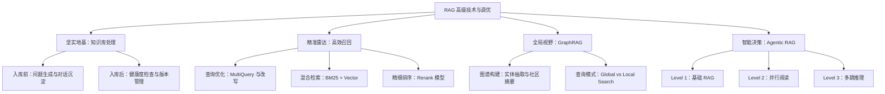
```mermaid
flowchart TD
    R["RAG 高级技术与调优"] --> A["坚实地基：知识库处理"]
    R --> B["精准雷达：高效召回"]
    R --> C["全局视野：GraphRAG"]
    R --> D["智能决策：Agentic RAG"]

    A --> A1["入库前：问题生成与对话沉淀"]
    A --> A2["入库后：健康度检查与版本管理"]

    B --> B1["查询优化：MultiQuery 与改写"]
    B --> B2["混合检索：BM25 + Vector"]
    B --> B3["精细排序：Rerank 模型"]

    C --> C1["图谱构建：实体抽取与社区摘要"]
    C --> C2["查询模式：Global vs Local Search"]

    D --> D1["Level 1：基础 RAG"]
    D --> D2["Level 2：并行阅读"]
    D --> D3["Level 3：多跳推理"]
```

## 坚实地基：知识库处理

知识库的质量决定了 RAG 系统的上限。这一部分围绕四个场景展开：入库前用问题生成增强可检索性、从真实对话中沉淀知识、入库后做健康度体检、以及用版本管理支撑回归测试与上线验收。

四个场景共用同一套迪士尼乐园示例知识库，方便横向对比各自的作用点。

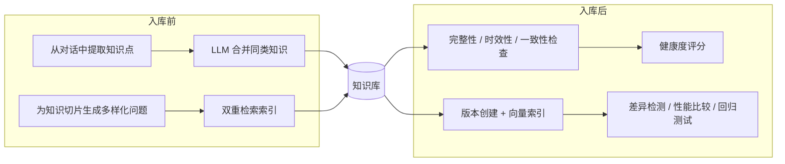
```mermaid
flowchart LR
    subgraph 入库前
        Q1["为知识切片生成多样化问题"] --> IDX["双重检索索引"]
        Q2["从对话中提取知识点"] --> MERGE["LLM 合并同类知识"]
    end
    subgraph 入库后
        H1["完整性 / 时效性 / 一致性检查"] --> SCORE["健康度评分"]
        V1["版本创建 + 向量索引"] --> V2["差异检测 / 性能比较 / 回归测试"]
    end
    MERGE --> KB[("知识库")]
    IDX --> KB
    KB --> H1
    KB --> V1
```

### 场景 1：知识库问题生成与检索优化

用户提问的措辞往往与知识切片的原文表述差异很大。当用户问"如果我想体验最刺激的过山车，应该去哪个区域？"时，靠原文匹配很容易失手，因为切片里写的是"创极速光轮（明日世界）"。

一个直接的对策是：让模型为每个知识切片预先生成一批可能的问题，然后同时构建"原文索引"和"问题索引"两套 BM25 检索索引，用问题去匹配问题。对应实现是 `1-知识库问题生成与检索优化-BM25.py`。

#### 为单个切片生成多样化问题

`generate_questions_for_chunk()` 负责基础问题生成，要求模型返回带问题类型和难度等级的结构化 JSON：

```python
def generate_questions_for_chunk(self, knowledge_chunk, num_questions=5):
    """为单个知识切片生成多样化问题"""
    instruction = """
你是一个专业的问答系统专家。给定的知识内容能回答哪些多样化的问题，这些问题可以：
1. 使用不同的问法（直接问、间接问、对比问等）
2. 避免重复和相似的问题
3. 确保问题不超出知识内容范围

请返回JSON格式：
{
    "questions": [
        {
            "question": "问题内容",
            "question_type": "问题类型（直接问/间接问/对比问/条件问等）",
            "difficulty": "难度等级（简单/中等/困难）"
        }
    ]
}
"""
    prompt = f"""
### 指令 ###
{instruction}

### 知识内容 ###
{knowledge_chunk}

### 生成问题数量 ###
{num_questions}

### 生成结果 ###
"""
    response = get_completion(prompt, self.model)
    response = preprocess_json_response(response)
    try:
        result = json.loads(response)
        return result.get('questions', [])
    except json.JSONDecodeError as e:
        print(f"JSON解析失败: {e}")
        return [{"question": f"关于{knowledge_chunk[:50]}...的问题", "question_type": "直接问", "keywords": [], "difficulty": "中等"}]
```

以知识库第一条切片为输入，模型给出的 5 个问题横跨了直接问、间接问、对比问和条件问：

```text
知识内容: 上海迪士尼乐园位于上海市浦东新区，是中国大陆首座迪士尼主题乐园，于2016年6月16日开园。乐园占地面积390公顷，包含七大主题园区：米奇大街、奇想花园、探险岛、宝藏湾、明日世界、梦幻世界和迪士尼小镇。

生成的5个问题:
  1. 上海迪士尼乐园是什么时候开园的？ (类型: 直接问, 难度: 简单)
  2. 中国大陆第一座迪士尼乐园在哪里？ (类型: 间接问, 难度: 简单)
  3. 与美国、日本等地的迪士尼相比，上海迪士尼有什么特别之处？ (类型: 对比问, 难度: 中等)
  4. 如果想游览上海迪士尼的所有主题园区，需要了解哪些区域？ (类型: 条件问, 难度: 中等)
  5. 上海迪士尼乐园占地多少公顷？ (类型: 直接问, 难度: 简单)
```

`generate_diverse_questions()` 进一步把维度扩到 8 个问题，并增加了 `perspective`（提问角度）和 `is_answerable`（该知识能否作答）两个字段，相当于顺带做了一次自检。下面是实际生成的 8 个问题中的前四个：

```text
生成的8个多样化问题:
  1. 上海迪士尼乐园是在哪一年开园的？
     类型: 直接问, 难度: 简单, 角度: 时间信息, 能否回答: True, 回答的答案：2016年
  2. 如果一个人想在上海体验迪士尼主题乐园，他应该去哪里？
     类型: 间接问, 难度: 简单, 角度: 地理位置与用途, 能否回答: True, 回答的答案：上海迪士尼乐园，位于上海市浦东新区
  3. 上海迪士尼和香港迪士尼相比，哪个是中国大陆首座迪士尼主题乐园？
     类型: 对比问, 难度: 中等, 角度: 地域比较, 能否回答: True, 回答的答案：上海迪士尼是中国大陆首座迪士尼主题乐园
  4. 假如你计划去上海迪士尼游玩，你会选择哪个主题园区来体验探险氛围？
     类型: 假设问, 难度: 中等, 角度: 游客体验角度, 能否回答: True, 回答的答案：探险岛
```

#### 构建双重索引

`build_knowledge_index()` 同时维护两套 BM25 索引。问题索引在构建时把"原文 + 问题"拼接后一起分词，这样既能匹配到问题措辞，也能保留原文的上下文词汇：

```python
for i, chunk in enumerate(knowledge_base):
    text = chunk.get('content', '')
    # 原文文档
    content_words = preprocess_text(text)
    if content_words:
        content_documents.append(content_words)
        content_metadata.append({... "type": "content"})

    # 问题文档（如果存在生成的问题）
    if 'generated_questions' in chunk and chunk['generated_questions']:
        for j, question_data in enumerate(chunk['generated_questions']):
            question = question_data.get('question', '')
            if question.strip():
                # 拼接全文和问题，保持上下文
                combined_text = f"内容：{text} 问题：{question}"
                question_words = preprocess_text(combined_text)
                if question_words:
                    question_documents.append(question_words)
                    question_metadata.append({... "type": "question"})

if content_documents:
    self.content_bm25 = BM25Okapi(content_documents)
if question_documents:
    self.question_bm25 = BM25Okapi(question_documents)
```

中文分词依赖 jieba，并手工过滤了一批评率较高的停用词，避免短词干扰 BM25 打分：

```python
def preprocess_text(text):
    """文本预处理和分词"""
    text = re.sub(r'[^\w\s]', '', text)          # 移除标点符号和特殊字符
    words = jieba.lcut(text)
    stop_words = {'的', '了', '在', '是', '我', '有', '和', '就', '不', ...}
    words = [word for word in words if len(word) > 1 and word not in stop_words]
    return words
```

#### 检索评估：原文检索 vs 问题检索

`evaluate_retrieval_methods()` 用同一批测试查询跑两条链路，各取 Top-1，比较命中的切片是否等于标注的正确切片。测试集刻意挑选了"口语化、词汇与原文不重叠"的问题：

```python
test_queries = [
    {"query": "如果我想体验最刺激的过山车，应该去哪个区域？", "correct_chunk": knowledge_base[4]['content']},
    {"query": "什么时间去人比较少？",                        "correct_chunk": knowledge_base[2]['content']},
    {"query": "可以带食物进去吗？",                          "correct_chunk": knowledge_base[5]['content']}
]
```

三个查询的实测结果如下：

```text
测试查询数量: 3
BM25原文检索准确率: 66.7%
BM25问题检索准确率: 100.0%
问题检索改进的查询数量: 1

=== 详细分析 ===

问题检索方法表现更好的查询（按分数差异排序）:
  1. 查询: 如果我想体验最刺激的过山车，应该去哪个区域？
     原文检索分数: 0.155
     问题检索分数: 1.000
     分数差异: +0.845
     原文检索: ✗
     问题检索: ✓
  2. 查询: 可以带食物进去吗？
     原文检索分数: 0.153
     问题检索分数: 0.556
     分数差异: +0.402
     原文检索: ✓
     问题检索: ✓
  3. 查询: 什么时间去人比较少？
     原文检索分数: 0.168
     问题检索分数: 0.279
     分数差异: +0.112
     原文检索: ✓
     问题检索: ✓
```

值得注意的是三条查询的 BM25 原文分数都被压在 0.2 以下，而问题检索把最典型的那条从 0.155 拉到了 1.000。这验证了问题生成的核心价值：把"用户的口语"翻译成"知识库自己的语言"，让匹配发生在同一语义平面上。

优化效果与代价的关系可以用下面这张图概括：

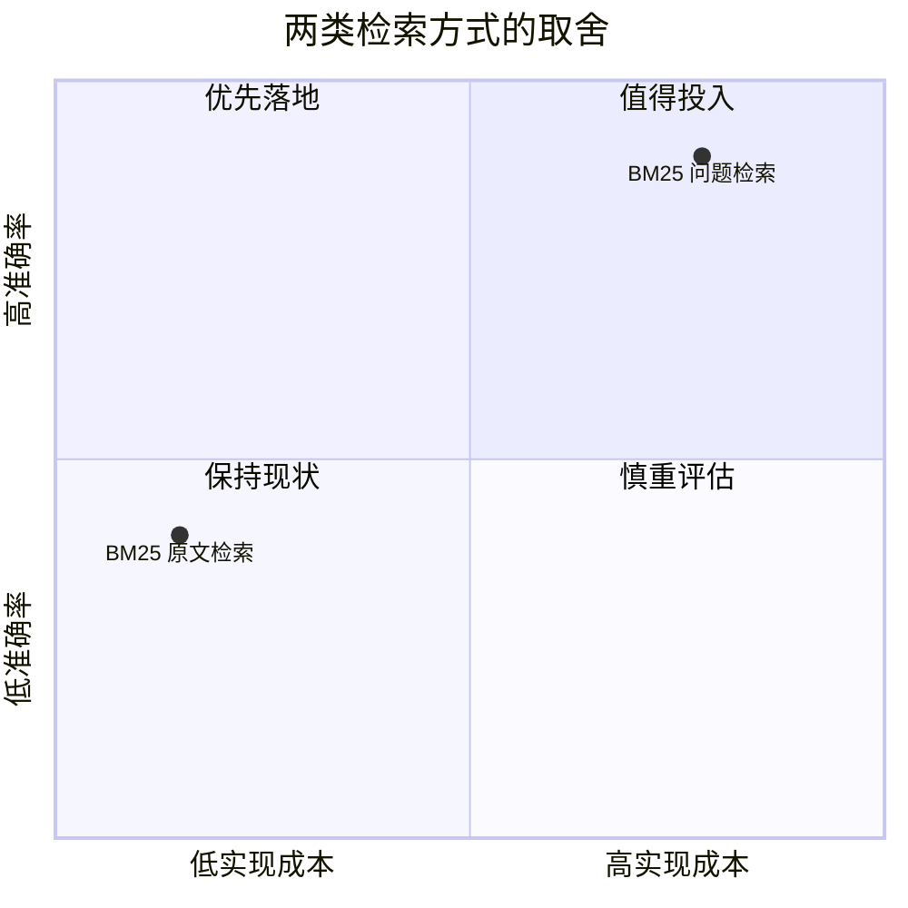
```mermaid
quadrantChart
    title 两类检索方式的取舍
    x-axis "低实现成本" --> "高实现成本"
    y-axis "低准确率" --> "高准确率"
    quadrant-1 "值得投入"
    quadrant-2 "优先落地"
    quadrant-3 "保持现状"
    quadrant-4 "慎重评估"
    "BM25 原文检索": [0.15, 0.4]
    "BM25 问题检索": [0.78, 0.9]
```

### 场景 2：对话知识沉淀

产品上线后每天产生大量对话，其中隐藏着知识库里没有的细节。场景 2 的目标是从对话流里自动提取结构化知识，补进知识库。对应实现是 `2-对话知识沉淀.py`。

#### 从单次对话提取结构化知识

提取环节把知识点归到"事实 / 需求 / 问题 / 流程 / 注意"五类，并要求模型给出置信度、关键词和分类，同时输出对话摘要与用户意图：

```python
def extract_knowledge_from_conversation(self, conversation):
    """从单次对话中提取知识"""
    instruction = """
你是一个专业的知识提取专家。请从给定的对话中提取有价值的知识点，包括：
1. 事实性信息（地点、时间、价格、规则等）
2. 用户需求和偏好
3. 常见问题和解答
4. 操作流程和步骤
5. 注意事项和提醒

请返回JSON格式：
{
    "extracted_knowledge": [
        {
            "knowledge_type": "知识类型（事实/需求/问题/流程/注意）",
            "content": "知识内容",
            "confidence": "置信度(0-1)",
            "source": "来源（用户/AI/对话）",
            "keywords": ["关键词1", "关键词2"],
            "category": "分类"
        }
    ],
    "conversation_summary": "对话摘要",
    "user_intent": "用户意图"
}
"""
    prompt = f"""
### 指令 ###
{instruction}

### 对话内容 ###
{conversation}

### 提取结果 ###
"""
    response = get_completion(prompt, self.model)
    response = preprocess_json_response(response)
    ...
```

以一段咨询门票价格、预订方式和机场交通的对话为输入，提取结果如下：

```text
提取的知识点:
  1. 类型: 事实
     内容: 上海迪士尼乐园平日成人票价为399元，周末和节假日为499元。
     置信度: 1.0
     分类: 门票信息
  2. 类型: 事实
     内容: 儿童票（1.0-1.4米）平日为299元，周末为374元；1.0米以下儿童免费。
     置信度: 1.0
     分类: 门票信息
  3. 类型: 需求
     内容: 用户希望了解上海迪士尼乐园的门票价格，并计划前往游玩。
     置信度: 0.95
     分类: 用户意图
  4. 类型: 流程
     内容: 从浦东机场到迪士尼乐园可乘坐地铁2号线到广兰路站，换乘11号线到迪士尼站，全程约1小时。
     置信度: 0.9
     分类: 出行指南
  5. 类型: 流程
     内容: 从浦东机场打车前往迪士尼乐园约需40分钟。
     置信度: 0.9
     分类: 出行指南
  6. 类型: 注意
     内容: 建议提前预订门票，特别是周末和节假日，可通过官方网站或第三方平台预订。
     置信度: 0.95
     分类: 购票提醒

对话摘要: 用户咨询上海迪士尼乐园门票价格、是否需要提前预订以及从浦东机场如何前往。AI提供了详细的票价信息、购票建议和交通方式（地铁与打车）。
用户意图: 获取上海迪士尼乐园的门票价格、购票建议及从浦东机场前往的交通方式，以便规划行程。
```

#### 过滤临时性内容

"需求"和"问题"两类知识点带着强烈的个人色彩和时效性，沉淀进知识库只会带来噪声。因此合并前先做一次类型过滤：

```python
# 过滤掉需求和问题类型的知识，因为它们是临时的、个性化的
filtered_knowledge = [
    knowledge for knowledge in knowledge_list
    if knowledge.get('knowledge_type') not in ['需求', '问题']
]
```

#### 用 LLM 做同类合并

过滤之后按 `knowledge_type` 分组。组内只有一条就直通，多条才交给 LLM 合并，合并提示词明确要求"保留全部重要信息、消除重复、置信度取最高值"：

```python
# 按知识类型分组
knowledge_by_type = {}
for knowledge in filtered_knowledge:
    knowledge_type = knowledge.get('knowledge_type', '其他')
    knowledge_by_type.setdefault(knowledge_type, []).append(knowledge)

merged_knowledge = []
# 对每个知识类型分别进行LLM合并
for knowledge_type, knowledge_group in knowledge_by_type.items():
    if len(knowledge_group) == 1:
        merged_knowledge.append(knowledge_group[0])
    else:
        merged = self.merge_knowledge_with_llm(knowledge_group, knowledge_type)
        merged_knowledge.append(merged)
```

```python
prompt = f"""
你是一个专业的知识整理专家。请将以下{knowledge_type}类型的知识点进行智能合并，生成一个更完整、准确的知识点。

### 合并要求：
1. 保留所有重要信息，避免信息丢失
2. 消除重复内容，整合相似表述
3. 提高内容的准确性和完整性
4. 保持逻辑清晰，结构合理
5. 合并后的置信度取所有知识点中的最高值

### 待合并的知识点：
{chr(10).join(knowledge_contents)}

### 请返回JSON格式：
{{
    "knowledge_type": "{knowledge_type}",
    "content": "合并后的知识内容",
    "confidence": 最高置信度值,
    "keywords": ["合并后的关键词列表"],
    "category": "合并后的分类",
    "sources": ["所有来源"],
    "frequency": {len(knowledge_group)}
}}

### 合并结果：
"""
```

三组示例对话批量跑完后的收敛过程非常直观：22 个知识点经过滤剩 17 个，再经同类合并压缩到 3 个。下面是合并结果中的第一条：

```text
过滤前知识点数量: 22
过滤后知识点数量: 17
过滤掉的'需求'和'问题'类型知识点: 5
合并后剩余 3 个知识点

合并后的知识点:
  1. 类型: 事实
     内容: 上海迪士尼乐园门票价格为：成人平日票价399元，周末及节假日499元；儿童票（身高1.0-1.4米）平日299元，周末374元，1.0米以下儿童免费。乐园通常每日开放，营业时间为上午8:00至晚上8:00，但人流量会因日期、季节和活动而变化，周末、节假日和寒暑假期间游客较多。必玩项目包括创极速光轮（明日世界）、七个小矮人矿山车（梦幻世界）、加勒比海盗：战争之潮（宝藏湾）和翱翔·飞越地平线（探险岛）。园内部分游乐项目设有身高限制，入园时需遵守相关规定，如可携带密封包装的零食和水，但禁止携带玻璃瓶及酒精饮料。此外，园区停车场收费为100元/天。
     频率: 8次
     置信度: 1.0
     分类: 综合旅游信息
     关键词: ['门票价格', '儿童票', '营业时间', '人流量', '必玩项目', '身高限制', '食物携带', '停车费', '上海迪士尼']
     来源: ['AI']
```

另外两条分别归到"流程"（频率 5 次，置信度 0.9）和"注意"（频率 4 次，置信度 0.95）。`frequency` 字段在这里承担了双重角色：既是合并次数的记录，也天然构成了知识点的"热度权重"，后续检索排序时可以直接利用。

### 场景 3：知识库健康度检查

知识库不是一次性工程。缺少的知识、过期的价格、互相冲突的条款，都会让 RAG 系统悄悄给出错误答案。场景 3 把 LLM 当成审计员，从完整性、时效性、一致性三个维度体检。对应实现是 `3-知识库健康度检查.py`。

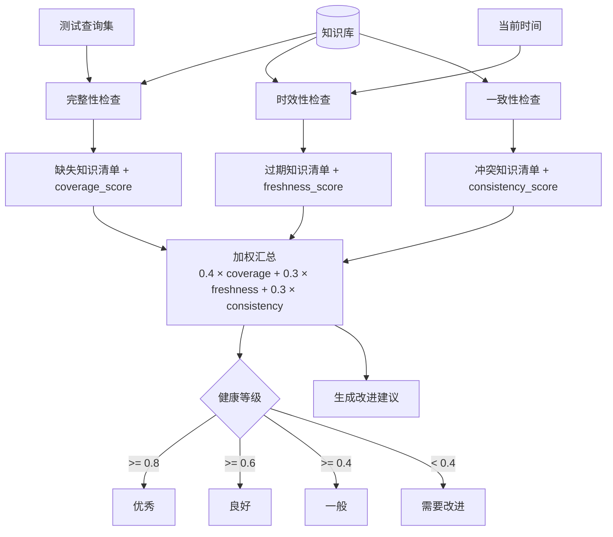
```mermaid
flowchart TD
    KB[("知识库")] --> C1["完整性检查"]
    KB --> C2["时效性检查"]
    KB --> C3["一致性检查"]
    Q["测试查询集"] --> C1
    NOW["当前时间"] --> C2

    C1 --> R1["缺失知识清单 + coverage_score"]
    C2 --> R2["过期知识清单 + freshness_score"]
    C3 --> R3["冲突知识清单 + consistency_score"]

    R1 --> S["加权汇总<br/>0.4 × coverage + 0.3 × freshness + 0.3 × consistency"]
    R2 --> S
    R3 --> S
    S --> LV{"健康等级"}
    LV -->|">= 0.8"| L1["优秀"]
    LV -->|">= 0.6"| L2["良好"]
    LV -->|">= 0.4"| L3["一般"]
    LV -->|"< 0.4"| L4["需要改进"]
    S --> ADV["生成改进建议"]
```

#### 三项检查各自的判定标准

完整性检查把测试查询和知识库全文一起交给模型，输出缺失知识点、覆盖率评分和完整性分析：

```python
instruction = """
你是一个知识库完整性检查专家。请分析给定的测试查询和知识库内容，判断知识库中是否缺少相关的知识。

检查标准：
1. 查询是否能在知识库中找到相关答案
2. 知识是否完整、准确
3. 是否覆盖了用户的主要需求
4. 是否存在知识空白

请返回JSON格式：
{
    "missing_knowledge": [
        {
            "query": "测试查询",
            "missing_aspect": "缺少的知识方面",
            "importance": "重要性（高/中/低）",
            "suggested_content": "建议的知识内容",
            "category": "知识分类"
        }
    ],
    "coverage_score": "覆盖率评分(0-1)",
    "completeness_analysis": "完整性分析"
}
"""
```

时效性检查的关键在于注入当前时间，让模型有判断"过期"的基准：

```python
prompt = f"""
### 指令 ###
{instruction}

### 知识库内容 ###
{knowledge_text}

### 当前时间 ###
{datetime.now().strftime('%Y年%m月%d日')}

### 分析结果 ###
"""
```

一致性检查则专门盯多切片之间的矛盾——同一主题的不同说法、价格差异、时间不一致、规则冲突：

```python
instruction = """
你是一个知识一致性检查专家。请分析给定的知识库，找出可能存在冲突或矛盾的信息。

检查标准：
1. 同一主题的不同说法（地点、名称、描述等）
2. 价格信息的差异（价格、费用、收费标准等）
3. 时间信息的不一致（营业时间、开放时间、活动时间等）
4. 规则政策的冲突（规定、政策、要求等）
5. 操作流程的差异（步骤、方法、流程等）
6. 联系方式的差异（地址、电话、网址等）

请返回JSON格式：
{
    "conflicting_knowledge": [
        {
            "conflict_type": "冲突类型",
            "chunk_ids": ["相关切片ID"],
            "conflicting_content": ["冲突内容"],
            "severity": "严重程度（高/中/低）",
            "resolution_suggestion": "解决建议"
        }
    ],
    "consistency_score": "一致性评分(0-1)",
    "conflict_analysis": "冲突分析"
}
"""
```

#### 加权评分与健康等级

三个维度的评分按 40% / 30% / 30% 加权汇总，再映射到四档健康等级：

```python
def calculate_overall_health_score(self, missing_result, outdated_result, conflicting_result):
    """计算整体健康度评分"""
    coverage_score = missing_result.get('coverage_score', 0)
    freshness_score = outdated_result.get('freshness_score', 0)
    consistency_score = conflicting_result.get('consistency_score', 0)

    # 加权计算
    overall_score = (
        coverage_score * 0.4 +      # 覆盖率权重40%
        freshness_score * 0.3 +     # 新鲜度权重30%
        consistency_score * 0.3     # 一致性权重30%
    )
    return overall_score

def get_health_level(self, score):
    """根据评分确定健康等级"""
    if score >= 0.8:
        return "优秀"
    elif score >= 0.6:
        return "良好"
    elif score >= 0.4:
        return "一般"
    else:
        return "需要改进"
```

示例知识库中刻意埋了三处问题：`kb_002` 的更新时间停在 `2023-12-01`（时效性问题）、`kb_003` 写了一套与 `kb_002` 完全不同的票价（一致性问题），而测试查询中的"有什么特别活动？""停车费是多少？"在库里找不到任何对应内容（完整性问题）。实测报告如下：

```text
正在检查知识库健康度...
1. 检查缺少的知识...
2. 检查过期的知识...
3. 检查冲突的知识...
=== 知识库健康度报告 ===
整体健康度评分: 0.60
健康等级: 良好
检查时间: 2025-08-03T08:57:36.164103

=== 详细分析 ===
1. 缺少的知识分析:
   覆盖率: 60.0%
   缺少知识点数量: 2
   1. 查询: 有什么特别活动？
      缺少方面: 乐园当前或定期举办的特别活动信息（如节日庆典、演出、限时活动等）
      重要性: 高
   2. 查询: 停车费是多少？
      缺少方面: 停车场收费标准（包括小时计费、全天封顶价、是否提供免费停车等）
      重要性: 中

2. 过期的知识分析:
   新鲜度评分: 0.60
   过期知识点数量: 2
   1. 切片ID: kb_002
      过期方面: 价格信息
      严重程度: 高
   2. 切片ID: kb_004
      过期方面: 活动信息
      严重程度: 中

3. 冲突的知识分析:
   一致性评分: 0.60
   冲突数量: 2
   1. 冲突类型: 价格信息的差异
      相关切片: ['kb_002', 'kb_003']
      严重程度: 高
   2. 冲突类型: 时间信息的不一致
      相关切片: ['kb_004']
      严重程度: 中

=== 改进建议 ===
1. 补充2个缺少的知识点，提高覆盖率
2. 更新2个过期知识点，确保信息时效性
3. 解决2个知识冲突，提高一致性
```

健康度检查的输出是可直接执行的整改清单，这也是它比"人工抽查"更实用的地方——每一项都能定位到具体的切片 ID 和严重程度。

### 场景 4：知识库版本管理与性能比较

知识库一旦开始持续更新，就必须回答两个问题：这次更新改了什么？新版比旧版好在哪里？场景 4 用"版本快照 + 向量索引 + A/B 对比 + 回归测试"给出工程化答案。对应实现是 `4-知识库版本管理与性能比较.py`。

这里换了一套技术栈：文本向量化走通义千问的 `text-embedding-v4`（1024 维），索引走 FAISS，而不是前面几个场景用的 BM25：

```python
# 全局配置
TEXT_EMBEDDING_MODEL = "text-embedding-v4"
TEXT_EMBEDDING_DIM = 1024

def get_text_embedding(text):
    """获取文本的 Embedding"""
    response = client.embeddings.create(
        model=TEXT_EMBEDDING_MODEL,
        input=text,
        dimensions=TEXT_EMBEDDING_DIM
    )
    return response.data[0].embedding
```

FAISS 索引使用 `IndexIDMap` 包装 `IndexFlatL2`，这样向量 ID 可以和元数据中的业务 ID 对齐，检索后能直接反查原始切片：

```python
def build_vector_index(self, knowledge_base):
    """构建向量索引"""
    metadata_store = []
    text_vectors = []
    for i, chunk in enumerate(knowledge_base):
        content = chunk.get('content', '')
        if not content.strip():
            continue
        metadata = {"id": i, "content": content, "chunk_id": chunk.get('id', f'chunk_{i}')}
        vector = get_text_embedding(content)
        text_vectors.append(vector)
        metadata_store.append(metadata)

    text_index = faiss.IndexFlatL2(TEXT_EMBEDDING_DIM)
    text_index_map = faiss.IndexIDMap(text_index)
    if text_vectors:
        text_ids = [m["id"] for m in metadata_store]
        text_index_map.add_with_ids(np.array(text_vectors).astype('float32'), np.array(text_ids))
    return metadata_store, text_index_map
```

#### 版本差异检测：集合运算

版本对比的核心是用集合运算快速切出新增、删除、修改三类变化：

```python
def detect_changes(self, kb1, kb2):
    """检测知识库变化"""
    kb1_dict = {chunk.get('id'): chunk for chunk in kb1}
    kb2_dict = {chunk.get('id'): chunk for chunk in kb2}

    kb1_ids = set(kb1_dict.keys())
    kb2_ids = set(kb2_dict.keys())
    added_ids   = kb2_ids - kb1_ids        # 差集：新增
    removed_ids = kb1_ids - kb2_ids        # 差集：删除
    common_ids  = kb1_ids & kb2_ids        # 交集：共有
    ...
```

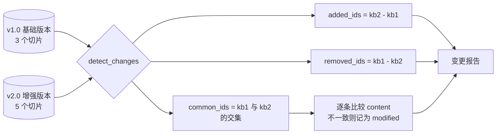
```mermaid
flowchart LR
    V1[("v1.0 基础版本<br/>3 个切片")] --> D{"detect_changes"}
    V2[("v2.0 增强版本<br/>5 个切片")] --> D
    D --> A["added_ids = kb2 - kb1"]
    D --> R["removed_ids = kb1 - kb2"]
    D --> C["common_ids = kb1 与 kb2 的交集"]
    C --> M["逐条比较 content<br/>不一致则记为 modified"]
    A --> REP["变更报告"]
    R --> REP
    M --> REP
```

#### 检索与评估

检索距离通过 `1 / (1 + distance)` 转换成 0~1 的相似度分数，便于和阈值比较：

```python
def retrieve_relevant_chunks(self, query, version_name, k=3):
    """使用embedding和faiss检索相关知识切片"""
    version_info = self.versions[version_name]
    metadata_store = version_info['metadata_store']
    text_index = version_info['text_index']

    query_vector = np.array([get_text_embedding(query)]).astype('float32')
    distances, indices = text_index.search(query_vector, k)

    relevant_chunks = []
    for i, doc_id in enumerate(indices[0]):
        if doc_id != -1:                      # faiss返回-1表示没有找到匹配
            match = next((item for item in metadata_store if item["id"] == doc_id), None)
            if match:
                relevant_chunks.append({
                    "id": match["chunk_id"],
                    "content": match["content"],
                    "similarity_score": 1.0 / (1.0 + distances[0][i])   # 距离转相似度
                })
    return relevant_chunks
```

评估使用字符串包含匹配——只要期望答案关键词出现在任一召回的切片中即判定为正确：

```python
def evaluate_retrieval_quality(self, query, retrieved_chunks, expected_answer):
    """评估检索质量"""
    if not retrieved_chunks:
        return False
    # 简化的质量评估
    for chunk in retrieved_chunks:
        content = chunk.get('content', '').lower()
        if expected_answer.lower() in content:
            return True
    return False
```

需要说明的是，这里的差异检测用的是精确文本匹配而非语义比对，所以它能发现"内容改动"，但发现不了"换种说法表达同一件事"。课件在总结页也明确标注了这一点。

#### 五个功能的实测输出

功能 1 创建两个版本并统计切片数：

```text
功能1: 创建知识库版本
版本1信息:
  版本名: v1.0
  描述: 基础版本
  知识切片数量: 3
  平均切片长度: 36字符

版本2信息:
  版本名: v2.0
  描述: 增强版本
  知识切片数量: 5
  平均切片长度: 54字符
```

功能 2 输出差异报告，5 个切片里有 2 个新增、3 个修改、0 个删除：

```text
功能2: 版本差异比较
版本比较结果:
  新增知识切片: 2个
  删除知识切片: 0个
  修改知识切片: 3个

新增的知识切片:
  1. ID: kb_004
     内容: 从上海市区到迪士尼乐园可以乘坐地铁11号线到迪士尼站，或乘坐迪士尼专线巴士。
  2. ID: kb_005
     内容: 上海迪士尼乐园的特色项目包括：创极速光轮、七个小矮人矿山车、加勒比海盗等。

修改的知识切片:
  1. ID: kb_003
     旧内容: 上海迪士尼乐园营业时间为上午8:00至晚上8:00。
     新内容: 上海迪士尼乐园营业时间为上午8:00至晚上8:00，全年无休。建议出发前查看官方网站确认具体时间。
  2. ID: kb_002
     旧内容: 上海迪士尼乐园的门票价格：平日成人票价为399元，周末和节假日为499元。
     新内容: 上海迪士尼乐园的门票价格：平日成人票价为399元，周末和节假日为499元。儿童票（1.0-1.4米）平日为299元，周末为374元。1.0米以下儿童免费。
  3. ID: kb_001
     旧内容: 上海迪士尼乐园位于上海市浦东新区，是中国大陆首座迪士尼主题乐园，于2016年6月16日开园。
     新内容: 上海迪士尼乐园位于上海市浦东新区，是中国大陆首座迪士尼主题乐园，于2016年6月16日开园。乐园占地面积390公顷，包含七大主题园区。
```

功能 3 到功能 5 是性能评估、性能比较与回归测试。这里最值得关注的是准确率与响应时间并不同步：

```text
功能3: 版本性能评估
版本1性能:
  准确率: 60.0%
  平均响应时间: 115.8ms

版本2性能:
  准确率: 100.0%
  平均响应时间: 120.2ms

功能4: 性能比较与建议
性能比较结果:
  准确率提升: 40.0%
  响应时间变化: 21.6ms
  建议: 推荐使用版本2，准确率提升40.0%，响应时间提升

功能5: 回归测试
回归测试结果:
  测试通过率: 100.0%
  测试用例数量: 5
详细测试结果:
  1. 上海迪士尼乐园在哪里？ ✓
  2. 门票多少钱？ ✓
  3. 营业时间是什么？ ✓
  4. 怎么去迪士尼？ ✓
  5. 有什么好玩的项目？ ✓
```

v2.0 的准确率从 60% 提升到 100%，代价是平均响应时间多了约 21.6ms——因为切片变多了，向量检索的候选规模也随之变大。这个数字量级说明：召回质量的提升往往能用极小的延迟代价换来，关键在于是否建立了可量化的对比机制。回归测试的 5 个用例全部通过，则保证了这次扩容没有破坏原有能力。

### 本部分小结

| 场景               | 核心手段                                    | 模型/算法承担的角色                                        |
| ------------------ | ------------------------------------------- | ---------------------------------------------------------- |
| 问题生成与检索优化 | 为切片生成多样化问题，构建双重 BM25 索引    | LLM 生成问题、评估检索质量、优化知识库结构                 |
| 对话知识沉淀       | 从对话提取知识点、按类型分组后智能合并      | LLM 提取知识点、合并相似知识、生成结构化内容               |
| 健康度检查         | 完整性 / 时效性 / 一致性三维体检 + 加权评分 | LLM 分析知识缺失、检查过时内容、识别知识冲突               |
| 版本管理与性能比较 | 版本快照、向量索引、A/B 对比、回归测试      | Embedding 构建向量索引与语义检索；差异检测使用精确文本匹配 |

## 精准雷达：高效召回

知识库存好之后，下一个瓶颈就是"能不能找对"。工作区中的 `CASE-高效召回` 目录用一篇真实的银行内部考核办法 PDF（《上海浦东发展银行西安分行个金客户经理考核办法》，9 页，提取文本 3881 字符）串起了一整套召回优化链路，逐级叠加能力：

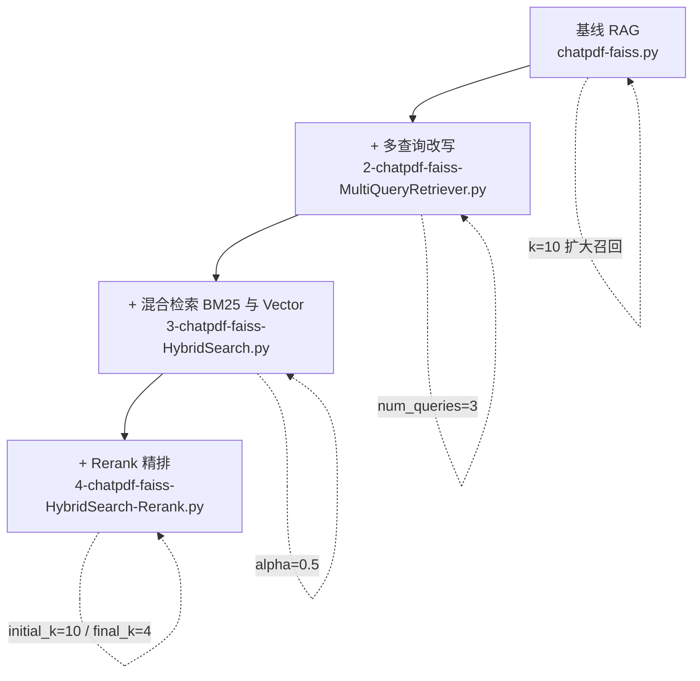
```mermaid
flowchart TD
    B["基线 RAG<br/>chatpdf-faiss.py"] --> M["+ 多查询改写<br/>2-chatpdf-faiss-MultiQueryRetriever.py"]
    M --> H["+ 混合检索 BM25 与 Vector<br/>3-chatpdf-faiss-HybridSearch.py"]
    H --> R["+ Rerank 精排<br/>4-chatpdf-faiss-HybridSearch-Rerank.py"]
    B -.->|"k=10 扩大召回"| B
    M -.->|"num_queries=3"| M
    H -.->|"alpha=0.5"| H
    R -.->|"initial_k=10 / final_k=4"| R
```

这套示例的语料虽小，但问题设计得很典型——"客户经理被投诉了，投诉一次扣多少分"这类提问，既需要精确匹配专有名词（投诉、扣分），又需要理解口语化的表达，正好能暴露单一检索手段的短板。

### 基线：DeepSeek + Faiss 搭建本地知识库检索

基线版本 `chatpdf-faiss.py` 的做法是标准的"切分 → 向量化 → 相似度检索 → 拼上下文 → 生成"。切分参数定为 1000 字符一块、200 字符重叠：

```python
text_splitter = RecursiveCharacterTextSplitter(
    separators=["\n\n", "\n", ".", " ", ""],
    chunk_size=1000,
    chunk_overlap=200,
    length_function=len,
)
chunks = text_splitter.split_text(text)
print(f"文本被分割成 {len(chunks)} 个块。")

# 创建嵌入模型
embeddings = DashScopeEmbeddings(
    model="text-embedding-v1",
    dashscope_api_key=DASHSCOPE_API_KEY,
)
# 从文本块创建知识库
knowledgeBase = FAISS.from_texts(chunks, embeddings)
```

生成侧用的是 DeepSeek 模型，通过 LangChain 的 `Tongyi` 接口调用：

```python
from langchain_community.llms import Tongyi
llm = Tongyi(model_name="deepseek-v3", dashscope_api_key=DASHSCOPE_API_KEY)
```

该示例还额外解决了一个 RAG 落地的刚需——来源页码溯源。它的做法是按字符记录页码，再对每个切块内的页码取众数：

```python
for page_number, page in enumerate(pdf.pages, start=1):
    extracted_text = page.extract_text()
    if extracted_text:
        text += extracted_text
        # 为当前页面的每个字符记录页码
        char_page_mapping.extend([page_number] * len(extracted_text))
```

```python
# 取页码的众数（出现最多的页码）作为该块的页码
if chunk_pages:
    page_counts = {}
    for page in chunk_pages:
        page_counts[page] = page_counts.get(page, 0) + 1
    most_common_page = max(page_counts, key=page_counts.get)
    page_info[chunk] = most_common_page
```

建库阶段的实测输出：

```text
提取的文本长度: 3881 个字符。
文本被分割成 5 个块。
已从文本块创建知识库。
页码映射完成，共 5 个文本块
向量数据库已保存到: ./vector_db
页码信息已保存到: ./vector_db\page_info.pkl
```

3881 个字符切成 5 块，检索时 `k=10` 实际上已经覆盖全库，这也解释了后文为什么多条查询的召回条数都稳定落在 4~5 条。基线查询"客户经理被投诉了，投诉一次扣多少分"的结果如下：

```text
根据您提供的上下文，客户经理被投诉一次扣 **2分**。

依据在文档的"第五章 工作质量考核标准"中的第九条第一款第2项：

> 2、客户服务效率低，态度生硬或不及时为客户提供维护服务，有客户投诉的 ,每投诉一次扣 2分
来源:
文本块页码: 6
文本块页码: 1
文本块页码: 8
```

答案引用的条款完全正确，但来源页码一次命中了 6、1、8 三页，覆盖范围偏大。这正是"精准雷达"要解决的问题：不是找不到，而是找得不够准。

### 优化查询扩展：MultiQuery 多查询改写

同样的查询，换个角度问可能会命中完全不同的切片。MultiQuery 的思路是用 LLM 把一个问题改写成多个语义相近但视角不同的查询，分别检索后合并去重。

课件中提到，LangChain 旧版本提供了 `MultiQueryRetriever`，新版本需要自己实现。工作区里两种做法都有示例。

#### 官方 MultiQueryRetriever 的最小用法

`1-MultiQueryRetriever使用.py` 演示了官方类的直接调用，只需把向量库包装成 retriever 传进去：

```python
from langchain.retrievers import MultiQueryRetriever

retriever = MultiQueryRetriever.from_llm(
    retriever=vectorstore.as_retriever(),
    llm=llm
)

query = "客户经理的考核标准是什么？"
results = retriever.invoke(query)
print(f"查询: {query}")
print(f"找到 {len(results)} 个相关文档:")
for i, doc in enumerate(results):
    print(f"\n文档 {i+1}:")
    print(doc.page_content[:200] + "..." if len(doc.page_content) > 200 else doc.page_content)
```

查询"客户经理的考核标准是什么？"的实测输出（截取前两个文档）：

```text
查询: 客户经理的考核标准是什么？
找到 5 个相关文档:

文档 1:
第十二条   客户经理聘任实行开放式、浮动制，即：本人申报  —
— 所在部门推荐  —— 分行考核  —— 行长聘任  —— 每年考评
调整浮动。   
第十三条   特别聘任：  
（一）经分行同意录用从其他单位调入的个金客户经理，由用人
单位按 D类人员进行考核， 薪资待遇按其业绩享受行内正式行员工同
等待遇。待正式转正后按第十一条规定申报技术职务。  
（二）对为我行业务创新、工作业绩等方...

文档 2:
5.超出最低考核标准可相互折算，折算标准： 50万储蓄 =50万个贷 =50张有效卡 =5分（折算以 5分为单位）  
 
 百度文库  - 好好学习，天天向上  
-5 第五章  工作质量考核标准  
第九条   工作质量考核实行扣分制。工作质量指个金客户经理在
从事所有个人业务时出现投诉、差错及风险。该项考核最多扣 50分，
如发生重大差错事故，按分行有关制度处理。  
（一）服务质量考核： ...
```

这里有一个实操中很常见的坑值得强调：官方 `MultiQueryRetriever` 生成的查询变体是通过 `logging` 输出的，默认不配置日志就完全看不到变体列表。想观察模型改写出的查询，需要显式打开该 logger：

```python
import logging
logging.basicConfig()
logging.getLogger("langchain.retrievers.multi_query").setLevel(logging.INFO)
```

#### 自实现多查询检索

`2-chatpdf-faiss-MultiQueryRetriever.py` 用二十来行代码实现了同样的能力，好处是变体可见、参数可控：

```python
def generate_multi_queries(query: str, llm, num_queries: int = 3) -> List[str]:
    """使用LLM生成多个查询变体"""
    prompt = f"""你是一个AI助手，负责生成多个不同视角的搜索查询。
给定一个用户问题，生成{num_queries}个不同但相关的查询，以帮助检索更全面的信息。
每个查询应该从不同角度表达相同的信息需求。

原始问题: {query}

请直接输出{num_queries}个查询，每行一个，不要编号和其他内容:"""

    response = llm.invoke(prompt)
    queries = [q.strip() for q in response.strip().split('\n') if q.strip()]
    queries = [query] + queries[:num_queries]
    return queries

def multi_query_search(query: str, vectorstore, llm, k: int = 4) -> List:
    """执行多查询检索，合并去重结果"""
    queries = generate_multi_queries(query, llm)
    print(f"生成的查询变体: {queries}")

    seen_contents = set()
    unique_docs = []
    for q in queries:
        docs = vectorstore.similarity_search(q, k=k)
        for doc in docs:
            content = doc.page_content
            if content not in seen_contents:       # 按内容精确去重
                seen_contents.add(content)
                unique_docs.append(doc)
    return unique_docs
```

注意 `queries = [query] + queries[:num_queries]` 这一行——原始查询被显式保留在检索列表最前面，保证改写失败时仍有兜底。三个查询的实测输出如下：

```text
==================================================
查询: 客户经理被投诉了，投诉一次扣多少分
生成的查询变体: ['客户经理被投诉了，投诉一次扣多少分', '客户经理投诉扣分标准是什么', '一次投诉对客户经理绩效影响有多大', '银行或金融机构客户经理被投诉的处罚机制']
找到 4 个相关文档

回答:
根据您提供的上下文，客户经理被投诉一次扣 **2分**。

依据来自文件第五章"工作质量考核标准"中的第九条：

> （一）服务质量考核：  
> 2、客户服务效率低，态度生硬或不及时为客户提供维护服务，有客户投诉的，**每投诉一次扣 2分**。

来源页码:
- 第 1 页
- 第 6 页
- 第 8 页
==================================================
```

另外两条查询的改写效果同样明显，尤其是第二条，改写出的变体覆盖了"年度评聘申报时间安排""职称评聘申报周期""申报时间节点"等多个表述角度：

```text
==================================================
查询: 客户经理每年评聘申报时间是怎样的？
生成的查询变体: ['客户经理每年评聘申报时间是怎样的？', '客户经理年度评聘申报时间安排是怎样的？', '每年客户经理职称评聘的申报周期在什么时候？', '企业客户经理岗位评聘的申报时间节点有哪些规定？']
找到 5 个相关文档

回答:
根据文中的**第十一条**规定：

每年一月份为客户经理评聘的申报时间。

来源页码:
- 第 1 页
- 第 4 页
- 第 6 页
- 第 8 页
==================================================
```

查询变体的生成与合并过程可以这样表示：

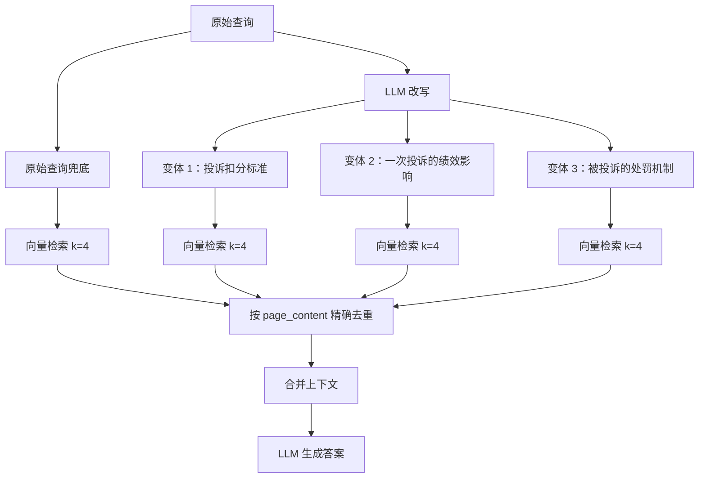
```mermaid
flowchart TD
    Q["原始查询"] --> L["LLM 改写"]
    L --> V1["变体 1：投诉扣分标准"]
    L --> V2["变体 2：一次投诉的绩效影响"]
    L --> V3["变体 3：被投诉的处罚机制"]
    Q --> S["原始查询兜底"]
    V1 --> R1["向量检索 k=4"]
    V2 --> R2["向量检索 k=4"]
    V3 --> R3["向量检索 k=4"]
    S --> R0["向量检索 k=4"]
    R0 --> DD["按 page_content 精确去重"]
    R1 --> DD
    R2 --> DD
    R3 --> DD
    DD --> CTX["合并上下文"]
    CTX --> GEN["LLM 生成答案"]
```

三个查询的召回情况汇总：

| 查询                               | 查询变体数（含原文） | 去重后文档数 | 来源页码   | 答案要点                                     |
| ---------------------------------- | -------------------- | ------------ | ---------- | -------------------------------------------- |
| 客户经理被投诉了，投诉一次扣多少分 | 4                    | 4            | 1, 6, 8    | 每投诉一次扣 2 分（第九条）                  |
| 客户经理每年评聘申报时间是怎样的？ | 4                    | 5            | 1, 4, 6, 8 | 每年一月份申报，二月组织资格考试（第十一条） |
| 客户经理的考核标准是什么？         | 4                    | 5            | 1, 4, 6, 8 | 个人业绩考核 + 工作质量考核双轨制            |

需要留意的是，知识库总共只有 5 个切片，所以"找到 5 个相关文档"实际上已经是全库召回。多查询的价值在这种小语料上主要体现在**提高命中概率**，而不是提高精确率；语料规模越大，多查询去重的收益才越明显。

### 索引扩展：BM25 + Vector 混合检索

向量检索擅长理解同义词和语义，但在专有名词的精确匹配上容易吃亏；BM25 恰好相反。把两者结合，是提升召回质量最直接的工程手段。

两种检索方式的能力边界可以这样对照：

| 维度     | BM25 检索              | 向量检索                            |
| -------- | ---------------------- | ----------------------------------- |
| 原理     | 词频 / 逆文档频率      | Embedding 语义相似度                |
| 优势     | 精确匹配专有名词       | 理解同义词、语义                    |
| 劣势     | 无法理解语义           | 可能漏掉精确关键词                  |
| 适合场景 | "投诉扣分"这类精确查找 | "处罚规定" = "扣分标准"这类语义等价 |

#### 融合公式与 alpha 权重

`3-chatpdf-faiss-HybridSearch.py` 中的 `HybridRetriever` 采用线性加权融合，用一个 alpha 参数控制两种检索的权重：

```python
class HybridRetriever:
    """混合检索器: BM25 + Vector"""

    def __init__(self, chunks: List[str], vectorstore: FAISS, alpha: float = 0.5):
        self.chunks = chunks
        self.vectorstore = vectorstore
        self.alpha = alpha

        # 构建BM25索引
        tokenized_chunks = [tokenize_chinese(chunk) for chunk in chunks]
        self.bm25 = BM25Okapi(tokenized_chunks)
        self.chunk_to_idx = {chunk: idx for idx, chunk in enumerate(chunks)}
```

检索时两条链路并行打分，各自归一化到 [0, 1] 后再融合：

```python
# BM25检索
tokenized_query = tokenize_chinese(query)
bm25_scores = self.bm25.get_scores(tokenized_query)

# 归一化BM25分数
max_bm25 = max(bm25_scores) if max(bm25_scores) > 0 else 1
bm25_scores_normalized = [s / max_bm25 for s in bm25_scores]

# 向量检索 (获取更多结果用于融合)
vector_results = self.vectorstore.similarity_search_with_score(query, k=len(self.chunks))

# 构建向量分数字典 (距离越小越好，转换为分数)
vector_scores = {}
max_distance = max(score for _, score in vector_results) if vector_results else 1
for doc, distance in vector_results:
    idx = self.chunk_to_idx.get(doc.page_content)
    if idx is not None:
        # 距离转分数: 1 - (distance / max_distance)
        vector_scores[idx] = 1 - (distance / max_distance) if max_distance > 0 else 0

# 融合分数
hybrid_scores = []
for idx in range(len(self.chunks)):
    bm25_score = bm25_scores_normalized[idx]
    vector_score = vector_scores.get(idx, 0)
    combined = self.alpha * vector_score + (1 - self.alpha) * bm25_score
    hybrid_scores.append((idx, combined))
```

融合公式可以写成：

```text
Score_hybrid = α × Score_vector + (1 - α) × Score_BM25
```

两路分数都做了"按本次结果集最大值归一化"处理，因此融合前两者量纲一致，alpha 才有明确的物理意义。整体流程如下：

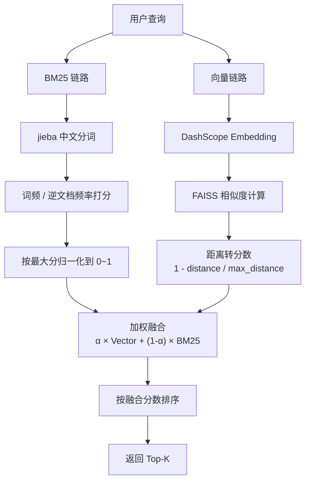
```mermaid
flowchart TD
    IN["用户查询"] --> P1["BM25 链路"]
    IN --> P2["向量链路"]
    P1 --> T1["jieba 中文分词"]
    T1 --> T2["词频 / 逆文档频率打分"]
    P2 --> T3["DashScope Embedding"]
    T3 --> T4["FAISS 相似度计算"]
    T2 --> N1["按最大分归一化到 0~1"]
    T4 --> N2["距离转分数<br/>1 - distance / max_distance"]
    N1 --> F["加权融合<br/>α × Vector + (1-α) × BM25"]
    N2 --> F
    F --> SORT["按融合分数排序"]
    SORT --> OUT["返回 Top-K"]
```

alpha 的取值直接决定检索倾向，实际调参时可以参考这张表：

| Alpha 值 | 检索倾向             | 适用场景                   |
| -------- | -------------------- | -------------------------- |
| α = 0.0  | 纯 BM25，只看关键词  | 专业术语查询、精确匹配需求 |
| α = 0.3  | 偏向关键词，兼顾语义 | 技术文档、法规条文检索     |
| α = 0.5  | 平衡，各占一半       | 通用场景（推荐默认值）     |
| α = 0.7  | 偏向语义，兼顾关键词 | 口语化问答、模糊查询       |
| α = 1.0  | 纯向量，只看语义     | 同义词丰富、表述多样的场景 |

调参建议也很朴素：专业术语多的文档降低 alpha 偏向 BM25，用户提问口语化则提高 alpha 偏向向量；拿不准时从 α = 0.5 起步，再根据效果微调。

#### 混合检索的实测输出

示例中 alpha 取 0.5，创建检索器时直接打印了配置：

```python
# 创建混合检索器 (alpha=0.5 表示BM25和向量各占50%权重)
hybrid_retriever = HybridRetriever(chunks, knowledgeBase, alpha=0.5)
print("混合检索器已创建 (BM25 + Vector, alpha=0.5)")
```

压轴查询"客户经理被投诉了，投诉一次扣多少分"的运行结果：

```text
发现现有向量数据库: ./vector_db_hybrid
向量数据库已从 ./vector_db_hybrid 加载。
页码信息已加载。
chunks已加载。
Loading model cost 0.967 seconds.
Prefix dict has been built successfully.
混合检索器已创建 (BM25 + Vector, alpha=0.5)

==================================================
查询: 客户经理被投诉了，投诉一次扣多少分
生成的查询变体: ['客户经理被投诉了，投诉一次扣多少分', '客户经理投诉扣分标准官方文件', '银行/金融机构客户经理投诉处罚细则', '客户经理因投诉被扣分的具体规定和申诉流程']
找到 5 个相关文档

回答:
根据提供的《上海浦东发展银行西安分行个金客户经理管理考核暂行办法》第五章第九条"工作质量考核标准"中关于**服务质量考核**的规定：

> （一）服务质量考核：  
> ……  
> **2、客户服务效率低，态度生硬或不及时为客户提供维护服务，有客户投诉的，每投诉一次扣 2分**

✅ 因此，客户经理被投诉一次，**扣2分**。

来源页码:
- 第 1 页
- 第 2 页
- 第 4 页
- 第 6 页
- 第 7 页
==================================================
```

三个查询全部跑完后，回答质量保持一致：投诉扣分问题稳定引用到"第五章第九条（一）服务质量考核第 2 点"，评聘时间问题稳定引用到"第十一条"。混合检索在这套小语料上给出的召回条数都是 5 条（即全库），说明候选覆盖足够；真正的排序优化留给下一步的 Rerank。

### 精细排序：Rerank 模型

初步召回解决的是"候选里有没有正确答案"，Rerank 解决的是"正确答案排不排在前面"。这一步对最终答案质量的影响往往比扩大召回数量更大。

#### Rerank 与向量检索的本质差异

向量检索是双编码器（bi-encoder）思路——查询和文档各自独立编码成向量，再算相似度，速度快但交互信息少。Rerank 模型走的是交叉编码器（cross-encoder）路线，把查询和文档拼成一对一起送进模型，直接输出相关性得分。代价是每个候选都要过一次模型，所以候选数量不宜过多。

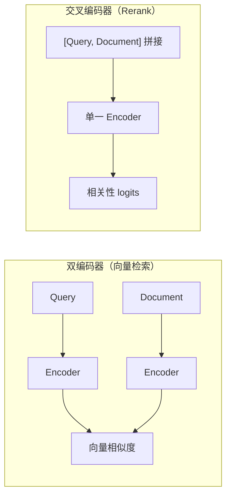
```mermaid
flowchart LR
    subgraph BI["双编码器（向量检索）"]
        Q1["Query"] --> E1["Encoder"]
        D1["Document"] --> E2["Encoder"]
        E1 --> S1["向量相似度"]
        E2 --> S1
    end
    subgraph CE["交叉编码器（Rerank）"]
        QD["[Query, Document] 拼接"] --> E3["单一 Encoder"]
        E3 --> S2["相关性 logits"]
    end
```

业界常用的两类 Rerank 服务，定位差异清晰：

| 特性       | BGE-Rerank         | Cohere Rerank        |
| ---------- | ------------------ | -------------------- |
| 开源/商业  | 开源               | 商业 API             |
| 部署方式   | 可本地部署         | 云端调用             |
| 多语言支持 | 中英优化           | 多语言（v3.0）       |
| 适用场景   | 数据敏感、垂直领域 | 快速集成、多语言优化 |

BGE-Rerank 由北京智源人工智能研究院（BAAI）开源，属于 FlagEmbedding 项目，基于 Transformer 的 Cross-Encoder 结构。它提供 `bge-reranker-base` 和 `bge-reranker-large` 两个版本，后者精度更优但更慢。Cohere Rerank 则通过 API 调用，返回归一化到 0~1 的相关性分数，更易解释。

#### 直接验证 Rerank 的打分能力

`CASE-rerank/beg-reranker.py` 用最朴素的方式验证了交叉编码器的判别力——同一问题配三种相关度的文档：

```python
import torch
from transformers import AutoModelForSequenceClassification, AutoTokenizer

tokenizer = AutoTokenizer.from_pretrained('/root/autodl-tmp/models/BAAI/bge-reranker-large')
model = AutoModelForSequenceClassification.from_pretrained('/root/autodl-tmp/models/BAAI/bge-reranker-large')
model.eval()

pairs = [
    ['what is panda?', 'The giant panda is a bear species endemic to China.'],  # 高相关
    ['what is panda?', 'Pandas are cute.'],                                     # 中等相关
    ['what is panda?', 'The Eiffel Tower is in Paris.']                        # 不相关
]
inputs = tokenizer(pairs, padding=True, truncation=True, return_tensors='pt')
scores = model(**inputs).logits.view(-1).float()
print(scores)  # 输出相关性分数
```

实测输出把三档相关度拉得非常开：

```text
tensor([ 4.9538, -0.4951, -9.4803], grad_fn=<ViewBackward0>)
```

高相关文档拿到 4.9538，中等相关掉到 -0.4951，完全无关的则是 -9.4803，首尾差距超过 14。这里的分数是未归一化的对数几率（logits），取值没有固定上下界。课件给出了经验区间参考：高相关约 3.0~10.0，中等相关约 0.0~3.0，低相关/不相关为负数（-5.0 以下）。这一特性在工程上很有用——可以直接用阈值过滤掉低相关候选，而不必强行塞进上下文窗口。

#### 从 ModelScope 加载 Rerank 模型

`4-chatpdf-faiss-HybridSearch-Rerank.py` 把 Rerank 接入了完整的检索链路。模型加载部分先下载到本地缓存再加载，并自动选择 GPU 或 CPU：

```python
class Reranker:
    """基于ModelScope的Rerank模型"""

    def __init__(self, model_name: str = "BAAI/bge-reranker-base", cache_dir: str = "./models"):
        """
        参数:
            model_name: ModelScope上的模型名称
                - BAAI/bge-reranker-base (轻量级，推荐)
                - BAAI/bge-reranker-large (效果更好，但更慢)
            cache_dir: 模型缓存目录，默认为当前目录下的 ./models
        """
        print(f"正在加载Rerank模型: {model_name}")
        print(f"模型缓存目录: {cache_dir}")
        os.makedirs(cache_dir, exist_ok=True)

        # 先下载模型到指定目录
        model_dir = snapshot_download(model_name, cache_dir=cache_dir)
        print(f"模型已下载到: {model_dir}")

        self.tokenizer = AutoTokenizer.from_pretrained(model_dir)
        self.model = AutoModelForSequenceClassification.from_pretrained(model_dir)
        self.model.eval()

        # 使用GPU如果可用
        self.device = "cuda" if torch.cuda.is_available() else "cpu"
        self.model.to(self.device)
        print(f"Rerank模型已加载，使用设备: {self.device}")
```

打分逻辑就是把所有候选构造成 `[query, document]` 对，一次批量前向：

```python
def rerank(self, query: str, documents: List[Document], top_k: int = None) -> List[Document]:
    """对文档进行重排序"""
    if not documents:
        return []

    # 构建query-document对
    pairs = [[query, doc.page_content] for doc in documents]

    # 批量计算分数
    with torch.no_grad():
        inputs = self.tokenizer(
            pairs,
            padding=True,
            truncation=True,
            max_length=512,        # 限制长度
            return_tensors="pt"
        ).to(self.device)
        # 模型输出相关性分数
        scores = self.model(**inputs).logits.squeeze(-1).cpu().tolist()

    # 按分数排序，返回Top-K
    scored_docs = list(zip(documents, scores))
    scored_docs.sort(key=lambda x: x[1], reverse=True)

    # 更新metadata中的分数
    results = []
    for doc, score in scored_docs:
        doc.metadata["rerank_score"] = score
        results.append(doc)

    if top_k:
        results = results[:top_k]
    return results
```

#### 两阶段检索：粗排召大 + 精排选小

Rerank 的价值在于它前面有一个"宽进"的粗排阶段。`hybrid_multi_query_search_with_rerank()` 用 `initial_k=10` 放大候选池，再用 `final_k=4` 收敛：

```python
def hybrid_multi_query_search_with_rerank(
    query: str,
    hybrid_retriever: HybridRetriever,
    reranker: Reranker,
    llm,
    initial_k: int = 10,
    final_k: int = 4
) -> List[Document]:
    """混合检索 + 多查询 + Rerank"""
    queries = generate_multi_queries(query, llm)
    print(f"生成的查询变体: {queries}")

    # 第一阶段: 多查询混合检索，获取更多候选
    seen_contents = set()
    candidate_docs = []
    for q in queries:
        docs = hybrid_retriever.search(q, k=initial_k)
        for doc in docs:
            if doc.page_content not in seen_contents:
                seen_contents.add(doc.page_content)
                candidate_docs.append(doc)
    print(f"初步召回 {len(candidate_docs)} 个候选文档")

    # 第二阶段: Rerank精排
    reranked_docs = reranker.rerank(query, candidate_docs, top_k=final_k)
    print(f"Rerank后保留 {len(reranked_docs)} 个文档")

    return reranked_docs
```

完整链路的实测输出如下，其中模型下载耗时 83 秒（10 个文件，主权重 1.04G），推理走的是 CPU：

```text
发现现有向量数据库: ./vector_db_hybrid
向量数据库已从 ./vector_db_hybrid 加载。
混合检索器已创建 (BM25 + Vector)
正在加载Rerank模型: BAAI/bge-reranker-base
模型缓存目录: ./models
Downloading Model from https://www.modelscope.cn to directory: ./models\BAAI\bge-reranker-base
2025-12-28 21:54:22,412 - modelscope - INFO - Got 10 files, start to download ...
2025-12-28 21:55:45,861 - modelscope - INFO - Download model 'BAAI/bge-reranker-base' successfully.
模型已下载到: ./models\BAAI\bge-reranker-base
Rerank模型已加载，使用设备: cpu

==================================================
查询: 客户经理被投诉了，投诉一次扣多少分
生成的查询变体: ['客户经理被投诉了，投诉一次扣多少分', '客户经理投诉扣分标准是什么', '银行客户经理被投诉一次会扣多少绩效分', '金融机构客户经理投诉处罚规定']
初步召回 5 个候选文档
Rerank后保留 4 个文档

回答:
根据您提供的上下文，客户经理被投诉一次扣 **2分**。

依据如下：

在文件的"第五章 工作质量考核标准"中，第九条下的"（一）服务质量考核"第2点明确规定：

> 2、客户服务效率低，态度生硬或不及时为客户提供维护服务，有客户投诉的，**每投诉一次扣 2分**。

来源页码:
- 第 2 页
- 第 4 页
- 第 6 页
- 第 7 页
==================================================
```

把加入 Rerank 前后的效果并排比较，能看到一个微妙但重要的变化：

| 环节              | 未加 Rerank（`3-chatpdf-faiss-HybridSearch.py`） | 加入 Rerank（`4-chatpdf-faiss-HybridSearch-Rerank.py`） |
| ----------------- | ------------------------------------------------ | ------------------------------------------------------- |
| 生成查询变体      | 4 条（含原问题）                                 | 4 条（含原问题）                                        |
| 候选文档数        | 5                                                | 初步召回 5                                              |
| 送入 LLM 的文档数 | 5                                                | 4                                                       |
| 来源页码          | 1, 2, 4, 6, 7                                    | 2, 4, 6, 7                                              |
| 最终答案          | 每投诉一次扣 2 分                                | 每投诉一次扣 2 分                                       |

差异落在第 1 页被剔除。第 1 页是文件的总则与职位设置章节，与"投诉扣分"这个具体问题相关性最低，却因为混合检索的分数归一化而挤进了候选。Rerank 把它识别出来并剔除，最终交给 LLM 的上下文更干净——这正是精排阶段的核心价值：**在候选数量不变的前提下，提升上下文的信息密度**。

#### 参数配置建议

课件在总结页给出了这组参数的建议值：

| 参数         | 说明               | 建议值                                         |
| ------------ | ------------------ | ---------------------------------------------- |
| `initial_k`  | 粗排召回数量       | 10~20（召回越多，Rerank 精度越高，但速度越慢） |
| `final_k`    | 最终返回数量       | 3~5（太多会引入噪声，太少可能漏掉）            |
| `max_length` | Tokenizer 最大长度 | 512（默认值，过长会截断）                      |
| `alpha`      | 混合检索权重       | 0.5（平衡 BM25 和向量）                        |

配套的工程注意事项同样值得记录：

- Rerank 模型对每个 `(Query, Doc)` 对都要过一次，候选数量不宜过多。
- 首次运行会从 ModelScope 下载模型，建议设置 `cache_dir` 到本地目录；`bge-reranker-base` 约 1.04G，`bge-reranker-large` 约 2.09G。
- GPU 加速效果明显，建议在有 GPU 的环境运行。
- 长文档会被截断到 `max_length`，可考虑对长文档分段处理。

### 其他召回增强思路

除了上述四种已经在代码中落地的手段，课件还介绍了几个方向：

#### 双向改写：Query2Doc 与 Doc2Query

双向改写的目标是缓解短文本向量化效果差的问题。

**Query2Doc** 把查询扩写成一段文档。用户问"如何提高深度学习模型的训练效率？"，原始查询很短、意图表达不充分，改写成一段包含优化算法（AdamW、LAMB）、混合精度训练、分布式训练、数据预处理与增强、学习率调度策略的扩展文档后，向量表达的信息量大幅提升。

**Doc2Query** 反向操作，为文档生成可能被问到的问题。文档介绍"深度学习模型训练的优化技巧"，就可以生成"如何选择深度学习模型的优化器？""混合精度训练有哪些优势？""分布式训练技术如何加速深度学习？""如何减少深度学习训练中的显存占用？"等问题。

这实际上是场景 1"知识库问题生成"在检索侧的镜像——一个在入库时扩展文档，一个在检索时扩展查询：

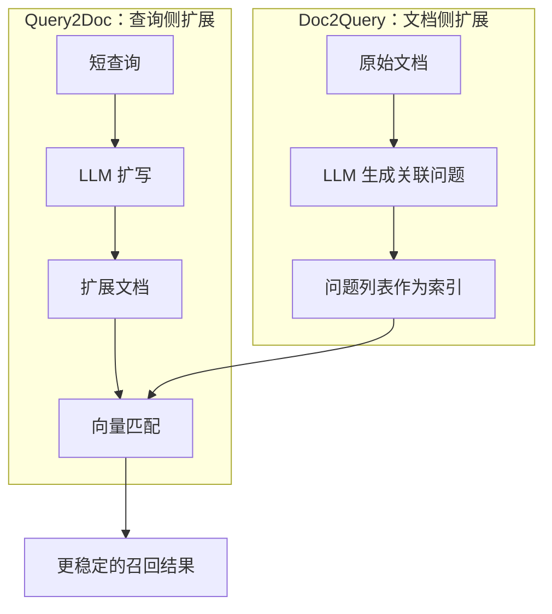
```mermaid
flowchart TD
    subgraph Q2D["Query2Doc：查询侧扩展"]
        Q["短查询"] --> EQ["LLM 扩写"]
        EQ --> ED["扩展文档"]
        ED --> EV["向量匹配"]
    end
    subgraph D2Q["Doc2Query：文档侧扩展"]
        D["原始文档"] --> GQ["LLM 生成关联问题"]
        GQ --> QL["问题列表作为索引"]
        QL --> EV
    end
    EV --> RES["更稳定的召回结果"]
```

#### Small-to-Big 索引策略

Small-to-Big 专治长文档场景。核心思路是用小规模内容（摘要、关键句或段落）建索引，检索命中后再通过链接回跳到完整的大规模内容，兼顾检索速度与上下文完整性：

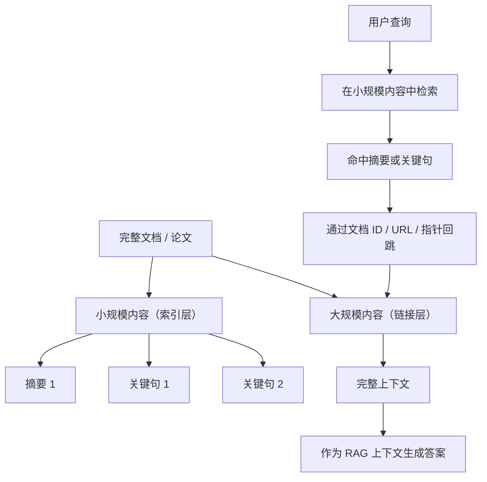
```mermaid
flowchart TD
    DOC["完整文档 / 论文"] --> SM["小规模内容（索引层）"]
    DOC --> LG["大规模内容（链接层）"]
    SM --> S1["摘要 1"]
    SM --> S2["关键句 1"]
    SM --> S3["关键句 2"]
    Q["用户查询"] --> SR["在小规模内容中检索"]
    SR --> HIT["命中摘要或关键句"]
    HIT --> LINK["通过文档 ID / URL / 指针回跳"]
    LINK --> LG
    LG --> BIG["完整上下文"]
    BIG --> GEN["作为 RAG 上下文生成答案"]
```

三个阶段可以概括为：**小规模内容检索**（查询先匹配摘要与关键句）、**链接到大规模内容**（通过预定义链接找到完整文档）、**上下文补充**（把完整内容作为上下文输入，生成更连贯的答案）。

以论文场景为例，索引层可以放"本文介绍了 Transformer 模型在机器翻译任务中的应用，并提出了改进的注意力机制"这样的摘要，也可以放"Transformer 模型通过自注意力机制实现了高效的并行计算"这样的关键句；检索命中后再链接到包含完整实验与结果分析的 PDF 全文。

### 本部分小结

高效召回的四种手段构成了一条由浅入深的优化路径：

1. **优化查询扩展（相似语义改写）**：用大模型把用户查询改写成多个语义相近的查询，提升召回多样性。
2. **混合检索**：结合向量检索和关键词检索的优势，通过归一化处理融合分数，提升召回质量。
3. **引入重排序**：用 BGE-Rerank 或 Cohere Rerank 对召回结果重排，提升问题与文档的相关性。
4. **改进检索算法**：利用知识图谱中的语义信息和实体关系，增强对查询和文档的理解。

课件举的例子很形象：面对"如何提高深度学习模型的训练效率？"，初步召回 10 篇文档，其中既包含"优化深度学习训练的技巧"这类高相关文章，也混入了"深度学习基础理论"这类低相关文章；经过 BGE-Rerank 重排，最相关的文档被提到最前，相关性较低的排到后面。检索链路的能力叠加关系如下：

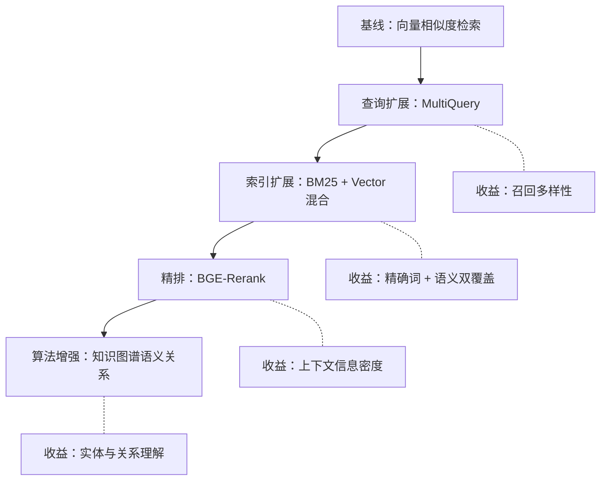
```mermaid
flowchart TD
    A["基线：向量相似度检索"] --> B["查询扩展：MultiQuery"]
    B --> C["索引扩展：BM25 + Vector 混合"]
    C --> D["精排：BGE-Rerank"]
    D --> E["算法增强：知识图谱语义关系"]
    B -.- B1["收益：召回多样性"]
    C -.- C1["收益：精确词 + 语义双覆盖"]
    D -.- D1["收益：上下文信息密度"]
    E -.- E1["收益：实体与关系理解"]
```

## 全局视野：GraphRAG（拓展）

前面所有优化都在"文本片段 + 语义相似度"的框架内做文章。但有一类问题，这个框架从原理上就答不好。GraphRAG 正是为此而生。

### 基线 RAG 的两个结构性短板

课件点明了两类基线 RAG 表现很差的场景：

- **连接点缺失**：问题的答案分散在文档的不同位置，彼此之间没有直接的语义重叠，纯向量检索很难把它们串联起来。
- **宏观理解缺失**：如果用户问"这篇文章的主旨是什么？"，基线 RAG 很难给出概括性的答案，因为它手里只有若干零散片段。

GraphRAG 的做法是用 LLM 从原始语料中抽出知识图谱，构建社区层级并为每个社区生成摘要，查询时再把这些结构化的中间产物喂给 LLM。相比基线 RAG，它在上述两类问题上都有明显改善。

一个流传很广的对比例子能直观说明差别。查询"19 世纪的艺术运动是如何影响 20 世纪现代艺术的发展的？"：

- **RAG 检索到的片段**：莫奈等印象派艺术家引入新技术改变了对光和颜色的描绘；印象派技法影响了后来的艺术运动；毕加索开创立体主义；立体主义出现在 20 世纪初。
- **RAG 回答**：像莫奈这样的印象派艺术家引入了影响后来艺术运动的新技术。毕加索在 20 世纪初开创了立体主义。
- **GraphRAG 检索到的关系链**：（莫奈）-[引进]→（新技术）-（新技术）-[革新]→（光和颜色的描绘）、（印象派技术）-[影响]→（后来的艺术运动）、（毕加索）-[开创]→（立体主义）、（立体主义）-[出现]→（20世纪初）
- **GraphRAG 回答**：莫奈引进的新技术彻底改变了对光和色彩的描绘。他的印象派技巧影响了后来的艺术运动，包括 20 世纪初出现的毕加索的立体主义。这种影响有助于塑造毕加索对碎片化视角的创新方法。

差别在于：RAG 拿到的是四条并列的事实片段，模型只能把它们罗列出来；GraphRAG 拿到的是带方向的关系链，模型可以沿着"谁影响了谁"的路径做因果推理。

### 索引构建：把非结构化文本变成结构化图谱

索引构建是 GraphRAG 中最"重"的一步。课件给出的步骤是：

1. **切片**（Source Text to TextUnits）：把文档切分成文本块。
2. **抽取**（Extract Graph）：使用 LLM 从文本块中提取实体（人、地、物）、关系（谁做了什么）和主张（Claim）。
3. **聚类与摘要**（Community Detection & Summarization）：使用 Leiden 算法对图谱做层级聚类形成社区，再自下而上为每个社区生成摘要。

第三步的层级结构，课件用了一个很贴切的比喻：给原本零散的数据建立了一套从"村委会"到"市政府"再到"中央"的层级汇报体系。查询宏观问题时看高层摘要，查询具体实体时看底层细节。

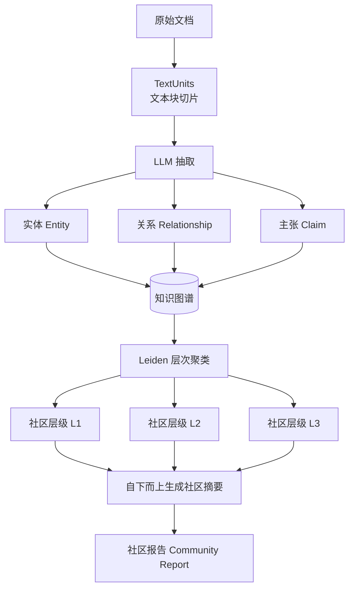
```mermaid
flowchart TD
    SRC["原始文档"] --> TU["TextUnits<br/>文本块切片"]
    TU --> EX["LLM 抽取"]
    EX --> EN["实体 Entity"]
    EX --> RE["关系 Relationship"]
    EX --> CL["主张 Claim"]
    EN --> KG[("知识图谱")]
    RE --> KG
    CL --> KG
    KG --> LE["Leiden 层次聚类"]
    LE --> C1["社区层级 L1"]
    LE --> C2["社区层级 L2"]
    LE --> C3["社区层级 L3"]
    C1 --> SUM["自下而上生成社区摘要"]
    C2 --> SUM
    C3 --> SUM
    SUM --> CR["社区报告 Community Report"]
```

完整的索引数据流分为六个阶段：

| 阶段     | 内容           | 关键动作                                                     |
| -------- | -------------- | ------------------------------------------------------------ |
| 第一阶段 | 组合 TextUnits | 将输入文档转换为 TextUnits，块大小和分组方式可配置           |
| 第二阶段 | 知识图谱提取   | 分析每个 TextUnit，提取实体、关系和主张；`entity_extract` 动词负责实体与关系，`claim_extract` 动词负责主张 |
| 第三阶段 | 知识图谱增强   | 使用层次 Leiden 算法做社区检测，使用 Node2Vec 算法做图谱嵌入 |
| 第四阶段 | 社区总结       | 使用 LLM 为每个社区生成摘要，形成社区报告                    |
| 第五阶段 | 文档处理       | 为知识模型创建"文档"表，CSV 数据源可追加自定义字段           |
| 第六阶段 | 网络可视化     | 执行 UMAP 降维，在 2D 空间中可视化知识图谱，UMAP 嵌入作为"节点"表发出 |

GraphRAG 的知识模型包含多种类型：Document、TextUnit、Entity、Relationship、Covariate、Community Report 和 Node。

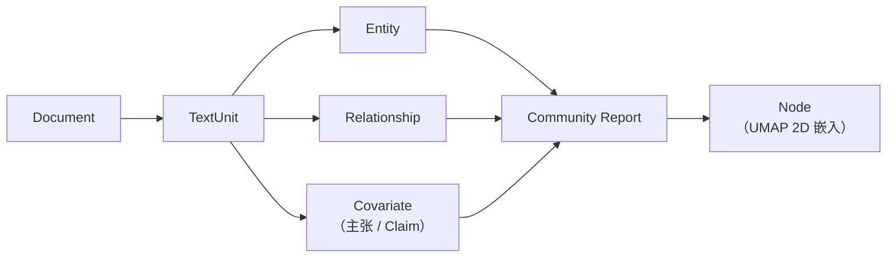
```mermaid
flowchart LR
    DOC["Document"] --> TU["TextUnit"]
    TU --> ENT["Entity"]
    TU --> REL["Relationship"]
    TU --> COV["Covariate<br/>（主张 / Claim）"]
    ENT --> COM["Community Report"]
    REL --> COM
    COV --> COM
    COM --> NODE["Node<br/>（UMAP 2D 嵌入）"]
```

在实体与关系提取环节有一个容易被忽视但很关键的工程细节：**合并具有相同名称和类型的实体，以及具有相同源和目标的关系**。语料里同一实体往往有多种写法，不做归并就会在图谱中产生大量重复节点。此外，实体的简要概述通过询问 LLM 获得，而"实体解析"（把指向同一现实实体的不同名称归并）这一功能默认并未启用，需要按需开启。

### 部署与运行

GraphRAG 由微软开源，仓库地址为 `https://github.com/microsoft/graphrag`。课件给出的落地步骤如下：

```bash
# Step1 下载源代码
git clone https://github.com/microsoft/graphrag.git

# Step2 下载依赖并初始化项目（自动基于 pyproject.toml 安装 python 包）
pip install -e .

# Step3 初始化配置，生成 prompts、.env、settings.yaml
graphrag init --root .

# Step5 将待检索的文档放到 ./input 目录下

# Step6 创建索引（耗时较长，取决于文本大小）
graphrag index --root .

# Step7 查询
graphrag query --root . --method global --query "和曹操相关的人物都有哪些?"
python -m graphrag.query --root ./cases --method local "和曹操相关的人物都有哪些?"
```

初始化后生成三个关键产物：

- `settings.yaml`：主配置文件，包含 LLM 模型配置（默认使用 OpenAI 的 `gpt-4-turbo-preview` 和 `text-embedding-3-small`）、输入输出设置（从 `input` 读文本，结果存 `output`，缓存到 `cache`，日志到 `logs`）、向量存储（默认 LanceDB）、图抽取与社区报告等工作流配置、以及 `local_search` / `global_search` / `drift_search` 等查询设置。
- `.env`：环境变量文件，形如 `GRAPHRAG_API_KEY=<API_KEY>`，替换为实际密钥即可。
- `prompts/`：一批生成好的 prompt 模板文件。

索引完成后会在 `./cache` 下生成若干文件夹，供后续提问复用。课件也提示了一个实际的版本坑：更新到最新版 graphrag 后运行可能报错，需要修改 litellm 源码。

### 两种查询模式：Global 与 Local

GraphRAG 提供两种查询模式，面向完全不同的问题类型。

#### Global Query：宏观问题的 Map-Reduce

全局查询回答"《三国演义》的主题是什么"这类需要纵观整个语料库的问题。它用社区层级摘要作为上下文，以 Map-Reduce 方式生成响应：

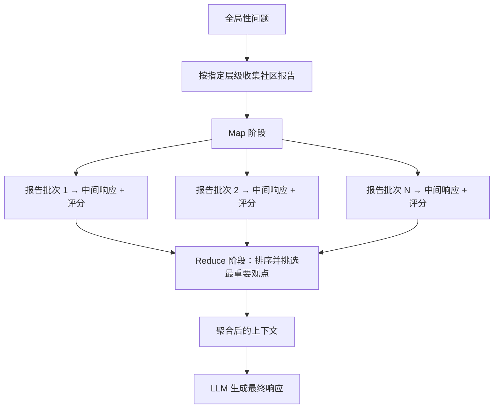
```mermaid
flowchart TD
    Q["全局性问题"] --> RS["按指定层级收集社区报告"]
    RS --> MAP["Map 阶段"]
    MAP --> B1["报告批次 1 → 中间响应 + 评分"]
    MAP --> B2["报告批次 2 → 中间响应 + 评分"]
    MAP --> B3["报告批次 N → 中间响应 + 评分"]
    B1 --> RED["Reduce 阶段：排序并挑选最重要观点"]
    B2 --> RED
    B3 --> RED
    RED --> CTX["聚合后的上下文"]
    CTX --> FIN["LLM 生成最终响应"]
```

Map 阶段把社区报告切成文本块，每块生成带数值评级的中间响应；Reduce 阶段挑出最重要的点聚合成最终上下文。这个设计的直观理解是：**越宏观的问题需要越宏观的视角和信息来回答**。代价是这种查询方式资源密集，需要多次调用 LLM。

#### Local Query：微观问题的实体扩展

本地查询回答"洋甘菊有哪些治疗特性？"这类针对特定实体的问题。它从知识图谱中识别出与用户输入语义相关的一组实体，再以这些实体为起点扩展检索：

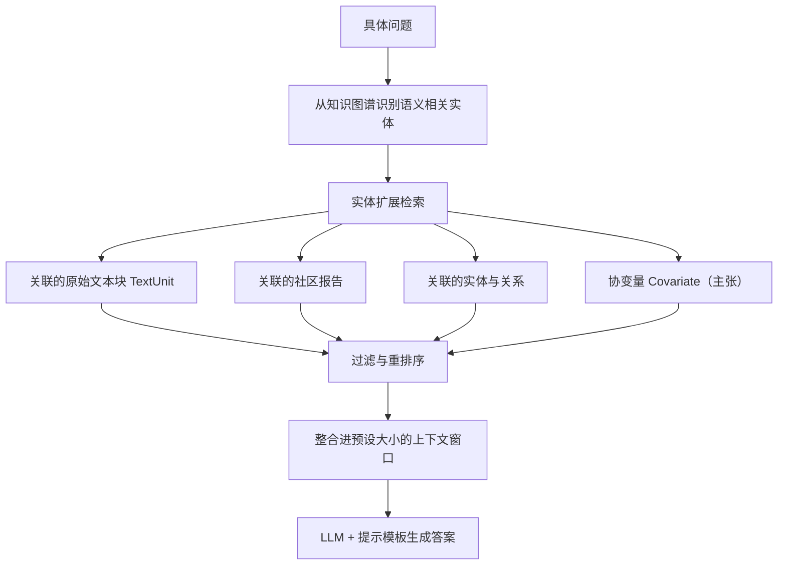
```mermaid
flowchart TD
    Q["具体问题"] --> ID["从知识图谱识别语义相关实体"]
    ID --> EX["实体扩展检索"]
    EX --> R1["关联的原始文本块 TextUnit"]
    EX --> R2["关联的社区报告"]
    EX --> R3["关联的实体与关系"]
    EX --> R4["协变量 Covariate（主张）"]
    R1 --> FIL["过滤与重排序"]
    R2 --> FIL
    R3 --> FIL
    R4 --> FIL
    FIL --> CTX["整合进预设大小的上下文窗口"]
    CTX --> GEN["LLM + 提示模板生成答案"]
```

本地查询结合了知识图谱的结构化数据与原始文档的非结构化数据，适合需要理解文档中特定实体的问题，且只需一次 LLM 调用。

#### 两种模式的全面对比

| 对比维度     | Global 模式                                                  | Local 模式                                                   |
| ------------ | ------------------------------------------------------------ | ------------------------------------------------------------ |
| 适用场景     | 支持全局型查询任务，回答基于高层语义理解的概要性问题，如"数据集中的主要主题是什么？" | 针对具体事实的提问，回答关于特定实体的信息与关系             |
| 查询架构     | 采用分布式计算中的 Map-Reduce 架构                           | 结合知识图谱结构化信息与原始文档的非结构化数据构建上下文     |
| 查询过程     | 1. MAP：根据用户问题与对话历史，查询指定层次结构上的所有社区报告，分批生成带评分的中间响应（RIR）；2. Reduce：对中间响应排序，挑选最重要观点汇总作为参考上下文，交由 LLM 生成最终结果 | 1. 根据查询问题与对话历史，从知识图谱中识别最相关实体；2. 从这些实体出发提取关联的原始文本块、社区、实体与关系，经排序筛选形成参考上下文；3. 借助 LLM 与提示模板，输入上下文与原始问题，生成最终响应 |
| 数据来源     | 主要基于社区报告                                             | 包括知识图谱中的实体、关系、社区报告以及原始文本块           |
| LLM 调用特点 | 需要多次调用，先为每个社区的 summary 生成答案，再汇总所有答案生成最终结果 | 一次调用，将构建好的上下文与原始问题一起输入                 |
| 上下文规模   | 由于使用社区报告且需 Map-Reduce 处理，上下文规模较大         | 相比基线 RAG 会产生更大的上下文                              |
| 查询成本     | 非常高，需要处理大量上下文并多次调用 LLM                     | 高，需要多种信息构建上下文                                   |

两种模式在答案生成路径上的差别可以这样理解：**Local 答案生成**针对具体问题，通过结合元素和元素摘要生成初步答案，这些答案来源于图谱中的特定社区；**Global 答案生成**面向需要涵盖整个数据集的全局性问题，采用 Map-Reduce 机制把所有社区的初步答案组合起来。

#### 查询参数调优

课件列出了影响"匹配到的实体和关系数量"的一系列环境变量，核心几项如下：

| 环境变量                                                     | 含义                                                         | 默认值 |
| ------------------------------------------------------------ | ------------------------------------------------------------ | ------ |
| `GRAPHRAG_LOCAL_SEARCH_TOP_K_ENTITIES`                       | 从实体描述嵌入存储中检索的相关实体数                         | 10     |
| `GRAPHRAG_LOCAL_SEARCH_TOP_K_RELATIONSHIPS`                  | 引入上下文窗口的网络关系数量                                 | 10     |
| `GRAPHRAG_LOCAL_SEARCH_COMMUNITY_PROP`                       | 上下文窗口用于社区报告的比例                                 | 0.1    |
| `GRAPHRAG_LOCAL_SEARCH_TEXT_UNIT_PROP`                       | 上下文窗口用于相关文本单位的比例                             | 0.5    |
| `GRAPHRAG_LOCAL_SEARCH_MAX_TOKENS`                           | 本地搜索上下文的最大 token 数（按模型上限调整，8k 模型建议 5000） | 12000  |
| `GRAPHRAG_LOCAL_SEARCH_CONVERSATION_HISTORY_MAX_TURNS`       | 包含在对话历史中的最大轮次数                                 | 5      |
| `GRAPHRAG_GLOBAL_SEARCH_MAX_TOKENS`                          | 全局搜索上下文的最大 token 数                                | 12000  |
| `GRAPHRAG_GLOBAL_SEARCH_MAP_MAX_TOKENS`                      | Map 阶段单批的最大 token 数                                  | 500    |
| `GRAPHRAG_GLOBAL_SEARCH_REDUCE_MAX_TOKENS`                   | Reduce 阶段的最大 token 数（8k 模型建议 1000~1500）          | 2000   |
| `GRAPHRAG_GLOBAL_SEARCH_CONCURRENCY`                         | 全局搜索并发度                                               | 32     |
| `GRAPHRAG_LLM_MAX_RETRIES` / `GRAPHRAG_EMBEDDING_MAX_RETRIES` | 请求失败时的最大重试次数                                     | 20     |

调优的抓手很清楚：想引入更多实体和关系，就提高 `TOP_K_ENTITIES` 与 `TOP_K_RELATIONSHIPS`；上下文超限，就下调对应的 `MAX_TOKENS`；需要并行加速，就调整 `CONCURRENCY`。这些参数必须和自己所用模型的 token 上限匹配——课件反复强调"根据你的模型的标记限制进行更改"。

### 什么时候该上 GraphRAG

GraphRAG 的能力提升伴随明确的成本上升：索引阶段要做全量实体与关系抽取，查询阶段 Global 模式还要多次调用 LLM。因此它更适合这样的场景：

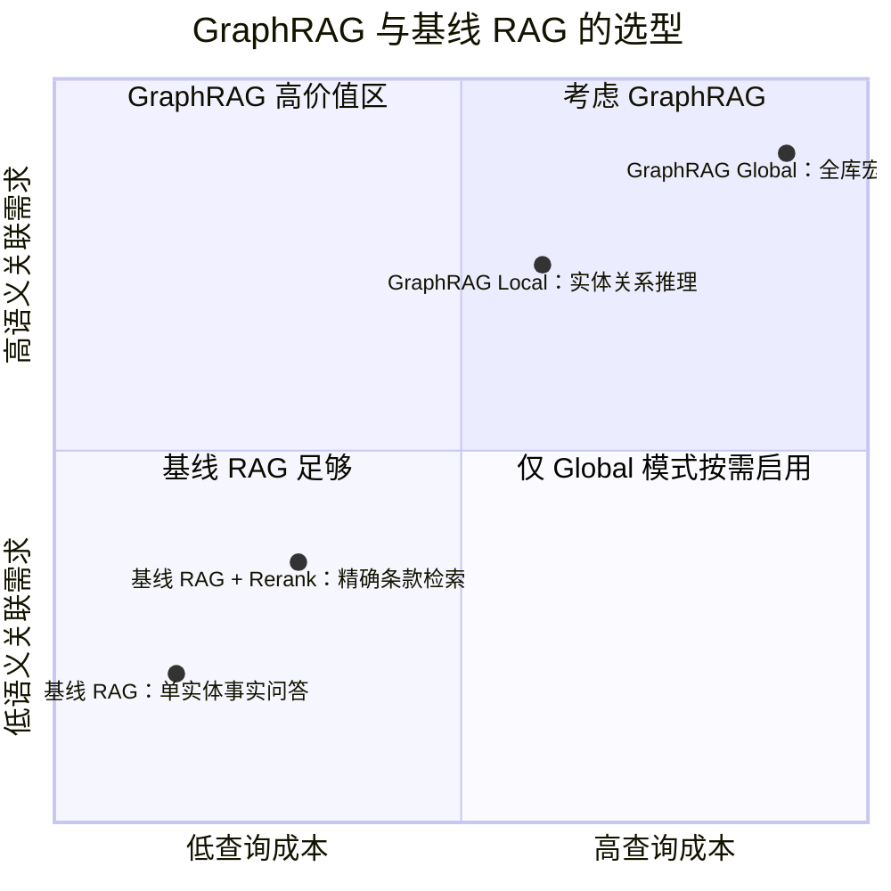
```mermaid
quadrantChart
    title GraphRAG 与基线 RAG 的选型
    x-axis "低查询成本" --> "高查询成本"
    y-axis "低语义关联需求" --> "高语义关联需求"
    quadrant-1 "考虑 GraphRAG"
    quadrant-2 "GraphRAG 高价值区"
    quadrant-3 "基线 RAG 足够"
    quadrant-4 "仅 Global 模式按需启用"
    "基线 RAG：单实体事实问答": [0.15, 0.2]
    "基线 RAG + Rerank：精确条款检索": [0.3, 0.35]
    "GraphRAG Local：实体关系推理": [0.6, 0.75]
    "GraphRAG Global：全库宏观综述": [0.9, 0.9]
```

如果业务问题集中在"某条规定是什么""某个参数是多少"这类单点事实，基线 RAG 配合混合检索与 Rerank 已经足够，引入图谱只会徒增复杂度。当问题开始变成"这几件事之间有什么关联""整个语料的核心议题是什么"时，GraphRAG 才真正开始体现出它的不可替代性。

## 整体调优路线回顾

把三条主线放回同一张图上，可以看到它们各自解决的问题层次：

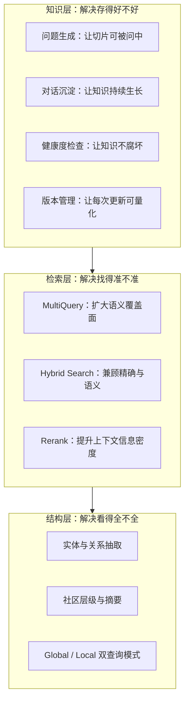
```mermaid
flowchart TD
    subgraph L1["知识层：解决存得好不好"]
        K1["问题生成：让切片可被问中"]
        K2["对话沉淀：让知识持续生长"]
        K3["健康度检查：让知识不腐坏"]
        K4["版本管理：让每次更新可量化"]
    end
    subgraph L2["检索层：解决找得准不准"]
        R1["MultiQuery：扩大语义覆盖面"]
        R2["Hybrid Search：兼顾精确与语义"]
        R3["Rerank：提升上下文信息密度"]
    end
    subgraph L3["结构层：解决看得全不全"]
        G1["实体与关系抽取"]
        G2["社区层级与摘要"]
        G3["Global / Local 双查询模式"]
    end
    L1 --> L2 --> L3
```

这套方法的落地顺序也有讲究。**先治理知识库**——因为知识本身缺失或过时，再强的检索算法也找不出不存在的答案。**再优化召回链路**——切分、多查询、混合检索、Rerank 逐步叠加，每一步都要有可量化的评估指标支撑。**最后按需引入图谱**——只有当业务问题真正涉及跨文档关联和全局理解时，GraphRAG 的投入才划得来。

从代码层面看，这条路线在三个目录中留下的资产可以直接复用：`CASE-知识库处理` 提供了四个可独立运行的知识库治理脚本，`CASE-高效召回` 提供了从基线到"多查询 + 混合检索 + Rerank"的完整递进实现，`CASE-rerank` 提供了重排序模型的直接验证方法。把它们按业务需要组合起来，一套可评估、可迭代的 RAG 调优体系就成型了。
