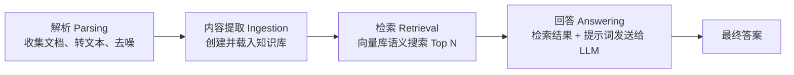
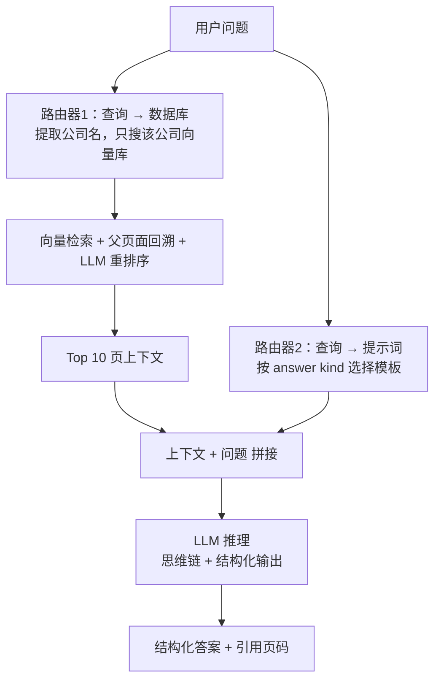
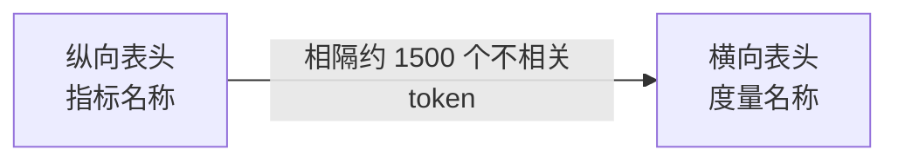
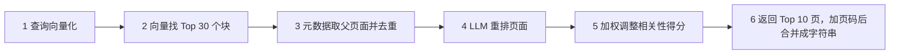
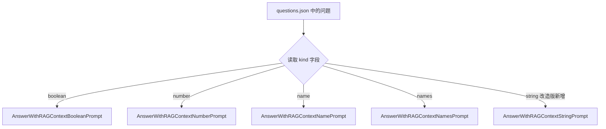
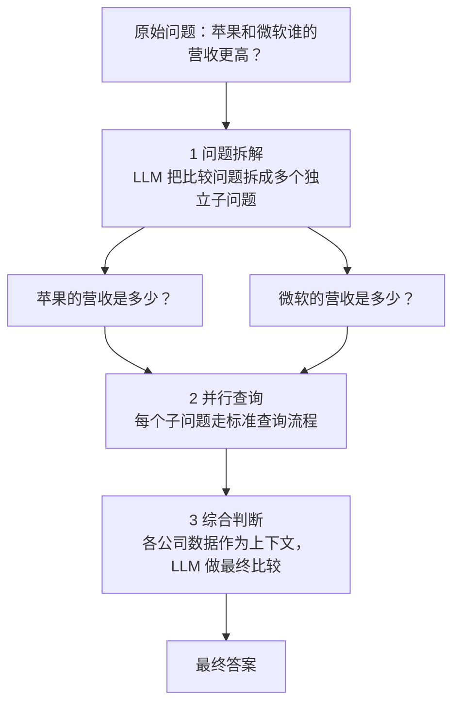
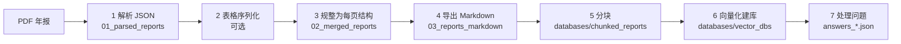
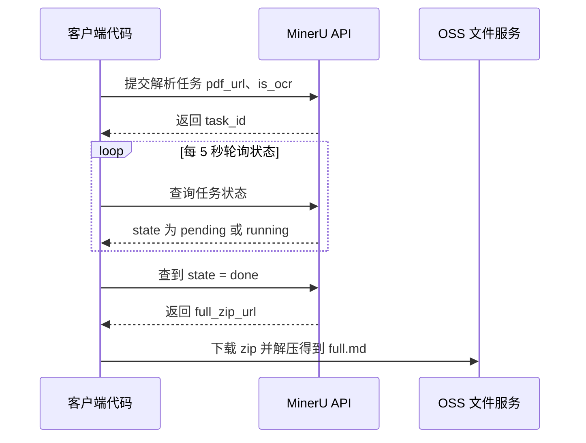
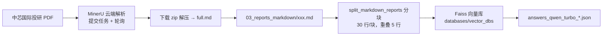
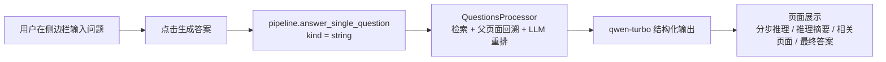

<!-- more -->


### 1. 项目背景与比赛任务

#### 1.1 企业RAG挑战赛

比赛仓库：https://github.com/trustbit/enterprise-rag-challenge

比赛任务是基于公司年度报告构建一个问答系统，比赛当天的流程如下：

- 收到随机挑选公司的 100 份年度报告，需在 2.5 小时内解析这些报告并构建数据库；报告为 PDF 格式，每份最长可达 1000 页
- 系统随后生成 100 个随机问题（基于预设模板），RAG 系统必须尽快作答
- 所有问题都有确定的答案，例如：是/否、公司名称（某些情况下是多个公司名）、领导职位头衔、推出的产品名称、数值指标（营收、商店数量等）
- 每个答案都必须注明引用的页码，确保系统从原文得出答案，而不是输出虚假信息（hallucinate）

#### 1.2 冠军方案 RAG-Challenge-2

参考项目：https://github.com/IlyaRice/RAG-Challenge-2

RAG-Challenge 系统在比赛中赢得了所有类别的奖项，在处理公司年度报告问答上表现突出。这是竞赛代码，功能完善但存在一些临时方案，比如 IBM Watson 集成部分是竞赛特定的，脱离比赛环境无法正常工作。

系统特点：

- 定制 PDF 解析：使用 Docling 解析 PDF 文档
- 向量搜索与父文档检索：通过向量搜索实现文档检索
- LLM 重排序：利用 LLM 对检索结果重新排序，提高上下文相关性
- 结构化输出提示：采用链式推理（chain-of-thought reasoning）进行结构化输出
- 查询路由：支持多公司比较的查询路由功能

获胜方案在 native RAG 的基础上，加入了两个路由器（router）和 LLM 重排序模块（LLM reranking），在 retrieval、generation 以及总分上都取得了不错的成绩，采用 o3-mini 进行推理。

#### 1.3 工作区中的两个项目

| 维度       | RAG-Challenge-2-main（原版）                                 | RAG-cy（改造版）                                           |
| ---------- | ------------------------------------------------------------ | ---------------------------------------------------------- |
| 数据集     | `data/test_set`（5 份英文年报）+ `data/erc2_set`（完整竞赛集） | `data/stock_data/pdf_reports`（9 份中芯国际投研/财报 PDF） |
| 解析方式   | Docling 本地解析 → JSON → Markdown                           | MinerU 云端解析，直接产出 `full.md`                        |
| 问题类型   | boolean / number / name / names 模板题                       | 5 道 `kind = string` 的开放式中文问题                      |
| 模型与接口 | OpenAI（o3-mini、GPT-4o 等）、`text-embedding-3-large`       | DashScope：`qwen-turbo-latest`、`text-embedding-v1`        |
| 分块方式   | 按 token 分块（`split_all_reports`，JSON 输入）              | 按行分块（`split_markdown_reports`，30 行/块，重叠 5 行）  |
| 结果去向   | `answers_*.json` 提交文件                                    | `answers_qwen_turbo_*.json` + Streamlit 界面展示           |
| 交互方式   | 命令行（`python -m src.pipeline`、`main.py`）                | 命令行 + `app_streamlit.py` 可视化界面                     |

两个项目的 `docs/src_modules_overview.md` 对 `src` 各模块的职责说明一致，改造集中在 `pipeline.py`、`pdf_mineru.py`、`text_splitter.py`、`prompts.py`、`api_requests.py` 与新增的前端文件。

### 2. 基础RAG系统流程

基础 RAG 系统的开发流程分为四个环节：

- 解析（Parsing）：为知识库准备数据，包括收集文档、将其转换为文本格式，并清理无关的噪点信息
- 内容提取（Ingestion）：创建并载入知识库
- 检索（Retrieval）：根据用户查询查找并返回相关数据，通常在向量数据库中进行语义搜索
- 回答（Answering）：将检索到的数据 + 用户的提示词发送给 LLM，返回最终答案



### 3. 冠军方案总体架构

冠军方案在基础 RAG 之上增加了两个路由：一个把查询路由到数据库（定位到具体公司的向量库），一个把查询路由到提示词（按答案类型选择模板）；中间穿插父页面检索与 LLM 重排序。



### 4. 解析模块（Parsing）

#### 4.1 解析的挑战

需要将 PDF 文档转换为纯文本，这远非易事，充满无数细微难题：

- 保留表格结构
- 保留关键的格式元素（例如标题和项目符号列表）
- 识别多栏文本
- 处理图表、图片、公式、页眉/页脚等
- 大型表格有时会旋转 90 度，导致解析器产生乱码

#### 4.2 解析器选型

作者尝试了 20 多种解析器：小众解析器、知名解析器、基于前沿机器学习算法训练的解析器、支持 API 访问的商业解析器，最终选择了 Docling 作为 PDF 解析器。

没有任何解析器可以处理所有细微之处，并在不丢失重要信息的情况下把 PDF 内容完全还原为文本，因此解析之后还需要人工检查与后处理。

#### 4.3 Docling 优化

尽管 Docling 的结果非常优秀，但它缺乏一些基本能力。作者研究了 Docling 源代码并重写了几个方法以满足需求：

- 解析后得到一个包含所有必要元数据的 JSON 文件
- 利用这个 JSON 构建 Markdown 文档，表格结构从 PDF 转换为 Markdown 甚至 HTML
- 部分文本解析出来时会出错、包含特定语法，降低可读性；使用十几个正则表达式处理这类问题

原版 `src/pdf_parsing.py` 负责调用 Docling 输出标准 JSON，支持并行处理、元数据补全与页码校验，是数据流的起点。

#### 4.4 表格序列化的验证

大型表格中，度量名称（横向表头）通常离纵向表头太远，两者之间可能隔着 1500 个不相关 token，削弱了语义连贯性：



大型表格的挑战：

- 理论上，大表格会降低向量搜索中 chunk 的相关性，同时存在表格不能完全装进一个 chunk 的情况
- LLM 处理大表格时很难把度量名称与表头对应起来，可能返回错误的值
- 表格序列化（Serialization of tables）成为候选方案，可参考 Row-wise Serialization、Attribute-Value Pairing 等思路（论文：https://arxiv.org/pdf/2402.17944）

格式选择上，最初以 Markdown 格式向 LLM 输入表格，后来改用 HTML：语言模型对 HTML 的理解程度高得多，而且 HTML 可以描述合并单元格、子标题和其他复杂结构的表格。序列化代码见 `src/tables_serialization.py`。

结论：在测试不同配置时可以发现，被寄予厚望的表格序列化不仅没有改进系统，反而略微降低了有效性——实际使用上没有启用表格序列化（`use_serialized_tables = False`）。

### 5. 内容提取（Ingestion）

#### 5.1 分块策略

报告已从 PDF 转换为 Markdown 文本，接下来用它们创建数据库。根据比赛规则必须指明包含相关信息的页码，企业系统也采用同样的方法：引用能验证模型的答案是否为虚假信息，既让用户更透明，也简化了调试。

如何切分文档？用一页作为一个 chunk，还是 300 个 token 作为一个 chunk？

- 最简单的选择是把整页作为块，因为页面很少超过几千个 token
- 但要再思考查询与文本块之间的语义连贯性：能回答问题的信息片段通常不超过十个句子，一个包含目标语句的小段落，会比同样语句稀释在一整页较弱相关文本中获得更高的相似度得分

因此方案是：将每页文本分割成 300 个 token（约 15 个句子）的块，每个块都存储其 ID 及其在元数据（metadata）中的父页面编号——这为后面的父页面检索埋下伏笔。

原版实现见 `src/text_splitter.py` 的 `split_all_reports`（对每页 JSON 分块，输出仍是 JSON，保存到 `databases/chunked_reports`）。改造版针对 Markdown 新增了按行分块，见第 11 节。

#### 5.2 向量化

如果有 100 家公司的文档，是创建一个 Faiss 数据库，还是 100 个 Faiss 数据库？答案是：100 个数据库，其中 1 个数据库 = 1 个文档。

- 没有必要把所有公司信息混合在一起，之后再试图把一个公司的收入与另一个公司区分开
- 以公司为单位建库结构更清晰：想看哪个公司的情况，直接从该 Faiss 库检索

Faiss 数据库使用 `IndexFlatIP` 方法创建：

- 优点：所有向量"原样"存储，没有压缩或量化，搜索使用暴力搜索，精度更高
- 缺点：计算和内存消耗更高

为了把块和查询嵌入到向量表示中，原版使用 `text-embedding-3-large`（实际项目中可按需求替换）；改造版切换到 DashScope 的 `text-embedding-v1`：

```python
# RAG-cy/src/retrieval.py（节选）
elif self.embedding_provider == "dashscope":
    import dashscope
    rsp = dashscope.TextEmbedding.call(
        model="text-embedding-v1",
        ...
    )
```

### 6. 检索（Retrieval）与重排序

#### 6.1 基础检索与混合搜索的取舍

RAG 系统中的 R（检索）是一个通用的搜索系统：接收查询作为输入，返回回答所需的相关文本。基础实现中，它只是对向量数据库发起查询，提取 Top N 个结果。

检索是 RAG 的关键部分：如果 LLM 在上下文中没有收到必要信息，它就无法提供正确答案（无论提示词多精心）——垃圾进，垃圾出（Garbage in → Garbage out）。

常用策略是混合搜索（Hybrid search）：vDB + BM25 结合向量语义与传统关键词搜索，将两种方法的结果合并后再重排序。理论上它通过同时考虑语义与精确关键词匹配来提高检索准确性，但在基础实现中，混合搜索通常会降低检索质量而不是提高——所以项目默认关闭 BM25（`use_bm25_db = False`），代码中保留了 `BM25Retriever` 与 `HybridRetriever` 供对比实验。

#### 6.2 重排序的两种路线

课件中介绍了 Jina Reranker 这类专用重排序模型的特点：

- 细粒度语义分析：交叉编码器架构对查询和文档联合编码，捕捉 token 级交互，弥补余弦相似度在语义理解上的不足
- 多阶段检索优化：向量检索初步召回后二次重排，LlamaIndex 测试中命中率提升 7.9%，MRR 提升 33.7%
- 多语言支持：支持 100 多种语言，在 MKQA 基准中表现优于 bge-reranker-v2-m3 等同类模型
- Agentic RAG 增强：可识别结构化数据查询意图（如 MySQL/MongoDB），为 API 调用生成相关性评分
- 推理速度快：Flash Attention 2 优化，v2 比前代快 6 倍、比 bge-reranker-v2-m3 快 15 倍，参数量仅 278M

Jina Reranker 和 bge-m3 都是常用 Reranking 模型，但比赛中作者使用的是 LLM 重排序。

#### 6.3 LLM 重排序的实现

思路：让 LLM 对查询结果进行格式化输出，包含两个字段——`reasoning`（让模型解释其判断）和 `relevance_score`（可直接从 JSON 中提取）。修正后的相关性得分使用加权平均计算：

```text
final_score = 0.3 × 向量相似度 + 0.7 × LLM 相关性得分
vector_weight = 0.3
llm_weight    = 0.7
```

理论上可以直接跳过向量搜索，把每一页都传给 LLM；但用 embedding 做更便宜、更快速的过滤仍然是必要的——对于一份 1000 页的文档，仅仅回答一个问题就可能花费约 25 美分，太昂贵。

重排序提示词（节选自课件）：

```text
你是一个RAG检索重排专家。
你将收到一个查询和一个检索到的文本块，请根据其与查询的相关性进行评分。
评分说明：
1. 推理：分析文本块与查询的关系，简要说明理由。
2. 相关性分数（0-1，步长0.1）：
   0 = 完全无关
   0.1 = 极弱相关
   ...
   0.9 = 高度相关
   1 = 完全匹配
3. 只基于内容客观评价，不做假设。
```

对应的结构化输出 Schema 定义在 `src/prompts.py`：

```python
class RetrievalRankingSingleBlock(BaseModel):
    """对检索到的单个文本块与查询的相关性进行评分。"""
    reasoning: str = Field(description="分析该文本块，指出其关键信息及与查询的关系")
    relevance_score: float = Field(
        description="相关性分数，取值范围0到1，0表示完全无关，1表示完全相关"
    )
```

#### 6.4 父页面检索（Parent Page Retrieval）

之前把文本分割成了小块，这里是否还需要引入父节点？

- 回答问题的核心信息通常集中在某个小块中（这也是分块能提升检索效果的原因），但同一页面的其他部分可能仍包含次要却重要的细节
- 实际应用中先检索出 Top N 个最相关文本块，这些块仅作为"指针"定位对应完整页面，随后把整个页面内容纳入上下文分析
- 这就是为什么每个块的元数据中都记录所属页面编号——以便快速回溯原始内容

#### 6.5 整合后的检索器

最终检索器的步骤：

1. 对查询进行向量化
2. 根据查询向量找到 Top 30 个相关块
3. 通过块的元数据提取对应的页面（记得去重）
4. 通过 LLM 重排序器处理这些页面
5. 调整页面的相关性得分
6. 返回得分最高的 Top 10 页，在每一页前面加上页码，并将它们合并成一个字符串



对应代码在 `src/retrieval.py`：`VectorRetriever.retrieve_by_company_name(..., return_parent_pages=True)` 负责回溯父页面并按页去重，`HybridRetriever` / 重排序逻辑在 `src/reranking.py` 中加权融合。

### 7. 增强（Augmentation）与提示词工程

#### 7.1 为什么单独管理提示词

向量数据库已建立、检索已完成，进入 RAG 中的 A（增强）部分。这部分相当直接，主要是 f-string 字符串拼接。真正需要设计的是提示词的存储方式：项目最终把提示词集中放在 `prompts.py` 中，并分割成四个逻辑块：

- 核心系统指令
- 定义 LLM 返回响应格式的 Pydantic schema
- 用于创建单次示例（one-shot）/少次示例（few-shot）的问答对示例
- 用于插入上下文和查询的模板

#### 7.2 四个逻辑块

**（1）核心系统指令**：告诉模型"你是谁、你要做什么、你要遵循哪些规则"。

```python
class AnswerWithRAGContextSharedPrompt:
    instruction = """
    你是一个RAG（检索增强生成）问答系统。
    你的任务是仅基于公司年报中RAG检索到的相关页面内容，回答给定问题。
    ...
    """
```

**（2）Pydantic schema**：定义输出的 JSON 格式，强制输出结构化内容，便于后续解析和校验。

```python
class AnswerSchema(BaseModel):
    step_by_step_analysis: str = Field(description="详细分步推理过程，至少5步，150字以上。")
    reasoning_summary: str = Field(description="简要总结推理过程，约50字。")
    relevant_pages: List[int] = Field(description="保持为空列表。")
    final_answer: Union[str, Literal["N/A"]] = Field(
        description="公司名称需与问题中完全一致。答案只能是单个公司名或'N/A'。"
    )
```

**（3）示例（one-shot / few-shot）**：给模型一个或几个"问题-答案"示例，帮助它学会想要的格式和风格。

```text
示例：
问题：
"下列公司中，哪家2022年总资产最低："A公司", "B公司", "C公司"？若无数据则排除。"
答案：
{
  "step_by_step_analysis": "...",
  "reasoning_summary": "...",
  "relevant_pages": [],
  "final_answer": "C公司"
}
```

**（4）模板**：动态插入上下文和问题，驱动实际问答。

```python
user_prompt = """
以下是上下文:
\"\"\"
{context}
\"\"\"
---
以下是问题：
"{question}"
"""
```

`prompts.py` 把所有与模型交互相关的提示词、格式、示例、模板集中管理，结构清晰、易于维护、可复用、易扩展，也是当前 RAG 项目的主流做法。

#### 7.3 按 kind 路由提示词

`prompts.py` 中有多种 prompt，代表不同的任务说明、结构化输出要求和示例：

- boolean：要求输出是/否，并分步推理
- number：要求输出数值，并分步推理
- name：要求输出实体名
- names：要求输出实体名列表
- string（改造版新增）：要求输出一段连贯文本

在主流程 `api_requests.py` 中，处理每个问题时会读取 `kind` 字段，再根据 `kind` 选择不同的 prompt 模板：



### 8. 生成（Generation）的关键技术

RAG 中的 G（生成）最耗费精力，需要巧妙地使用几种技术。

#### 8.1 技术1：把查询路由到数据库

这是 RAG 系统中最简单却最有用的部分。

- 比赛场景：每家公司都有独立向量库，问题中明确包含公司名，直接匹配即可定位数据库
- 实际应用：可能需要用模型提取实体或打标签来匹配数据库

核心逻辑一致：1. 提取公司名 → 2. 匹配对应数据库 → 3. 仅搜索该库。这样可将搜索范围缩小 100 倍，提升效率。

#### 8.2 技术2：把查询路由到提示词

比赛要求答案简洁且严格匹配指定数据类型（int/float/bool/str/list[str]），类似数据库存储格式。挑战在于：

- 每种类型有 3-6 个细节需处理（如去除货币符号、单位换算等）
- 规则越多，让模型一次性遵守所有规则越不可靠

解决方案：把复杂查询拆解为多个简单步骤，减少单次请求的规则数量，例如先提取原始数值、再单独处理货币单位转换。核心思路是：简化任务 → 降低模型认知负荷 → 确保格式零错误。

#### 8.3 技术3：复合查询路由

比赛中每个问题的预期响应类型是明确给定的，因此可以为每种数据类型预先设计专门的提示词模板，再通过简单的 if-else 逻辑自动选择对应版本——既保证格式精确，又实现高效自动化。

处理涉及多家公司的比较问题时，采用分步拆解：



这种模块化处理模式具有高度可扩展性，能灵活应对各类复杂比较查询。

#### 8.4 思维链（Chain of Thoughts, CoT）

思维链通过让模型在给出最终答案之前"出声思考"，显著提高答案质量。早期提示词工程中"一步步思考"（Think step by step）这类通用指令有帮助，但对复杂任务仍不足；较弱模型常出现"虚假推理"——先给答案再倒推理由，甚至捏造事实。为了确保 CoT 的作用，必须清晰引导模型如何推理：解释推理步骤、目标，并提供示例。

课件中的一个带模糊上下文的推理示例（问题：Ritter Pharmaceuticals Inc. 的研发设备按成本计是多少）：

1. 问题要求从资产负债表提取专门用于研发的设备的原始购置成本，不含累计折旧
2. 上下文（第 35 页）"不动产和设备，净额"为 12,500 美元——是净值且范围更广
3. 上下文（第 37 页）"机械和设备"的累计折旧为 110,000 美元——是折旧而非原始成本，且未说明用于研发
4. 两个指标都不完全符合请求的指标
5. 上下文没有提供仅用于研发设备的原始成本，且不允许假设、计算，因此答案是 "N/A"

#### 8.5 结构化输出（Structured outputs）

结构化输出是一种强制模型返回标准化格式（如 JSON/Pydantic schema）的方法，通过 API 传递 schema，确保输出始终符合预定结构。例如 LLM 重排序使用的 schema（见 6.3 节），有了它，模型总是返回包含两个字段的 JSON——第一个是字符串，第二个是数字。

#### 8.6 CoT + 结构化输出

两者可以理想地结合：在生成阶段，模型有一个专门用于推理的字段，还有一个单独字段用于最终答案——这样可以直接提取答案，而无需从冗长推理步骤中解析。回答比赛问题的主 schema 有四个字段：

- `step_by_step_analysis`：初步推理（思维链本身）
- `reasoning_summary`：前一个字段的精简摘要（便于跟踪模型逻辑）
- `relevant_pages`：答案引用的报告页码
- `final_answer`：按要求格式化后的简洁答案

#### 8.7 指令细化（Instruction Refinement）

回答问题时需要判断"答案的灵活范围"——比如问"CEO 是谁"，实际要包括哪些类似职位（总裁、董事总经理等）？现实中数据不完美，不同公司用不同头衔称呼负责人（美国叫 CEO，英国可能叫 MD），用户真正想知道的可能比字面意思更广，所以需要对 instruction 进行细化。

挑战：

1. 解释自由度：该把哪些边缘情况算作答案？硬标准只认"CEO"字眼；软标准包括相似职位（总裁/MD），但要划定界限
2. 如果没有找到答案该如何处理：比如问"股息政策有变吗？"，若报告未提及，该回答"无变更"还是"无信息"

解决方案：

- 提前与客户确定规则（如"接受 MD 作为 CEO 的答案吗？"）
- 收集大量边缘案例测试系统
- 灵活回答适合开放问答："Ethan Caldwell 是董事总经理（最接近 CEO 的角色），但目前因调查暂停职务……"
- 严格回答适合简答比赛：需预先定义是否允许"MD ≈ CEO"，否则可能输出错误简答

指令细化的工作量与整个数据准备阶段不相上下，需要无止境地迭代调试、校对答案以及手动分析模型的推理过程。

### 9. 提示词创建与系统调参

#### 9.1 用验证集创建提示词

比赛前一周，作者团队利用公开的问题生成器快速创建了 100 个问题的验证集，并手动回答这些问题，获得两个重要收益：

- 量化改进：验证集成为客观衡量系统性能的标准，通过统计正确率和错误模式，精准优化提示词和流程
- 发现隐性规则：手动分析暴露了问题中隐藏的细节和歧义，促使团队与专家确认回答规范，并将这些规则明确写入提示词指令

最终这些洞察被系统化地整合到提示词设计中，形成更严谨的指令框架。

#### 9.2 各类 prompt 实现

`prompts.py` 中每种 `kind` 都对应一个类，以 boolean 为例（节选）：

```python
class AnswerWithRAGContextBooleanPrompt:
    instruction = AnswerWithRAGContextSharedPrompt.instruction
    user_prompt = AnswerWithRAGContextSharedPrompt.user_prompt

    class AnswerSchema(BaseModel):
        step_by_step_analysis: str = Field(description="""
详细分步推理过程，至少5步，150字以上。特别注意问题措辞，避免被迷惑。
有时上下文中看似有答案，但可能并非所问内容，仅为相似项。
""")
        reasoning_summary: str = Field(description="简要总结分步推理过程，约50字。")
        relevant_pages: List[int] = Field(description="""
仅包含直接用于回答问题的信息页面编号。只包括：
- 直接包含答案或明确陈述的页面
- 强有力支持答案的关键信息页面
不要包含仅与答案弱相关或间接相关的页面。
列表中至少应有一个页面。
""")
        final_answer: Union[bool] = Field(description="""
一个从上下文中精确提取的布尔值（True或False），直接回答问题。
如果问题问某事是否发生，且上下文有相关信息但未发生，则返回 False。
""")

    pydantic_schema = re.sub(r"^ {4}", "", inspect.getsource(AnswerSchema), flags=re.MULTILINE)
    example = r"""
问题：
"'万科企业股份有限公司'年报是否宣布了分红政策变更？"
答案：
{
 "step_by_step_analysis": "...",
 "reasoning_summary": "年报显示分红金额变化但政策未变，答案为 False。",
 "relevant_pages": [12, 18, 45],
 "final_answer": false
}
"""
```

number 类型的 prompt 则强调"严格的指标匹配要求"：明确指标精确定义、检查上下文中所有可能指标、仅当含义完全一致才接受；范围不匹配、概念不等价、需要计算推导、聚合不匹配等情况一律返回 `N/A`，不允许猜测。

#### 9.3 系统调参（RunConfig）

拥有验证集不仅帮助改进提示词，也让整个系统受益。所有关键功能都被配置化，以便衡量实际效果并微调超参数：

```python
@dataclass
class RunConfig:
    # 运行流程参数配置
    use_serialized_tables: bool = False
    parent_document_retrieval: bool = False
    use_vector_dbs: bool = True
    use_bm25_db: bool = False
    llm_reranking: bool = False
    llm_reranking_sample_size: int = 30
    top_n_retrieval: int = 10
    parallel_requests: int = 1 # 并行的数量，需要限制，否则qwen-turbo会超出阈值
    pipeline_details: str = ""
    submission_file: bool = True
    full_context: bool = False
    api_provider: str = "dashscope" #openai
    answering_model: str = "qwen-turbo-latest"
    config_suffix: str = ""
```

（以上为 RAG-cy 改造版中的定义；原版默认 `api_provider = "openai"`，并保留 `team_email`、`submission_name` 等竞赛提交字段。）

通过配置不同超参数得到的关键结论之一：被寄予厚望的表格序列化不仅没有改进系统，反而降低了有效性。

原版 `pipeline.py` 中预置了多组配置，`main.py` 通过 `--config` 选择：

```bash
python main.py process-questions --config max_nst_o3m
# 可选：base / pdr / max / max_no_ser_tab / max_nst_o3m / max_st_o3m / ibm_llama70b / ibm_llama8b / gemini_thinking
```

- `max_nst_o3m`：表现最好的配置，使用 OpenAI o3-mini 推理
- `ibm_llama70b`：替代方案（IBM API 仅在竞赛期间可用）
- `gemini_thinking`：利用 Gemini 超长上下文做全上下文回答，实际上不算 RAG

### 10. 项目实战一：跑通 RAG-Challenge-2（原版）

#### 10.1 环境与运行方式

```bash
git clone https://github.com/IlyaRice/RAG-Challenge-2.git
cd RAG-Challenge-2
python -m venv venv
venv\Scripts\Activate.ps1  # Windows (PowerShell)
pip install -e . -r requirements.txt
# 将 env 重命名为 .env 并填入自己的 API KEY
```

运行整个流水线：把 `src/pipeline.py` 中想运行的方法取消注释，然后执行：

```bash
python -m src.pipeline
```

也可以用 `main.py` 分阶段运行（需在数据目录下执行）：

```bash
cd .\data\test_set\
python ..\..\main.py process-questions --config max_nst_o3m
```

`main.py` 提供的命令：`download-models`（下载 Docling 模型）、`parse-pdfs`（解析 PDF）、`serialize-tables`（表格序列化）、`process-reports`（处理报告）、`process-questions`（处理问题）。

#### 10.2 流水线七步

原版 `src/pipeline.py` 的 `__main__` 按顺序串联 7 个阶段：

```text
1. 解析PDF报告为结构化JSON，输出到 debug/data_01_parsed_reports
2. 序列化表格，输出到 debug/data_01_parsed_reports
3. 将解析后的JSON规整为更简单的每页markdown结构，输出到 debug/data_02_merged_reports
4. 导出规整后报告为纯markdown文本，仅用于人工复核或全文检索
5. 将规整后报告分块，便于后续向量化，输出到 databases/chunked_reports
6. 从分块报告创建向量数据库，输出到 databases/vector_dbs
7. 处理问题并生成答案，具体逻辑取决于 run_config
完成
```



#### 10.3 src 模块职责

| 模块                                | 职责                                                         |
| ----------------------------------- | ------------------------------------------------------------ |
| `api_requests.py`                   | 与各类模型 API 交互，封装消息发送、结构化输出、重试、计费等逻辑 |
| `api_request_parallel_processor.py` | 并发、限流地批量处理 API 请求，支持重试、速率控制和日志记录  |
| `ingestion.py`                      | `BM25Ingestor` 构建 BM25 索引；`VectorDBIngestor` 建立 Faiss 向量库 |
| `parsed_reports_merging.py`         | 把复杂解析 JSON 规整为每页文本结构，可导出 Markdown          |
| `pdf_parsing.py`                    | 调用 Docling 解析 PDF 为标准 JSON，支持并行、元数据补全、页码校正 |
| `pipeline.py`                       | 主流程调度，串联解析、序列化、规整、分块、向量化、问题处理各阶段 |
| `prompts.py`                        | 集中定义所有提示词与结构化输出 Schema（问答、重排、比较等）  |
| `questions_processing.py`           | 问题处理与答案生成：公司名抽取、检索调用、上下文构建、问答、引用页校验 |
| `reranking.py`                      | 基于 Jina API 和 LLM 的重排序，结合向量分数与 LLM 分数加权   |
| `retrieval.py`                      | BM25、向量、混合检索器，支持按公司名检索、父页面回溯与可选 LLM 重排 |
| `tables_serialization.py`           | 通过 LLM 把表格序列化为结构化信息块（可选开关）              |
| `text_splitter.py`                  | 按 Token 数分块，支持表格内容特殊处理                        |
| `questions_processing.py` 等        | 详见 `docs/src_modules_overview.md`                          |

#### 10.4 运行情况

项目自带的 `运行情况.txt` 记录了 `python -m src.pipeline` 的真实输出（节选）：

```text
PS D:\RAG-Challenge-2-main> python -m src.pipeline
root_path: D:\RAG-Challenge-2-main\data\test_set
1. 解析PDF报告为结构化JSON，输出到 debug/data_01_parsed_reports
INFO:src.pdf_parsing:Starting to process 5 documents
INFO:docling.document_converter:Going to convert document batch...
INFO:docling.document_converter:Initializing pipeline for StandardPdfPipeline with options hash 7d9a167221579fdb2d9ef48812d1110c
INFO:docling.models.factories:Loading plugin 'docling_defaults'
INFO:docling.models.factories:Registered ocr engines: ['easyocr', 'ocrmac', 'rapidocr', 'tesserocr', 'tesseract']
INFO:docling.utils.accelerator_utils:Accelerator device: 'cpu'
...
INFO:docling.pipeline.base_pipeline:Processing document 194000c9109c6fa628f1fed33b44ae4c2b8365f4.pdf
DEBUG:docling.pipeline.base_pipeline:Finished converting page batch time=510839.250
DEBUG:docling.pipeline.base_pipeline:Finished converting page batch time=510847.640
```

首次运行时会从 Hugging Face 下载 Docling 的版面模型、表格模型（Tableformer）等权重，Windows 下因符号链接限制会给出缓存降级警告，属正常提示。

#### 10.5 测试集与结果样例

`data/test_set` 包含 5 份年报、对应问题与样例答案（`answers_max_nst_o3m.json` 为获胜系统的样例输出）。`answers_max_nst_o3m_27.json` 中的一条结果（`details` 字段标注：Custom pdf parsing + vDB + Router + Parent Document Retrieval + reranking + SO CoT; llm = qwen-turbo）：

```json
{
  "question_text": "Did Mercia Asset Management PLC mention any mergers or acquisitions in the annual report?",
  "kind": "boolean",
  "value": "{\"step_by_step_analysis\": \"1. The question asks if Mercia Asset Management PLC mentioned any mergers or acquisitions in the annual report.\\n2. The text retrieved from multiple pages of the report was analyzed for terms related to mergers or acquisitions.\\n3. No explicit mention of mergers or acquisitions was found in the text.\\n4. The report discusses investments, divestitures, and portfolio developments but does not reference any mergers or acquisitions.\", \"reasoning_summary\": \"The annual report does not mention any mergers or acquisitions.\", \"relevant_pages\": [], \"final_answer\": false}",
  "references": [
    { "pdf_sha1": "ac9aa244462c80705c3ff046542c02c459989742", "page_index": 55 }
  ]
}
```

可以看到结构化输出的完整落地：分步推理、推理摘要、引用页码、最终布尔值都在一个 JSON 里，程序可以直接解析 `final_answer` 入库。

### 11. 项目实战二：打造自己的RAG系统（RAG-cy）

改造目标：把冠军方案改造为面向中文投研文档的企业知识库系统，包括替换模型接口、替换解析器、更新中文知识库与问题清单、支持开放式问题（kind=string）、搭建前端页面。

#### 11.1 中文知识库与问题清单

将多份投研报告存放到 `data/stock_data/pdf_reports`，当前知识库包含 9 份中芯国际相关文档：

- 【财报】中芯国际 2024 年年度报告
- 【上海证券】中芯国际深度研究报告：晶圆制造龙头，领航国产芯片新征程
- 【东方证券】产能利用率提升，持续推进工艺迭代和产品性能升级
- 【中原证券】【光大证券】【兴证国际】【华泰证券】【国信证券】等机构的季报点评/研究报告
- 中芯国际机构调研纪要

针对知识库提问，问题清单存放在 `data/stock_data/questions.json`：

```json
[
  { "text": "中芯国际在晶圆制造行业中的地位如何？其服务范围和全球布局是怎样的？", "kind": "string" },
  { "text": "半导体行业有哪些关键特性，这些特性如何助力中芯国际发展？", "kind": "string" },
  { "text": "中芯国际的营收和利润情况近期有何变化？影响因素是什么？", "kind": "string" },
  { "text": "中芯国际的收入结构有何变化？尤其是在中国大陆和北美市场的表现如何？", "kind": "string" },
  { "text": "美国对中国半导体产业的限制政策对中芯国际有何影响？中芯国际如何应对？", "kind": "string" }
]
```

#### 11.2 接入 DashScope 模型接口

用 DashScope API KEY 替换原有 OpenAI 接口，使用 `qwen-turbo-latest` 作为 LLM，`text_embedding_v1` 作为 embedding 模型，对应 `RunConfig`：

```python
parallel_requests: int = 1 # 并行的数量，需要限制，否则qwen-turbo会超出阈值
api_provider: str = "dashscope" #openai
answering_model: str = "qwen-turbo-latest"
```

`parallel_requests` 需要限流，否则 qwen-turbo 会超出调用阈值。

#### 11.3 用 MinerU 替换 Docling 解析

原有的 pipeline 处理过程较复杂（JSON → 规整 → Markdown），改造后简化为：解析直接产出 Markdown。新增 `src/pdf_mineru.py`，调用 MinerU 在线解析 API。

提交解析任务：

```python
import requests
import time
import zipfile
api_key = '你的api_key'   # 替换为自己的 MinerU API KEY

def get_task_id(file_name):
    url = 'https://mineru.net/api/v4/extract/task'
    header = {
        'Content-Type': 'application/json',
        "Authorization": f"Bearer {api_key}".format(api_key)
    }
    pdf_url = 'https://vl-image.oss-cn-shanghai.aliyuncs.com/pdf/' + file_name
    data = {
        'url': pdf_url,
        'is_ocr': True,
        'enable_formula': False,
    }
    res = requests.post(url, headers=header, json=data)
    task_id = res.json()["data"]['task_id']
    return task_id
```

轮询结果并下载解压：

```python
def get_result(task_id):
    url = f'https://mineru.net/api/v4/extract/task/{task_id}'
    header = {
        'Content-Type': 'application/json',
        "Authorization": f"Bearer {api_key}".format(api_key)
    }
    while True:
        res = requests.get(url, headers=header)
        result = res.json()["data"]
        state = result.get('state')
        err_msg = result.get('err_msg', '')
        # 如果任务还在进行中，等待后重试
        if state in ['pending', 'running']:
            print("任务未完成，等待5秒后重试...")
            time.sleep(5)
            continue
        if err_msg:
            print(f"任务出错: {err_msg}")
            return
        if state == 'done':
            full_zip_url = result.get('full_zip_url')
            if full_zip_url:
                local_filename = f"{task_id}.zip"
                r = requests.get(full_zip_url, stream=True)
                with open(local_filename, 'wb') as f:
                    for chunk in r.iter_content(chunk_size=8192):
                        if chunk:
                            f.write(chunk)
                unzip_file(local_filename)   # 下载完成后自动解压
            return

def unzip_file(zip_path, extract_dir=None):
    if extract_dir is None:
        extract_dir = zip_path.rstrip('.zip')
    with zipfile.ZipFile(zip_path, 'r') as zip_ref:
        zip_ref.extractall(extract_dir)
```

调用入口（`pipeline.export_reports_to_markdown(file_name)` 已改写为）：

```python
task_id = pdf_mineru.get_task_id(file_name)
print(f"task_id: {task_id}")
pdf_mineru.get_result(task_id)
```



文件也可以先上传到 URL，或使用本地的 MinerU 进行解析。`RAG-cy/data/stock_data/debug_data/03_reports_markdown/` 中可以看到解析产出的 Markdown（如《中芯国际 2024 年年度报告.md》）。

#### 11.4 Markdown 分块改造

原代码对 JSON 进行切分（`split_all_reports`），改造后对 `text_splitter.py` 新增两个函数，按行切分 Markdown：

```python
def split_markdown_reports(self, all_md_dir: Path, output_dir: Path,
                           chunk_size: int = 30, chunk_overlap: int = 5,
                           subset_csv: Path = None):
    """
    批量处理目录下所有markdown文件，分块并输出为json文件到目标目录。
    支持通过 subset.csv 补充公司名、sha1 等元信息。
    :param all_md_dir: md文件目录
    :param output_dir: 输出目录
    :param chunk_size: 每块最大行数
    :param chunk_overlap: 分块重叠行数
    :param subset_csv: 可选，文件名到公司名映射表
    """

def split_markdown_file(self, md_path: Path, chunk_size: int = 30,
                        chunk_overlap: int = 5) -> List[Dict]:
    """
    按行分割markdown文件，每个分块记录起止行号和内容，
    适合处理结构化较强的md文本。
    """
```

`pipeline.chunk_reports()` 中调用 `text_splitter.split_markdown_reports`，对文档切分后保存到 `stock_data/databases/chunked_reports`，随后 `create_vector_dbs()` 生成向量库。



#### 11.5 新增 kind = string 开放式问答

原程序实现了 `AnswerWithRAGContextNumberPrompt`、`AnswerWithRAGContextBooleanPrompt`、`AnswerWithRAGContextNamesPrompt`、`ComparativeAnswerPrompt`。在此基础上新增 `AnswerWithRAGContextStringPrompt`，用于回答一段文本的开放性问题（`RAG-cy/src/prompts.py`）：

```python
class AnswerWithRAGContextStringPrompt:
    instruction = AnswerWithRAGContextSharedPrompt.instruction
    user_prompt = AnswerWithRAGContextSharedPrompt.user_prompt

    class AnswerSchema(BaseModel):
        step_by_step_analysis: str = Field(description="""
详细分步推理过程，至少5步，150字以上。请结合上下文信息，逐步分析并归纳答案。
""")
        reasoning_summary: str = Field(description="简要总结分步推理过程，约50字。")
        relevant_pages: List[int] = Field(description="""
仅包含直接用于回答问题的信息页面编号。只包括：
- 直接包含答案或明确陈述的页面
- 强有力支持答案的关键信息页面
不要包含仅与答案弱相关或间接相关的页面。
列表中至少应有一个页面。
""")
        final_answer: str = Field(description="""
最终答案为一段完整、连贯的文本，需基于上下文内容作答。
如上下文无相关信息，可简要说明未找到答案。
""")

    pydantic_schema = re.sub(r"^ {4}", "", inspect.getsource(AnswerSchema), flags=re.MULTILINE)
    example = r'''
示例：
问题：
"请简要总结'万科企业股份有限公司'2022年主营业务的主要内容。"

答案：
{
  "step_by_step_analysis": "1. 问题要求总结2022年万科企业股份有限公司的主营业务。\n2. 年报第10-12页详细描述了公司主营业务，包括房地产开发、物业服务等。\n3. 结合上下文，归纳出主要业务板块。\n4. 重点突出房地产开发和相关服务。\n5. 形成简明扼要的总结。",
  "reasoning_summary": "年报10-12页明确列出主营业务，答案基于原文归纳。",
  "relevant_pages": [10, 11, 12],
  "final_answer": "万科企业股份有限公司2022年主营业务包括房地产开发、物业服务、租赁住房、物流仓储等，核心业务为住宅及商业地产开发与运营。"
}
'''

    system_prompt = build_system_prompt(instruction, example)
    system_prompt_with_schema = build_system_prompt(instruction, example, pydantic_schema)
```

对应的 kind 分发逻辑加入 `src/api_requests.py`：

```python
elif schema == "string":
    system_prompt = (
        prompts.AnswerWithRAGContextStringPrompt.system_prompt_with_schema
        if use_schema_prompt else prompts.AnswerWithRAGContextStringPrompt.system_prompt
    )
    response_format = prompts.AnswerWithRAGContextStringPrompt.AnswerSchema
    user_prompt = prompts.AnswerWithRAGContextStringPrompt.user_prompt
```

#### 11.6 Streamlit 可视化界面

界面搭建思路：找一个不错的 RAG 系统界面截屏作为风格参考（项目根目录的 `UI界面参考-之前.png`、`UI界面参考-完成.png`），用 Streamlit 复刻；后台调用类似 `pipeline.process_questions()` 的流程，默认 `kind = string`，只需单个问题即可，然后把结果显示在界面上。

`app_streamlit.py` 的核心逻辑：

```python
root_path = Path("data/stock_data")
pipeline = Pipeline(root_path, run_config=max_config)

# 左侧输入区
with st.sidebar:
    st.header("查询设置")
    user_question = st.text_area("输入问题", "请简要总结公司2022年主营业务的主要内容。", height=80)
    submit_btn = st.button("生成答案", use_container_width=True)

if submit_btn and user_question.strip():
    with st.spinner("正在生成答案，请稍候..."):
        answer = pipeline.answer_single_question(user_question, kind="string")
        # 逐层解析 content → final_answer JSON
        content = answer_dict.get("content", answer_dict)
        content = content.get("final_answer", "")
        ...
        st.markdown("**分步推理：**");   st.info(step_by_step)
        st.markdown("**推理摘要：**");   st.success(reasoning_summary)
        st.markdown("**相关页面：** ");  st.write(relevant_pages)
        st.markdown("**最终答案：**");   st.markdown(final_answer)
```

为支撑单条问题即时推理，`pipeline.py` 新增了 `answer_single_question`，内部带计时输出：

```python
def answer_single_question(self, question: str, kind: str = "string"):
    """
    单条问题即时推理，返回结构化答案（dict）。
    kind: 支持 'string'、'number'、'boolean'、'names' 等
    """
    processor = QuestionsProcessor(
        vector_db_dir=self.paths.vector_db_dir,
        documents_dir=self.paths.documents_dir,
        questions_file_path=None,   # 单问无需文件
        ...
        parallel_requests=1,
        api_provider=self.run_config.api_provider,
        answering_model=self.run_config.answering_model,
    )
    answer = processor.process_single_question(question, kind=kind)
    return answer
```

界面搭建是一个逐步调试的过程：先是输出结果没有正确解析，完善解析后结果正确但检索时间过长，仍需进一步优化。



#### 11.7 运行结果

改造版 `src/pipeline.py` 的 `__main__` 指向 `data/stock_data`，执行 `python -m src.pipeline` 会打印各阶段：

```text
root_path: .../data/stock_data
4. 将pdf转化为纯markdown文本
5. 将规整后报告分块，便于后续向量化，输出到 databases/chunked_reports
6. 从分块报告创建向量数据库，输出到 databases/vector_dbs
7. 处理问题并生成答案，具体逻辑取决于 run_config
完成
```

（首次跑通时的 Docling 解析日志同样记录在 `RAG-cy/运行情况.txt` 中。）

问答结果保存在 `data/stock_data/answers_qwen_turbo_20_debug.json`，5 道问题全部成功：

```json
{
  "total_questions": 5,
  "error_count": 0,
  "na_count": 0,
  "success_count": 5
}
```

其中第一个问题的结构化回答（节选）：

```json
{
  "question_text": "中芯国际在晶圆制造行业中的地位如何？其服务范围和全球布局是怎样的？",
  "kind": "string",
  "value": {
    "step_by_step_analysis": "1. 问题询问中芯国际在晶圆制造行业的地位，以及其服务范围和全球布局。\n2. 在年报中，明确提到中芯国际是世界领先的集成电路晶圆代工企业之一，也是中国大陆集成电路制造业的领导者。\n3. 报告中还提到中芯国际在全球晶圆代工企业中排名第二，在中国大陆企业中排名第一。\n4. 服务范围方面，中芯国际提供8英寸和12英寸晶圆代工与技术服务，并且为客户提供设计服务与IP支持、光掩模制造等一站式配套服务。\n5. 全球布局方面，中芯国际的客户服务团队覆盖上海、北京、天津、深圳、中国台湾、美国加州、德国慕尼黑、意大利米兰、日本东京等多个国家和地区。\n6. 综合以上信息，可以总结出中芯国际在行业中的领先地位及其服务范围和全球布局。",
    "reasoning_summary": "年报明确指出中芯国际是世界领先的晶圆代工企业之一，同时提供了其服务范围和全球布局的相关信息。",
    "relevant_pages": [0],
    "final_answer": "中芯国际是世界领先的集成电路晶圆代工企业之一，也是中国大陆集成电路制造业的领导者。根据2024年全球纯晶圆代工企业的销售额数据，中芯国际位居全球第二，在中国大陆企业中排名第一。公司主要提供8英寸和12英寸晶圆代工与技术服务，并为客户提供设计服务与IP支持、光掩模制造等一站式配套服务。其客户服务团队覆盖上海、北京、天津、深圳、中国台湾、美国加州、德国慕尼黑、意大利米兰、日本东京等多个国家和地区，展现了广泛的全球布局。"
  },
  "references": [
    { "pdf_sha1": "stock_10001", "page_index": 0 }
  ]
}
```

这条结果完整体现了 CoT + 结构化输出的四字段设计：分步推理、推理摘要、相关页码、最终答案一次给齐，界面与程序都能直接消费。

### 12. 小结

系统化方法胜过"神奇方案"：成功并非依赖单一突破性技术，而是通过系统化的流程优化，结合并精细调整多种技术。关键因素包括：

- 高质量解析：确保数据预处理精准、结构化
- 高效检索：优化检索效率与准确性
- 智能路由：动态分配查询到最合适的处理模块
- LLM 重排序：对检索结果重新排序，显著提升相关性
- 提示词设计：精心设计的提示词让紧凑模型也能发挥出色性能

RAG 的优化是一个精细化工程问题，问答结果高度依赖对任务细节的深入理解；通过精准微调每个环节（解析、检索、路由、排序等），即使简单技术也能实现显著效果。

围绕本次实战的两个实践方向：

- 跑通 RAG-Challenge：系统性理解高质量解析、高效检索、智能路由、LLM 重排序、提示词设计五大模块，并阅读 `src` 下 `pipeline.py`、`prompts.py`、`retrieval.py`、`reranking.py`、`ingestion.py`、`text_splitter.py` 等核心实现
- 打造自己的 RAG 系统：接入 DashScope 接口、用 MinerU 替换 Docling 解析、用中文投研报告重建知识库与问题清单、为开放式问题补充 `kind = string`、用 Streamlit 搭建前端页面
