<!-- more -->


## 第 0 章 导读与工程速览

### 0.1 问题的起点

RAG（Retrieval-Augmented Generation，检索增强生成）在过去两年几乎成了"让大模型接入私有知识"的默认答案。但工程实践中，它反复暴露出三类问题：

1. **切碎了就拼不回来**——文档被切成固定大小的 Chunk，主题边界被破坏，跨页引用、表格、代码逻辑全部断裂。
2. **检索是"系统行为"，不是"模型行为"**——搜索策略、召回数量在系统上线前就写死了，LLM 只能被动接收 Top-k，不参与任何检索决策。
3. **知识是静态的**——新增文档只是"多了一份搜索素材"，知识之间的关联、摘要、实体关系不会随之更新。

而"超长上下文""Agentic Retrieval""LLM Wiki"这三条路线，恰好分别瞄准了这三点。

### 0.2 配套工程速览：Agentic Search

本文的工程样本是工作区中的 **Agentic Search**——一个基于 Qwen 模型推理决策的多源企业搜索系统。它的技术栈与规模如下：

| 层次     | 文件                 | 规模     | 职责                                             |
| -------- | -------------------- | -------- | ------------------------------------------------ |
| 表现层   | `app.py`             | 275 行   | Streamlit 界面 + 全流程可视化                    |
| 推理层   | `core/agent.py`      | 988 行   | ReAct 主循环、13 个工具定义与分派                |
| 模型层   | `core/llm.py`        | 60 行    | Qwen 客户端（OpenAI 兼容协议，含 tool_calls）    |
| 日志层   | `core/logger.py`     | 149 行   | 单例日志 + JSONL 结构化落盘                      |
| 引擎层   | `engines/*.py`       | 5 个引擎 | SQLite / Chroma / Whoosh / 代码库 / 企业系统 SDK |
| 配置层   | `config.py`          | 23 行    | 路径、模型、`MAX_SEARCH_ROUNDS = 20`             |
| 数据种子 | `seed_data_large.py` | 1578 行  | 生成全部演示数据与代码仓库                       |

工程内**实测**的数据规模（本文所有数字均来自对 `data/` 目录的实际统计，非估算）：

| 数据源            | 明细                                                         | 合计                      |
| ----------------- | ------------------------------------------------------------ | ------------------------- |
| SQLite 结构化库   | 员工 100 / 部门 15 / 项目 50 / 合同 40 / 产品 40             | **245 条记录**            |
| Chroma 向量库     | `company_info` 38 / `tech_docs` 32 / `meeting_notes` 181     | **251 条向量**            |
| Whoosh 关键词索引 | `policies` 60 / `tech_articles` 50                           | **110 篇文档**            |
| 代码仓库          | 30 个 `.py` + Dockerfile / compose / requirements 等         | **34 个文件**             |
| 企业系统 SDK      | HR 4 / 财务 5 / 项目 3 / Wiki 3 个 action                    | **4 个系统 15 个 action** |
| Agent 工具        | `database_*`、`vector_*`、`keyword_*`、`code_*`、`enterprise_*`、`log_search` | **13 个工具**             |

> **为什么这个样本值得研究？**
> 它同时具备两个罕见特征：**（1）** 它是一个**真正跑起来的 Agentic Retrieval 实现**——不是伪代码，而是含工具定义、参数校验、错误降级、过程追踪的完整链路；**（2）** 它的检索引擎层是**混合检索的天然底座**——BM25 关键词、向量语义、结构化 SQL、代码检索四类能力并存，这恰好是第 4 章 LLM Wiki 所需索引体系的前置条件。

### 0.3 全文结构关系

> **图 1｜全文结构关系**

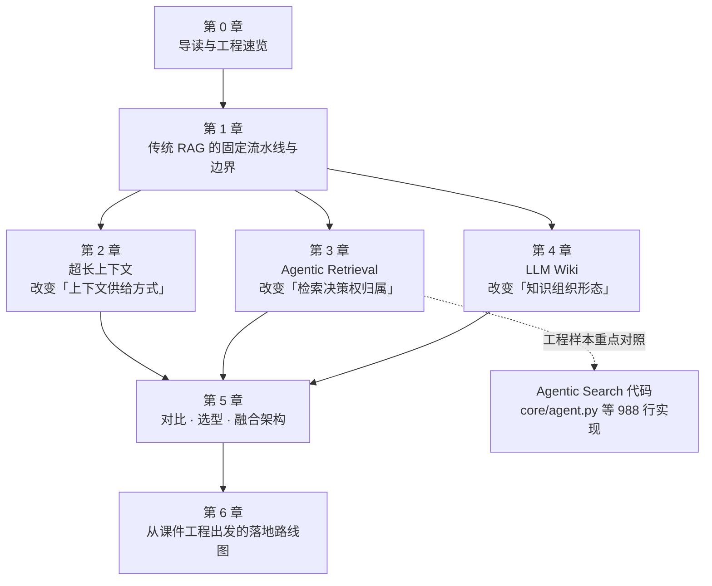

---

## 第 1 章 起点：传统 RAG 的固定流水线与它的边界

### 1.1 RAG 的五段式流水线

传统 RAG 的本质是一条**线性、固定、不可协商**的流水线：

> **图 2｜传统 RAG 的五段式流水线**

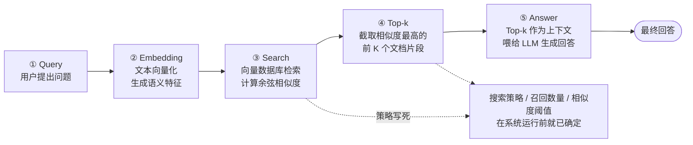

这条流水线有三个**固化点**，它们共同决定了 RAG 的能力天花板：

| 固化点           | 具体表现                                                     | 导致的后果                                         |
| ---------------- | ------------------------------------------------------------ | -------------------------------------------------- |
| **策略固化**     | 用向量检索还是关键词检索、是否重排、是否混合，全在上线前决定 | 面对"精确单号查询"和"模糊概念问答"用同一套策略     |
| **召回数量固化** | `top_k=5` 就是一个魔法数字，改它需要重新评估整条链路         | 简单问题召回过多引入噪声，复杂问题召回不足丢失证据 |
| **时机固化**     | 只要有 Query，就必然检索一次，且只检索一次                   | 无法"先想想再搜"，也无法"搜完发现不对再搜"         |

### 1.2 LLM 在 RAG 中的真实角色：被动总结者

这是最容易被忽视的一点。在传统 RAG 中：

> 强大的大语言模型（LLM）仅仅充当了"**文本总结者**"的角色，完全被动地读取检索结果，不参与任何检索决策。

模型的能力被限制在流水线的最后一环。它可以很好地"把给定的材料组织成通顺的回答"，但它**没有机会**表达"你给我的材料不对，我应该去查另一个数据源"。

这形成了巨大的能力错配：**我们用一个具备推理、规划、反思能力的模型，去做一件只需要阅读理解的事。**

### 1.3 三个失效点 → 三条替代路线

把上面三个固化点翻译成"失效场景"，三条替代路线的针对性就非常清晰了：

> **图 3｜从 RAG 的三个失效点到三条替代路线**

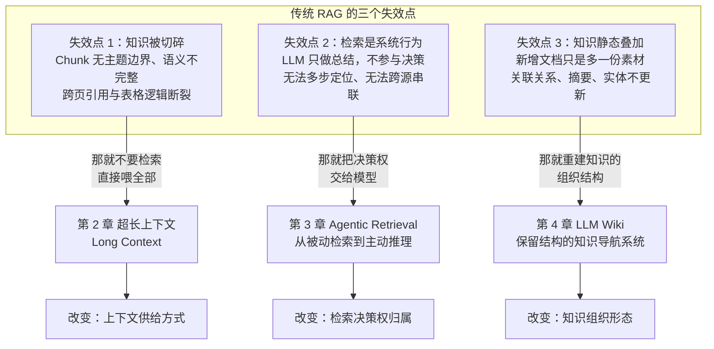

**这三条路线并不互斥**。它们作用于知识系统的不同层次，因此在第 5 章我们会看到：一个成熟的企业知识系统，往往是三者按比例组合的产物。

### 1.4 三大技术定位对照

在深入每一章之前，先建立一张全局对照表，后续各章会逐格展开：

| 维度             | 超长上下文                 | Agentic Retrieval             | LLM Wiki                         |
| ---------------- | -------------------------- | ----------------------------- | -------------------------------- |
| **核心主张**     | 绕过检索，全量投喂         | 检索即推理，模型自主决策      | 保留结构，构建可导航知识空间     |
| **改变的层次**   | 上下文供给                 | 检索决策                      | 知识组织                         |
| **一句话记忆**   | 读一遍、单文件、不改了     | 查多步、跨系统、找根因        | 要沉淀、强关联、常更新           |
| **成本特征**     | Token 成本随上下文长度激增 | 推理轮次带来延迟与 Token 成本 | 摄入期（Ingest）一次性工程成本高 |
| **最大风险**     | 注意力衰减、成本不可控     | 循环不收敛、步数失控          | 级联更新震荡、实体命名漂移       |
| **企业级成熟度** | 适合特定场景，非通用解     | 已在故障排查、跨系统咨询落地  | 工程复杂度最高，长期收益最大     |

---

## 第 2 章 超长上下文 (Long Context)

### 2.1 核心逻辑：绕过检索，直接"喂"整个文档库

超长上下文技术的核心逻辑非常直观：利用大模型不断扩展的"记忆容量"，**直接把完整的文档库作为上下文输入**，从根本上绕过传统 RAG 架构中的检索与拼接步骤。

> **图 4｜传统模式与超长上下文模式的工作流对比**

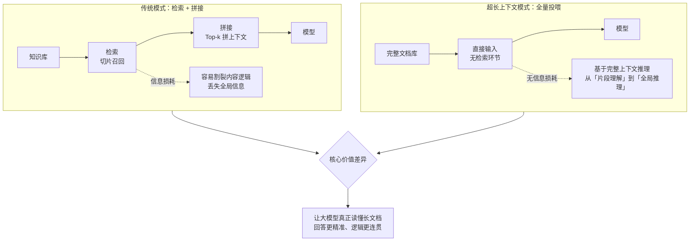

**支持的海量知识库类型**（课件列举）：

- **复杂文本**：产品说明书、法律合同、财务年报
- **代码与记录**：完整代码仓库、数小时的会议记录

### 2.2 理论窗口 ≠ 有效窗口

这是超长上下文最需要警惕的认知陷阱。课件给出的核心洞察是：

> 大模型宣传的上下文窗口长度多为**理论最大值**，受注意力衰减等影响，**实际有效利用率仅约 25%**。

也就是说，一个标称 128K 的模型，在需要"均匀利用全文信息"的任务上，可靠工作区间可能只有 32K 左右。这带来两个直接推论：

1. **不能按标称窗口做容量规划**。若按 128K 设计"全量投喂"方案，实际会在 30K～40K 附近开始出现信息丢失。
2. **训练策略比窗口数字更重要**。既然有效利用率受注意力机制约束，那么**预训练与扩展阶段的训练策略与数据投入，才是决定长文本处理能力的核心变量**。

### 2.3 长窗口是怎么"炼"出来的：预训练基础 vs 扩展策略

课件对主流模型的窗口训练路径做了拆解，结论相当反直觉：**主流模型绝大多数预训练是在 4K 窗口上完成的**，长窗口能力主要靠后期扩展"补"出来。

> **图 5｜主流模型的长窗口训练路径**

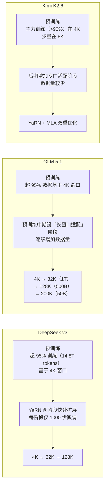

**课件结论**：

> 主流模型多以 4K 窗口完成绝大多数预训练，通过 YaRN 等技术快速扩展。**扩展阶段的数据量与技术适配，是拉开长文本能力差距的关键。**

### 2.4 训练窗口的演进差异：原生超长窗口成为新标杆

进一步对比不同代际模型的**预训练窗口分布**，能看到一条清晰的路线分叉：

| 模型                  | 预训练窗口分布                   | 特点                                                     |
| --------------------- | -------------------------------- | -------------------------------------------------------- |
| **GLM 5.1**           | >95% 数据在 4K 窗口完成          | 典型传统模式，主要依赖后期长窗口适配                     |
| **Kimi K2.6**         | 主力训练（>90%）在 4K，少量在 8K | 与 GLM 5.1 策略相似，仍以小窗口训练为基础                |
| **DeepSeek v4 Flash** | 小窗口仅占 3.125%                | **96.875% 数据在 64K/1M 完成，真正的原生超长上下文训练** |
| **DeepSeek v4 Pro**   | 小窗口推测占比 <6%               | 延续原生超长窗口路线，绝大部分数据在 64K/1M 训练         |

> **图 6｜传统路线与原生超长窗口路线**


**课件总结**：

> 原生超长窗口训练正成为行业新标杆。这表明，在预训练阶段"喂饱"长上下文数据，而非仅在微调阶段做适配，是提升大模型长文本能力的核心路径。

### 2.5 成本模型：为什么"全量投喂"在企业级不成立

这是课件中"无法替代的局限"里最硬的一条。原文表述是"**Token 消耗随上下文长度大幅增加，企业规模化应用难以承受**"。我们把这句话量化一下。

设知识库总量为 $N$ 个 Token，单次问答需要把知识库作为上下文输入：

- **单次请求的输入成本** ∝ $N$
- 若一次会话有 $Q$ 个问题，总输入成本 ∝ $N \times Q$
- 更关键的是**自注意力机制的平方复杂度**：计算开销 ∝ $N^2$

| 知识库规模                    | 约合 Token（按 1 页 ≈ 500 token 估） | 单次请求上下文 | 可行性判断         |
| ----------------------------- | ------------------------------------ | -------------- | ------------------ |
| 一份 20 页合同                | ≈ 1 万                               | 1 万           | ✅ 完全可行         |
| 一套产品说明书（200 页）      | ≈ 10 万                              | 10 万          | ⚠️ 接近有效窗口上限 |
| 一个中型代码仓库（1000 文件） | ≈ 200 万                             | 200 万         | ❌ 超出任何商用窗口 |
| 企业制度库（1 万份文档）      | ≈ 500 万                             | 500 万         | ❌ 超出两个数量级   |
| 课件提到的极端情况            | **10TB 级**                          | —              | ❌ 结构性不可行     |

> **关键判断**：超长上下文的成本是**随知识库规模线性增长**的，而 RAG 的检索成本几乎是**常数级**（只与 Top-k 有关）。这个结构性差异决定了：**知识库越大，超长上下文越不可行**。

### 2.6 能力边界：注意力衰减与"中间遗忘"

除了成本，还有一条质量层面的硬约束：**模型存在"中间遗忘"（Lost in the Middle）效应，无法稳定、均匀地利用超长文本中的所有信息。**

> **图 7｜注意力衰减与「中间遗忘」效应**

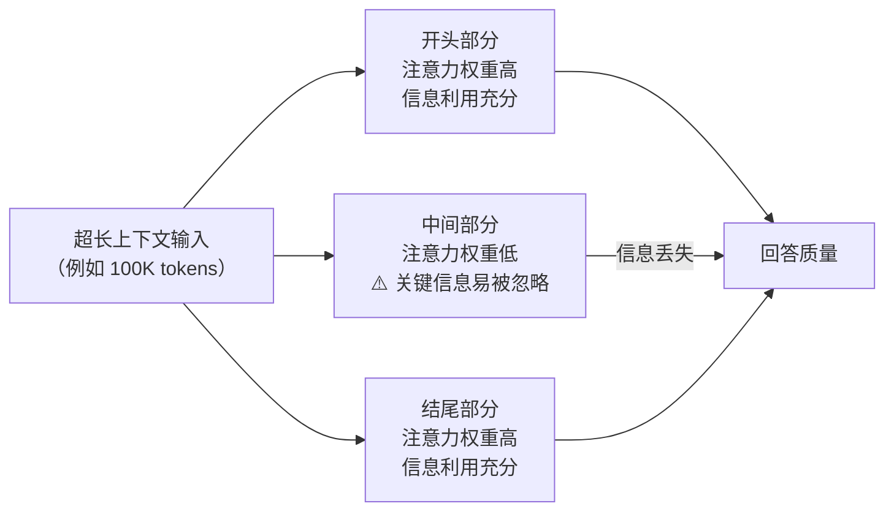

结合 2.2 节的"有效利用率约 25%"，可以得出一个实用的工程经验：

> **把最重要的材料放在上下文的两端，把次要的、可被裁减的材料放在中间。** 这是一个零成本就能提升长上下文任务效果的技巧。

### 2.7 何时能替代 RAG：场景判断

课件明确指出：**超长上下文与 RAG 并非完全对立，而是互补关系**。在小体量、单文档场景下，它能提供更连贯的语境；但面对海量知识，RAG 仍是企业级应用的基石。

> **图 8｜超长上下文选型决策树**

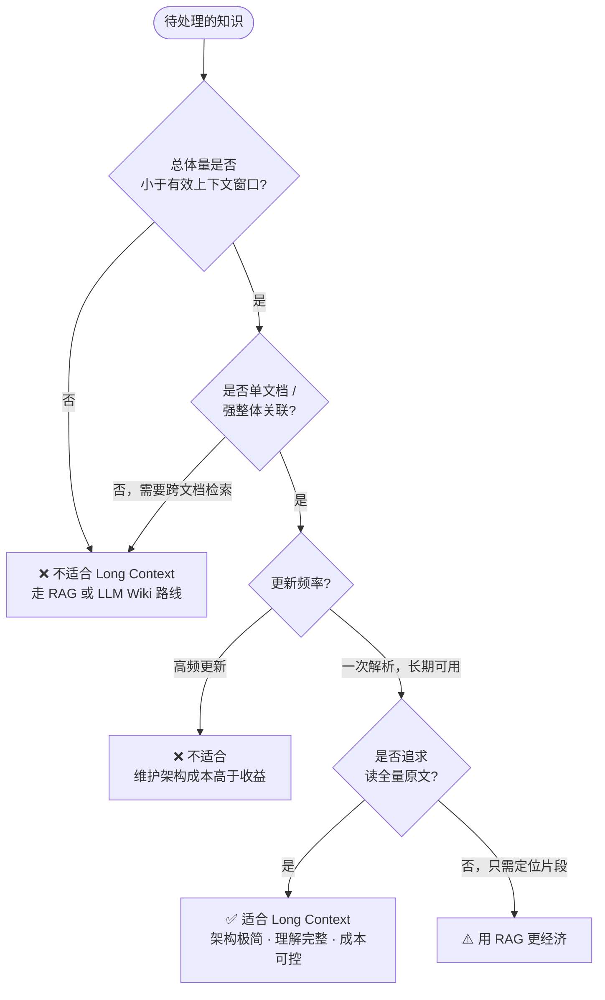

**适合替代的场景**：

| 场景             | 说明                                           | 核心优势                         |
| ---------------- | ---------------------------------------------- | -------------------------------- |
| **小型知识库**   | 知识库仅几十至几百万 Token（企业制度、说明书） | 可直接喂给模型，无需检索架构     |
| **单文档强相关** | 合同分析、财报研读                             | 提供完整语境，避免信息割裂       |
| **高精度理解**   | 表格、跨页引用、代码逻辑                       | 避免 Chunk 切碎与 Embedding 失真 |

**无法替代的局限**：

| 局限               | 说明                                                         |
| ------------------ | ------------------------------------------------------------ |
| **知识库规模受限** | 百万级文档、10TB 级海量知识无法一次性塞进上下文窗口          |
| **成本指数级上升** | Token 消耗随上下文长度大幅增加，企业规模化应用难以承受       |
| **注意力衰减**     | 存在"中间遗忘"效应，无法稳定、均匀地利用超长文本中的所有信息 |

**不适用场景清单**：高频更新的实时动态知识库 / 海量非结构化数据的检索查询 / 对响应延迟极其敏感的交互场景。

**选型金句**：

> **"读一遍、单文件、不改了" → 直接上 Long Context！**

### 2.8 【代码落地】工作区工程中的"长上下文"实践

课件项目的核心是 Agentic Retrieval，但它内部恰好包含了一个**微缩版的长上下文实践**，很值得对照。

#### 2.8.1 `code_read`：整文件读取即"单文档全量投喂"

`engines/code_search.py:169-194` 实现了 `read_file`，它支持按行范围读取代码仓库中的**完整文件**：

```python
def read_file(self, file_path: str, start_line: int = 1, end_line: int = None) -> str:
    full_path = os.path.join(self.repo_dir, file_path)
    if not os.path.exists(full_path):
        return json.dumps({"error": f"File not found: {file_path}"}, ensure_ascii=False)
    with open(full_path, "r", encoding="utf-8", errors="ignore") as f:
        lines = f.readlines()
    start = max(1, start_line) - 1
    end = end_line if end_line else len(lines)
    ...
```

**为什么这是"长上下文"而非"RAG"？**

| 特征         | 传统 RAG       | `code_read` 的整文件读取        |
| ------------ | -------------- | ------------------------------- |
| 输入单位     | 固定大小 Chunk | **完整文件**                    |
| 是否切分     | 是             | **否**                          |
| 信息完整性   | 逻辑可能断裂   | **保留完整代码逻辑**            |
| 对应课件场景 | —              | "代码文件 / PR 完整逻辑 Review" |

这正对应课件在选型指南中给出的场景："**代码文件 / PR 完整逻辑 Review——避免因 Chunk 拆分导致逻辑断裂，完美适配'一次性精读'需求**"。

#### 2.8.2 系统提示词中的"上下文工程"

`core/agent.py:15-80` 的 `SYSTEM_PROMPT_TEMPLATE` 是一个典型的**上下文工程**样本。它没有简单地说"你是一个搜索助手"，而是把**时间语义**显式注入：

```
【当前日期: {current_date}】
今天是 {current_date}，{weekday}。你必须根据当前日期来理解用户问题中的时间词（如"本周"、"本月"、"今天"、"最近"等）。

例如：
- "本周" = {week_start} 至 {week_end}
- "本月" = {month_start} 至 {month_end}
- "今天" = {current_date}
- "最近" = 最近7天（{recent_start} 至 {current_date}）
```

这解决的是一个**长上下文之外的经典难题**：LLM 的训练数据有截止日期，它对"本周""最近"这类相对时间词没有任何锚点。`_build_system_prompt()`（`core/agent.py:350-371`）在每次请求时动态计算并注入：

```python
week_start = now - timedelta(days=now.weekday())
week_end = week_start + timedelta(days=6)
month_start = now.replace(day=1)
recent_start = now - timedelta(days=7)
```

> **工程启示**：上下文工程不只是"塞更多内容"，更是"塞对的内容"。一段精确的时间锚定（约 200 token），其价值可能超过 10 万 token 的无关文档。

#### 2.8.3 长上下文与 Agentic 的边界：工具返回体积控制

值得注意的是，工程在**工具返回**这一层主动做了体积截断，这与"长上下文"的思路正好相反：

```python
# core/agent.py:403-407
result_summary = result[:200] + "..." if len(result) > 200 else result
```

```python
# core/agent.py:489
"result_preview": result[:500] + "..." if len(result) > 500 else result,
```

这说明一个成熟的工程实践是：**在"要不要把全量内容放进上下文"这件事上，必须按场景分层决策**——

- **需要精读的**（如代码文件）→ 全量放入（长上下文思路）
- **只需定位的**（如检索结果列表）→ 截断摘要放入（RAG 思路）

这种"按需决定上下文粒度"的能力，恰恰是 Agentic Retrieval 带来的（见第 3 章）。

---

## 第 3 章 Agentic Retrieval

### 3.1 本质：从被动检索到主动推理

在 Agentic Retrieval 范式中，LLM 不再是被动的检索工具，而是成为了**整个流程的主导者**。课件把它拆解为四个自主决策：

> **图 9｜Agentic Retrieval 的四个自主决策**

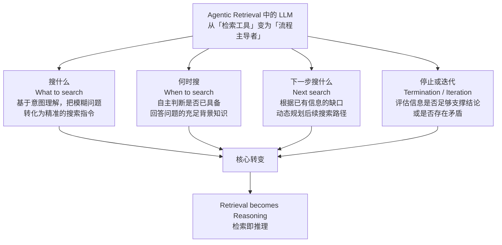

这四个问题看似简单，但它们标志着一次根本性的权力转移：

| 决策项           | 传统 RAG                        | Agentic Retrieval                                        |
| ---------------- | ------------------------------- | -------------------------------------------------------- |
| **搜什么**       | 系统把用户原始 Query 直接向量化 | 模型理解意图后**重新构造**搜索指令（甚至拆成多个子查询） |
| **何时搜**       | Query 到达即检索                | 模型先判断"我知道吗"，**可能不检索**直接回答             |
| **下一步搜什么** | 不存在"下一步"                  | 基于信息缺口**动态规划**，可换数据源、换关键词           |
| **何时停**       | 检索完就停                      | 模型评估证据充分性与矛盾性，**自主决定**继续或终止       |

### 3.2 架构跃迁：从单次检索到循环推理

> **图 10｜Retrieve Once 与 Reason-Retrieve Loop 架构对比**

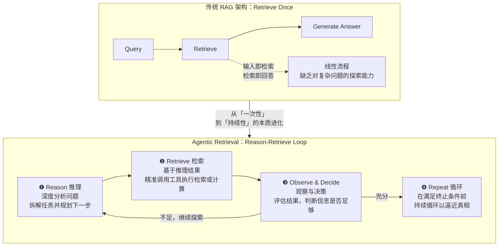

**这是从"一次性"到"持续性"的本质进化**。

### 3.3 经典实现：ReAct Pattern

几乎所有 Agentic Retrieval 的底层逻辑，都能看到 **ReAct** 的影子。它是一种让 LLM 模拟人类思维方式，通过交替进行"推理（Reason）"与"行动（Act）"来逐步拆解、解决复杂问题的核心范式。

> **图 11｜ReAct 核心循环**

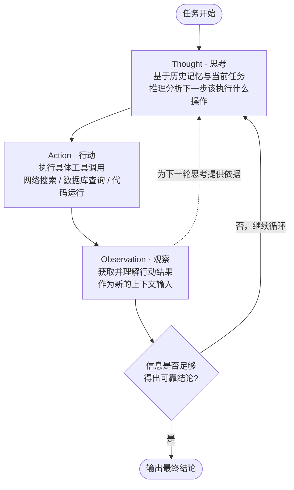

**三个角色的职责边界**：

| 角色            | 输入                    | 输出                     | 关键要求                       |
| --------------- | ----------------------- | ------------------------ | ------------------------------ |
| **Thought**     | 历史记忆 + 当前任务状态 | 下一步行动的自然语言推理 | 推理必须显式化，便于追踪与调试 |
| **Action**      | Thought 的结论          | 结构化工具调用（JSON）   | 参数必须可执行、可校验         |
| **Observation** | 工具返回结果            | 更新后的上下文           | 需处理空结果、错误、超长结果   |

> **核心循环逻辑**：这三步构成一个闭环，不断重复迭代。直到模型通过"观察"确认已获取足够信息，能够得出可靠结论时，循环才会终止。

### 3.4 企业案例：追踪退款率升高原因

课件给出了一个非常典型的多步根因分析案例，完整展示了 ReAct 循环如何在真实业务中运转：

**用户问：为什么退款率最近升高？**

> **图 12｜退款率升高根因追踪案例**

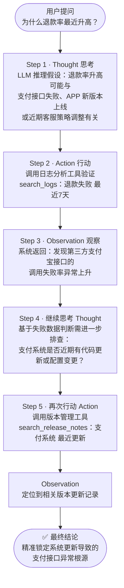

**这个案例揭示了 Agentic Retrieval 的三个关键能力**：

1. **假设驱动的检索**：第一轮检索不是"搜索退款率"（那是用户已经知道的信息），而是**验证一个假设**（支付接口失败）。
2. **结果驱动的下一跳**：第二轮检索的目标完全由第一轮的观察结果决定——"接口失败率上升"→"查版本变更"。这是固定流水线无法表达的。
3. **跨工具类型串联**：两次调用分别命中**日志分析工具**和**版本管理工具**，属于完全不同的数据类型。

> 如果把这个案例交给传统 RAG：向量库里有日志、有发布记录，但因为它们语义上与"退款率"都不直接相似，Top-k 很可能一个都召不回来。

### 3.5 技术实现：五层架构

把 Agentic Retrieval 落到工程，需要一套明确的分层架构。课件给出了五层模型：

> **图 13｜Agentic Retrieval 五层架构**

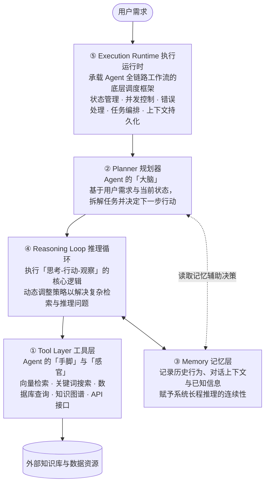

**各层详解**：

#### ① Tool Layer 工具层

> Agent 的"手脚"与"感官"，提供底层交互能力，是连接数字资产与智能体的桥梁。

常见能力：向量检索 · 关键词搜索 · 数据库查询 · 知识图谱 · API 接口。

#### ② Planner 规划器

> 核心任务：基于需求与信息，推理决策"下一步调用哪个工具"。
> 实现方式：**初级**——LLM Prompt 驱动；**进阶**——独立规划模型与搜索策略。

这是一个关键的工程分水岭。用 Prompt 驱动规划的优势是**零额外训练成本、改规则即改行为**；劣势是规划质量受基座模型能力约束，且规划逻辑与提示词耦合。工作区工程采用的正是"初级"路线（详见 3.6.3）。

#### ③ Memory 记忆层

> Agent 需要记忆来避免重复劳动、保持上下文连贯性，是处理复杂长任务的基石。

核心记录内容：已搜索查询 / 已访问页面 / 已知事实 / 提出的假设。

> **类比**：就像侦探的调查笔记，记录每一步线索与发现。

#### ④ Reasoning Loop 推理循环

> 系统的"核心引擎"，驱动 Agent 不断自我迭代解决问题。
> `while not solved: Think → Act → Observe`

课件特别强调了三项**企业级增强机制**，它们决定了一个 Agent 是"玩具"还是"生产系统"：

| 增强机制                   | 解决的问题           | 缺失后果                               |
| -------------------------- | -------------------- | -------------------------------------- |
| **最大步数限制**           | 避免无限循环         | 模型反复调用同一工具，Token 与延迟失控 |
| **置信度阈值**             | 证据是否足够         | 信息不足时强行编造答案                 |
| **自我反思（Reflection）** | 判断当前路径是否正确 | 在错误方向上越走越远                   |

#### ⑤ Execution Runtime 执行运行时

> 在真实的企业级智能体系统中，Agent 已超越简单的单次函数调用，它的运行、调度与状态维护，都需要专门的运行时框架来提供坚实的底层支撑。

**为什么需要 Runtime？** 因为 **Agent 本质上是一个长生命周期的复杂工作流，而非一次性的指令执行**。没有运行时框架，就难以处理多步推理、状态记忆与协作问题。

主流运行时框架对比：

| 框架                  | 定位                                        | 适用场景                     |
| --------------------- | ------------------------------------------- | ---------------------------- |
| **LangGraph**         | 构建有状态、可循环执行的 Agent 图结构工作流 | 需要精确控制流转与状态持久化 |
| **AutoGen**           | 支持多智能体间的对话协作与复杂任务分工      | 多角色协作、任务分解         |
| **CrewAI**            | 聚焦于角色扮演与任务协作的多智能体平台      | 角色化流程编排               |
| **OpenAI Agents SDK** | 安全执行环境 + 工具调用 + 多角色协作        | 生产环境快速落地             |

必备基础设施能力：**状态管理 · 并发控制 · 错误处理 · 任务编排 · 上下文持久化**。

---

### 3.6 【代码落地】Agentic Search 工程全解剖

前面五层是"应该长什么样"，接下来看工作区工程"实际长什么样"。这是一次难得的逐层对照机会——因为这份工程的五层结构**完整且可运行**。

#### 3.6.1 工程全景

> **图 14｜Agentic Search 工程全景**

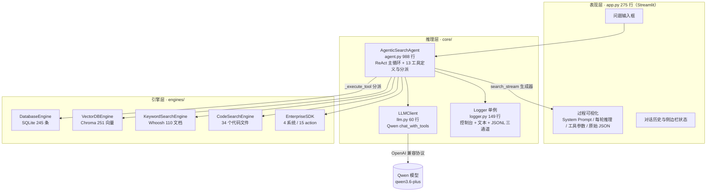

**五层架构与工程实现的映射关系**：

| 课件五层            | 工程实现                                                  | 具体位置                                  |
| ------------------- | --------------------------------------------------------- | ----------------------------------------- |
| ① Tool Layer        | 13 个工具的 JSON Schema + `_execute_tool` 分派            | `core/agent.py:95-348`                    |
| ② Planner           | `SYSTEM_PROMPT_TEMPLATE` 中的意图路由规则（Prompt 驱动）  | `core/agent.py:15-80`                     |
| ③ Memory            | `messages` 数组（短期）+ JSONL 日志（长期）               | `core/agent.py:374-377`、`core/logger.py` |
| ④ Reasoning Loop    | `search_stream()` 的 `for round_num in range(1, 21)` 循环 | `core/agent.py:527-612`                   |
| ⑤ Execution Runtime | Streamlit 主进程 + 生成器 + 单例 Logger                   | `app.py`、`core/logger.py:10-51`          |

#### 3.6.2 推理循环的实现：`search_stream`

这是整个系统的心脏。它是一个**生成器函数**，一边执行 ReAct 循环，一边把中间步骤实时 `yield` 给前端：

```python
# core/agent.py:527-571（节选）
def search_stream(self, question: str):
    yield {
        "step": "init",
        "timestamp": datetime.now().strftime("%Y-%m-%d %H:%M:%S"),
        "system_prompt": self._build_system_prompt(),
        "question": question,
        "api_available": True,
    }

    messages = [
        {"role": "system", "content": self._build_system_prompt()},
        {"role": "user", "content": question}
    ]

    for round_num in range(1, MAX_SEARCH_ROUNDS + 1):
        response = self.llm.chat_with_tools(messages, self.tools)

        if response["tool_calls"]:
            for tc in response["tool_calls"]:
                ...
                result = self._execute_tool(tool_name, arguments)
                yield {
                    "step": "tool_call",
                    "round": round_num,
                    "llm_raw_response": json.dumps(response, ensure_ascii=False, indent=2),
                    "tool_name": tool_name,
                    "arguments": arguments,
                    "result": result,
                }
                messages.append({"role": "assistant", "content": None, "tool_calls": [...]})
                messages.append({"role": "tool", "tool_call_id": tc["id"], "content": result})
        else:
            final_answer = response["content"]
            ...
            yield {
                "step": "final",
                "round": round_num,
                "final_answer": final_answer,
                "final_messages_context": final_messages_context,
                "final_prompt_type": "模型自主判断信息已足够，直接生成回答",
            }
            return
```

**对照 ReAct 三要素**：

| ReAct 阶段      | 代码对应                                       | 说明                                 |
| --------------- | ---------------------------------------------- | ------------------------------------ |
| **Thought**     | `chat_with_tools` 返回的 `response["content"]` | 模型在 tool_calls 之外输出的推理文本 |
| **Action**      | `response["tool_calls"]` → `_execute_tool()`   | 结构化工具调用，参数为 JSON          |
| **Observation** | `messages.append({"role": "tool", ...})`       | 工具结果作为 tool 角色消息回灌       |

**完整主循环流程**：

> **图 15｜search_stream 主循环流程**

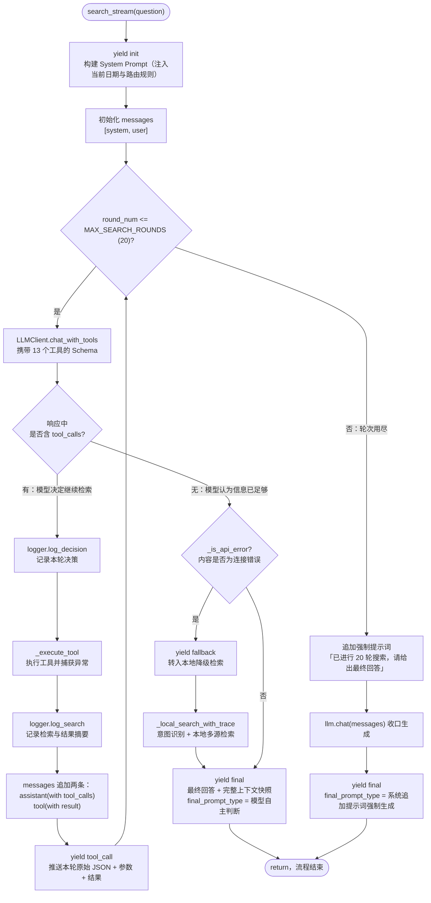

> **设计亮点**：`for ... else` 式的双出口设计。正常出口是模型**自主判断终止**；异常出口是**轮次耗尽强制收口**。这正好对应课件提到的"最大步数限制"企业级机制——没有它，Agent 可能永远不收敛。

#### 3.6.3 Planner 的"软实现"：System Prompt 里的意图路由

工程没有独立的规划模型，而是把规划逻辑"编译"进了 System Prompt。这是课件所说"初级：LLM Prompt 驱动"的典型实现。

`core/agent.py:40-63` 定义了一张**意图路由表**：

```
【查询意图路由规则 - 必须严格遵守】
在调用任何工具之前，必须先判断用户问题的核心意图，选择最匹配的工具和数据源：

- 支付/收款/交易/流水/账单/对账 → 优先调用 enterprise_call(finance, get_payments) 或 enterprise_call(finance, get_transactions)
  参数示例: enterprise_call(system="finance", action="get_payments", params={"type": "收入", "start_date": "2026-01-01", "end_date": "2026-01-31"})
  注意: type 参数只能填 "收入" 或 "支出"（不要填"收款""付款"等）；日期格式必须是 YYYY-MM-DD
- 预算/费用/报销/发票 → 优先调用 enterprise_call(finance, get_budget/get_invoices/get_expenses)
- 员工信息/人事/组织架构/请假 → 优先调用 enterprise_call(hr, ...) 或 database_search(table=employees)
- 项目进度/里程碑 → 优先调用 enterprise_call(project, ...) 或 database_search(table=projects)
- 合同/客户 → 优先调用 database_search(table=contracts)
- 产品/价格 → 优先调用 database_search(table=products)
- 公司政策/制度/流程 → 优先调用 enterprise_call(wiki, search_policies) 或 keyword_search
- 技术文档/架构/规范 → 优先调用 enterprise_call(wiki, search_tech_docs) 或 keyword_search 或 code_search
- 模糊/概念性查询 → 优先使用 vector_search
- 精确关键词匹配 → 使用 keyword_search
- 需要精确筛选/聚合/排序 → 使用 database_sql
```

整理成表格：

| 用户意图                      | 首选工具                                  | 兜底工具                         | 设计考量                 |
| ----------------------------- | ----------------------------------------- | -------------------------------- | ------------------------ |
| 支付 / 交易 / 流水 / 对账     | `enterprise_call(finance, ...)`           | `database_sql`                   | 财务系统有聚合汇总能力   |
| 预算 / 费用 / 报销 / 发票     | `enterprise_call(finance, ...)`           | —                                | 同上                     |
| 员工 / 人事 / 组织架构 / 请假 | `enterprise_call(hr, ...)`                | `database_search(employees)`     | 双通道冗余               |
| 项目进度 / 里程碑             | `enterprise_call(project, ...)`           | `database_search(projects)`      | 双通道冗余               |
| 合同 / 客户                   | `database_search(contracts)`              | —                                | 结构化数据直接查表       |
| 产品 / 价格                   | `database_search(products)`               | —                                | 同上                     |
| 公司政策 / 制度 / 流程        | `enterprise_call(wiki, search_policies)`  | `keyword_search`                 | 制度类文本关键词匹配更准 |
| 技术文档 / 架构 / 规范        | `enterprise_call(wiki, search_tech_docs)` | `keyword_search` / `code_search` | 三通道                   |
| **模糊 / 概念性查询**         | `vector_search`                           | —                                | 语义检索的专长区         |
| **精确关键词匹配**            | `keyword_search`                          | —                                | BM25 的专长区            |
| **精确筛选 / 聚合 / 排序**    | `database_sql`                            | —                                | SQL 的专长区             |

**这张表本身就是一份"检索策略选择"的知识沉淀**——它把人类工程师对"什么数据用什么检索方式"的经验，显式地写进了 Prompt。

同时，Prompt 里还有一组**关键词提取规则**，用来防止模型退化成"泛词检索"：

```
【关键词提取规则 - 必须严格遵守】
- 提取用户问题中的核心业务关键词，而不是泛词
- ❌ 错误示例：查询"本周的支付数据情况"→ 关键词"数据"（太泛，会匹配到"数据分析师"等无关内容）
- ✅ 正确示例：查询"本周的支付数据情况"→ 关键词"支付"或直接调用财务系统
- ❌ 错误示例：查询"项目进度如何"→ 关键词"如何"（无意义）
- ✅ 正确示例：查询"项目进度如何"→ 关键词"项目"或直接调用项目系统
- 如果关键词太泛（如"数据"、"信息"、"情况"），应该结合上下文提取更具体的词
```

> **工程启示**：这段规则解决的是一个非常真实的坑。工程中同时存在"支付"业务数据和"数据分析师"员工记录，若关键词提取为"数据"，`database_search` 会在 `employees` 表里命中"数据分析师"，产生严重噪声。**负样本示例（❌ 反例）比正向指令更能约束模型行为**。

#### 3.6.4 Tool Layer：13 个工具与 5 类数据源

`core/agent.py:95-282` 用标准的 OpenAI Function Calling Schema 定义了 13 个工具：

| #    | 工具名               | 关键参数                               | 底层引擎              | 适用场景                     |
| ---- | -------------------- | -------------------------------------- | --------------------- | ---------------------------- |
| 1    | `database_search`    | `query`, `table`, `limit`              | `DatabaseEngine`      | 结构化表模糊搜索             |
| 2    | `database_sql`       | `sql`                                  | `DatabaseEngine`      | 精确筛选 / 聚合 / 排序       |
| 3    | `database_schema`    | —                                      | `DatabaseEngine`      | 探查表结构（元认知工具）     |
| 4    | `vector_search`      | `query`, `collection`, `n_results`     | `VectorDBEngine`      | 语义 / 概念性查询            |
| 5    | `vector_info`        | —                                      | `VectorDBEngine`      | 探查集合信息                 |
| 6    | `keyword_search`     | `query`, `index_name`, `limit`         | `KeywordSearchEngine` | 精确关键词匹配               |
| 7    | `keyword_info`       | —                                      | `KeywordSearchEngine` | 探查索引信息                 |
| 8    | `code_search`        | `query`, `search_type`, `file_pattern` | `CodeSearchEngine`    | 文件名 / 内容 / 符号三级检索 |
| 9    | `code_read`          | `file_path`, `start_line`, `end_line`  | `CodeSearchEngine`    | 整文件精读（长上下文思路）   |
| 10   | `code_list`          | `directory`, `pattern`                 | `CodeSearchEngine`    | 浏览仓库结构                 |
| 11   | `enterprise_call`    | `system`, `action`, `params`           | `EnterpriseSDK`       | 调用 4 大企业系统            |
| 12   | `enterprise_systems` | —                                      | `EnterpriseSDK`       | 探查可用系统与 action        |
| 13   | `log_search`         | `keyword`, `level`, `engine`, `limit`  | `Logger`              | **回读自身历史决策**         |

> **值得注意的设计**：4 个 "info / schema / list / systems" 类工具（#3、#5、#7、#12）本质上是**元认知工具**——让 Agent 有能力先"看看有什么"，再决定"搜什么"。这是从固定流水线走向自主推理的必要条件。而 #13 `log_search` 更特别：**Agent 可以检索自己的历史决策日志**，这是"记忆层"外部化的体现。

**工具分派机制**（`core/agent.py:284-348`）：

> **图 16｜工具分派与异常包装机制**

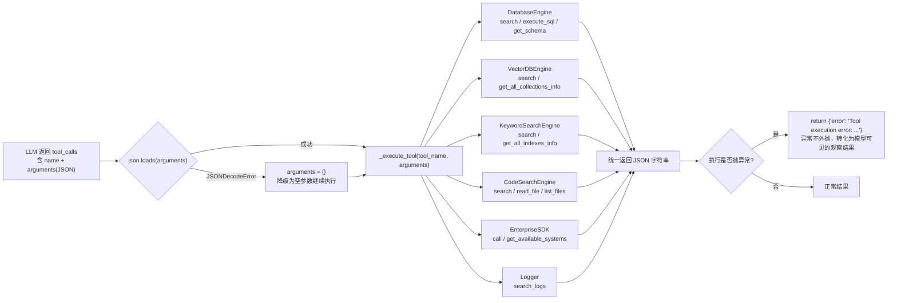

> **容错设计**：`_execute_tool` 用 `try/except` 包住所有引擎调用（`core/agent.py:285-348`），任何工具异常都会被转成 `{"error": "..."}` 的 JSON 字符串返回给模型。这样**单个工具故障不会中断整个推理循环**——模型能看到错误信息并自行换一条路。这是 Agent 系统与普通程序的根本区别：**错误是观察的一部分，而不是流程的终点**。

#### 3.6.5 Memory：双层记忆结构

工程采用了一个简洁但有效的双层记忆设计：

> **图 17｜双层记忆结构**

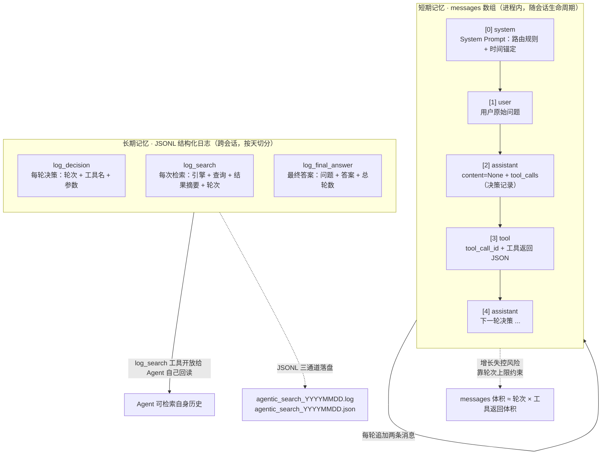

**对照课件的记忆层设计要点**：

| 课件要求记录的内容      | 工程实现                                                     |
| ----------------------- | ------------------------------------------------------------ |
| 已搜索查询 / 已访问页面 | `log_search`：记录 `engine` + `query` + `round`              |
| 已知事实 / 提出的假设   | `messages` 中的 `tool` 消息（观察结果）+ `assistant` 推理文本 |
| 避免重复劳动            | 短期靠 `messages` 上下文；长期靠 `log_search` 回读           |

**日志的三个通道**（`core/logger.py:27-51`）：

```python
console_handler = logging.StreamHandler()          # 控制台：INFO 及以上
file_handler = logging.FileHandler(log_file, ...)  # 文本文件：DEBUG 及以上，含 funcName:lineno
self.json_handler = JsonLogHandler(json_log_file)  # JSONL：结构化字段，可被 search_logs 解析
```

`JsonLogHandler`（`core/logger.py:125-148`）会把 `extra` 中的业务字段提取为独立 key：

```python
for key in ["search_engine", "query", "results_summary", "round",
            "decision", "reasoning", "question", "answer", "total_rounds"]:
    if hasattr(record, key):
        log_entry[key] = getattr(record, key)
```

这使得日志**可被程序查询**，而不只是给人看的文本——`log_search` 工具（`core/logger.py:96-122`）正是基于这个结构化格式实现的。**日志从"事后排查材料"升级为"Agent 可访问的记忆"。**

#### 3.6.6 Execution Runtime：生成器 + Streamlit 的轻量实现

工程没有引入 LangGraph 这类重型运行时，而是用 **Python 生成器 + Streamlit** 实现了一个最小可用的运行时：

> **图 18｜事件流与四类 step 时序**

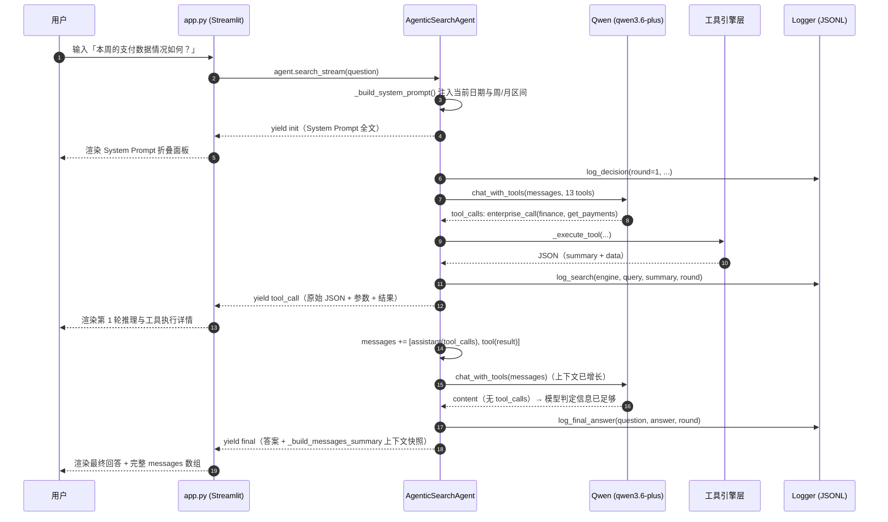

**四种 step 事件与前端渲染的对应关系**（`app.py:86-183`）：

| step        | 触发时机           | 携带数据                                                     | 前端渲染                                                     |
| ----------- | ------------------ | ------------------------------------------------------------ | ------------------------------------------------------------ |
| `init`      | 循环开始前         | `system_prompt`, `question`, `timestamp`                     | 用户问题 + System Prompt 折叠面板（含字符数）                |
| `tool_call` | 每轮每次工具调用后 | `round`, `llm_raw_response`, `tool_name`, `arguments`, `result` | 轮次标题 + LLM 推理摘要 + Qwen 原始响应 JSON + 工具参数 + 结果（含财务汇总的 metric 卡片） |
| `fallback`  | API 不可用时       | `round`, `intent`                                            | 降级警告提示                                                 |
| `final`     | 生成最终回答时     | `final_answer`, `final_messages_context`, `final_prompt_type`, `force_prompt` | 生成方式 + 强制提示词 + 最终回答 + **完整 messages 上下文逐条展开** |

> **这个可视化本身就是一份教学资产**。`_build_messages_summary()`（`core/agent.py:917-967`）把发往模型的 `messages` 数组逐条结构化，前端按角色（⚙️ system / 👤 user / 🤖 assistant / 🔧 tool）分别渲染。这等于把"LLM 到底看到了什么"完全透明化——**对于调试 Agent 系统，这个能力的价值高于任何日志**。
>
> 前端还针对财务数据做了特殊渲染（`app.py:120-132`）：检测到结果 JSON 含 `summary` 字段时，直接用 `st.metric` 展示总收入 / 总支出 / 记录数三张卡片，而不是丢一大段 JSON 给用户。

#### 3.6.7 企业级增强机制：课件三项要求的落实情况

| 课件要求                   | 工程实现                                                     | 代码位置                            | 评价                                       |
| -------------------------- | ------------------------------------------------------------ | ----------------------------------- | ------------------------------------------ |
| **最大步数限制**           | `MAX_SEARCH_ROUNDS = 20`，`for round_num in range(1, 21)`    | `config.py:20`、`core/agent.py:541` | ✅ 完整实现，且轮次耗尽后追加强制提示词收口 |
| **置信度阈值**             | 由模型自主判断（"当你认为已经收集到足够信息时，给出最终答案"） | `core/agent.py:80`                  | ⚠️ 部分实现：无量化阈值，依赖模型判断力     |
| **自我反思（Reflection）** | Prompt 中要求"交叉验证"+"换工具重试"                         | `core/agent.py:35-37`               | ⚠️ 部分实现：靠提示词引导，非独立反思环节   |

**关于"轮次耗尽后强制收口"的实现**（`core/agent.py:598-612`）：

```python
final_prompt = f"你已经进行了{MAX_SEARCH_ROUNDS}轮搜索。请根据已收集的信息，给出最终回答。"
messages.append({"role": "user", "content": final_prompt})
final_answer = self.llm.chat(messages)

yield {
    "step": "final",
    "round": MAX_SEARCH_ROUNDS,
    "final_answer": final_answer,
    "final_messages_context": final_messages_context,
    "final_prompt_type": f"达到最大搜索轮数({MAX_SEARCH_ROUNDS})，系统追加提示词强制生成回答",
    "force_prompt": final_prompt,
}
```

注意最后那个 `force_prompt` 字段——它把"系统在什么情况下强行介入"这件事**显式暴露给了用户**。这是一个很好的产品设计：**Agent 的自主性与系统的强制干预都应当是可观测的**。

#### 3.6.8 降级与容错：API 不可用时的本地检索

工程实现了一条完整的降级链路，这是"生产可用"与"Demo 可用"的分界线。

`_is_api_error`（`core/agent.py:707-717`）通过关键词匹配识别 API 故障：

```python
def _is_api_error(self, content: str) -> bool:
    if not content:
        return False
    try:
        data = json.loads(content)
        if isinstance(data, dict) and "error" in data:
            error_str = str(data["error"]).lower()
            return any(keyword in error_str for keyword in
                       ["connection", "timeout", "api", "key", "auth", "unauthorized", "not found", "rate limit"])
    except json.JSONDecodeError:
        pass
    return False
```

注意这里的链路设计：`LLMClient.chat` / `chat_with_tools`（`core/llm.py:16-60`）在捕获异常时，会返回 `json.dumps({"error": str(e)})` 而不是抛出——**把异常转化为一个"看起来像正常响应"的返回值**，再由 `_is_api_error` 识别。这是为了让 ReAct 循环的代码路径保持统一。

> **图 19｜API 故障降级与容错链路**

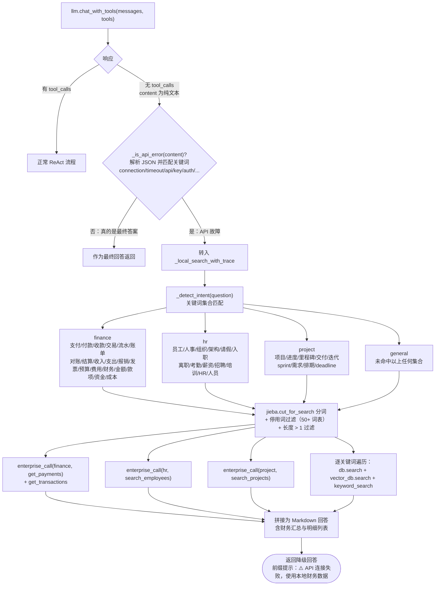

**降级链路上的三个工程细节**：

**① 意图优先于关键词**（`core/agent.py:639-665`）：对于 finance / hr / project 三类意图，直接调用对应的企业系统 action，**不做关键词检索**。因为这三类系统本就是精确数据源，关键词匹配反而会引入噪声。

**② 停用词表是硬编码的领域资产**（`core/agent.py:618-624`）：

```python
stopwords = {"的", "了", "在", "是", "我", "有", "和", ...
             "什么", "怎么", "如何", "哪", "为什么", "多少", "几",
             "可以", "能", "应该", "需要", "情况", "信息", "数据", "问题",
             "关于", "对于", "目前", "现在", "今天", "本周", "本月", "本季度",
             "今年", "最近", "当前", "最新", "怎样", "是否", "有没有", "能不能"}
```

注意"数据""情况""信息""最近""本周"这些词都在停用词表里——这与 3.6.3 节 Prompt 中的"关键词提取规则"**完全呼应**。**提示词层的约束与代码层的过滤形成了双保险**。

**③ 结果为空时的诚实回答**（`core/agent.py:669-670`）：

```python
if not all_results:
    return "抱歉，在本地数据源中没有找到与您问题相关的信息。"
```

宁可说"没找到"，也不编造。这与 System Prompt 中"最终回答要基于搜索到的实际数据，不要编造信息"（`core/agent.py:38`）的原则一致。

#### 3.6.9 检索底座：5 类引擎的能力矩阵

Agentic Retrieval 的上限，取决于工具层的**检索能力覆盖面**。工作区工程的 5 类引擎构成了一张互补的能力网：

> **图 20｜五类检索引擎能力矩阵**

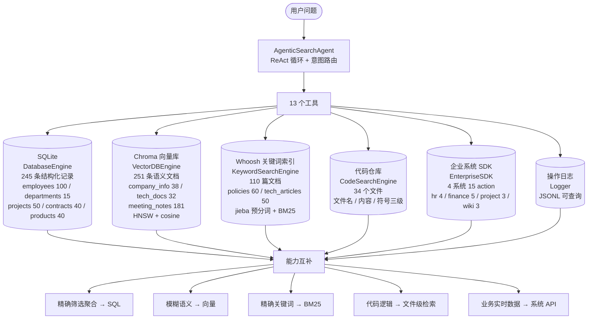

**五类引擎的技术选型细节**：

| 引擎                    | 技术选型                    | 关键实现细节                                                 | 代码位置                           |
| ----------------------- | --------------------------- | ------------------------------------------------------------ | ---------------------------------- |
| **DatabaseEngine**      | SQLite + `sqlite3.Row`      | 动态构造 `WHERE col LIKE ? OR ...` 多列多关键词 OR 匹配；`execute_sql` 支持任意 SQL 并自动区分读写 | `engines/database.py:119-194`      |
| **VectorDBEngine**      | ChromaDB `PersistentClient` | 集合元数据 `{"hnsw:space": "cosine"}`；批量写入 100 条/批；不指定集合时**遍历所有集合召回** | `engines/vector_db.py:10-72`       |
| **KeywordSearchEngine** | Whoosh + jieba              | Schema: `doc_id/title/content/category/source`；**写入前用 `jieba.cut_for_search` 预分词**，查询同样分词；`MultifieldParser` 跨 title+content 检索 | `engines/keyword_search.py:18-124` |
| **CodeSearchEngine**    | 纯 Python `os.walk` + `re`  | 三种模式：文件名匹配 / 逐行内容匹配（多关键词 AND）/ 符号定义匹配（def/class/function/const/...）；支持行号范围读取 | `engines/code_search.py:13-213`    |
| **EnterpriseSDK**       | 进程内 Mock 数据            | 日期年份动态替换 `_y()`；日期格式归一化 `_normalize_date()`（`2026-1-1` → `2026-01-01`）；支付类型同义词归一化 `_normalize_payment_type()` | `engines/enterprise_sdk.py:10-473` |

> **三个值得学习的防御性设计**：
>
> **① 关键词分词一致性**（`engines/keyword_search.py:18-21`）：中文全文检索最大的坑是"写入时不分词、查询时分词"导致召回为零。工程在 `add_documents` 和 `search` 两侧都调用 `_tokenize_chinese`，保证一致。
>
> **② 日期格式归一化**（`engines/enterprise_sdk.py:20-27`）：LLM 生成的日期格式五花八门（`2026-1-1`、`2026-01-01`），而字符串比较 `>=` 对 `2026-1-1` 会出错。`_normalize_date` 用 `zfill` 补齐，让字符串比较等价于日期比较。
>
> **③ 支付类型同义词映射**（`engines/enterprise_sdk.py:30-41`）：模型的词汇与数据字段的取值经常对不上，工程用一个同义词表兜住：

```python
income_synonyms = {"收入", "收款", "进账", "应收账款", "营收"}
expense_synonyms = {"支出", "付款", "出账", "支付", "应付账款", "费用"}
```

> 这解决了 System Prompt 中特别强调的那个坑："type 参数只能填'收入'或'支出'（不要填'收款''付款'等）"。**Prompt 约束 + 代码归一化，双重保障。**

---

### 3.7 从代码中提炼的六条工程经验

综合第 3 章的代码剖析，可以提炼出六条可直接复用的 Agentic Retrieval 工程经验：

| #     | 经验                     | 代码依据                                                     | 说明                                         |
| ----- | ------------------------ | ------------------------------------------------------------ | -------------------------------------------- |
| **1** | **输入语义必须锚定**     | `_build_system_prompt()` 每次请求注入当前日期与周月区间      | LLM 对"本周""最近"无天然锚点，不注入必然算错 |
| **2** | **工具异常要转化为观察** | `_execute_tool` 全量 try/except，返回 `{"error": ...}`       | 让模型有机会自我修复，而不是让循环崩溃       |
| **3** | **提供元认知工具**       | `database_schema` / `vector_info` / `keyword_info` / `enterprise_systems` | 让 Agent 先"看看有什么"再"决定搜什么"        |
| **4** | **控制单次观察的体积**   | `result[:200]` 摘要 / `result[:500]` 预览                    | 避免一次工具调用吃掉大量上下文预算           |
| **5** | **双重终止条件**         | 模型自主判断 + `MAX_SEARCH_ROUNDS` 强制收口                  | 自主性给效果，硬上限给确定性                 |
| **6** | **过程必须可观测**       | `search_stream` 四类 step + `_build_messages_summary`        | Agent 系统不透明就无法调试，更无法优化       |

**一个完整的执行轨迹示例**（基于代码逻辑推演）：

```
用户输入：本周的支付数据情况如何？

[round 1] LLM 决策 → enterprise_call(system="finance", action="get_payments",
                                     params={"start_date": "2026-09-22", "end_date": "2026-09-28"})
          ← {"summary": {"total_income": ..., "total_expense": ..., "net_amount": ..., "count": ...},
             "data": [...]}
[round 2] LLM 无 tool_calls → 直接输出最终回答（final_prompt_type = "模型自主判断信息已足够，直接生成回答"）
```

注意这里的 `start_date` / `end_date` 是模型根据 System Prompt 注入的"本周 = 2026-09-22 至 2026-09-28"**自己算出来**的——这正是 3.6.3 节"时间锚定"的价值体现。

---

## 第 4 章 LLM Wiki

### 4.1 从"切碎知识"到"保留结构"

> 传统 RAG 最大的痛点是将知识强制"**碎片化**"，导致上下文断裂、逻辑关系丢失。LLM Wiki 的核心思想是**保留知识的原始结构**，为 LLM 构建一个可阅读、可导航的完整知识空间。

**它是什么？** LLM Wiki 是为大模型量身打造的企业级知识体系。它就像**为 LLM 专门重构的 Confluence 或 Wikipedia**，将分散的文档转化为适合机器阅读、引用与推理的结构化"百科全书"。

> **图 21｜搜索-回答模式与导航-探索模式对比**

```mermaid
flowchart TB
    subgraph OLD["传统 RAG：搜索-回答模式"]
        direction LR
        O1["Query"] --> O2["Embedding"] --> O3["Top-k Chunk"] --> O4["Answer"]
        O3 -.->|"检索即终点<br/>线性匹配结果"| O5["基于向量相似度的单点检索<br/>缺乏对复杂知识网络的探索能力<br/>容易丢失深层逻辑关联"]
    end
    subgraph NEW["LLM Wiki：导航-探索模式"]
        direction LR
        N1["Query"] --> N2["定位知识入口页"] --> N3["Agent 逐步导航"] --> N4["扩展关联页面"] --> N5["生成答案"]
        N3 -.->|"Agent 模拟人类浏览维基百科"| N6["从单一知识节点出发<br/>主动点击链接探索关联领域<br/>在持续「导航-扩展」中构建完整知识图景"]
    end
    OLD -->|"从「单点碎片化」<br/>到「网络系统化」的回答能力跃迁"| NEW
```

### 4.2 LLM Wiki 的六大构件

LLM Wiki 不是一个单一技术，而是六个相互支撑的构件组成的体系：

> **图 22｜LLM Wiki 七大构件关系**

```mermaid
flowchart TB
    ROOT["LLM Wiki<br/>为 LLM 构建的可导航知识空间"]
    ROOT --> A["① 页面化<br/>Page-based Knowledge<br/>以页面为单位保持完整语义"]
    ROOT --> B["② 双向链接<br/>Bi-directional Links<br/>构建实体间的关联网络"]
    ROOT --> C["③ 层级目录<br/>Hierarchy Tree<br/>建立清晰的目录体系"]
    ROOT --> D["④ 实体关系<br/>Entity Relationship<br/>抽取可计算的知识骨架"]
    ROOT --> E["⑤ 自动摘要<br/>Auto Summary<br/>三层摘要金字塔"]
    ROOT --> F["⑥ 自动索引<br/>Auto Indexing<br/>建立多种访问入口"]
    D --> NAV["⑦ 语义导航<br/>Semantic Navigation<br/>以上构件的运行方式"]
    A --> NAV
    B --> NAV
    C --> NAV
    E --> NAV
    F --> NAV
    NAV --> GOAL["核心价值：告别「碎片化失忆」<br/>Structured Knowledge > Fragments"]
```

---

#### 4.2.1 一：页面化（Page-based Knowledge）

**传统 RAG 的问题**：

| 问题         | 说明                                              |
| ------------ | ------------------------------------------------- |
| **切分缺陷** | 将 PDF / 文档切成固定大小 Chunk，**丢失页面身份** |
| **核心问题** | 无主题边界、语义不完整，**无法识别 Chunk 归属**   |

课件举的典型例子：**"退款规则"被切分为 Chunk_182（上半段）+ Chunk_183（下半段）→ LLM 无法识别二者属于同一主题。**

> **图 23｜传统切块与页面化对比**

```mermaid
flowchart TB
    subgraph BAD["传统切块：无边界 Chunk"]
        D1["《退款规则》文档"] --> C1["Chunk_182<br/>上半段"]
        D1 --> C2["Chunk_183<br/>下半段"]
        C1 -.->|"独立的向量条目<br/>上下文中彼此不可见"| X["❌ LLM 无法识别<br/>二者属于同一主题"]
        C2 -.-> X
    end
    subgraph GOOD["页面化：结构化 Page Object"]
        D2["《退款规则》文档"] --> S1["Step 1 文档解析<br/>提取标题、段落、表格<br/>保留原始结构"]
        S1 --> S2["Step 2 结构识别<br/>识别 Markdown 层级<br/>构建父子关系树"]
        S2 --> S3["Step 3 生成 Page Object<br/>page_id / title / content / summary"]
        S3 --> G["✅ 保留语义完整性与<br/>可引用的页面身份"]
    end
    BAD -->|"知识重构"| GOOD
```

**页面化的实现流程**（三步）：

| 步骤       | 动作                                                         | 产出             |
| ---------- | ------------------------------------------------------------ | ---------------- |
| **Step 1** | 文档解析：提取标题、段落、表格，保留原始结构                 | 结构化中间表示   |
| **Step 2** | 结构识别：识别 Markdown 层级，构建父子关系树                 | 层级树           |
| **Step 3** | 生成 Page Object：封装 `page_id` / `title` / `content` / `summary` | 可寻址的知识单元 |

> **核心转变：从"无边界 Chunk"到"结构化 Page"的知识重构。**
>
> **对比 RAG 的关键差异**：Page 有**身份**（`page_id`），因此可以被**引用、链接、更新**；而 Chunk 只是一段漂浮的文本，没有身份，也就无法成为知识网络中的节点。

---

#### 4.2.2 二：双向链接（Bi-directional Links）

> **核心价值：打破知识孤岛。** 借鉴维基百科的链接思想，让孤立的文本片段形成相互关联的网络。

这对 RAG 系统至关重要——**能帮助模型自动扩展关联知识，突破传统 Top-k 检索仅返回"直接匹配"结果的局限**。

**典型关联示例**：`退款规则 ↔ 财务审批 ↔ 发票制度 ↔ 税务政策`

> **图 24｜双向链接与多跳扩展**

```mermaid
flowchart LR
    A["退款规则"] <--> B["财务审批"]
    B <--> C["发票制度"]
    C <--> D["税务政策"]
    A -.->|"多跳推理可达"| D
    E["用户问：退款要走什么审批？"] --> A
    A -.->|"1 跳扩展"| B
    B -.->|"2 跳扩展"| C
    C -.->|"3 跳扩展"| D
```

**双向链接的三步实现**：

> **图 25｜双向链接三步实现**

```mermaid
flowchart LR
    S1["Step 1 · NER<br/>识别文本中的关键实体<br/>如 OpenAI、API Key"] --> S2["Step 2 · 链接<br/>检查实体是否存在<br/>生成 [[API Key]] 链接"]
    S2 --> S3["Step 3 · 反向索引<br/>自动维护索引<br/>记录谁引用了当前页面"]
    S3 --> IDX[("反向索引<br/>API Key → OpenAI API文档、<br/>系统权限管理规范、<br/>API鉴权机制说明")]
```

**技术选型对照**：

| 方案       | 实现方式       | 优点                     | 缺点                           |
| ---------- | -------------- | ------------------------ | ------------------------------ |
| **简单版** | 向量相似度     | 实现成本低，无需实体识别 | 链接关系模糊，可能引入噪声链接 |
| **进阶版** | 知识图谱（KG） | 关系明确、可推理、可解释 | 构建与维护成本高               |

**反向索引数据结构示例**（课件原文）：

```json
{"API Key": ["OpenAI API文档", "系统权限管理规范", "API鉴权机制说明"]}
```

> **课件的关键结论**：通过双向链接构建的"**非结构化知识图谱**"，RAG 系统不仅能"召回"直接相关的文本，更能基于链接关系进行"**多跳推理**"和关联扩展，从而显著提升回答的丰富度和准确性。
>
> 注意"**非结构化知识图谱**"这个措辞非常精确：它不需要预先定义本体（Ontology）和关系类型，而是从文档自身的引用关系中**涌现**出图结构。这大幅降低了 LLM Wiki 的落地门槛。

---

#### 4.2.3 三：层级目录（Hierarchy Tree）

> **让 LLM 理解知识结构与上下文**：模拟人类查阅书籍的方式，引导 LLM 先定位大类再聚焦细节，解决"大海捞针"式检索。
> **核心优势**：模拟人类认知逻辑 · 大幅提升检索精准度与效率。

**目录结构示例**（课件原文）：

```
财务制度
├── 报销制度
│   ├── 差旅报销
│   └── 餐饮报销
└── 发票制度与合规
```

> **图 26｜层级目录与层级检索路径**

```mermaid
flowchart TD
    ROOT["财务制度"]
    ROOT --> N1["报销制度"]
    ROOT --> N2["发票制度与合规"]
    N1 --> N11["差旅报销"]
    N1 --> N12["餐饮报销"]
    N2 --> N21["增值税专票"]
    N2 --> N22["电子发票归档"]
    Q["用户问：出差住宿能报多少？"] -.->|"层级检索路径<br/>财务制度 → 报销制度 → 差旅报销"| N11
```

**层级结构的两种实现方式**：

| 方式                | 做法                                                         | 适用场景         |
| ------------------- | ------------------------------------------------------------ | ---------------- |
| **1. 文档原生解析** | 直接解析 Markdown 标题层级（`#`、`##`），构建抽象语法树（AST Tree），**还原作者意图** | 结构化良好的文档 |
| **2. LLM 自动生成** | 针对无结构化文本，通过 Prompt 指令让模型分析内容逻辑，**输出 JSON 格式的层级关系** | 无结构的散乱文本 |

**企业级存储与应用能力**：通常存储为节点关系型数据库，通过父子 ID 关联维护层级：

```json
{ "node_id": "1001", "parent_id": "1000", "children": [...] }
```

**支持能力**：树遍历（Traversal）· 层级检索 · 章节动态扩展。

---

#### 4.2.4 四：实体关系（Entity Relationship）

> 实体关系抽取是构建知识图谱（LLM Wiki）的核心能力，其本质是**从非结构化文本中，自动识别并抽取出结构化的"实体"与"关系"，为 AI 提供可计算的骨架**。

**结构化抽取示例**（课件原文）：

| 原文                                            | 抽取结果                                       |
| ----------------------------------------------- | ---------------------------------------------- |
| "张三负责 Apollo 项目。Apollo 项目服务于腾讯。" | `(张三, 负责, Apollo)`、`(Apollo, 客户, 腾讯)` |

> **图 27｜实体关系抽取与图谱构建**

```mermaid
flowchart LR
    TXT["非结构化文本<br/>张三负责 Apollo 项目。<br/>Apollo 项目服务于腾讯。"] --> EX["实体关系抽取"]
    EX --> E1["实体：张三"]
    EX --> E2["实体：Apollo 项目"]
    EX --> E3["实体：腾讯"]
    EX --> R1["关系：(张三) —负责→ (Apollo)"]
    EX --> R2["关系：(Apollo) —客户→ (腾讯)"]
    E1 --> G[("图数据库<br/>Neo4j 等")]
    E2 --> G
    E3 --> G
    R1 --> G
    R2 --> G
    G --> Q1["查询：张三间接服务的客户有哪些？"]
    G --> Q2["多跳推理：张三 → Apollo → 腾讯"]
```

**为何这是关键？** 将信息转化为实体与关系后，才能**打破文本孤岛，实现复杂的多跳推理**，让 AI 具备像人一样理解、关联和运用知识的能力。

**主流实现方法**：

| 方法                          | 说明                                                   | 现状                                                |
| ----------------------------- | ------------------------------------------------------ | --------------------------------------------------- |
| **1. LLM 端到端抽取（主流）** | 通过精心设计的 Prompt 指令，直接让大模型输出结构化数据 | 高效且适配性强，当前主流                            |
| **2. 传统 NLP 技术栈**        | 依存句法分析、NER 等工具                               | 在追求极致效率场景仍有应用，但正逐步被 LLM 方案替代 |

**存储与最终形态**：抽取结果通常存入图数据库（Graph DB，如 Neo4j），将海量碎片化信息编织成一张可被高效查询、遍历和推理的知识图谱，为企业构建专属的"数字大脑"。

---

#### 4.2.5 五：自动摘要（Auto Summary）

**为什么需要？** 企业知识通常篇幅过长，LLM 难以每次读取全文。因此需要高效的摘要技术提炼核心信息，**解决长上下文处理难题**。

> **图 28｜三层摘要金字塔**

```mermaid
flowchart TB
    RAW["长文档原文"] --> CH["① Chunk Summary<br/>细粒度摘要<br/>对最小语义单元初步提炼<br/>保留关键事实与数据"]
    CH --> PG["② Page Summary<br/>页面聚合摘要<br/>将分散的 Chunk 摘要聚合与逻辑整合<br/>生成完整的页面级摘要"]
    PG --> SC["③ Section Summary<br/>全文 / 章节摘要<br/>进一步聚合页面摘要<br/>形成文档全貌的宏观摘要<br/>输出关键结论与核心观点"]
    SC --> QA["✨ 高级玩法：Query-aware Summary<br/>从「为文档生成通用摘要」<br/>转变为「为用户问题动态提取答案」"]
    QA --> LINK["技术演进：已接近 Agentic Retrieval 的核心逻辑<br/>根据用户意图动态调整信息处理路径<br/>是 RAG 的重要升级方向"]
```

**三层摘要的粒度对照**：

| 层级                | 输入                 | 输出             | 用途                         |
| ------------------- | -------------------- | ---------------- | ---------------------------- |
| **Chunk Summary**   | 最小语义单元         | 关键事实与数据   | 为上层摘要提供原料           |
| **Page Summary**    | 该页所有 Chunk 摘要  | 完整页面级摘要   | 支持"先看摘要再决定是否精读" |
| **Section Summary** | 该章节所有 Page 摘要 | 文档全貌宏观摘要 | 快速把握全局，输出核心观点   |

**示例结构**（课件原文）：`{page:..., summary_short:..., key_points: [...]}`

> **注意摘要的级联风险**：三层摘要构成一个**依赖金字塔**——底层摘要的微小变化会向上传播。这正是 4.6 节"摘要级联效应"挑战的根源。

---

#### 4.2.6 六：自动索引（Auto Indexing）

> **本质：为知识建立多种访问入口。** 自动索引的核心思想是为知识建立多样化的访问入口，**打破单一向量（Embedding）检索的局限**，通过组合不同维度的检索能力来覆盖复杂的查询需求。

**当前主流：混合搜索（Hybrid Search）**

> 现代企业级系统普遍采用混合策略以达到最佳效果，其核心组合是：
> **BM25（关键词）+ Vector（语义）+ Graph（关联）**

**企业真实系统中的七类索引**：

| 索引类型       | 能力                    | 解决的问题                     |
| -------------- | ----------------------- | ------------------------------ |
| **Vector**     | 理解文本深层语义含义    | 模糊、概念性查询               |
| **BM25**       | 经典高效的关键词检索    | 精确术语、专有名词             |
| **Entity**     | 人名 / 产品名等精准匹配 | 实体定位                       |
| **Graph**      | 探索实体关联与多跳检索  | 关联推理                       |
| **Hierarchy**  | 支持目录式层级导航      | 由粗到细定位                   |
| **Temporal**   | 基于时间维度的过滤      | "最近""上周"类查询             |
| **Permission** | 精细化的数据权限控制    | 企业安全合规（**企业级刚需**） |

> **图 29｜自动索引体系与混合搜索**

```mermaid
flowchart TB
    subgraph IDX["企业知识索引体系"]
        direction LR
        I1["Vector<br/>语义"]
        I2["BM25<br/>关键词"]
        I3["Entity<br/>实体"]
        I4["Graph<br/>关联"]
        I5["Hierarchy<br/>层级"]
        I6["Temporal<br/>时间"]
        I7["Permission<br/>权限"]
    end
    IDX --> HYBRID["混合搜索 Hybrid Search<br/>BM25 + Vector + Graph"]
    HYBRID --> QUERY["覆盖复杂查询需求"]
    QUERY --> Q1["模糊概念 → Vector"]
    QUERY --> Q2["精确术语 → BM25"]
    QUERY --> Q3["多跳关联 → Graph"]
    QUERY --> Q4["权限过滤 → Permission 前置"]
```

**常见技术栈选型**：

| 技术栈                         | 定位               | 特点                           |
| ------------------------------ | ------------------ | ------------------------------ |
| **Elasticsearch / OpenSearch** | 成熟搜索引擎       | 支持 BM25 与向量检索的混合查询 |
| **Weaviate / Milvus**          | AI 原生向量数据库  | 高性能的海量向量存储与检索     |
| **Vespa**                      | 实时大数据处理引擎 | 支持混合搜索，适合低延迟场景   |

---

#### 4.2.7 七：Semantic Navigation（语义导航）

> **本质：从"召回"到"导航"。** 不再是简单的 Top-k 召回，而是 LLM 像人一样，**自主决定下一步该去哪里探索**。
> **类比**：如在维基百科上阅读，不断点击链接，从一个知识点跳转至另一个。

**示例**（用户问"退款失败为何增多？"）：

> **图 30｜语义导航链**

```mermaid
flowchart LR
    Q(["用户问：退款失败为何增多？"]) --> S1["1. 退款规则"]
    S1 --> S2["2. 支付系统"]
    S2 --> S3["3. 版本更新"]
    S3 --> S4["4. Bug 报告"]
    S4 --> S5["5. 客服工单"]
    S5 --> ANS["综合生成答案"]
    LOOP["实现：Retrieval as Agent Action<br/>reason → retrieve → read → decide next retrieve"]
    LOOP -.->|"驱动导航"| S1
    ARCH["常见架构<br/>• ReAct（思考→行动→观察循环）<br/>• Tree Search（在知识图谱上做 BFS / MCTS 导航）"] -.-> LOOP
```

**本质区别**：

| 维度           | 传统 RAG                               | 语义导航                           |
| -------------- | -------------------------------------- | ---------------------------------- |
| **检索的性质** | 系统的**内部行为**，用户与模型均不可见 | 模型的**自主行为**，每一步都可解释 |
| **检索的次数** | 一次                                   | 多次，路径动态生成                 |
| **路径**       | 无路径概念                             | 有明确的知识跳转路径               |

> **课件原文**：传统 RAG 中检索是"**系统行为**"，而语义导航中检索是"**模型自主行为**"。

---

### 4.3 三层架构：从数据到智能

Karpathy 提出的 LLM Wiki 三层架构，将企业知识系统从简单的"存文档"升级为类似"**编译器**"的智能系统，实现了从原始数据到结构化知识的质变，是 AI 时代构建企业知识库的新思路。

> **图 31｜LLM Wiki 三层架构**

```mermaid
flowchart TB
    subgraph RAW["Raw Layer · 原始数据湖（事实来源 Source of Truth）"]
        R1["文档<br/>PDF / Word"]
        R2["代码<br/>Git"]
        R3["数据库"]
        R4["IM 记录"]
        RN["特点：数据混乱、不可控<br/>不适合直接处理<br/>价值：保留原始事实，为回溯提供依据"]
    end
    subgraph WIKI["Wiki Layer · 编译输出层（核心知识层）"]
        W1["页面 Page"]
        W2["摘要 Summary"]
        W3["实体 Entity"]
        W4["双向链接与关系图"]
        WN["本质：「知识编译器」<br/>价值：将原始数据转化为<br/>LLM 可高效利用的预编译知识"]
    end
    subgraph SCH["Schema Layer · 控制协议（系统规则层）"]
        S1["页面模版"]
        S2["实体 Schema"]
        S3["命名规范"]
        S4["链接规则"]
        SN["价值：统一知识表示<br/>避免实体不统一、命名混乱<br/>确保系统长期可维护"]
    end
    RAW -->|"解析 · 编译"| WIKI
    SCH -.->|"约束与校验"| WIKI
    RAW -.->|"摄入规则约束"| SCH
    WIKI --> OUT(["面向 LLM 的可导航知识空间"])
```

**三层职责对照**：

| 层               | 定位       | 内容                                           | 关键价值                                                     |
| ---------------- | ---------- | ---------------------------------------------- | ------------------------------------------------------------ |
| **Raw Layer**    | 原始数据湖 | 文档（PDF/Word）、代码（Git）、数据库、IM 记录 | **事实来源**，保留原始事实为回溯提供依据；数据混乱不可控，不适合直接处理 |
| **Wiki Layer**   | 编译输出层 | 页面、摘要、实体、双向链接及关系图             | **知识编译器**，将原始数据转化为 LLM 可高效利用的预编译知识  |
| **Schema Layer** | 控制协议   | 页面模版、实体 Schema、命名规范、链接规则      | 统一知识表示，避免实体不统一、命名混乱，确保长期可维护       |

> **核心转变**：从 **Query-time Intelligence**（查询时理解）转向 **Ingest-time Intelligence**（摄入时编译）。
>
> 这一架构的本质，是将"企业知识库"升级为"**AI 时代的知识编译系统**"。

**这个转变的工程含义非常深刻**：

| 维度           | Query-time（传统 RAG）         | Ingest-time（LLM Wiki）          |
| -------------- | ------------------------------ | -------------------------------- |
| **计算发生在** | 每次查询时                     | 每次摄入时                       |
| **查询延迟**   | 高（需现场检索 + 重排 + 推理） | 低（知识已预编译）               |
| **写入延迟**   | 低（切片入库即可）             | 高（需编译、抽取、建链、摘要）   |
| **一致性维护** | 无需维护（各 Chunk 独立）      | 需要（页面、链接、摘要相互依赖） |
| **类比**       | 解释型语言（每次运行都解释）   | 编译型语言（先编译，运行快）     |

> **"知识编译器"这个类比不是修辞，而是架构预言**：编译器需要**前端**（解析源文件 → AST，对应文档解析 → 结构树）、**中端**（优化与符号表，对应实体抽取与链接建立）、**后端**（代码生成，对应页面与索引产出），也一样面临**增量编译**（对应知识增量更新）与**一致性问题**。

---

### 4.4 LLM Wiki：知识的持续演化

#### 4.4.1 核心区别：从"新增"到"重构"

> 企业知识系统的最大挑战在于应对知识的持续演化。传统 RAG 系统将新知识仅作为"素材"进行简单的叠加，**无法更新知识间的深层关联**。而 LLM Wiki 将知识视为**动态系统**，在每次更新时进行整体的"编译"与"重构"。

> **图 32｜Append-only 与 Recompilation 对比**

```mermaid
flowchart TB
    subgraph OLD["传统 RAG：Append-only"]
        direction LR
        O1["新文档"] --> O2["切分"] --> O3["向量化"] --> O4["入库"]
        O4 -.->|"本质"| O5["仅新增搜索素材<br/>不会更新摘要、实体关系等深层结构<br/>知识是孤立、静态的"]
    end
    subgraph NEW["LLM Wiki：Recompilation"]
        direction LR
        N1["新知识"] --> N2["解析"] --> N3["重构"] --> N4["全局更新"]
        N4 -.->|"本质"| N5["类似代码的「增量编译」<br/>新知识进入后，整个知识空间的<br/>实体、关系和摘要都可能发生连锁变化"]
    end
    OLD --> CMP{"知识观的根本差异"}
    NEW --> CMP
    CMP --> R1["传统 RAG：知识 = 被动存储<br/>系统更像「搜索工具」"]
    CMP --> R2["LLM Wiki：知识 = 持续演化的动态系统<br/>目标是「可进化的知识操作系统」"]
```

#### 4.4.2 企业级完整知识更新流水线（九步）

> **图 33｜九步知识更新流水线**

```mermaid
flowchart LR
    S1["1<br/>变更检测<br/>Change Detection"] --> S2["2<br/>文档解析<br/>Document Parsing"]
    S2 --> S3["3<br/>实体抽取<br/>Entity Extraction"]
    S3 --> S4["4<br/>关联分析<br/>Link Analysis"]
    S4 --> S5["5<br/>页面更新<br/>Page Update"]
    S5 --> S6["6<br/>摘要重建<br/>Summary Rebuild"]
    S6 --> S7["7<br/>图谱更新<br/>Graph Update"]
    S7 --> S8["8<br/>索引刷新<br/>Index Refresh"]
    S8 --> S9["9<br/>一致性检查<br/>Consistency Check"]
    S9 -.->|"发现偏差或不一致"| S3
    S9 -.->|"全流程审计"| AUDIT["更新可追溯<br/>每一步都可回滚"]
```

**九步流水线的工程含义**：

| 步骤         | 输入                  | 输出          | 失败模式         |
| ------------ | --------------------- | ------------- | ---------------- |
| 1 变更检测   | 源系统事件 / 定时扫描 | 变更清单      | 漏检导致知识陈旧 |
| 2 文档解析   | 原始文件              | 结构化文本    | 格式兼容性       |
| 3 实体抽取   | 结构化文本            | 实体列表      | **实体命名漂移** |
| 4 关联分析   | 实体列表              | 链接关系      | **关系链接过量** |
| 5 页面更新   | 链接关系              | 更新后的 Page | 版本冲突         |
| 6 摘要重建   | 更新后的 Page         | 新摘要        | **摘要级联效应** |
| 7 图谱更新   | 新实体与关系          | 更新后的图    | 图一致性         |
| 8 索引刷新   | 全部变更              | 新索引        | 索引与内容不同步 |
| 9 一致性检查 | 全链路产物            | 校验报告      | 检测规则的完备性 |

> **注意第 9 步的回环**：一致性检查发现问题时会**回退到第 3 步重新抽取**，而不是简单地重跑整个流程。这是"增量编译"思想的直接体现——**只重编译受影响的部分**。

#### 4.4.3 知识更新的触发机制：双轮驱动

> LLM Wiki 的知识更新不再是人工维护的静态过程，而是由"**外部业务事件**"与"**内部逻辑规则**"双轮驱动的动态进化体系，实现了知识的自我生长与持续迭代。

> **图 34｜知识更新的双轮驱动机制**

```mermaid
flowchart TB
    subgraph ACTIVE["主动触发 · 外部事件驱动"]
        A1["原始数据变更<br/>合同版本迭代、产品手册更新<br/>CRM / DB 新增记录等源头变化直接同步"]
        A2["Schema / 规则迭代带来的批量更新<br/>修改 Schema Layer 规则时<br/>触发全量 / 增量的知识重编译"]
        AV["核心价值：确保知识库与业务现实世界<br/>保持毫秒级同步，奠定准确性基础"]
    end
    subgraph PASSIVE["被动触发 · 内部逻辑驱动"]
        P1["连锁反应<br/>客户 / 产品属性变更时<br/>自动重构所有关联文档与知识图谱关系"]
        P2["外部知识源的自动同步<br/>企业系统对接的外部数据源发生变化<br/>自动同步为新知识"]
        P3["业务流程产出<br/>项目立项文档、跨部门会议纪要<br/>合规审计报告等协作交付物自动纳入"]
    end
    ACTIVE --> PIPE["知识重编译流水线<br/>九步更新"]
    PASSIVE --> PIPE
    PIPE --> RESULT(["知识库随业务自动生长"])
```

**两类触发的对比**：

| 维度         | 主动触发                              | 被动触发                     |
| ------------ | ------------------------------------- | ---------------------------- |
| **驱动源**   | 外部业务事件（数据变更、Schema 迭代） | 内部逻辑规则（依赖关系推导） |
| **可预测性** | 高（事件明确）                        | 中（连锁范围需计算）         |
| **典型难点** | 变更识别与去重                        | **连锁影响范围的计算**       |
| **企业价值** | 保证时效性                            | 保证一致性                   |

> **"Schema 迭代触发全量重编译"是一条容易被低估的设计**。它意味着 Schema Layer 不只是"约束"，而是**系统的一个可调参数**：修改命名规范或实体 Schema，会让整个知识空间按新规则重新编译。这既是强大的能力，也是**成本与风险的主要来源**。

---

### 4.5 【代码落地】从现有工程到 LLM Wiki 的距离

现在把工作区工程与 LLM Wiki 的七项构件逐一对齐，看看**已经具备什么、还缺什么**。

> **图 35｜现有工程与 LLM Wiki 的能力缺口**

```mermaid
flowchart TB
    subgraph NOW["当前工程已具备（检索底座层）"]
        N1["BM25 关键词索引<br/>Whoosh + jieba 预分词<br/>110 篇文档"]
        N2["向量语义索引<br/>Chroma + HNSW cosine<br/>251 条向量"]
        N3["结构化精确检索<br/>SQLite 245 条记录"]
        N4["代码检索<br/>34 个文件的<br/>文件名 / 内容 / 符号"]
        N5["企业系统 API<br/>4 系统 15 action"]
        N6["可查询日志<br/>JSONL 结构化落盘"]
    end
    subgraph GAP["LLM Wiki 需要补齐（知识编译层）"]
        G1["① 页面化<br/>Page Object<br/>page_id / title / content / summary"]
        G2["② 双向链接<br/>[[实体]] 链接 + 反向索引"]
        G3["③ 层级目录<br/>父子 ID 关系树"]
        G4["④ 实体关系<br/>图数据库 + 多跳查询"]
        G5["⑤ 三层自动摘要<br/>Chunk → Page → Section"]
        G6["⑥ 扩展索引<br/>Entity / Graph / Hierarchy<br/>Temporal / Permission"]
        G7["⑦ 语义导航<br/>Retrieval as Agent Action"]
    end
    NOW --> BASE["混合检索底座<br/>BM25 + Vector + SQL"]
    GAP --> LAYER["知识编译层<br/>Ingest-time Intelligence"]
    BASE --> TARGET(["可导航的企业知识空间"])
    LAYER --> TARGET
    BASE -.->|"已经被 Agent 调用"| AGENT["Agentic Retrieval 循环"]
    G7 -.->|"当前已实现雏形"| AGENT
```

**逐项对齐表**：

| LLM Wiki 构件  | 当前工程状态     | 证据（代码位置）                                             | 差距                                                      |
| -------------- | ---------------- | ------------------------------------------------------------ | --------------------------------------------------------- |
| **① 页面化**   | ❌ 缺失           | `vector_db.add_documents` 按整段文本入库（`engines/vector_db.py:21-41`）；`keyword_search` 以 doc 为单位（`engines/keyword_search.py:54-71`）。两者都**没有 page_id 与结构树** | 无主题边界、无父子关系                                    |
| **② 双向链接** | ❌ 缺失           | 无实体识别、无 `[[链接]]`、无反向索引                        | 完全空白                                                  |
| **③ 层级目录** | ⚠️ 部分具备       | 关键词索引有 `category` 字段（`engines/keyword_search.py:35`），但只是**扁平标签**，非层级树 | 缺少父子 ID 关系                                          |
| **④ 实体关系** | ⚠️ 弱具备         | 企业 SDK 的 `org_chart` 是一棵**硬编码组织树**（`engines/enterprise_sdk.py:65-72`），但不是从文本抽取的图谱 | 无图数据库、无多跳推理                                    |
| **⑤ 自动摘要** | ⚠️ 部分具备       | `vector_info` / `vector_info` 系列可 `peek` 样本；工具返回做了 `result[:200]` 截断。但**没有生成式摘要** | 缺少三层摘要金字塔                                        |
| **⑥ 自动索引** | ✅ **基础扎实**   | 已具备 BM25（Whoosh）+ Vector（Chroma）+ 结构化（SQLite）三类索引，**这正是课件所说混合搜索的核心组合** | 缺 Entity / Graph / Hierarchy / Temporal / **Permission** |
| **⑦ 语义导航** | ✅ **已实现雏形** | `search_stream` 的 ReAct 循环让模型自主决定"下一步搜什么"（`core/agent.py:527-612`） | 缺"知识页面间的跳转"能力（因为没有页面）                  |

**结论：这个工程"下半身"很强，"上半身"待补。**

- **强在检索底座**：BM25 + Vector + SQL 的混合检索已经就位，且已被 Agent 统一调度。这是一个**非常难得**的起点——很多团队的 LLM Wiki 项目卡在"索引体系要重做"。
- **弱在知识编译层**：没有页面、没有链接、没有图谱、没有摘要。知识仍然是"文档集合"而非"知识网络"。

**改造的目标架构**：

> **图 36｜从现有工程改造 LLM Wiki 的目标架构**

```mermaid
flowchart TB
    subgraph INGEST["摄入期 Ingest-time（需新建）"]
        P["文档解析<br/>标题 / 段落 / 表格"]
        P --> PO["Page Object 生成<br/>page_id + title + content"]
        PO --> SUM["三层摘要<br/>Chunk → Page → Section"]
        PO --> ENT["实体抽取<br/>LLM 端到端"]
        ENT --> LINK["双向链接构建<br/>[[实体]] + 反向索引"]
        ENT --> GRAPH["图谱写入<br/>Neo4j / 图存储"]
        PO --> TREE["层级目录<br/>AST 解析 / LLM 生成"]
    end
    subgraph QUERY["查询期 Query-time（改造现有）"]
        AG["AgenticSearchAgent<br/>ReAct 循环"]
        AG --> T1["页面检索工具<br/>vector + bm25 联合"]
        AG --> T2["链接扩展工具<br/>1 跳 / 2 跳邻居"]
        AG --> T3["图谱查询工具<br/>多跳关系"]
        AG --> T4["层级导航工具<br/>目录树遍历"]
        AG --> T5["摘要检索工具<br/>先摘要后精读"]
    end
    INGEST --> STORE[("统一知识存储<br/>Page + Link + Graph + Summary + Index")]
    STORE --> QUERY
    SCHEMA["Schema Layer<br/>页面模版 · 实体 Schema<br/>命名规范 · 链接规则"] -.->|"约束"| INGEST
    SCHEMA -.->|"校验"| STORE
    STORE --> NAV["语义导航<br/>从入口页出发逐步扩展"]
    NAV --> AG
```

**最小可行的改造路径**（按投入产出比排序）：

| 优先级 | 改造项                                                       | 工作量                               | 收益                                |
| ------ | ------------------------------------------------------------ | ------------------------------------ | ----------------------------------- |
| **P0** | 给向量库和关键词索引的 document 增加 `page_id` + `parent_id` 元数据 | 低（改 `add_documents` 的 metadata） | 立即获得页面身份与层级归属          |
| **P0** | 用 LLM 为每个 page 生成 `summary_short` + `key_points`       | 低（一次批量离线任务）               | 支持"先看摘要再决定精读"            |
| **P1** | 新增 `page_read` / `page_links` 两个 Agent 工具              | 中                                   | 让 Agent 能"打开页面"和"沿链接跳转" |
| **P1** | LLM 抽取实体与关系，落地为 `entities.json` / `relations.json` | 中                                   | 支持多跳扩展                        |
| **P2** | 引入图存储（Neo4j 或轻量的 networkx 落盘）                   | 中高                                 | 真正的关系推理                      |
| **P2** | 反向索引与层级树存储                                         | 中                                   | 目录式导航                          |
| **P3** | 增量重编译流水线与一致性检查                                 | 高                                   | 长期可维护性                        |

---

### 4.6 现实挑战：LLM Wiki 的三道坎

课件用两个页面（"现实挑战与本质总结"与"LLM Wiki 的现实挑战"）反复强调了落地的困难，这里合并整理。

#### 三大核心挑战

> **图 37｜LLM Wiki 落地的三大核心挑战**

```mermaid
flowchart TB
    subgraph C1["① 构建成本高"]
        C11["传统 RAG：扔文档进去即可"]
        C12["LLM Wiki：文档解析 → 页面拆分<br/>→ 实体提取 → 链接生成 → 图谱构建"]
        C13["对技术团队要求较高"]
    end
    subgraph C2["② 知识更新更难"]
        C21["Wiki 化后知识之间存在复杂关系依赖"]
        C22["更新部分内容可能导致<br/>关联摘要 / 内部链接 / 知识图谱失效"]
        C23["日常维护成本显著高于普通知识库"]
    end
    subgraph C3["③ 不适合超实时数据"]
        C31["高频变化的股票交易数据"]
        C32["IoT 实时流数据 / 系统实时日志"]
        C33["直接使用时序数据库或实时查询工具<br/>在效率上远优于 LLM Wiki"]
    end
```

#### 五大关键技术难点

| 难点               | 具体表现                                         | 后果                           |
| ------------------ | ------------------------------------------------ | ------------------------------ |
| **成本与震荡**     | 级联更新成本极高                                 | 一次小改动触发大面积重编译     |
| **知识生成不一致** | LLM 生成内容易产生**时间不一致性**               | 同一事实在不同页面说法不一     |
| **实体命名混乱**   | 同一实体多种命名导致**漂移**                     | 链接断裂、图谱分裂             |
| **关系链接过量**   | 自动链接引发海量关系难以管理                     | 图变成"毛球"，多跳推理失去意义 |
| **摘要级联效应**   | 底层摘要的微小变化可导致上层摘要体系**全部失效** | 摘要维护成本随层级指数增长     |

> **图 38｜级联更新风险传播**

```mermaid
flowchart TD
    EDIT["一次底层内容修改"] --> D1["页面内容变化"]
    D1 --> D2["Chunk 摘要重算"]
    D2 --> D3["Page 摘要重算"]
    D3 --> D4["Section 摘要重算"]
    D4 --> D5["全文摘要重算"]
    D1 --> L1["实体列表变化"]
    L1 --> L2["链接关系变化"]
    L2 --> L3["反向索引更新"]
    L3 --> L4["图谱更新"]
    L4 --> L5["依赖该实体的其他页面失效"]
    L5 -.->|"连锁反应扩散"| D1
    D5 --> COST["⚠️ 级联成本与时间不一致性风险"]
    L5 --> COST
```

> **这就是为什么 Schema Layer 如此重要**：它是唯一能在"级联爆炸"发生前进行约束的机制。统一的命名规范把"实体漂移"堵在源头；链接规则（如"每页最多 N 个出链"）把"链接过量"堵在源头。

#### 本质：知识定义的范式跃迁

| 维度           | 传统 RAG | LLM Wiki                 |
| -------------- | -------- | ------------------------ |
| **知识的定义** | 被动存储 | **持续演化的动态系统**   |
| **系统的定位** | 搜索工具 | **可进化的知识操作系统** |
| **演进方式**   | 静态检索 | 动态生长                 |
| **解决的问题** | —        | 知识孤岛与更新滞后       |

> **核心目标：让企业知识从"死数据"变为"活系统"**
> ▶ 从"静态检索"转向"动态生长"
> ▶ 通过动态演化机制，构建一个可维护、自适应、持续进化的智能知识底座

---

## 第 5 章 三种技术的对比、选型与融合

### 5.1 三维对比矩阵

经过前三章的展开，现在可以给出完整的对比。请注意一个贯穿全文的判断：**它们不在同一个维度上竞争**。

> **图 39｜三大技术的三个作用维度**

```mermaid
flowchart TB
    RAG["传统 RAG<br/>检索增强生成"]
    RAG --> D1["维度一：上下文供给"]
    RAG --> D2["维度二：检索决策权"]
    RAG --> D3["维度三：知识组织形态"]
    D1 -->|"改为全量投喂"| T1["超长上下文"]
    D2 -->|"改为模型自主决策"| T2["Agentic Retrieval"]
    D3 -->|"改为结构化知识网络"| T3["LLM Wiki"]
    T1 -.->|"三者可叠加"| T2
    T2 -.->|"三者可叠加"| T3
    T1 -.->|"三者可叠加"| T3
```

**完整对比表**：

| 对比维度         | 传统 RAG              | 超长上下文               | Agentic Retrieval        | LLM Wiki                     |
| ---------------- | --------------------- | ------------------------ | ------------------------ | ---------------------------- |
| **核心机制**     | 向量检索 + Top-k 拼接 | 全量上下文投喂           | Reason-Retrieve 循环     | 页面化 + 链接 + 图谱         |
| **改变的维度**   | —                     | 上下文供给               | 检索决策权               | 知识组织                     |
| **检索次数**     | 1 次                  | 0 次                     | N 次（动态）             | N 次（沿链接导航）           |
| **LLM 角色**     | 被动总结者            | 全文读者                 | **流程主导者**           | 流程主导者 + 网络探索者      |
| **知识单元**     | 固定大小 Chunk        | 完整文档                 | 无固定单元               | **Page Object**              |
| **知识关联**     | 无（只有向量相似度）  | 无                       | 无（靠模型推理串联）     | **双向链接 + 实体图谱**      |
| **知识更新**     | Append-only           | 直接替换输入             | 不涉及                   | **增量重编译**               |
| **计算发生时机** | Query-time            | Query-time               | Query-time               | **Ingest-time**              |
| **延迟特征**     | 中（检索 + 生成）     | 高（长上下文推理）       | **最高**（多轮推理）     | 低（预编译）                 |
| **成本特征**     | 低且稳定              | 随知识库规模线性增长     | 随推理轮次增长           | **摄入期一次性高，查询期低** |
| **主要风险**     | 碎片化、检索失配      | 注意力衰减、成本失控     | 循环不收敛、步数失控     | 级联震荡、实体漂移           |
| **工程复杂度**   | ★☆☆☆☆                 | ★☆☆☆☆                    | ★★★☆☆                    | ★★★★★                        |
| **落地速度**     | 天级                  | 小时级                   | 周级                     | **月级**                     |
| **选型口诀**     | —                     | 读一遍 · 单文件 · 不改了 | 查多步 · 跨系统 · 找根因 | 要沉淀 · 强关联 · 常更新     |

### 5.2 选型决策树

> **图 40｜选型决策树**

```mermaid
flowchart TD
    START(["面临一个知识型任务"]) --> Q0{"知识是否高频实时变化?<br/>股票 / IoT / 实时日志"}
    Q0 -->|"是"| REALTIME["❌ 三者都不适合<br/>用时序数据库 / 实时查询工具"]
    Q0 -->|"否"| Q1{"核心诉求是什么?"}
    Q1 -->|"一次性读全量原文<br/>拒绝碎片化理解"| LC["✅ 超长上下文<br/>架构极简 · 理解完整 · 成本可控"]
    Q1 -->|"多步推理 · 跨数据源<br/>定位根因"| AR["✅ Agentic Retrieval<br/>按需动态检索 · 打破信息孤岛"]
    Q1 -->|"结构化沉淀 · 强关联<br/>持续迭代维护"| WIKI["✅ LLM Wiki<br/>可复用的企业级知识资产"]
    LC --> C1{"知识体量是否<br/>小于有效上下文窗口?"}
    C1 -->|"否"| BACK["回退：改用 RAG 或 LLM Wiki"]
    C1 -->|"是"| LC2["可直接落地"]
    AR --> C2{"是否需要长期沉淀<br/>为组织资产?"}
    C2 -->|"是"| WIKI
    C2 -->|"否"| AR2["作为独立检索服务"]
    WIKI --> C3{"团队是否具备<br/>持续维护能力?"}
    C3 -->|"否"| WARN["⚠️ 先做混合检索 + Agentic<br/>再逐步演进"]
    C3 -->|"是"| WIKI2["构建知识编译系统"]
```

### 5.3 三句选型口诀（课件原文）

| 技术                  | 金句                                                    | 适用特征                                                     |
| --------------------- | ------------------------------------------------------- | ------------------------------------------------------------ |
| **超长上下文**        | **"读一遍、单文件、不改了"** → 直接上 Long Context！    | 一次性处理 · 单文档为主 · 低更新频率                         |
| **Agentic Retrieval** | **"查多步 · 跨系统 · 找根因"** → 首选 Agentic Retrieval | 摒弃简单"一次搜索"，通过多步推理、跨数据源关联、构建强逻辑链 |
| **LLM Wiki**          | **"要沉淀、强关联、常更新"** → 首选 LLM Wiki            | 结构化 · 强关联 · 持续迭代 · 长期维护                        |

**各技术的典型场景清单**：

- **超长上下文**
  1. **法律 / 合同 / 审计文档深度审阅**  
     一次性审核数十页合同条款、财务审计报告，需逐字核对风险。  
     *优势*：无需复杂检索系统，开发落地成本最低。
  2. **代码文件 / PR 完整逻辑 Review**  
     一次性审阅大型函数、复杂配置或完整 PR 逻辑。  
     *优势*：避免 Chunk 拆分导致逻辑断裂。
  3. **静态长文档问答**  
     产品说明书、历史白皮书、归档的项目总结报告。  
     *优势*：一次解析，长期可用。  
     *不适用*：高频更新的实时知识库 / 海量非结构化数据检索 / 延迟敏感场景

- **Agentic Retrieval**
  1. **复杂故障排查与根因分析**  
     退款失败时，Agent 自主串联日志、支付状态、版本更新、工单记录，层层定位 Bug。  
     *优势*：按需动态检索，避免海量日志信息过载。
  2. **跨系统 / 部门复杂咨询**  
     回答客户全链路信息时，跨 CRM、项目文档、合同系统、财务系统自动规划检索路径。  
     *优势*：解决"多跳、多源"难题，打破信息孤岛。
  3. **客服疑难问题处理**  
     处理复杂投诉时，结合客户档案、历史对话、产品知识库，生成定制化解决方案。  
     *优势*：不局限于固定 FAQ，能随用户追问动态调整策略。

- **LLM Wiki**
  1. **技术资产沉淀**  
     Git 代码仓库、PR / Issue 记录、API 接口文档 → 转化为"代码实体 + 依赖关系 + 变更历史"的知识图谱。  
     *价值*：解决"为什么这么写？""这段代码依赖谁？""历史变更在哪里？"
  2. **产品 / 项目体系**  
     产品需求文档、项目交付手册、技术会议纪要 → "层级目录 + 双向链接 + 版本控制"。  
     *价值*：从接口文档直接跳转到关联的后端服务与历史变更记录。
  3. **制度与管理规范**  
     财务报销制度、人事入职流程、合规政策文档。  
     *价值*：快速回答"某条政策对应哪个流程？""需要填什么表单？""该条款历史上修改过几次？"

### 5.4 融合架构：一个企业知识系统的参考设计

三种技术不是单选题。下面给出一个把它们组装起来的参考架构——**这个架构的每一层，都能在本文的工程样本中找到对应的落点**。

> **图 41｜融合架构参考设计**

```mermaid
flowchart TB
    U(["用户问题"]) --> ROUTER["路由层<br/>意图识别与任务分类"]
    ROUTER -->|"单文档精读型"| LC["超长上下文通道<br/>整文档 / 整 PR 直接投喂"]
    ROUTER -->|"多步根因型"| AR["Agentic Retrieval 通道<br/>Reason → Retrieve → Observe → Decide"]
    ROUTER -->|"知识导航型"| NAV["语义导航通道<br/>定位入口页 → 沿链接扩展"]
    subgraph BASE["LLM Wiki 知识底座（Ingest-time 编译）"]
        W1["Page Object<br/>页面化知识单元"]
        W2["双向链接与反向索引"]
        W3["实体关系图谱"]
        W4["三层摘要金字塔"]
        W5["混合索引<br/>Vector + BM25 + Graph + Hierarchy + Temporal + Permission"]
    end
    BASE --> TOOLS["工具层<br/>页面检索 / 链接扩展 / 图谱查询 / 层级导航 / 摘要检索"]
    TOOLS --> AR
    BASE -->|"按页/按章节取全量"| LC
    BASE -->|"提供入口页与链接图"| NAV
    AR --> ANS["统一回答生成<br/>带出处与推理链"]
    LC --> ANS
    NAV --> ANS
    ANS --> OUT(["可解释、可追溯的答案"])
    SCHEMA["Schema Layer<br/>页面模版 · 实体 Schema · 命名规范 · 链接规则"] -.->|"约束与校验"| BASE
```

**融合架构的三条设计原则**：

| 原则                         | 说明                                                   | 工程含义                                  |
| ---------------------------- | ------------------------------------------------------ | ----------------------------------------- |
| **底座统一**                 | 所有通道共享同一份知识底座                             | 避免"三套知识、三种真相"                  |
| **按需分配上下文粒度**       | 精读场景给全文，定位场景给摘要                         | 对应 2.8.3 节"工具返回体积控制"的分层决策 |
| **决策权归模型，边界归系统** | 模型决定搜什么、何时停；系统决定步数上限、权限、Schema | 对应 3.6.7 节"企业级增强机制"             |

### 5.5 成本 · 质量 · 复杂度三角

> **图 42｜成本·质量·复杂度三角**

```mermaid
flowchart TB
    TRI["技术选型三角"]
    TRI --> C["成本 Cost"]
    TRI --> Q["质量 Quality"]
    TRI --> X["复杂度 Complexity"]
    C --> C1["超长上下文：Token 成本随规模线性增长"]
    C --> C2["Agentic：多轮推理带来延迟与 Token 成本"]
    C --> C3["LLM Wiki：摄入期工程成本最高<br/>查询期成本最低"]
    Q --> Q1["超长上下文：全局理解强<br/>但受注意力衰减限制"]
    Q --> Q2["Agentic：多步推理强<br/>但依赖工具覆盖度"]
    Q --> Q3["LLM Wiki：关联推理强<br/>但一致性维护难"]
    X --> X1["超长上下文：最低（无需检索系统）"]
    X --> X2["Agentic：中（需工具层 + 循环控制 + 可观测）"]
    X --> X3["LLM Wiki：最高（需编译流水线 + 一致性检查）"]
    C1 --> DECISION["经验判断"]
    Q1 --> DECISION
    X1 --> DECISION
    DECISION --> D1["知识规模小 → 从超长上下文起步"]
    DECISION --> D2["问题复杂、数据源多 → 优先 Agentic"]
    DECISION --> D3["知识是核心资产、需长期沉淀 → 投入 LLM Wiki"]
```

---

## 第 6 章 从课件工程出发的落地路线图

### 6.1 现状盘点

工作区工程 `Agentic Search` 是一个**已经跑通的 Agentic Retrieval 实现**。它的能力边界如下：

| 能力项          | 状态   | 说明                                         |
| --------------- | ------ | -------------------------------------------- |
| ReAct 推理循环  | ✅ 完整 | `search_stream` + 双出口终止条件             |
| 工具定义与分派  | ✅ 完整 | 13 个工具，覆盖 5 类数据源                   |
| 意图路由        | ✅ 完整 | Prompt 驱动的 11 条路由规则                  |
| 多源混合检索    | ✅ 完整 | SQLite + Chroma + Whoosh + 代码库 + 系统 API |
| 过程可观测      | ✅ 完整 | 四类 step 事件 + 完整 messages 快照          |
| 结构化日志      | ✅ 完整 | 控制台 / 文本 / JSONL 三通道                 |
| 降级容错        | ✅ 完整 | API 故障 → 意图识别 → 本地多源检索           |
| 参数归一化      | ✅ 完整 | 日期格式、支付类型同义词                     |
| 记忆层（短期）  | ✅ 具备 | `messages` 数组随轮次增长                    |
| 记忆层（长期）  | ⚠️ 部分 | JSONL 日志可查，但未做跨会话摘要             |
| 置信度阈值      | ⚠️ 部分 | 依赖模型自主判断，无量化机制                 |
| 独立反思环节    | ⚠️ 部分 | 靠 Prompt 引导，非结构化 Reflection          |
| 页面化知识单元  | ❌ 缺失 | 无 Page Object                               |
| 双向链接 / 图谱 | ❌ 缺失 | 无实体抽取与关系推理                         |
| 三层摘要        | ❌ 缺失 | 无生成式摘要                                 |
| 权限 / 时序索引 | ❌ 缺失 | 企业级合规能力待补                           |

**一句话总结**：**它是一个优秀的 Agentic Retrieval 实现，同时是一个优秀的混合检索底座——但还不是一个 LLM Wiki。**

### 6.2 演进路线图

> **图 43｜演进路线图**

```mermaid
flowchart LR
    P0["阶段 0 · 现状<br/>多源混合检索<br/>+ ReAct 自主循环<br/>+ 全流程可观测"] --> P1["阶段 1 · 知识单元化<br/>Page Object<br/>page_id + title + summary<br/>+ 父子层级元数据"]
    P1 --> P2["阶段 2 · 建立关联<br/>LLM 抽取实体与关系<br/>双向链接 + 反向索引<br/>新增 page_read / page_links 工具"]
    P2 --> P3["阶段 3 · 摘要与导航<br/>三层摘要金字塔<br/>Query-aware Summary<br/>语义导航替代 Top-k"]
    P3 --> P4["阶段 4 · 图谱与重编译<br/>图存储 + 多跳查询<br/>增量重编译流水线<br/>一致性检查"]
    P4 --> GOAL(["目标：可导航的<br/>企业知识操作系统"])
    P1 -.->|"每阶段都可独立交付价值"| VALUE["渐进式演进<br/>不做大爆炸式重构"]
    P2 -.-> VALUE
    P3 -.-> VALUE
```

### 6.3 关键改造点清单

按"投入产出比"排序的具体改造项：

| 阶段  | 改造项                                                       | 涉及文件                                            | 工作量 | 交付价值               |
| ----- | ------------------------------------------------------------ | --------------------------------------------------- | ------ | ---------------------- |
| **1** | 为向量/关键词文档注入 `page_id` + `parent_id` 元数据         | `engines/vector_db.py`、`engines/keyword_search.py` | 低     | 知识单元获得身份与层级 |
| **1** | 新增文档解析器：Markdown 标题 → 父子关系树                   | 新增 `engines/page_builder.py`                      | 中     | 结构还原               |
| **1** | 批量生成 `summary_short` + `key_points`                      | 新增离线脚本                                        | 低     | 支持摘要优先检索       |
| **2** | LLM 端到端实体关系抽取                                       | 新增 `engines/entity_extractor.py`                  | 中     | 关系可计算             |
| **2** | 反向索引构建与维护                                           | 新增 `engines/link_index.py`                        | 中     | 支持"谁引用了我"       |
| **2** | 新增 Agent 工具 `page_read` / `page_links` / `entity_search` | `core/agent.py`                                     | 中     | Agent 获得导航能力     |
| **3** | 三层摘要聚合流水线                                           | 扩展离线脚本                                        | 中     | 多粒度知识供给         |
| **3** | Query-aware Summary 工具                                     | `core/agent.py`                                     | 中     | 按问题动态提取         |
| **4** | 图存储接入（networkx 起步 → Neo4j）                          | 新增 `engines/graph_db.py`                          | 高     | 多跳推理               |
| **4** | 增量重编译 + 一致性检查                                      | 新增编译调度层                                      | 高     | 长期可维护             |

**改造中的三条红线**：

| 红线                           | 原因                                                         |
| ------------------------------ | ------------------------------------------------------------ |
| **不要丢掉现有的混合检索底座** | BM25 + Vector + SQL 是 LLM Wiki 的必要条件，重建成本极高     |
| **不要让 ReAct 循环退化**      | 页面化之后，Agent 应该"多跳导航"而非"单次召回"，能力只能增强不能削弱 |
| **不要跳过 Schema Layer**      | 没有命名规范与链接规则，实体漂移和链接过量会在半年内摧毁知识网络 |

---

## 附录

### 附录 A 术语表

| 术语                               | 全称 / 英文                        | 含义                                                         |
| ---------------------------------- | ---------------------------------- | ------------------------------------------------------------ |
| **RAG**                            | Retrieval-Augmented Generation     | 检索增强生成：先检索相关片段，再让 LLM 基于片段生成回答      |
| **Chunk**                          | —                                  | 文档切分后的固定大小文本片段                                 |
| **Top-k**                          | —                                  | 检索返回的相似度最高的前 k 个结果                            |
| **Long Context**                   | 超长上下文                         | 直接把完整知识库作为上下文输入，绕过检索                     |
| **Lost in the Middle**             | 中间遗忘                           | LLM 对超长上下文中间部分的信息利用率显著下降的现象           |
| **YaRN**                           | Yet another RoPE extensioN         | 一种通过旋转位置编码插值来扩展上下文窗口的技术               |
| **MLA**                            | Multi-head Latent Attention        | 多头潜在注意力，可降低长上下文的 KV Cache 开销               |
| **Agentic Retrieval**              | 智能体式检索                       | LLM 自主决策检索内容、时机、路径与终止条件的检索范式         |
| **ReAct**                          | Reasoning + Acting                 | 交替进行"思考—行动—观察"的 Agent 范式                        |
| **Thought / Action / Observation** | —                                  | ReAct 循环的三个环节                                         |
| **Planner**                        | 规划器                             | Agent 中负责拆解任务、决定下一步行动的组件                   |
| **Reasoning Loop**                 | 推理循环                           | 驱动 Agent 反复迭代解决问题的核心循环                        |
| **Runtime**                        | 执行运行时                         | 承载 Agent 全链路工作流的底层调度框架                        |
| **LLM Wiki**                       | —                                  | 为 LLM 构建的、保留结构的知识导航系统                        |
| **Page Object**                    | 页面对象                           | 封装 `page_id` / `title` / `content` / `summary` 的结构化知识单元 |
| **Bi-directional Links**           | 双向链接                           | 页面之间相互引用的链接，含反向索引                           |
| **NER**                            | Named Entity Recognition           | 命名实体识别                                                 |
| **Knowledge Graph (KG)**           | 知识图谱                           | 由实体与关系构成的可计算知识网络                             |
| **Hybrid Search**                  | 混合搜索                           | 组合 BM25、向量、图谱等多种检索方式                          |
| **BM25**                           | Best Matching 25                   | 经典的关键词相关性排序算法                                   |
| **HNSW**                           | Hierarchical Navigable Small World | 向量数据库常用的近似最近邻索引结构                           |
| **Recompilation**                  | 重编译                             | LLM Wiki 中知识更新时对整个知识空间的重新编译                |
| **Query-aware Summary**            | 查询感知摘要                       | 根据用户问题动态提取答案，而非生成通用摘要                   |
| **Ingest-time Intelligence**       | 摄入时智能                         | 在知识摄入阶段完成理解与编译，而非查询时现场计算             |
| **Schema Layer**                   | 模式层                             | 定义知识表示规范的规则层                                     |

### 附录 B 工程数据规模与能力清单（实测）

> 以下数据来自对工作区 `data/` 目录的实际统计（SQLite 直读、Chroma `chroma.sqlite3` 元数据解析、种子脚本静态计数）。

**B.1 数据源规模**

| 数据源                 | 明细                                                         | 合计                 |
| ---------------------- | ------------------------------------------------------------ | -------------------- |
| SQLite `enterprise.db` | employees 100 / departments 15 / projects 50 / contracts 40 / products 40 | **245 条业务记录**   |
| Chroma 向量库          | `company_info` 38 / `tech_docs` 32 / `meeting_notes` 181（HNSW + cosine） | **251 条向量**       |
| Whoosh 关键词索引      | `policies` 60 / `tech_articles` 50（jieba 预分词）           | **110 篇文档**       |
| 代码仓库               | 30 个 `.py` + Dockerfile + docker-compose.yml + requirements.txt + .env.example + 其他 | **34 个文件**        |
| 企业系统 SDK           | HR 4 / 财务 5 / 项目 3 / Wiki 3 个 action（进程内 Mock）     | **4 系统 15 action** |
| 操作日志               | 控制台 / 文本 / JSONL 三通道，按天切分                       | 运行时产生           |

**B.2 工具清单（13 个）**

| 类别         | 工具                                                 | 数量   |
| ------------ | ---------------------------------------------------- | ------ |
| 结构化数据库 | `database_search`、`database_sql`、`database_schema` | 3      |
| 向量检索     | `vector_search`、`vector_info`                       | 2      |
| 关键词检索   | `keyword_search`、`keyword_info`                     | 2      |
| 代码检索     | `code_search`、`code_read`、`code_list`              | 3      |
| 企业系统     | `enterprise_call`、`enterprise_systems`              | 2      |
| 日志回读     | `log_search`                                         | 1      |
|              | **合计**                                             | **13** |

**B.3 关键配置参数**

| 参数                | 值                                   | 位置                                     |
| ------------------- | ------------------------------------ | ---------------------------------------- |
| `MAX_SEARCH_ROUNDS` | 20                                   | `config.py:20`                           |
| 模型                | `qwen3.6-plus`（可通过环境变量覆盖） | `config.py:18`                           |
| LLM 接口            | DashScope OpenAI 兼容模式            | `config.py:17`                           |
| 向量相似度          | cosine                               | `engines/vector_db.py:17`                |
| 向量写入批大小      | 100                                  | `engines/vector_db.py:30`                |
| 默认向量召回数      | 5（降级路径 3）                      | `core/agent.py:300`、`core/agent.py:814` |
| 默认关键词召回数    | 10（降级路径 5）                     | `core/agent.py:308`、`core/agent.py:824` |
| 工具结果摘要截断    | 200 字符                             | `core/agent.py:403`                      |

### 附录 C 关键源码索引

| 主题                                         | 文件:行号                           | 说明                       |
| -------------------------------------------- | ----------------------------------- | -------------------------- |
| System Prompt 模板（含意图路由、关键词规则） | `core/agent.py:15-80`               | Planner 的 Prompt 实现     |
| 13 个工具定义                                | `core/agent.py:95-282`              | Tool Layer 的 Schema       |
| 工具分派与异常包装                           | `core/agent.py:284-348`             | `_execute_tool`            |
| 动态 System Prompt 构建                      | `core/agent.py:350-371`             | 时间锚定注入               |
| `search`（非流式）                           | `core/agent.py:373-441`             | CLI 入口使用的版本         |
| `search_with_trace`                          | `core/agent.py:443-525`             | 结构化 trace 版本          |
| **`search_stream`（核心）**                  | `core/agent.py:527-612`             | Streamlit 使用的流式版本   |
| 降级检索（带 trace）                         | `core/agent.py:614-705`             | `_local_search_with_trace` |
| API 错误识别                                 | `core/agent.py:707-717`             | `_is_api_error`            |
| 降级检索（完整版）                           | `core/agent.py:719-915`             | `_local_search`            |
| 上下文快照构建                               | `core/agent.py:917-967`             | `_build_messages_summary`  |
| 意图识别                                     | `core/agent.py:969-988`             | `_detect_intent`           |
| LLM 客户端（含 tools）                       | `core/llm.py:29-60`                 | `chat_with_tools`          |
| 日志单例                                     | `core/logger.py:10-51`              | 三通道 Handler             |
| 日志检索                                     | `core/logger.py:96-122`             | `search_logs`              |
| JSONL Handler                                | `core/logger.py:125-148`            | `JsonLogHandler`           |
| 数据库动态 LIKE 检索                         | `engines/database.py:119-176`       | 多列多关键词 OR            |
| 任意 SQL 执行                                | `engines/database.py:178-194`       | 读写自动区分               |
| 表结构探查                                   | `engines/database.py:196-213`       | `get_schema`               |
| 向量检索（单/全集合）                        | `engines/vector_db.py:43-72`        | 不指定集合时遍历           |
| 中文预分词                                   | `engines/keyword_search.py:18-21`   | `_tokenize_chinese`        |
| Whoosh Schema                                | `engines/keyword_search.py:30-37`   | 5 字段                     |
| 代码内容检索                                 | `engines/code_search.py:56-113`     | 逐行多关键词 AND           |
| 代码符号检索                                 | `engines/code_search.py:115-167`    | def/class/function/...     |
| 整文件读取                                   | `engines/code_search.py:169-194`    | 长上下文实践               |
| 日期归一化                                   | `engines/enterprise_sdk.py:20-27`   | `_normalize_date`          |
| 支付类型归一化                               | `engines/enterprise_sdk.py:30-41`   | `_normalize_payment_type`  |
| 财务支付流水查询                             | `engines/enterprise_sdk.py:267-296` | `get_payments`（含汇总）   |
| 可用系统清单                                 | `engines/enterprise_sdk.py:436-473` | `get_available_systems`    |
| 数据生成总入口                               | `seed_data_large.py:1508-1574`      | `seed_all_large`           |
| 前端事件处理                                 | `app.py:76-191`                     | 四类 step 渲染             |

### 附录 D 图表索引

| 图号  | 标题                                           | 所属章节 |
| ----- | ---------------------------------------------- | -------- |
| 图 1  | 全文结构关系                                   | §0.3     |
| 图 2  | 传统 RAG 的五段式流水线                        | §1.1     |
| 图 3  | 从 RAG 的三个失效点到三条替代路线              | §1.3     |
| 图 4  | 传统模式与超长上下文模式的工作流对比           | §2.1     |
| 图 5  | 主流模型的长窗口训练路径                       | §2.3     |
| 图 6  | 传统路线与原生超长窗口路线                     | §2.4     |
| 图 7  | 注意力衰减与「中间遗忘」效应                   | §2.6     |
| 图 8  | 超长上下文选型决策树                           | §2.7     |
| 图 9  | Agentic Retrieval 的四个自主决策               | §3.1     |
| 图 10 | Retrieve Once 与 Reason-Retrieve Loop 架构对比 | §3.2     |
| 图 11 | ReAct 核心循环                                 | §3.3     |
| 图 12 | 退款率升高根因追踪案例                         | §3.4     |
| 图 13 | Agentic Retrieval 五层架构                     | §3.5     |
| 图 14 | Agentic Search 工程全景                        | §3.6.1   |
| 图 15 | search_stream 主循环流程                       | §3.6.2   |
| 图 16 | 工具分派与异常包装机制                         | §3.6.4   |
| 图 17 | 双层记忆结构                                   | §3.6.5   |
| 图 18 | 事件流与四类 step 时序                         | §3.6.6   |
| 图 19 | API 故障降级与容错链路                         | §3.6.8   |
| 图 20 | 五类检索引擎能力矩阵                           | §3.6.9   |
| 图 21 | 搜索-回答模式与导航-探索模式对比               | §4.1     |
| 图 22 | LLM Wiki 七大构件关系                          | §4.2     |
| 图 23 | 传统切块与页面化对比                           | §4.2.1   |
| 图 24 | 双向链接与多跳扩展                             | §4.2.2   |
| 图 25 | 双向链接三步实现                               | §4.2.2   |
| 图 26 | 层级目录与层级检索路径                         | §4.2.3   |
| 图 27 | 实体关系抽取与图谱构建                         | §4.2.4   |
| 图 28 | 三层摘要金字塔                                 | §4.2.5   |
| 图 29 | 自动索引体系与混合搜索                         | §4.2.6   |
| 图 30 | 语义导航链                                     | §4.2.7   |
| 图 31 | LLM Wiki 三层架构                              | §4.3     |
| 图 32 | Append-only 与 Recompilation 对比              | §4.4.1   |
| 图 33 | 九步知识更新流水线                             | §4.4.2   |
| 图 34 | 知识更新的双轮驱动机制                         | §4.4.3   |
| 图 35 | 现有工程与 LLM Wiki 的能力缺口                 | §4.5     |
| 图 36 | 从现有工程改造 LLM Wiki 的目标架构             | §4.5     |
| 图 37 | LLM Wiki 落地的三大核心挑战                    | §4.6     |
| 图 38 | 级联更新风险传播                               | §4.6     |
| 图 39 | 三大技术的三个作用维度                         | §5.1     |
| 图 40 | 选型决策树                                     | §5.2     |
| 图 41 | 融合架构参考设计                               | §5.4     |
| 图 42 | 成本·质量·复杂度三角                           | §5.5     |
| 图 43 | 演进路线图                                     | §6.2     |

---

## 结语

回到最初的问题：**这些技术真的能取代 RAG 吗？**

本文的答案是：

1. **超长上下文**不是替代者，而是一把**专用工具**——它在"小体量、单文档、一次解析长期可用"的场景里，用极简架构换取了完整的语境理解。但它的成本随知识规模线性增长，注定无法承担企业级海量知识的检索职责。

2. **Agentic Retrieval** 不是替代者，而是一次**权力转移**——把"搜什么、何时搜、何时停"的决策权从系统工程师的配置项，交给了模型。它改变了 RAG"只能检索一次"的根本限制，但它**仍然依赖检索工具**，只是把工具的选择权交给了更聪明的调用者。

3. **LLM Wiki** 不是替代者，而是一次**组织形态升级**——它保留了 RAG 的检索能力，但把知识从"漂浮的文本片段"重构为"有身份、有关联、可演化"的网络。它的代价是极高的工程复杂度，收益是知识真正成为可复用的组织资产。

**真正的答案**：RAG 不会被取代，它会被**吸收**——成为更大架构中的一个组件。就像工作区里那个 Agentic Search 工程所展示的：BM25 还在用，向量检索还在用，SQL 还在用，但调用它们的不再是一段写死的流水线代码，而是一个会思考、会反思、会换路的模型。

**这，才是"取代 RAG"这个说法真正想表达的东西。**

