<!-- more -->

RAG 是大模型应用开发岗位面试的必考项。面试官的问题看上去零散，其实都挂在同一条主线上：**怎么把知识存进去（Indexing）→ 怎么把真正有用的那一小部分找出来（Retrieval）→ 怎么让模型结合提问和检索结果生成答案（Generation）**。

这三个步骤看似简单，但从构建到落地，中间塞满了分块、Embedding、改写、重排、评估、维护这些细活。本文按这条主线把高频面试题、对应的技术方案和可落地的代码整理在一起，面试前逐条过一遍即可。

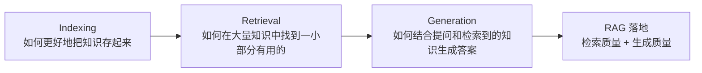

---

## 1. 大模型应用开发的三种模式

当模型回复错误时，原因无非三类：**没问清楚**、**缺乏背景知识**、**能力不足**。对应的解法分别是提示工程、RAG 和微调。

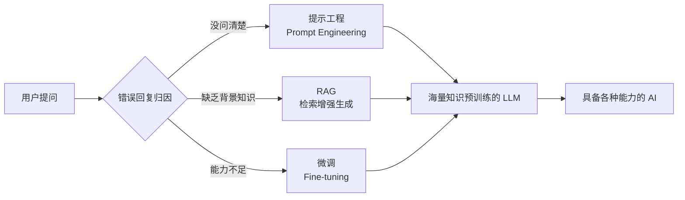

| 模式 | 适用场景 | 核心思想 |
| --- | --- | --- |
| **提示工程** | 没问清楚、指令不明确 | 优化输入提示，让模型更好地理解意图 |
| **RAG** | 缺乏背景知识 | 检索外部知识库，增强上下文 |
| **微调** | 模型能力不足 | 用领域数据训练模型，提升专业能力 |

### Q1：什么场景下应该选择 RAG 而不是 Fine-tuning？

- **知识需要频繁更新**：如产品文档、FAQ，用 RAG 只需更新向量库
- **需要引用来源**：如客服系统需要告诉用户答案来自哪个文档
- **数据量有限**：Fine-tuning 需要大量高质量数据，RAG 门槛更低
- **需要实时信息**：新闻、股票等实时数据无法通过训练固化到模型
- **预算有限**：RAG 的实现成本远低于微调

> **面试要点**：三种模式不是互斥的，实际项目中常常组合使用。比如 **RAG + Fine-tuning**（微调模型，让它可以更好地利用检索结果），或者 **RAG + Prompt Engineering**（优化检索后的提示词模板）。

---

## 2. 文档分块策略详解

文档分块（Chunking）是 RAG 系统的基础环节，**分块质量直接影响检索效果**。切得太碎，语义被割裂；切得太大，噪声混进来，检索精度下降。

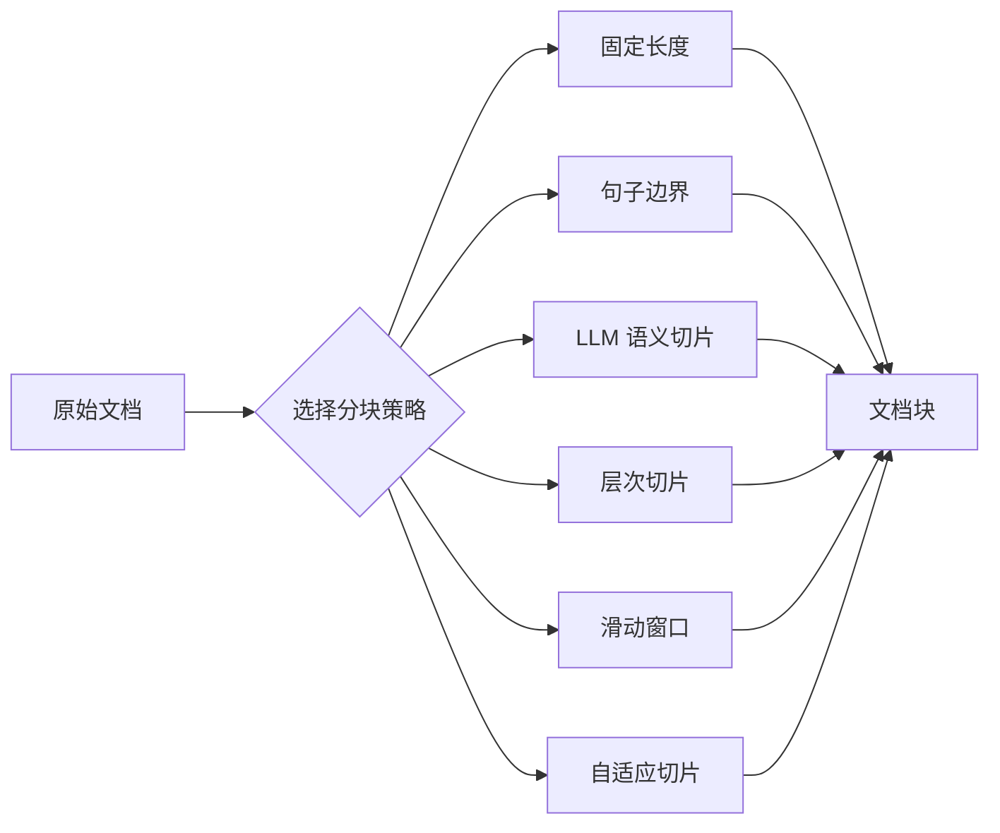

| 策略 | 原理 | 优点 | 缺点 | 适用场景 |
| --- | --- | --- | --- | --- |
| **固定长度** | 按字符数 / Token 数切分 | 实现简单，块大小可控 | 可能切断句子，破坏语义 | 结构简单的文本 |
| **句子边界** | 在句子结束符处切分 | 保持句子完整性 | 块大小不均匀 | 段落式文档 |
| **滑动窗口** | 固定窗口 + 重叠区域 | 保留上下文连续性 | 存储空间增加，有冗余 | 上下文依赖强的文本 |
| **层次切片** | 按文档结构（标题 / 章节）切分 | 保持文档逻辑结构 | 需要文档有清晰结构 | 技术文档、教材 |
| **LLM 语义切片** | 用 LLM 判断语义边界 | 语义完整性最好 | 成本高，速度慢 | 高价值文档 |
| **自适应切片** | 根据内容密度动态调整 | 平衡各方面因素 | 实现复杂 | 混合类型文档 |

### Q2：你项目中用了什么分块策略？为什么选它？

**回答示例**——我在项目中使用了 **滑动窗口 + 句子边界** 的混合策略：

1. 首先按句子边界切分，保证每个块的语义完整
2. 然后使用滑动窗口，设置 20% 重叠（window=512, step=100）
3. 重叠确保跨块的信息不会丢失

**选择原因**：

- 我们的知识库是产品 FAQ，段落之间有上下文依赖
- 用户问题可能涉及多个连续段落的信息
- 20% 重叠在存储开销和检索质量间取得平衡

**分块大小经验值**：

| 配置项 | 建议值 | 说明 |
| --- | --- | --- |
| `chunk_size` | 256 ~ 1024 tokens | 小块检索精度高但可能丢失上下文；大块上下文完整但噪声多、精度下降 |
| `chunk_overlap` | chunk_size 的 10% ~ 20% | 常见配置 `chunk_size=512, overlap=50-100` |
| 通用文档 | 800-1000 / overlap 160-200 | 平衡语义完整性和检索效率 |
| 精细检索 | 300-500 / overlap 30-100 | 需要精确匹配的场景 |
| 长文档 | 1000-1500 / overlap 200-300 | 保留更多上下文 |

---

## 3. RAG 系统架构与完整流程

整条链路可以拆成离线的 **Ingestion** 和在线的 **Answering** 两段。

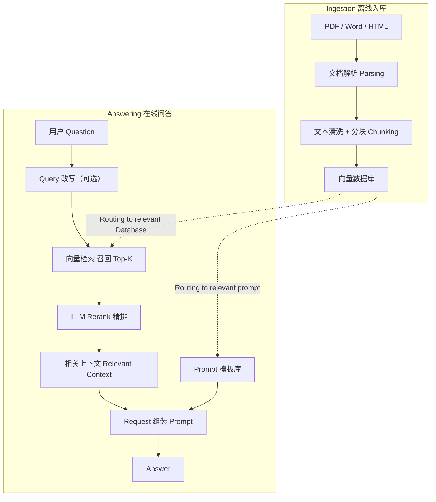

### Q3：请你描述下 RAG 系统的流程

**Step1，文档解析**
将 PDF、Word、HTML 等格式转换为纯文本。工具：`PyPDF2`、`python-docx`、`BeautifulSoup`。注意处理表格、图片等特殊内容。

**Step2，文档分块（Chunking）**
将长文档切分为适合检索的小块。需要平衡块大小、上下文完整性、检索精度。

**Step3，向量化（Embedding）**
使用 Embedding 模型将文本块转换为向量。常用模型：`text-embedding-v4` 等。

**Step4，向量存储**
将向量存入向量数据库。FAISS（本地）、Milvus（分布式）、Pinecone（云服务）。同时存储元数据用于过滤和展示。

**Step5，Query 改写（可选）**
处理模糊问题、补充上下文。使用 LLM 改写或扩展用户问题，提高检索召回率。

**Step6，向量检索**
计算 Query 向量与文档块向量的相似度，返回 Top-K 结果。距离度量：余弦相似度、L2 距离、内积。

**Step7，重排序（Rerank）**
使用 Cross-Encoder 对 Top-K 结果精排，选出最相关的 Top-N，显著提升最终效果。

**Step8，Prompt 构建**
将检索到的文档块拼接到 Prompt 中，作为 LLM 的上下文。注意控制总长度，避免超过模型上下文窗口。

**Step9，LLM 生成**
LLM 基于 Prompt 生成最终答案。可以要求模型引用来源，提高可信度。

| 步骤 | 名称 | 关键动作 | 常用工具 |
| --- | --- | --- | --- |
| Step1 | 文档解析 | 多格式 → 纯文本，处理表格图片 | PyPDF2、python-docx、BeautifulSoup |
| Step2 | 文档分块 | 长文档切成适合检索的块 | LangChain TextSplitter |
| Step3 | 向量化 | 文本块 → 向量 | text-embedding-v4、BGE |
| Step4 | 向量存储 | 存向量 + 元数据 | FAISS、Milvus、Pinecone |
| Step5 | Query 改写 | 补全模糊问题、结合历史 | LLM 改写、HyDE |
| Step6 | 向量检索 | 相似度计算返回 Top-K | 余弦相似度、L2、内积 |
| Step7 | 重排序 | Cross-Encoder 精排 | bge-reranker、Cohere Rerank |
| Step8 | Prompt 构建 | 拼接上下文、控制长度 | 自定义模板 |
| Step9 | LLM 生成 | 生成答案并引用来源 | Qwen、GPT、Claude |

---

## 4. Embedding 模型选择

### 主流 Embedding 模型对比

| 模型 | 厂商 | 维度 | 特点 | 适用场景 |
| --- | --- | --- | --- | --- |
| `text-embedding-ada-002` | OpenAI | 1536 | 通用性强，英文效果好 | 英文为主的场景 |
| `text-embedding-3-large` | OpenAI | 3072 | 最新模型，支持维度压缩 | 高精度需求 |
| `text-embedding-v4` | 阿里通义 | 512-1024 | 中文优化，性价比高 | 中文场景 |
| `BGE-large-zh` | 智源 | 1024 | 开源，中文效果优秀 | 私有化部署 |
| `M3E` | Moka | 768 | 开源，轻量级 | 资源有限场景 |
| `bge-m3` | 智源 | 1024 | 多语言，支持多种检索方式 | 多语言混合 |

### Embedding 模型选择的四类考虑因素

**语言支持**

- 中文场景：BGE、`text-embedding-v4`
- 英文场景：OpenAI 系列
- 多语言：`bge-m3`

**部署方式**

- API 调用：OpenAI、通义
- 私有化部署：BGE、M3E
- 混合部署：都支持

**性能指标**

- 延迟：本地部署 < API 调用
- 吞吐：取决于硬件 / 并发
- 精度：需要在自己数据上测试

**成本考量**

- API 按量付费，初期成本低
- 私有部署需 GPU，长期划算
- 维度影响存储成本

### Q4：你在项目中用了哪个 Embedding 模型？为什么选它？

我使用了阿里的 `text-embedding-v4`：

- **中文优化**：我们的知识库主要是中文文档，该模型在中文语义理解上表现优秀
- **维度可配**：支持 512 / 1024 维度，我选择 1024 维，在精度和存储间平衡
- **成本合理**：API 价格比 OpenAI 便宜，适合我们的预算
- **生态兼容**：与通义千问系列模型配合使用，接口统一

```python
completion = client.embeddings.create(
    model="text-embedding-v4",
    input="查询文本",
    dimensions=1024,
    encoding_format="float"
)
```

> **注意事项**
>
> - Query 和 Document 必须使用**同一个** Embedding 模型
> - 更换模型需要**重建整个向量索引**（不同模型的向量空间和维度都不通用）
> - 建议在自己的数据集上做 A/B 测试来选模型

---

## 5. RAG 效果调试与优化

### Q5：如果 RAG 效果很差，你会从哪几个方面去调试？

会按照 RAG 的流程，**逐步排查问题**：先判断是"找不到相关内容"还是"找到了但答案不对"，再往下定位具体环节。

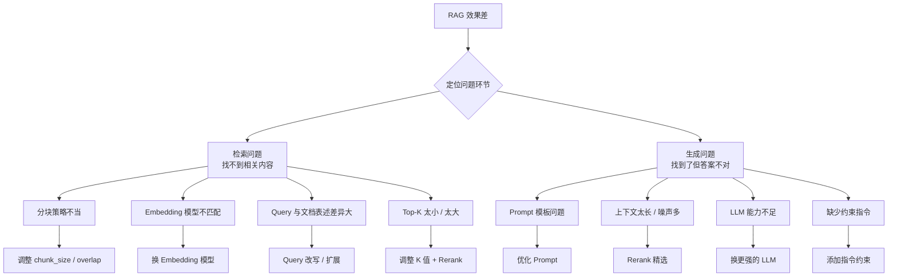

#### Step1 检索阶段调试

| 问题现象 | 可能原因 | 解决方案 |
| --- | --- | --- |
| 召回内容不相关 | Embedding 模型对领域词理解差 | 换用领域微调的 Embedding，或加同义词扩展 |
| 答案散落在多个块 | 分块太小，信息被切断 | 增大 `chunk_size`，增加 `overlap` |
| 噪声太多 | 分块太大，混入无关内容 | 减小 `chunk_size`，添加 Rerank |
| 用户口语化问题检索差 | Query 与文档表述风格差异 | Query 改写、HyDE 假设文档生成 |

#### Step2 生成阶段调试

| 问题现象 | 可能原因 | 解决方案 |
| --- | --- | --- |
| 答案与检索内容不符 | LLM 幻觉，未遵循上下文 | 强化 Prompt 指令："仅基于背景知识回答" |
| 答案过于简短 | Prompt 未要求详细解释 | 添加输出格式要求 |
| 答案冗长有很多废话 | 上下文噪声多 | Rerank 精选，减少喂给 LLM 的内容 |
| 无法处理复杂推理 | LLM 能力不足 | 换用更强的模型，或添加 CoT |

#### Step3 调试工具与方法

```python
import numpy as np

def debug_retrieval(query, index, metadata, k=10):
    """打印检索详情，帮助调试"""
    query_vec = get_embedding(query)
    distances, indices = index.search(
        np.array([query_vec]).astype('float32'), k
    )
    print(f"Query: {query}")
    print("-" * 80)
    for rank, (idx, dist) in enumerate(zip(indices[0], distances[0])):
        if idx == -1:
            continue
        doc = metadata[idx]
        similarity = 1 / (1 + dist)  # L2 距离转相似度
        print(f"Rank {rank+1} | 相似度: {similarity:.4f} | 距离: {dist:.4f}")
        print(f"来源: {doc.get('source', 'N/A')}")
        print(f"内容: {doc['text'][:100]}...")
        print("-" * 40)
    return indices, distances
```

排查经验：

- 先用 `debug_retrieval` 检查**检索结果**是否正确
- 如果检索结果好但生成差 → 优化 Prompt
- 如果检索结果差 → 从分块 / Embedding / Query 改写入手
- 记录 Bad Case，建立评估数据集持续改进

---

## 6. 多轮对话与 Query 改写

### Q6：当用户的问题很模糊，或者依赖上一轮对话时，RAG 怎么优化？

#### Step1，问题类型分析

**指代消解**

```
用户: "它的退票政策是什么？"
      "它" 指代上文提到的 "迪士尼"
解决: 结合历史对话改写 Query
```

**省略补全**

```
用户: "那儿童票呢？"
      省略了 "退票政策" 的上下文
解决: 从历史中补充完整语义
```

**模糊问题**

```
用户: "怎么买票？"
      缺少具体场景（线上 / 线下 / 团购）
解决: Query 扩展或追问
```

#### Step2，Query 改写技术

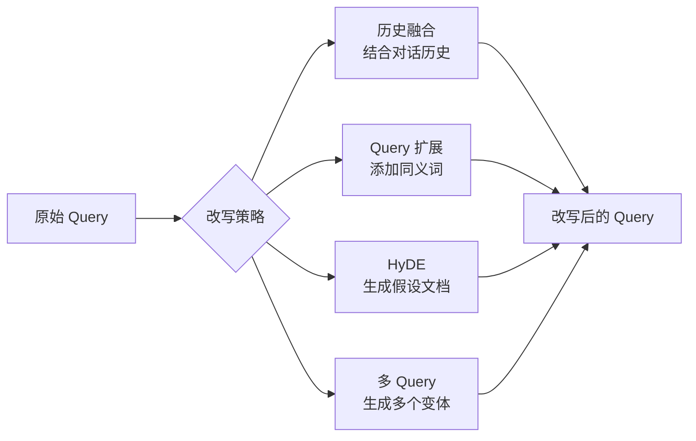

**历史融合改写示例**

```python
def rewrite_query_with_history(current_query, chat_history, client):
    """结合对话历史改写 Query"""
    # 构建改写 Prompt
    history_str = "\n".join([
        f"用户: {h['user']}\n助手: {h['assistant']}"
        for h in chat_history[-3:]  # 最近 3 轮
    ])
    prompt = f"""基于以下对话历史，改写用户的最新问题，使其成为一个独立、完整、明确的问题。

[对话历史]
{history_str}

[最新问题]
{current_query}

[改写要求]
1. 补充省略的主语 / 宾语
2. 解析指代词（它 / 这个 / 那个）
3. 补充上下文信息
4. 保持用户原始意图

改写后的问题:"""

    response = client.chat.completions.create(
        model="qwen-plus",
        messages=[{"role": "user", "content": prompt}],
        temperature=0
    )
    return response.choices[0].message.content
```

```python
# 使用示例
history = [
    {"user": "迪士尼的门票多少钱？", "assistant": "迪士尼门票价格..."},
    {"user": "能退票吗？", "assistant": "关于退票政策..."}
]
current = "儿童票呢？"

# 改写结果: "迪士尼儿童票的退票政策是什么？"
```

**HyDE（假设文档嵌入）**

思路是：让 LLM 先"编"一段可能的答案文档，用**这段假设文档的向量**去检索，而不是原始 Query 的向量——因为文档向量和文档向量之间的相似度，天然比"短问题"和"长文档"之间更接近。

```python
def hyde_query_expansion(query, client):
    """HyDE: 让 LLM 生成假设的答案文档，用文档向量检索"""
    prompt = f"""请为以下问题生成一段可能的答案文档（约 100 字）:

问题: {query}

假设答案文档:"""

    response = client.chat.completions.create(
        model="qwen-plus",
        messages=[{"role": "user", "content": prompt}],
        temperature=0.7
    )
    hypothetical_doc = response.choices[0].message.content
    # 用假设文档的向量去检索，而不是原始 Query
    return get_embedding(hypothetical_doc)
```

#### Step3，多轮对话 RAG 架构

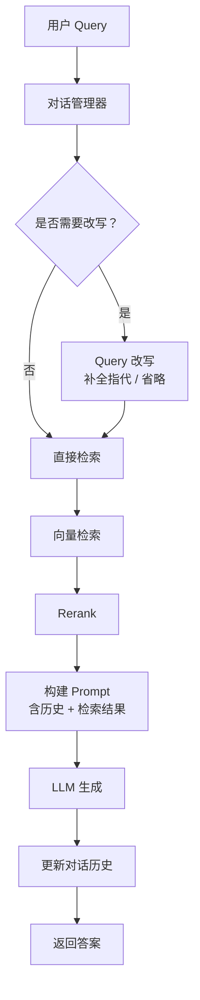

**实践建议**：

- 对话历史不宜过长，一般保留最近 **3-5 轮**
- 可以用 LLM 判断**是否需要改写**，避免每次都改写（多一次 LLM 调用就多一份延迟）
- 改写模型可以用较小的模型，降低延迟
- 记录改写前后的 Query，便于调试

---

## 7. 向量检索的缺陷与混合检索

### Q7：你只用了向量检索吗？它有什么缺点？什么是混合检索？

**向量检索的缺点**：

- 对精确关键词匹配不敏感（如产品型号、人名）
- 可能漏掉字面完全匹配的内容
- Embedding 模型对领域专有词理解可能不准

**混合检索**：结合向量检索和关键词检索（BM25），取长补短。

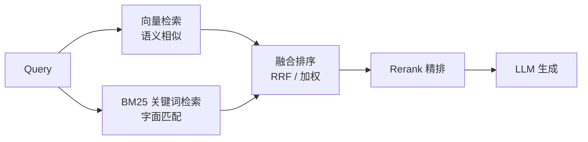

| 特性 | 向量检索 | 关键词检索（BM25） | 混合检索 |
| --- | --- | --- | --- |
| 语义理解 | 强 | 弱 | 强 |
| 精确匹配 | 弱 | 强 | 强 |
| 专有词处理 | 一般 | 好 | 好 |
| 实现复杂度 | 中 | 低 | 高 |
| 延迟 | 低 | 很低 | 中 |

两路召回的分数量纲不同（余弦相似度 vs BM25 分数），直接加权很难调。工程上更常用 **RRF（Reciprocal Rank Fusion）**，只利用排名信息做融合：

```python
def hybrid_search_rrf(query, vector_index, bm25_index, metadata, k=20, k_rrf=60):
    """向量检索 + BM25 关键词检索，用 RRF 融合排序"""
    # 1) 向量检索：语义召回
    query_vec = get_embedding(query)
    _, vec_indices = vector_index.search(
        np.array([query_vec]).astype('float32'), k
    )
    # 2) BM25 关键词检索：字面召回
    bm25_indices = bm25_index.search(query, k)

    # 3) RRF 融合：只累加 1/(k + rank)，避免量纲问题
    scores = {}
    for rank, idx in enumerate(vec_indices[0]):
        if idx != -1:
            scores[idx] = scores.get(idx, 0) + 1 / (k_rrf + rank + 1)
    for rank, idx in enumerate(bm25_indices):
        scores[idx] = scores.get(idx, 0) + 1 / (k_rrf + rank + 1)

    # 4) 按融合分数排序，返回带元数据的候选
    ranked = sorted(scores.items(), key=lambda x: x[1], reverse=True)
    return [{"text": metadata[i]["text"], "rrf_score": s} for i, s in ranked]
```

---

## 8. 重排序 Rerank

### Q8：检索召回了 20 条文档，你怎么确保喂给 LLM 的是最好的 3 条？

使用 **Rerank（重排序）** 技术，对初步召回的结果进行精排。核心思路是"粗排求快、精排求准"。

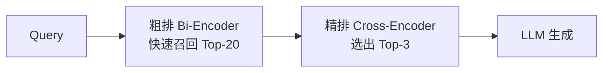

### 为什么需要 Rerank？

| | Bi-Encoder（向量检索） | Cross-Encoder（Rerank） |
| --- | --- | --- |
| 编码方式 | Query 和 Document **分别**编码，再算向量相似度 | Query 和 Document **拼接后一起**编码，直接输出相关性分数 |
| 速度 | 快，适合大规模召回 | 慢，只能处理少量候选 |
| 交互信息 | 少（两者独立编码） | 多，能捕捉细粒度交互 |
| 精度 | 相对较低 | 高 |
| 定位 | 从百万级语料中粗筛 | 对 Top-K 精排 |

**使用 BGE-Reranker**

```python
from transformers import AutoModelForSequenceClassification, AutoTokenizer
import torch


class Reranker:
    def __init__(self, model_name="BAAI/bge-reranker-large"):
        self.tokenizer = AutoTokenizer.from_pretrained(model_name)
        self.model = AutoModelForSequenceClassification.from_pretrained(model_name)
        self.model.eval()

    def rerank(self, query, documents, top_n=3):
        """对文档列表重排序，返回 Top-N"""
        # 构建 Query-Document 对
        pairs = [[query, doc['text']] for doc in documents]

        # 编码
        inputs = self.tokenizer(
            pairs,
            padding=True,
            truncation=True,
            max_length=512,
            return_tensors='pt'
        )

        # 推理
        with torch.no_grad():
            scores = self.model(**inputs).logits.squeeze(-1).tolist()

        # 按分数排序
        scored_docs = list(zip(documents, scores))
        scored_docs.sort(key=lambda x: x[1], reverse=True)
        return scored_docs[:top_n]
```

```python
# 使用示例
reranker = Reranker()
top_docs = reranker.rerank(
    query="迪士尼退票政策",
    documents=retrieval_results,  # 初步召回的 20 条
    top_n=3
)
```

**使用 API（Cohere Rerank）**

```python
import cohere

co = cohere.Client('your-api-key')


def rerank_with_cohere(query, documents, top_n=3):
    """使用 Cohere API 进行重排序"""
    docs_text = [doc['text'] for doc in documents]
    response = co.rerank(
        model='rerank-multilingual-v2.0',
        query=query,
        documents=docs_text,
        top_n=top_n
    )
    results = []
    for r in response.results:
        results.append({
            'document': documents[r.index],
            'relevance_score': r.relevance_score
        })
    return results
```

**完整的召回-精排流程**

```python
def rag_with_rerank(query, index, metadata, reranker, recall_k=20, rerank_n=3):
    """带重排序的 RAG 流程"""
    # Step 1: 向量检索（粗排，召回 Top-20）
    query_vec = get_embedding(query)
    distances, indices = index.search(
        np.array([query_vec]).astype('float32'), recall_k
    )
    candidates = []
    for idx in indices[0]:
        if idx != -1:
            candidates.append(metadata[idx])
    print(f"粗排召回 {len(candidates)} 条")

    # Step 2: Rerank（精排，选出 Top-3）
    reranked = reranker.rerank(query, candidates, top_n=rerank_n)
    print(f"精排选出 {len(reranked)} 条:")
    for doc, score in reranked:
        print(f"  - {score:.4f}: {doc['text'][:50]}...")

    # Step 3: 构建 Prompt，调用 LLM
    context = "\n\n".join([doc['text'] for doc, _ in reranked])
    # ... 后续生成流程
```

**Rerank 实践建议**：

- 召回数量（`recall_k`）一般设置为最终需要数量的 **5-10 倍**
- Rerank 模型选择：中文推荐 `bge-reranker`，多语言用 Cohere
- Rerank 会增加延迟，需要在效果和速度间权衡
- 可以设置分数阈值，过滤低相关性结果

---

## 9. 知识库维护与迭代

### Q9：系统上线后，你怎么维护和迭代你的知识库？

知识库维护是一个持续的过程，可以从四个方向展开。

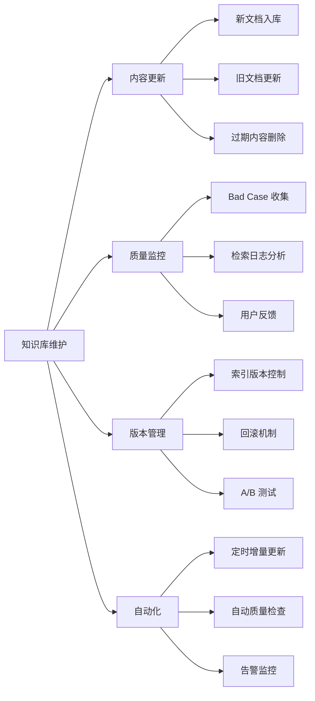

### 增量更新策略

核心是**用内容 hash 判断文档是否真的变了**，避免全量重建索引。

```python
import hashlib
from datetime import datetime


class KnowledgeBaseManager:
    def __init__(self, index, metadata_store):
        self.index = index
        self.metadata_store = metadata_store
        self.doc_hashes = {}  # 文档 hash，用于检测变更

    def compute_hash(self, text):
        """计算文档内容 hash"""
        return hashlib.md5(text.encode()).hexdigest()

    def add_document(self, doc_id, text, metadata):
        """添加新文档"""
        doc_hash = self.compute_hash(text)

        # 检查是否已存在
        if doc_id in self.doc_hashes:
            if self.doc_hashes[doc_id] == doc_hash:
                print(f"文档 {doc_id} 未变更，跳过")
                return
            else:
                print(f"文档 {doc_id} 已更新，先删除旧版本")
                self.delete_document(doc_id)

        # 生成向量
        embedding = get_embedding(text)

        # 添加到索引
        vector_id = len(self.metadata_store)
        self.index.add_with_ids(
            np.array([embedding]).astype('float32'),
            np.array([vector_id])
        )

        # 存储元数据
        self.metadata_store.append({
            'doc_id': doc_id,
            'text': text,
            'metadata': metadata,
            'created_at': datetime.now().isoformat(),
            'hash': doc_hash
        })
        self.doc_hashes[doc_id] = doc_hash
        print(f"文档 {doc_id} 已添加")

    def delete_document(self, doc_id):
        """删除文档（标记删除）"""
        for i, doc in enumerate(self.metadata_store):
            if doc.get('doc_id') == doc_id:
                doc['deleted'] = True
                doc['deleted_at'] = datetime.now().isoformat()
                break
        if doc_id in self.doc_hashes:
            del self.doc_hashes[doc_id]

    def rebuild_index(self):
        """重建索引（清理已删除文档）"""
        active_docs = [
            doc for doc in self.metadata_store
            if not doc.get('deleted', False)
        ]
        # 重新构建索引
        # ... 实现省略
        print(f"索引重建完成，共 {len(active_docs)} 条有效文档")
```

### Q9 plus：维护知识库能否通过 Agent RL？

Agent RL 的核心思路：**让 Agent 从环境反馈中学习改进策略**。关键是定义好：状态、动作、奖励。

**方案 A：基于反馈的 Prompt 优化**

- 最轻量的"RL"方式，不涉及模型训练
- 收集用户反馈（采纳 / 修改 / 拒绝）
- 分析 Bad Case 的模式
- 迭代优化 System Prompt
- 加入成功案例作为 Few-shot

**方案 B：RLHF 微调**

- 收集成对比较数据（好回答 vs 差回答）
- 训练奖励模型（Reward Model）
- 用 PPO 等算法优化策略模型
- 需要大量数据和算力

> 对于企业场景，推荐 **方案 A + 选择性微调**的组合。

```python
# 轻量级 Agent RL 实现
class AgentFeedbackLoop:
    def __init__(self):
        self.feedback_db = FeedbackDatabase()
        self.prompt_version = "v1.0"

    def collect_feedback(self, task_id, agent_output, user_action, user_correction):
        """收集用户反馈"""
        feedback = {
            "task_id": task_id,
            "agent_output": agent_output,
            "user_action": user_action,  # accept / modify / reject
            "user_correction": user_correction,
            "prompt_version": self.prompt_version
        }
        self.feedback_db.save(feedback)

    def analyze_failures(self):
        """分析失败模式"""
        failures = self.feedback_db.get_failures(limit=100)
        # 用 LLM 分析失败模式
        analysis = llm.analyze(
            prompt="分析 Agent 输出被用户拒绝的原因，归纳共性问题",
            data=failures
        )
        return analysis

    def generate_improved_prompt(self, analysis):
        """基于分析生成改进的 Prompt"""
        improved = llm.generate(
            prompt=f"""基于以下问题分析，改进 System Prompt：
问题分析：{analysis}
当前 Prompt：{self.current_prompt}
要求：针对性解决已发现的问题，保持其他功能不变"""
        )
        return improved
```

闭环的运转方式：

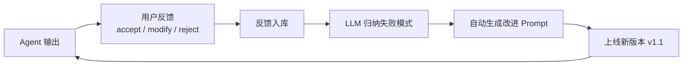

**Step1，收集反馈（`collect_feedback`）**

场景：Agent 写了一句日报"今日交易额 50000。"，业务人员看了一眼觉得不行，改成"今日交易额 50,000.00 元。"

代码在做什么：系统悄悄把这次交互记在小本本（数据库）上——Agent 写了啥、用户动作是 `Modify`、用户改成了什么、当时的手册版本是 v1.0。这就好比导师改了实习生的作业，系统把"错题本"和"正确答案"都存下来了。

**Step2，分析失败模式（`analyze_failures`）**

场景：过了一周，数据库里积累了 100 条类似的修改记录。

代码调用一个更聪明的大模型来当"教导主任"，把这 100 条错误扔给它问："你看看，这个 Agent 老是被用户纠正，到底哪儿做得不对？"

大模型分析结果：*"共性问题发现：Agent 输出金额时，普遍缺少千分位分隔符，且经常漏掉货币单位。"*

这一步不是简单统计，而是让 AI 去**归纳错误规律**——不是针对某一次错误，而是发现一类错误。

**Step3，生成改进的 Prompt**

既然发现了问题是"没写千分位"和"漏单位"，那就得改《操作手册》（System Prompt）。

```text
旧 Prompt：你是一个金融助理，请根据数据生成日报。

新 Prompt：你是一个金融助理，请根据数据生成日报。
注意：涉及金额数字时，必须使用千分位分隔符（如 1,000），
并严格标注货币单位（如 元/USD）。
```

通过以上方式形成闭环。下一次 Agent 再工作时，调用的是 v1.1 版的 Prompt。

### 维护最佳实践

| 实践 | 说明 |
| --- | --- |
| **定期审核** | 每周 / 每月审核 Bad Case，识别系统性问题 |
| **增量更新** | 避免全量重建，使用增量方式更新索引 |
| **版本控制** | 保留历史版本索引，支持快速回滚 |
| **文档生命周期** | 设置过期时间，自动标记 / 清理过期内容 |
| **监控告警** | 检索空结果率、用户负反馈率等指标超阈值时告警 |

---

## 10. RAG 系统评估方法

### Q10：如何评估一个 RAG 系统的好坏？

RAG 系统的评估需要从**检索质量**和**生成质量**两个维度进行，再叠加端到端的业务指标。

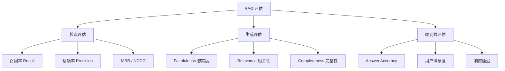

### 检索质量指标

| 指标 | 定义 | 计算公式 | 适用场景 |
| --- | --- | --- | --- |
| **Recall@K** | Top-K 中包含相关文档的比例 | 相关文档数 / 总相关文档数 | 评估召回能力 |
| **Precision@K** | Top-K 中相关文档的比例 | 相关文档数 / K | 评估精准度 |
| **MRR** | 第一个相关文档的排名倒数 | 1 / (第一个相关文档的排名) | 单一正确答案场景 |
| **NDCG@K** | 考虑相关性等级的排序质量 | DCG / IDCG | 有相关性分级的场景 |

### 什么是 RAGAS？

**RAGAS**（Retrieval Augmented Generation Assessment）是一个专门用于评估 RAG 系统的开源框架，由 Exploding Gradients 团队开发。

核心特点：

- **无需人工标注**：使用 LLM 自动评估，大幅降低评估成本
- **端到端评估**：同时评估检索质量和生成质量
- **指标全面**：提供 Faithfulness、Answer Relevancy、Context Precision 等核心指标
- **易于集成**：与 LangChain、LlamaIndex 等主流框架无缝对接

```bash
pip install ragas
```

GitHub: <https://github.com/explodinggradients/ragas>

### 生成质量指标（RAGAS 框架）

**Faithfulness（忠实度）**——答案是否基于检索到的内容，而非幻觉。
评估方法：用 LLM 判断答案中的每个声明是否能在上下文中找到支撑。

**Answer Relevance（答案相关性）**——答案是否回答了用户的问题。
评估方法：用 LLM 根据答案反向生成问题，与原问题比较相似度。

**Context Relevance（上下文相关性）**——检索到的内容是否与问题相关。
评估方法：计算上下文中与问题相关的句子比例。

**Context Recall（上下文召回）**——检索是否召回了回答问题所需的所有信息。
评估方法：对比标准答案，检查所需信息是否被检索到。

```python
from ragas import evaluate
from ragas.metrics import (
    faithfulness,
    answer_relevancy,
    context_relevancy,
    context_recall
)
from datasets import Dataset


def evaluate_rag_system(eval_data):
    """
    使用 RAGAS 评估 RAG 系统

    eval_data: 评估数据列表，每条包含:
      - question: 用户问题
      - answer: RAG 生成的答案
      - contexts: 检索到的上下文列表
      - ground_truth: 标准答案（可选）
    """
    # 转换为 Dataset 格式
    dataset = Dataset.from_dict({
        'question': [d['question'] for d in eval_data],
        'answer': [d['answer'] for d in eval_data],
        'contexts': [d['contexts'] for d in eval_data],
        'ground_truth': [d.get('ground_truth', '') for d in eval_data]
    })

    # 评估
    result = evaluate(
        dataset,
        metrics=[
            faithfulness,
            answer_relevancy,
            context_relevancy,
            context_recall
        ]
    )
    return result
```

```python
# 评估数据示例
eval_data = [
    {
        'question': '迪士尼门票可以退吗？',
        'answer': '迪士尼门票原则上不退不换，但在特殊情况下可申请...',
        'contexts': ['迪士尼门票一经售出，原则上不予退换...'],
        'ground_truth': '门票原则上不退，特殊情况可改期或退款'
    },
    # 更多评估样本...
]

results = evaluate_rag_system(eval_data)
print(results)
```

### 评估建议

- 构建包含 **50-100 个样本**的评估集，覆盖各类问题
- 定期运行评估，监控系统质量变化
- 重点关注 **Faithfulness**，这是 RAG 的核心价值
- 结合定量指标和人工抽检

---

## 11. 进阶技术 GraphRAG

### Q11：什么是 GraphRAG，与传统 RAG 的区别？

GraphRAG 是微软提出的增强型 RAG 架构，**通过构建知识图谱来增强检索和推理能力**。

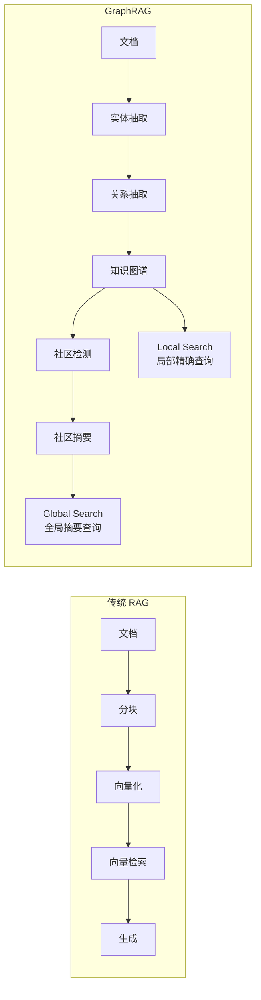

| 特性 | 传统 RAG | GraphRAG |
| --- | --- | --- |
| 知识表示 | 文本块 + 向量 | 实体 + 关系 + 图结构 |
| 检索方式 | 语义相似度 | 图遍历 + 语义 |
| 全局问题 | 困难（需要遍历所有文档） | 擅长（社区摘要） |
| 多跳推理 | 弱 | 强（沿关系推理） |
| 构建成本 | 低 | 高（需要实体抽取） |
| 适用场景 | 直接问答 | 复杂推理、总结分析 |

### GraphRAG 的核心概念

- **Entity（实体）**：从文档中抽取的关键对象。例：人名、地名、产品名、概念
- **Relationship（关系）**：实体之间的联系。例："属于"、"制造"、"位于"
- **Community（社区）**：图中紧密相连的实体群组，通过社区检测算法发现
- **Community Summary**：每个社区的 LLM 生成摘要，用于回答全局性问题

### GraphRAG 的两种查询模式

**Local Search（局部搜索）**
适合："XXX 公司的 CEO 是谁？"这类精确问题。
流程：`Query → 找到相关实体 → 沿关系扩展 → 收集上下文 → 生成答案`

**Global Search（全局搜索）**
适合："这篇文档的主要观点是什么？"这类总结性问题。
流程：`Query → 遍历社区摘要 → Map-Reduce 聚合 → 生成综合答案`

### GraphRAG 使用建议

- 构建成本高，适合**高价值、复杂**的知识库
- 对于简单 FAQ，传统 RAG 已足够
- 可以与传统 RAG 结合：简单问题用传统 RAG，复杂问题用 GraphRAG

---

## 12. 面试高频问题汇总

### Q13：RAG 和 Fine-tuning 怎么选？

- **选 RAG**：知识更新频繁、需要引用来源、数据量小、预算有限
- **选 Fine-tuning**：需要改变模型风格 / 格式、领域术语复杂、追求推理速度
- **组合使用**：先微调让模型更好地遵循检索结果，再用 RAG 注入知识

### Q14：如何处理知识库中的矛盾信息？

- 为文档添加**时间戳**元数据，优先使用最新的
- 为文档添加**权威度标签**，优先使用官方来源
- 检索时同时返回多个来源，让 LLM 综合判断
- 在 Prompt 中要求 LLM **指出信息冲突**

### Q15：RAG 系统的延迟优化有哪些方法？

| 环节 | 优化手段 | 代价 |
| --- | --- | --- |
| 向量检索 | 使用 ANN 索引（HNSW、IVF） | 用精确度换速度 |
| Embedding | 使用本地小模型，或异步预计算 | 精度可能下降 |
| Rerank | 减少候选数量，或使用蒸馏小模型 | 精排效果略降 |
| LLM 生成 | 流式输出，选择更快的模型 | 输出质量可能变化 |
| 缓存 | 相似 Query 复用检索结果 | 需要缓存失效策略 |

### Q16：如何处理超长文档？

- **分层索引**：先检索摘要，再检索详细段落
- **滑动窗口**：保留上下文的分块策略
- **长上下文模型**：使用支持 128K+ 的模型（如 Qwen、Claude）
- **迭代检索**：先检索一部分，根据 LLM 判断是否需要更多

### Q17：如何防止 LLM 幻觉？

- **Prompt 明确指令**："仅基于提供的信息回答，不确定时说不知道"
- **要求引用**：让 LLM 标注答案来源于哪个文档
- **降低 temperature**：减少随机性
- **答案验证**：用另一个 LLM 检查答案是否有上下文支撑
- **Rerank 精选**：确保上下文高度相关

### Q18：多模态 RAG 怎么做？

- **图片**：使用多模态 Embedding 模型（如 CLIP、通义 VL）将图片向量化
- **表格**：转换为 Markdown 或 JSON，保持结构信息
- **PDF**：OCR 提取文字 + 图表单独处理
- **视频**：抽帧 + 语音转文字，分别建索引
- **统一使用多模态 Embedding**，实现跨模态检索

### Q19：如何保证 RAG 系统的安全性？

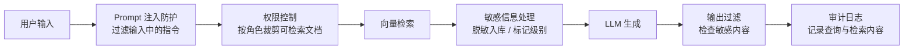

- **Prompt 注入防护**：过滤用户输入中的指令
- **权限控制**：根据用户角色过滤可检索的文档
- **敏感信息处理**：脱敏后入库，或标记敏感级别
- **输出过滤**：检查生成内容是否包含敏感信息
- **审计日志**：记录所有查询和检索内容

---

## 13. 打卡：RAG 项目经历准备

面试前准备 **1 个自己做过的 RAG 项目**，要能讲清楚技术选型和踩坑经历。

| 准备要点 | 说明 |
| --- | --- |
| **RAG 系统的架构** | 能画出 Ingestion + Answering 全链路，说清每个环节的取舍 |
| **主流工具** | LangChain、FAISS 等，知道各自解决什么问题 |
| **关注最新技术** | GraphRAG、Agentic RAG |
| **评估指标** | 理解 Recall / Precision / Faithfulness 等指标，能说出如何衡量效果好坏 |
| **召回质量** | 能讲出提升召回的具体手段：分块调优、混合检索、Query 改写、Rerank |

> **最后一句话**：面试官问的从来不是"你知道 RAG 吗"，而是"你踩过哪些坑、怎么定位、怎么权衡"。把上面每一条都对应到自己项目里的一个具体决策，回答就立得住了。
